# 🔬 AI System Testbed

[](https://www.python.org)
[](LICENSE)
[](https://github.com/tylerelyt/test_bed)

An advanced AI-powered search platform featuring three core capabilities: **Search & Recommendation**, **Retrieval-Augmented Generation (RAG)**, and **Image Search**. Built with modern MLOps practices for production-ready deployment.

## 🌟 Features

### 🎯 Three Core Capabilities

#### 1. 🔍 Search & Recommendation System
- **Intelligent Indexing**: TF-IDF based inverted index with Chinese word segmentation
- **CTR Prediction**: Advanced machine learning models (Logistic Regression & Wide & Deep) for click-through rate prediction
- **Real-time Ranking**: Dynamic ranking strategy adjustment based on user behavior
- **Knowledge Graph**: LLM-based NER technology for enhanced semantic search
- **A/B Testing**: Experiment management for ranking algorithm comparison

#### 2. 🤖 Retrieval-Augmented Generation (RAG)
- **Hybrid Retrieval**: Combines inverted index and knowledge graph for comprehensive information retrieval
- **LLM Integration**: Seamless integration with Ollama for local LLM inference
- **Prompt Engineering**: Optimized prompt templates with full transparency
- **Context Management**: Intelligent context selection and ranking for accurate responses
- **Multi-source RAG**: Retrieval from documents, knowledge graphs, and structured data

#### 3. 🖼️ Image Search System
- **CLIP-powered**: OpenAI CLIP model via Hugging Face Transformers
- **Multi-modal Search**: Image-to-image and text-to-image search capabilities
- **Semantic Understanding**: 512-dimensional embedding vectors for precise similarity matching
- **Real-time Processing**: Sub-second search response with efficient similarity calculation
- **Scalable Storage**: Unlimited image library with optimized storage management

### 🏗️ Shared Infrastructure
- **Microservice Architecture**: Decoupled services (Data, Index, Model, Image, Experiment)
- **Unified Service Management**: Centralized service discovery and management
- **MLOps Pipeline**: Complete workflow from data collection to model deployment
- **Monitoring & Observability**: Real-time performance tracking and health checks
- **Web Interface**: Modern Gradio-based UI with responsive design
- **Production Ready**: Comprehensive error handling, logging, and scalability features

## 🚀 Quick Start

### Requirements

- Python 3.8+
- Memory: At least 2GB
- Storage: At least 1GB available space
- GPU (optional): For better CLIP model performance

### Optional Dependencies

- Ollama (for RAG/KG): local LLM inference service, default at `http://localhost:11434`
- datasets (for data tools): `pip install datasets`, used by `tools/wikipedia_downloader.py`

### Installation

```bash
# Clone the repository
git clone https://github.com/tylerelyt/test_bed.git
cd test_bed

# Create virtual environment
python -m venv venv
source venv/bin/activate  # Windows: venv\Scripts\activate

# Install dependencies
pip install -r requirements.txt
```

### Preloaded Dataset (Read-Only)

The system comes with 100 preloaded Chinese Wikipedia documents as core dataset:
- **Immutable**: Preloaded documents are core; deleting or editing them via the UI is not supported in this version
- **Auto-loading**: Automatically loads `data/preloaded_documents.json` at startup
- **User Documents**: Importing new documents via the UI is not supported in this version (offline builds are possible via `offline_index` or the tooling)
- **Data Source**: From Hugging Face `fjcanyue/wikipedia-zh-cn` dataset

The preloaded documents provide rich foundational data covering mathematics, philosophy, literature, history, computer science, and other domains.

### Start the System

```bash
# Method 1: Using startup script
./quick_start.sh

# Method 2: Direct startup
python start_system.py
```

After the system starts, visit http://localhost:7861 to use the interface.

### Configuration

You can override default settings via environment variables (see `src/search_engine/config.py` for defaults):

```bash
# Web UI port (default 7861)
export UI_PORT=7861

# Ollama configuration (used by RAG & KG)
export OLLAMA_URL=http://localhost:11434

# Default RAG model
export LLM_MODEL="llama3.1:8b"

# Default KG/NER model
export KG_LLM_MODEL="qwen2.5:7b"
```

### System Architecture Overview

The platform is organized into **three main functional areas** with shared infrastructure:

#### 🔍 Search & Recommendation Module
- **Index Building Tab**: Offline index construction, document management, and knowledge graph building
- **Search Tab**: Online retrieval and ranking with CTR-based optimization  
- **Training Tab**: CTR data collection and Wide & Deep model training

#### 🤖 RAG Module
- **RAG Q&A Tab**: Retrieval-Augmented Generation system with Ollama integration
- **Knowledge Graph Integration**: Semantic search with LLM-based entity recognition
- **Multi-source Retrieval**: Documents, graphs, and structured data integration

> Note: RAG/KG rely on a locally running Ollama service and available models. If Ollama is not running or the model hasn't been pulled, the page will show a connection error, but other parts of the system remain available.

#### 🖼️ Image Search Module
- **Image Search Tab**: CLIP-based image retrieval supporting image-to-image and text-to-image search
- **Image Management**: Upload, indexing, and library management
- **Multi-modal Understanding**: Cross-modal semantic search capabilities

#### 🏗️ Shared Infrastructure
- **Service Management**: Unified service discovery and orchestration
- **Monitoring Tab**: System performance monitoring and health checks
- **Data Pipeline**: Centralized data processing and storage
- **Web Interface**: Modern responsive UI with Gradio framework

## 🖼️ Image Search System

### Overview

The image search system leverages OpenAI's CLIP model to provide intelligent image retrieval capabilities:

- **📤 Image Upload**: Store images with descriptions and tags
- **🔍 Image-to-Image Search**: Find visually similar images using query images
- **💬 Text-to-Image Search**: Search images using natural language descriptions
- **📋 Image Management**: Comprehensive image library management

### Technical Details

- **Model**: OpenAI CLIP ViT-B/32 via Hugging Face Transformers
- **Embedding Dimension**: 512-dimensional vectors
- **Similarity Metric**: Cosine similarity
- **Supported Formats**: JPG, PNG, GIF, BMP, and more
- **Performance**: Sub-second search response times

### Usage Examples

#### Text-to-Image Search
```python
# Examples of search queries
"a red car on the street"
"cat sleeping on a bed"
"beautiful sunset landscape"
"person running"  # Non-English queries are also supported
```

#### Upload and Index Images
1. Navigate to "🖼️ Image Search System" → "📤 Image Upload"
2. Select image files and add descriptions/tags
3. Click "📤 Upload Image" to index

#### Search Similar Images
1. Go to "🔍 Image-to-Image" tab
2. Upload a query image
3. Adjust the number of results (1-20)
4. View results in table and gallery format

For detailed usage instructions, see [Image Search Guide](docs/IMAGE_SEARCH_GUIDE.md).

## 📖 User Guide

### Basic Usage

1. **Index Building**: The system automatically builds indexes on startup, with manual document addition support
2. **Search Testing**: Enter queries in the search box to retrieve relevant documents
3. **Click Feedback**: Clicking search results records user behavior for model training
4. **Model Training**: After collecting sufficient data, train CTR prediction models

### Advanced Features

#### 1. Batch Data Import

```python
from src.search_engine.data_utils import import_ctr_data
result = import_ctr_data("path/to/your/data.json")
```

#### 2. Custom Ranking Strategy

```python
from src.search_engine.service_manager import get_index_service
index_service = get_index_service()
results = index_service.search("query terms", top_k=10)
```

#### 3. Experiment Management

The system supports A/B testing with configurable ranking strategies for comparison in the monitoring interface.

## 🏗️ Architecture Design

### System Architecture

```mermaid
graph TB
    subgraph "🖥️ Web Interface Layer"
        Portal["Portal<br/>🚪 Main Entry"]
    end
    
    subgraph "📱 Application Layer"
        SearchMod["🔍 Search & Recommendation<br/>• Index Building<br/>• Text Search<br/>• CTR Training"]
        RAGMod["🤖 RAG Module<br/>• RAG Q&A<br/>• Knowledge Graph<br/>• Multi-source Retrieval"]
        ImageMod["🖼️ Image Search<br/>• Image Upload<br/>• Image-to-Image<br/>• Text-to-Image"]
    end
    
    subgraph "🏗️ Service Layer"
        DataSvc["DataService<br/>📊 CTR Data Management"]
        IndexSvc["IndexService<br/>📚 Text Indexing & Search"]
        ModelSvc["ModelService<br/>🤖 ML Model Management"]
        ImageSvc["ImageService<br/>🖼️ CLIP-based Search"]
        ExpSvc["ExperimentService<br/>🧪 A/B Testing"]
    end
    
    subgraph "📊 Infrastructure Layer"
        Monitor["Monitoring<br/>📈 Performance Tracking"]
        Storage["Storage<br/>💾 Data Persistence"]
        ServiceMgr["ServiceManager<br/>🔧 Service Orchestration"]
    end
    
    Portal --> SearchMod
    Portal --> RAGMod
    Portal --> ImageMod
    
    SearchMod --> DataSvc
    SearchMod --> IndexSvc
    SearchMod --> ModelSvc
    
    RAGMod --> IndexSvc
    RAGMod --> ModelSvc
    
    ImageMod --> ImageSvc
    
    DataSvc --> ServiceMgr
    IndexSvc --> ServiceMgr
    ModelSvc --> ServiceMgr
    ImageSvc --> ServiceMgr
    ExpSvc --> ServiceMgr
    
    ServiceMgr --> Monitor
    ServiceMgr --> Storage
```



### Data Flow

```mermaid
graph LR
    subgraph "🔍 Search & Recommendation Flow"
        A1[User Query] --> A2[Index Retrieval]
        A2 --> A3[Initial Ranking]
        A3 --> A4[CTR Prediction]
        A4 --> A5[Re-ranking]
        A5 --> A6[Results Display]
        A6 --> A7[User Click]
        A7 --> A8[Behavior Recording]
        A8 --> A9[Model Training]
        A9 --> A4
    end
    
    subgraph "🤖 RAG Flow"
        B1[User Question] --> B2[Document Retrieval]
        B2 --> B3[Knowledge Graph Query]
        B3 --> B4[Context Assembly]
        B4 --> B5[LLM Generation]
        B5 --> B6[Response Display]
    end
    
    subgraph "🖼️ Image Search Flow"
        C1[Image/Text Query] --> C2[CLIP Encoding]
        C2 --> C3[Similarity Calculation]
        C3 --> C4[Result Ranking]
        C4 --> C5[Image Gallery Display]
        C5 --> C6[User Interaction]
        C6 --> C7[Usage Analytics]
    end
```



## 📊 Performance Metrics

### Text Search Performance
- **Search Latency**: < 100ms (10K documents)
- **Concurrent Users**: 100+ concurrent users
- **Memory Usage**: < 500MB (basic configuration)
- **Storage Efficiency**: Compression ratio > 70%

### Image Search Performance
- **CLIP Encoding**: 1-3 seconds per image (CPU)
- **Search Response**: Sub-second similarity calculation
- **Embedding Storage**: ~2KB per image
- **Supported Scale**: Unlimited image library size

## 🛠️ Development Guide

### Project Structure

```
Testbed/
├── src/                          # Source code
│   └── search_engine/           
│       ├── data_service.py            # Data service (CTR data management)
│       ├── index_service.py           # Index service (text search & indexing)
│       ├── model_service.py           # Model service (CTR & Wide&Deep models)
│       ├── image_service.py           # Image service (CLIP-based image search)
│       ├── experiment_service.py      # Experiment management service
│       ├── service_manager.py         # Service manager (unified service access)
│       ├── data_utils.py              # Data processing utilities
│       ├── portal.py                  # Main UI entry point
│       ├── index_tab/                 # Index building & knowledge graph UI
│       │   ├── index_tab.py
│       │   ├── knowledge_graph.py
│       │   ├── ner_service.py
│       │   └── offline_index.py
│       ├── search_tab/                # Text search UI
│       │   ├── search_tab.py
│       │   └── search_engine.py
│       ├── image_tab/                 # Image search UI
│       │   └── image_tab.py
│       ├── training_tab/              # Model training UI
│       │   ├── training_tab.py
│       │   ├── ctr_model.py
│       │   ├── ctr_wide_deep_model.py
│       │   └── ctr_config.py
│       ├── rag_tab/                   # RAG Q&A system UI
│       │   ├── rag_tab.py
│       │   └── rag_service.py
│       └── monitoring_tab/            # System monitoring UI
│           └── monitoring_tab.py
├── models/                       # Model files and data storage
│   ├── ctr_model.pkl                 # Trained CTR model
│   ├── wide_deep_ctr_model.h5        # Wide & Deep model
│   ├── index_data.json               # Text search index
│   ├── knowledge_graph.pkl           # Knowledge graph data
│   └── images/                       # Image storage and embeddings
│       ├── image_index.json
│       └── image_embeddings.npy
├── data/                         # Training and experiment data
│   └── preloaded_documents.json     # Preloaded Chinese Wikipedia documents
├── docs/                         # Comprehensive documentation
│   ├── IMAGE_SEARCH_GUIDE.md         # Image search usage guide
│   ├── KNOWLEDGE_GRAPH_GUIDE.md      # Knowledge graph guide
│   ├── RAG_GUIDE.md                  # RAG system guide
│   └── WIDE_DEEP_CTR_GUIDE.md        # CTR model guide
├── examples/                     # Example scripts
├── tools/                        # Utility and monitoring tools
├── test/ & tests/                # Test suites
├── start_system.py               # System startup script
├── quick_start.sh                # Quick start script
└── requirements.txt              # Python dependencies
```

### Extension Development

#### Adding New Ranking Algorithms

1. Create new ranking module in `src/search_engine/ranking/`
2. Implement `RankingInterface` interface
3. Register new algorithm in `IndexService`

#### Adding New Features

1. Define new features in `CTRSampleConfig`
2. Calculate feature values in `DataService.record_impression`
3. Update model training logic

#### Adding New Image Search Features

1. Extend `ImageService` class with new methods
2. Update `image_tab.py` UI components
3. Test with various image types and queries

## 🧪 Testing

```bash
# Run unit tests
python -m pytest test/

# Run integration tests
python test/test_integration.py

# Performance testing
python test/test_performance.py

# Test image search functionality
python -c "from src.search_engine.image_service import ImageService; print('Image service test passed')"
```

## 📈 Monitoring

The system provides multi-dimensional monitoring:

- **System Monitoring**: CPU, memory, disk usage
- **Business Monitoring**: Search QPS, click-through rate, response time
- **Data Monitoring**: Data quality, model performance metrics
- **Image Search Monitoring**: CLIP model performance, search accuracy
- **Alert Mechanism**: Anomaly detection and automatic alerting

## 🤝 Contributing

1. Fork the project
2. Create a feature branch (`git checkout -b feature/AmazingFeature`)
3. Commit your changes (`git commit -m 'Add some AmazingFeature'`)
4. Push to the branch (`git push origin feature/AmazingFeature`)
5. Create a Pull Request

## 📄 License

This project is licensed under the MIT License - see the [LICENSE](LICENSE) file for details.

## 🙏 Acknowledgments

- [jieba](https://github.com/fxsjy/jieba) - Chinese word segmentation
- [scikit-learn](https://scikit-learn.org/) - Machine learning library
- [Gradio](https://gradio.app/) - Web interface framework
- [pandas](https://pandas.pydata.org/) - Data processing
- [Hugging Face Transformers](https://huggingface.co/transformers/) - CLIP model implementation
- [OpenAI CLIP](https://github.com/openai/CLIP) - Original CLIP model

## 📞 Contact

- Project Homepage: https://github.com/tylerelyt/test_bed
- Issue Tracker: https://github.com/tylerelyt/test_bed/issues
- Email: tylerelyt@gmail.com
