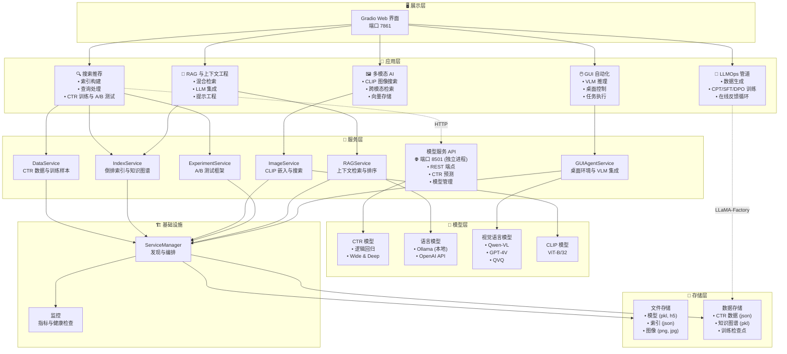
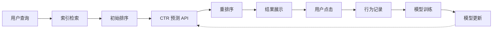
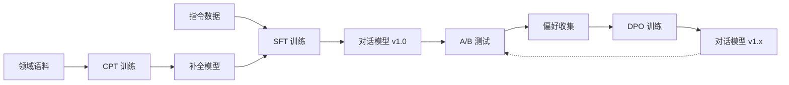
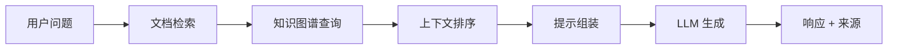
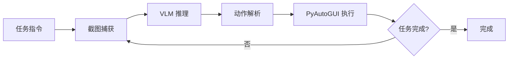

# 🔬 AI 工程测试床

[](https://www.python.org)
[](LICENSE)
[](https://github.com/tylerelyt/test_bed)

**语言**: [English](README.md) | [中文](README_zh.md)

一个全面的 AI 工程测试床，用于探索企业级 AI 系统工程，展示从经典搜索系统到前沿 LLM 训练和智能自动化的端到端 MLOps 工作流。设计为生产级 AI 架构和最佳实践的实践学习平台。

## 为什么叫 "Testbed"？

**Testbed（测试床）** 这个名称承载了工程学科的丰富传承：

- **电气自动化时代**：物理试验台，用于电路验证和原型设计
- **计算机科学演进**：软件测试框架和验证环境
- **人工智能工程**：端到端 AI 系统的实验与验证平台

本项目秉承**通过动手实验来学习**的工程哲学 —— 提供一个可控的环境来探索、验证和理解复杂的 AI 架构，然后再进行生产部署。测试床不仅是测试工具，更是**理论与实践结合**的学习平台，在这里错误成为宝贵的洞见。

### 产业实践：大厂内部平台

本架构复刻了顶级 AI 公司的运作方式。无论是国内还是国际科技巨头，所有新功能在公开发布前都要经过内部验证平台：

- 🔬 **内部 Portal**：研究团队实验和迭代的仪表盘
- 🔍 **X-Ray 界面**：开发人员的深度调试和可观测工具  
- 📊 **A/B 测试中心**：公开发布前的受控实验
- 🎯 **Staging 环境**：类生产测试，无用户影响

**我们的 Testbed Dashboard = 产业内部研发平台**。本项目将企业级内部工具实践带到开源社区。

## 🌟 平台亮点

**全栈 AI 系统**，涵盖五大领域：
- 🔍 **搜索推荐系统**：CTR 预测、A/B 测试、知识图谱
- 🤖 **LLMOps 训练管道**：完整的 CPT → SFT → DPO 工作流，支持在线反馈循环
- 💬 **RAG 与上下文工程**：混合检索与 LLM 集成
- 🖼️ **多模态 AI**：基于 CLIP 的图像搜索和跨模态理解
- 🖱️ **GUI 自动化代理**：基于 OSWorld 的桌面任务自动化，支持 VLM 推理

**生产级工程实践**：
- 微服务架构，独立模型服务
- 完整的可观测性和监控基础设施
- 自动化实验管理和 A/B 测试框架
- 真实世界的部署模式和可扩展性考虑

## 📊 技术栈

### 机器学习与 AI
| 领域 | 技术 |
|------|------|
| **经典 ML** | scikit-learn (逻辑回归), TensorFlow (Wide & Deep) |
| **大语言模型** | LLaMA-Factory, LoRA, Ollama, OpenAI API |
| **训练技术** | CPT, SFT, DPO, 无需 RLHF 的对齐 |
| **计算机视觉** | OpenAI CLIP (ViT-B/32), Hugging Face Transformers |
| **视觉语言模型** | Qwen-VL, GPT-4V, QVQ |

### NLP 与信息检索
| 组件 | 实现 |
|------|------|
| **文本处理** | jieba (中文分词), TF-IDF |
| **索引** | 倒排索引与自定义排序 |
| **知识图谱** | 基于 LLM 的实体识别、图谱构建与查询 |
| **嵌入** | CLIP 文本编码器、稀疏与稠密检索 |

### 系统架构
| 层级 | 技术 |
|------|------|
| **Web 框架** | Gradio (响应式 UI), Flask (REST API) |
| **模型服务** | 独立进程, RESTful 端点 (端口 8501) |
| **训练基础设施** | LLaMA-Factory CLI, 子进程管理 |
| **代理框架** | 基于 OSWorld 的架构, PyAutoGUI |
| **存储** | JSON, pickle, HDF5, TensorFlow SavedModel |

### 开发与运维
| 类别 | 工具 |
|------|------|
| **语言** | Python 3.8+ |
| **包管理** | pip, requirements.txt |
| **监控** | 自定义指标、健康检查、日志 |
| **实验管理** | A/B 测试框架、配置版本管理 |
| **文档** | Markdown, Mermaid 图表 |

## 🎯 核心能力

### 1. 🔍 搜索推荐系统
企业级信息检索，支持机器学习驱动的排序：
- **倒排索引**：基于 TF-IDF，支持中文分词 (jieba)
- **CTR 模型**：逻辑回归和 Wide & Deep 神经网络
- **知识图谱**：基于 LLM 的实体识别和语义增强
- **实验框架**：内置 A/B 测试，用于算法优化
- **实时排序**：基于用户反馈循环的动态重排序

### 2. 🤖 LLMOps 训练管道
完整的大语言模型训练工作流，遵循行业最佳实践：
- **CPT (继续预训练)**：在自定义语料上使用 LoRA 进行领域适配
- **SFT (监督微调)**：使用 ShareGPT 格式数据进行指令遵循
- **DPO (直接偏好优化)**：基于人类反馈的无需 RLHF 的对齐
- **在线反馈循环**：A/B 测试 → 偏好收集 → DPO 迭代
- **LLaMA-Factory 集成**：生产级训练，支持全面监控

### 3. 💬 RAG 与上下文工程
混合检索增强生成，实现准确问答：
- **多源检索**：文档、知识图谱和结构化数据
- **Ollama 集成**：本地 LLM 推理，支持多种模型
- **上下文排序**：智能选择相关信息
- **提示工程**：透明、可优化的提示模板
- **响应验证**：质量控制和事实检查机制

### 4. 🖼️ 多模态 AI 系统
基于 CLIP 的图像理解和跨模态搜索：
- **视觉语言模型**：通过 Hugging Face Transformers 使用 OpenAI CLIP
- **双搜索模式**：图像到图像和文本到图像检索
- **语义嵌入**：512 维向量，实现精确匹配
- **可扩展架构**：高效存储和亚秒级查询响应
- **统一接口**：与文本搜索系统无缝集成

### 5. 🖱️ GUI 自动化代理
基于视觉语言模型的智能桌面自动化：
- **OSWorld 架构**：观察-思考-行动循环，支持截图理解
- **VLM 集成**：Qwen-VL、GPT-4V 和 QVQ 模型用于视觉推理
- **动作执行**：基于 PyAutoGUI 的精确控制，支持坐标推断
- **安全机制**：虚拟机隔离和紧急停止控制
- **轨迹记忆**：历史上下文，支持多步骤任务完成

### 🏗️ 工程基础设施
生产级系统设计和运营卓越：
- **微服务架构**：模型服务、数据和推理的独立进程
- **RESTful API**：所有核心服务的标准化接口
- **服务发现**：组件编排的集中管理器
- **可观测性栈**：日志、指标和健康检查端点
- **现代 Web UI**：基于 Gradio 的响应式界面，支持实时更新

## 📚 技术文档

各系统组件的完整指南：

### 核心系统
- 🔍 **[搜索推荐系统](https://tylerelyt.github.io/test_bed/docs/search-recommendation/)**：倒排索引、CTR 模型、A/B 测试
- 🤖 **[LLMOps 训练流程](https://tylerelyt.github.io/test_bed/docs/llmops)**：CPT/SFT/DPO 工作流、数据生成、在线反馈循环
- 💬 **[RAG 与上下文工程](https://tylerelyt.github.io/test_bed/docs/rag)**：混合检索、LLM 集成
- 🖼️ **[多模态 AI](https://tylerelyt.github.io/test_bed/docs/multimodal/)**：CLIP 模型、多模态搜索、图像生成
- 🖱️ **[GUI 自动化代理](https://tylerelyt.github.io/test_bed/docs/gui-agent)**：OSWorld 架构、VLM 集成、桌面自动化

### 基础设施
- 🛠️ **[模型服务](https://tylerelyt.github.io/test_bed/docs/model-serving)**：RESTful API、部署模式、性能优化

📚 **[查看完整文档](https://tylerelyt.github.io/test_bed/)**：包含交互式示例的综合技术指南

## 🚀 快速开始

### 系统要求

- Python 3.8+
- 内存：至少 2GB
- 存储：至少 1GB 可用空间
- GPU（可选）：用于更好的 CLIP 模型性能

### 可选依赖

- Ollama（用于上下文工程/知识图谱）：本地 LLM 推理服务，默认地址 `http://localhost:11434`
- datasets（用于数据工具）：`pip install datasets`，由 `tools/wikipedia_downloader.py` 使用

### 安装

```bash
# 克隆仓库
git clone https://github.com/tylerelyt/test_bed.git
cd test_bed

# 创建虚拟环境
python -m venv venv
source venv/bin/activate  # Windows: venv\Scripts\activate

# 安装依赖
pip install -r requirements.txt
```

### 预加载数据集（只读）

如果存在 `data/preloaded_documents.json`，系统会将这些中文维基百科文档加载为只读核心数据集：
- **不可变**：预加载文档在 UI 中为只读
- **自动加载**：启动时自动加载 `data/preloaded_documents.json`（如果存在）
- **用户文档**：此版本不支持通过 UI 导入/编辑
- **数据源**：通常通过工具从 Hugging Face `fjcanyue/wikipedia-zh-cn` 生成

注意：如果不存在预加载文件，系统仍会启动，但文本索引可能为空，直到离线提供数据。

### 预加载知识图谱（只读）

系统会自动加载预加载的中文知识图谱（如果可用）：
- **主要来源**：`data/openkg_triples.tsv` - 真实的 OpenKG 概念层次数据（290 个实体，254 个关系）
- **备用格式**：`data/preloaded_knowledge_graph.json` - 如果 TSV 不可用时的替代格式
- **自动生成**：运行 `python tools/openkg_generator.py` 下载最新的 OpenKG 样本数据
- **格式**：TSV 格式，包含概念-类别关系（例如："移动应用 属于 软件"）
- **数据源**：GitHub 上的 OpenKG OpenConcepts 项目

知识图谱为实体识别和上下文工程功能提供支持。

### 启动系统

```bash
# 方法 1：使用启动脚本
./quick_start.sh

# 方法 2：直接启动
python start_system.py
```

系统启动后，访问 http://localhost:7861 使用界面。

### 配置

基本配置在代码中完成。对于 LLM 功能（NER、RAG、GUI Agent），需要通过环境变量配置 API 密钥。

**快速设置：**
```bash
# 复制示例环境文件
cp .env.example .env

# 编辑 .env 并添加你的 API 密钥
# 至少需要设置 DASHSCOPE_API_KEY 或 OPENAI_API_KEY
```

查看 `.env.example` 了解所有可用的配置选项和详细说明。

### 系统架构概览

平台采用**分层微服务架构**，包含五个专业子系统：

#### 🔍 搜索推荐子系统
- **索引服务**：TF-IDF 倒排索引，支持中文分词
- **模型服务**：独立进程，通过 REST API 提供 CTR 预测模型
- **数据服务**：CTR 数据收集、存储和训练样本生成
- **实验服务**：用于排序算法评估的 A/B 测试框架
- **搜索接口**：查询处理、检索、重排序和结果展示

#### 🤖 LLMOps 训练子系统
- **数据生成**：领域语料处理、Self-Instruct 和偏好收集
- **训练编排**：LLaMA-Factory 集成，支持 CPT/SFT/DPO 工作流
- **实验管理**：配置版本管理、训练监控和结果跟踪
- **在线反馈循环**：用于人类偏好收集的 A/B 测试接口
- **模型部署**：检查点管理和推理服务集成

#### 💬 RAG 与上下文工程子系统
- **检索层**：跨文档、知识图谱和结构化数据的混合搜索
- **LLM 集成**：Ollama 客户端，支持本地推理和多种模型
- **上下文排序**：智能相关性评分和上下文选择
- **提示管理**：基于模板的提示工程，支持变量注入
- **响应生成**：流式响应，支持来源标注

> **注意**：RAG 功能需要本地运行的 Ollama 服务。如果不可用，系统会优雅降级，同时保持其他功能。

#### 🖼️ 多模态 AI 子系统
- **图像服务**：CLIP 模型管理和嵌入生成
- **向量存储**：高效的余弦距离相似度搜索
- **双搜索模式**：图像到图像和文本到图像检索
- **图像管理**：上传、索引、元数据存储和图库查看
- **跨模态集成**：与文本搜索系统的统一接口

#### 🖱️ GUI 自动化子系统
- **桌面环境**：通过 PyAutoGUI 控制虚拟机或本地系统
- **代理核心**：观察-推理-行动循环，集成 VLM
- **视觉模型**：Qwen-VL、GPT-4V 和 QVQ 用于截图理解
- **动作执行器**：精确的鼠标/键盘控制，支持坐标推断
- **安全控制**：紧急停止机制和执行沙箱

#### 🏗️ 共享基础设施层
- **服务管理器**：集中式组件发现和生命周期管理
- **模型服务 API**：所有 ML 模型的 RESTful 端点（端口 8501）
- **监控仪表板**：实时指标、健康检查和性能跟踪
- **Web 接口**：基于 Gradio 的响应式 UI，支持标签页导航
- **数据管道**：统一存储、预处理和特征工程

## 🖼️ 图像搜索系统

### 概述

图像搜索系统利用 OpenAI 的 CLIP 模型提供智能图像检索功能：

- **📤 图像上传**：存储带描述和标签的图像
- **🔍 图像到图像搜索**：使用查询图像查找视觉相似的图像
- **💬 文本到图像搜索**：使用自然语言描述搜索图像
- **📋 图像管理**：全面的图像库管理

### 技术细节

- **模型**：通过 Hugging Face Transformers 使用 OpenAI CLIP ViT-B/32
- **嵌入维度**：512 维向量
- **相似度度量**：余弦相似度
- **支持格式**：JPG、PNG、GIF、BMP 等
- **性能**：亚秒级搜索响应时间

### 使用示例

#### 文本到图像搜索
```python
# 搜索查询示例
"街上的红色汽车"
"床上睡觉的猫"
"美丽的日落风景"
"跑步的人"  # 也支持非英文查询
```

#### 上传和索引图像
1. 导航到 "🖼️ 图像搜索系统" → "📤 图像上传"
2. 选择图像文件并添加描述/标签
3. 点击 "📤 上传图像" 进行索引

#### 搜索相似图像
1. 进入 "🔍 图像到图像" 标签页
2. 上传查询图像
3. 调整结果数量（1-20）
4. 以表格和图库格式查看结果

详细使用说明，请参阅：
- [搜索推荐系统](https://tylerelyt.github.io/test_bed/docs/search-recommendation/)
- [RAG 与上下文工程](https://tylerelyt.github.io/test_bed/docs/rag)
- [多模态 AI](https://tylerelyt.github.io/test_bed/docs/multimodal/)

## 📖 用户指南

### 基本使用

1. **索引构建**：系统会在启动时自动加载预加载文档（如果存在）并构建索引；不支持通过 UI 手动添加文档
2. **搜索测试**：在搜索框中输入查询以检索相关文档
3. **点击反馈**：点击搜索结果会记录用户行为用于模型训练
4. **模型训练**：收集足够数据后，训练 CTR 预测模型

### 高级功能

#### 1. 批量数据导入

```python
from src.search_engine.data_utils import import_ctr_data
result = import_ctr_data("path/to/your/data.json")
```

#### 2. 自定义排序策略

```python
from src.search_engine.service_manager import get_index_service
index_service = get_index_service()
results = index_service.search("query terms", top_k=10)
```

#### 3. 实验管理

系统支持 A/B 测试，可在监控界面中比较可配置的排序策略。

## 🏗️ 系统架构

### 高层架构



### 数据流图

#### 🔍 搜索推荐流程


#### 🤖 LLMOps 训练流程


#### 💬 RAG 与上下文工程流程


#### 🖼️ 多模态 AI 流程


#### 🖱️ GUI 自动化流程


## 📊 说明

本项目是一个用于学习和实验的测试床。任何性能数据都取决于环境、数据大小和配置，不提供保证。

## 🛠️ 开发指南

### 项目结构

```
Testbed/
├── src/search_engine/                     # 核心源代码
│   ├── portal.py                          # 主 Web 界面入口
│   ├── service_manager.py                 # 服务发现与编排
│   │
│   ├── # 搜索推荐
│   ├── data_service.py                    # CTR 数据收集与管理
│   ├── index_service.py                   # 倒排索引与文本搜索
│   ├── model_service.py                   # CTR 模型服务 (LR, Wide&Deep)
│   ├── experiment_service.py              # A/B 测试框架
│   ├── index_tab/                         # 索引构建 UI
│   │   ├── index_tab.py
│   │   ├── knowledge_graph.py             # 知识图谱构建
│   │   ├── ner_service.py                 # 实体识别
│   │   └── kg_retrieval_service.py        # 知识图谱查询服务
│   ├── search_tab/                        # 搜索 UI 和引擎
│   │   ├── search_tab.py
│   │   └── search_engine.py
│   │
│   ├── # LLMOps 训练管道
│   ├── training_tab/                      # 训练与 LLMOps UI
│   │   ├── training_tab.py                # CTR 训练接口
│   │   ├── ctr_model.py                   # 逻辑回归
│   │   ├── ctr_wide_deep_model.py         # Wide & Deep 模型
│   │   ├── llmops_tab.py                  # LLMOps 主接口
│   │   ├── llmops_engine.py               # 训练编排
│   │   ├── llama_factory_config.py        # 配置生成
│   │   ├── llamafactory_trainer.py        # 训练服务
│   │   ├── self_instruct_generator.py     # SFT 数据生成
│   │   ├── domain_corpus_processor.py     # CPT 数据处理
│   │   ├── preference_collector.py        # DPO 反馈收集
│   │   └── inference_model.py             # 模型推理（用于 A/B 测试）
│   │
│   ├── # RAG 与上下文工程
│   ├── rag_tab/                           # RAG 系统
│   │   ├── rag_tab.py                     # RAG 接口
│   │   └── rag_service.py                 # 检索与生成
│   │
│   ├── # 多模态 AI
│   ├── image_service.py                   # 基于 CLIP 的图像搜索
│   ├── image_tab/                         # 图像搜索 UI
│   │   └── image_tab.py
│   │
│   ├── # GUI 自动化代理
│   ├── gui_agent_service.py               # 代理核心 (基于 OSWorld)
│   │   # - SimpleDesktopEnv
│   │   # - SimplePromptAgent
│   │   # - VLM 集成 (Qwen-VL, GPT-4V, QVQ)
│   │
│   └── monitoring_tab/                    # 系统监控
│       └── monitoring_tab.py
│
├── models/                                # 模型文件
│   ├── ctr_model.pkl                      # 逻辑回归 CTR
│   ├── wide_deep_ctr_model.h5             # Wide & Deep CTR
│   ├── wide_deep_ctr_model_tf_serving/    # TF Serving 格式
│   ├── index_data.json                    # 倒排索引
│   ├── knowledge_graph.pkl                # 知识图谱
│   └── images/                            # 图像嵌入
│       ├── image_index.json
│       └── image_embeddings.npy
│
├── data/                                  # 数据存储
│   ├── preloaded_documents.json           # 维基百科语料
│   ├── preloaded_kg.json                  # 预加载知识图谱
│   ├── ctr_data.json                      # CTR 训练数据
│   ├── llmops/                            # LLMOps 数据集
│   │   ├── dataset_info.json              # 数据集注册表
│   │   ├── cpt/                           # CPT 训练数据
│   │   │   └── domain_corpus_*.jsonl
│   │   ├── sft/                           # SFT 训练数据
│   │   │   └── sft_data_*.json
│   │   └── dpo/                           # DPO 偏好数据
│   │       └── prefs.jsonl
│   └── gui_screenshots/                   # GUI 代理截图
│
├── checkpoints/                           # 训练检查点
│   ├── cpt/                               # CPT 模型检查点
│   ├── sft/                               # SFT 模型检查点
│   └── dpo/                               # DPO 模型检查点
│
├── configs/llmops/                        # LLMOps 配置
│   ├── cpt_config_*.yaml
│   ├── sft_config_*.yaml
│   └── dpo_config_*.yaml
│
├── docs/                                  # 技术文档
│   ├── SEARCH_GUIDE.md
│   ├── LLMOPS_GUIDE.md                    # LLMOps 完整指南
│   ├── RAG_GUIDE.md / CONTEXT_ENGINEERING_GUIDE.md
│   ├── IMAGE_SEARCH_GUIDE.md
│   ├── GUI_AGENT_GUIDE.md                 # GUI 自动化指南
│   └── MODEL_SERVING_GUIDE.md
│
├── tools/                                 # 工具
│   ├── model_service_manager.py           # 模型服务生命周期
│   ├── openkg_generator.py                # 知识图谱数据生成
│   └── performance_monitor.py
│
├── start_system.py                        # 主启动脚本
├── start_model_serving.py                 # 独立模型服务
├── quick_start.sh                         # 快速启动脚本
└── requirements.txt                       # Python 依赖
```

### 扩展开发

#### 添加新的排序算法

1. 在 `src/search_engine/ranking/` 中创建新的排序模块
2. 实现 `RankingInterface` 接口
3. 在 `IndexService` 中注册新算法

#### 添加新功能

1. 在 `CTRSampleConfig` 中定义新特征
2. 在 `DataService.record_impression` 中计算特征值
3. 更新模型训练逻辑

#### 添加新的图像搜索功能

1. 使用新方法扩展 `ImageService` 类
2. 更新 `image_tab.py` UI 组件
3. 使用各种图像类型和查询进行测试

## 🧪 测试

```bash
# 运行单元测试（如果存在）
python -m pytest tests/
```

## 📈 监控与可观测性

平台为所有子系统提供全面监控：

### 系统级监控
- **资源指标**：CPU、内存、磁盘 I/O、网络带宽
- **服务健康**：所有微服务的健康检查端点
- **API 性能**：响应时间、吞吐量、错误率
- **进程管理**：独立模型服务进程状态

### 应用级监控

#### 🔍 搜索推荐
- **搜索 QPS**：每秒查询数和延迟分布
- **CTR 指标**：预测准确性、点击率
- **排序质量**：位置偏差、相关性指标
- **A/B 测试结果**：实验性能比较

#### 🤖 LLMOps 管道
- **训练进度**：损失曲线、学习率调度
- **数据质量**：Token 数量、格式验证、多样性指标
- **模型检查点**：版本跟踪、存储使用
- **推理延迟**：Token 生成速度、吞吐量

#### 💬 RAG 系统
- **检索质量**：Precision@K、召回率、相关性分数
- **LLM 性能**：生成延迟、Token 使用
- **上下文利用**：上下文窗口使用、截断率
- **知识图谱**：查询性能、覆盖率指标

#### 🖼️ 多模态 AI
- **嵌入质量**：向量分布、聚类一致性
- **搜索准确性**：Top-K 精确度、相似度分布
- **CLIP 性能**：编码延迟、批量吞吐量
- **存储效率**：索引大小、查找速度

#### 🖱️ GUI 自动化
- **任务成功率**：完成率、失败原因
- **VLM 延迟**：截图到动作时间、API 成本
- **动作准确性**：坐标精度、执行成功率
- **安全指标**：停止触发率、错误恢复

### 告警与诊断
- **异常检测**：统计异常值检测
- **阈值告警**：可配置的警告和严重级别
- **日志聚合**：所有组件的集中日志
- **性能分析**：瓶颈识别和优化建议

## 🤝 贡献

1. Fork 项目
2. 创建功能分支 (`git checkout -b feature/AmazingFeature`)
3. 提交更改 (`git commit -m 'Add some AmazingFeature'`)
4. 推送到分支 (`git push origin feature/AmazingFeature`)
5. 创建 Pull Request

## 📄 许可证

本项目采用 MIT 许可证 - 详见 [LICENSE](LICENSE) 文件。

## 🙏 致谢

### 核心库
- [jieba](https://github.com/fxsjy/jieba) - 中文分词
- [scikit-learn](https://scikit-learn.org/) - 经典机器学习
- [TensorFlow](https://www.tensorflow.org/) - 深度学习框架
- [pandas](https://pandas.pydata.org/) - 数据处理与分析
- [Gradio](https://gradio.app/) - 现代 Web 界面框架
- [Flask](https://flask.palletsprojects.com/) - RESTful API 框架

### AI 与 ML 模型
- [Hugging Face Transformers](https://huggingface.co/transformers/) - 预训练模型中心
- [OpenAI CLIP](https://github.com/openai/CLIP) - 视觉语言模型
- [LLaMA-Factory](https://github.com/hiyouga/LLaMA-Factory) - 高效的 LLM 训练框架
- [Ollama](https://ollama.ai/) - 本地 LLM 推理
- [Qwen-VL](https://github.com/QwenLM/Qwen-VL) - 视觉语言推理

### 代理与自动化
- [OSWorld](https://github.com/xlang-ai/OSWorld) - 桌面代理架构
- [PyAutoGUI](https://pyautogui.readthedocs.io/) - GUI 自动化
- [pynput](https://pynput.readthedocs.io/) - 键盘和鼠标控制

### 参考文献与灵感
- [LoRA: Low-Rank Adaptation](https://arxiv.org/abs/2106.09685) - 参数高效微调
- [DPO: Direct Preference Optimization](https://arxiv.org/abs/2305.18290) - 无需 RLHF 的对齐
- [Self-Instruct](https://arxiv.org/abs/2212.10560) - 指令数据生成
- [Wide & Deep Learning](https://arxiv.org/abs/1606.07792) - 推荐系统架构

## 📞 联系方式

- 项目主页: https://github.com/tylerelyt/test_bed
- 问题追踪: https://github.com/tylerelyt/test_bed/issues
- 邮箱: tylerelyt@gmail.com

