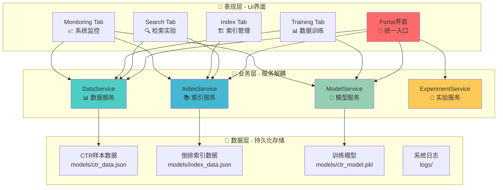
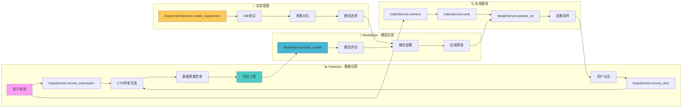
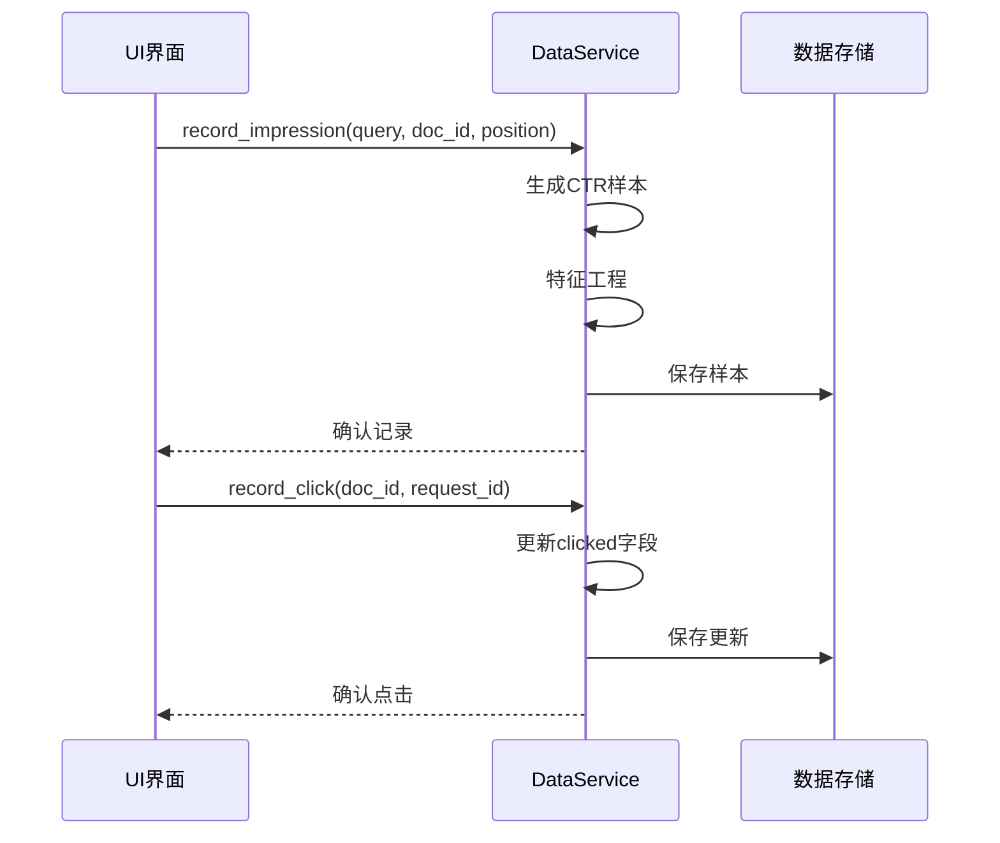
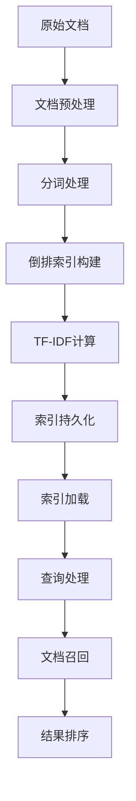
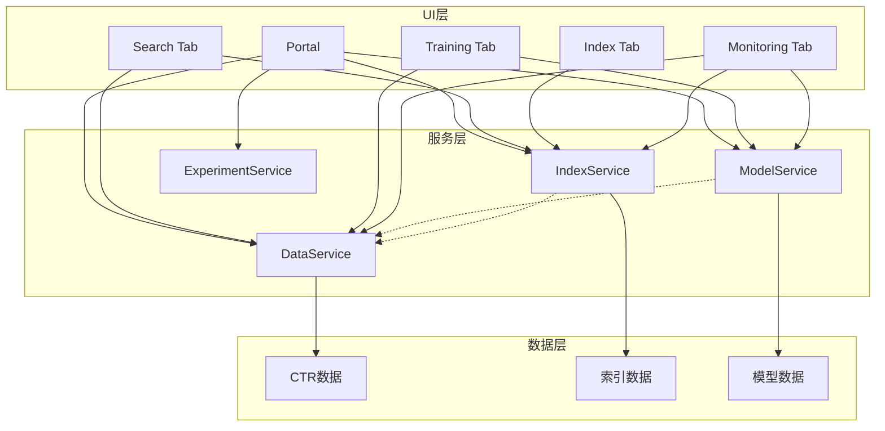
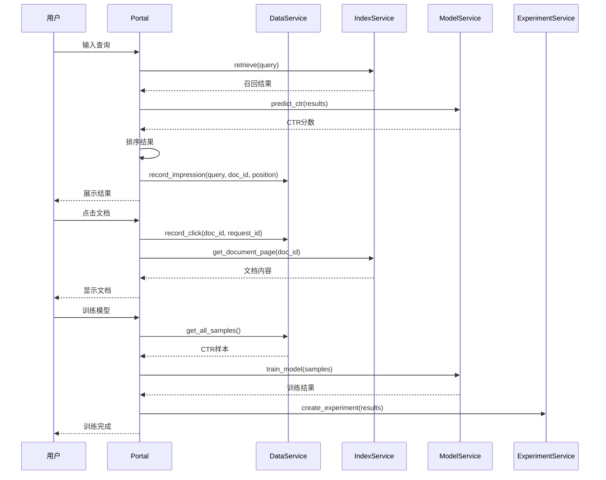
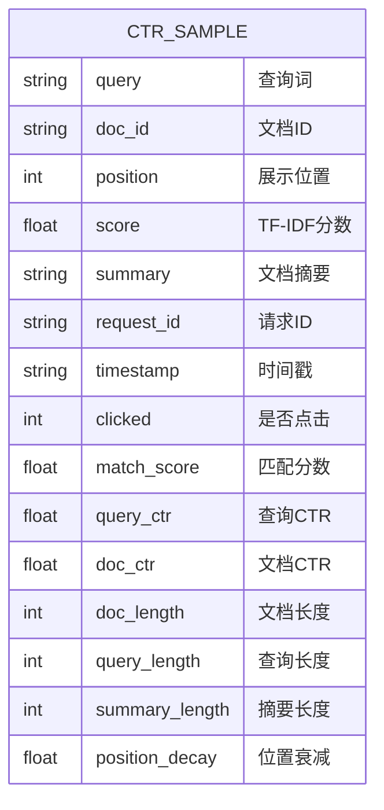
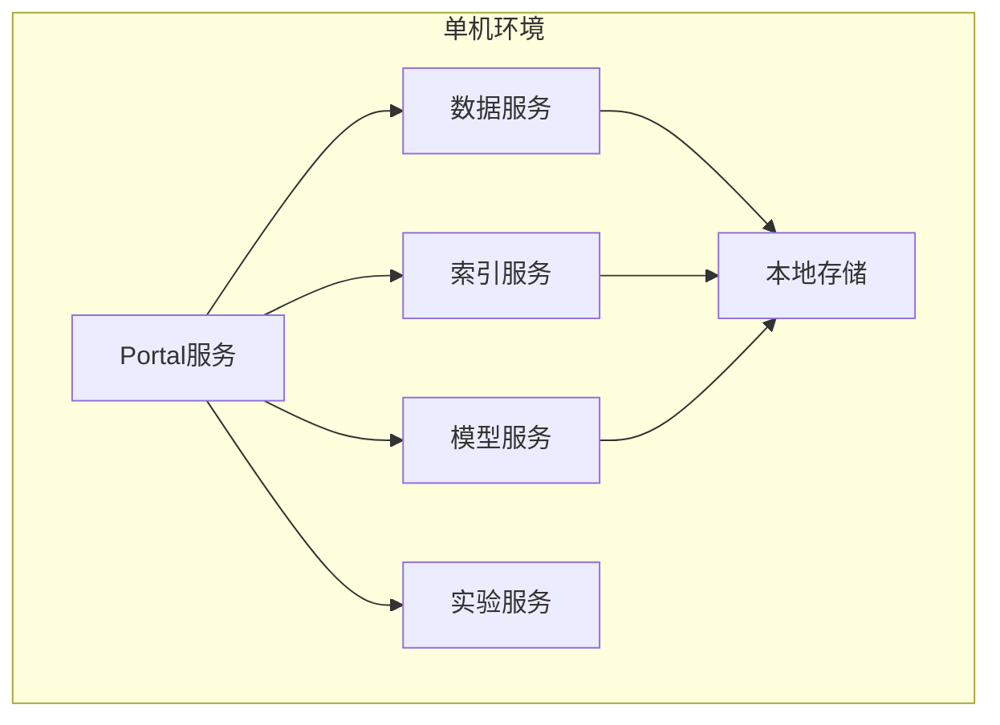
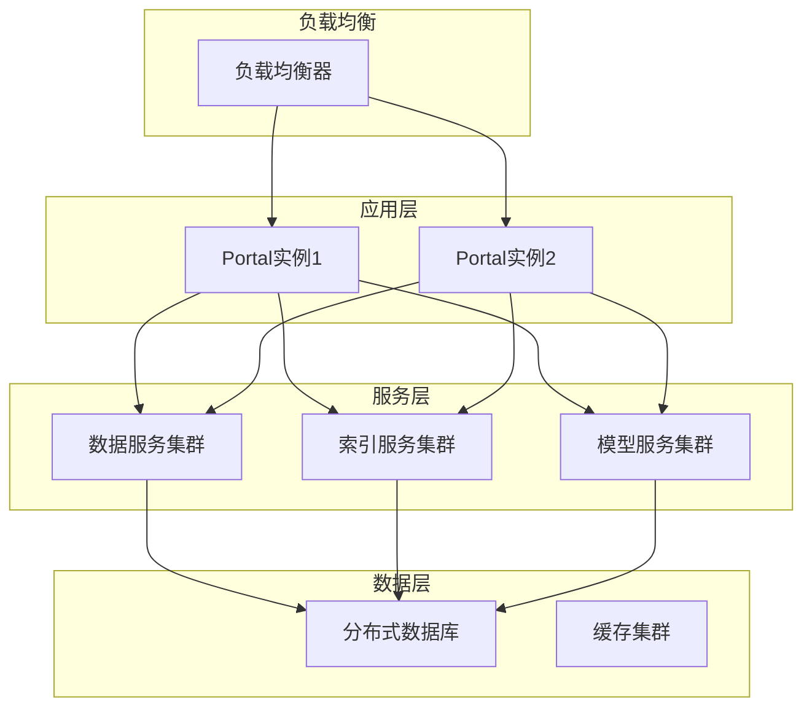

# 🏗️ 搜索引擎测试床 - MLOps架构设计

## 🎯 架构概述

本系统采用**服务解耦的MLOps架构**，将搜索引擎的各个功能模块抽象为独立的服务，通过标准化的接口进行交互，实现高内聚、低耦合的系统设计。

## 🏗️ 整体架构

### 服务分层架构



### MLOps数据流架构



## 🔧 核心服务设计

### 📊 DataService - 数据服务

**职责**: CTR样本的采集、存储、管理和数据质量保证

**核心功能**:
```python
class DataService:
    def record_impression(self, query, doc_id, position, score, summary, request_id)
    def record_click(self, doc_id, request_id)
    def get_samples_dataframe(self, request_id=None)
    def get_all_samples(self)
    def get_stats(self)
    def clear_data(self)
    def import_data(self, data)
    def export_data(self, format='json')
```

**数据流**:


### 📚 IndexService - 索引服务

**职责**: 倒排索引的构建、查询、管理和文档检索

**核心功能**:
```python
class IndexService:
    def build_index(self, documents)
    def retrieve(self, query, top_k=20)
    def rank(self, query, doc_ids, top_k=10)
    def get_document_page(self, doc_id, request_id, data_service)
    def get_index_stats(self)
    def search_documents(self, query)
```

**索引流程**:


### 🤖 ModelService - 模型服务

**职责**: CTR模型的训练、评估、部署和在线预测

**核心功能**:
```python
class ModelService:
    def train_model(self, samples)
    def predict_ctr(self, features)
    def evaluate_model(self, test_samples)
    def save_model(self, model_path)
    def load_model(self, model_path)
    def get_feature_importance(self)
    def get_model_stats(self)
```

**训练流程**:


### 🧪 ExperimentService - 实验服务

**职责**: 实验管理、A/B测试、版本控制和效果对比

**核心功能**:
```python
class ExperimentService:
    def create_experiment(self, name, description)
    def run_ab_test(self, experiment_id, variants)
    def compare_results(self, experiment_id)
    def select_best_model(self, experiment_id)
    def get_experiment_history(self)
    def export_experiment_results(self, experiment_id)
```

## 📊 模块依赖关系

### 服务依赖图



### 文件结构

```
src/search_engine/
├── portal.py                 # 🚪 统一入口
├── data_service.py           # 📊 数据服务
├── index_service.py          # 📚 索引服务
├── model_service.py          # 🤖 模型服务
├── experiment_service.py     # 🧪 实验服务
├── search_tab/
│   └── search_tab.py        # 🔍 检索实验Tab
├── training_tab/
│   ├── training_tab.py      # 📊 数据训练Tab
│   └── ctr_config.py        # ⚙️ CTR配置
├── index_tab/
│   └── index_tab.py         # 🏗️ 索引管理Tab
└── monitoring_tab/
    └── monitoring_tab.py    # 📈 系统监控Tab
```

## 🔄 数据流设计

### 完整工作流程



### CTR样本数据结构



## 🛠️ 扩展设计

### 服务扩展接口

所有服务都遵循标准接口设计：

```python
class BaseService:
    def __init__(self, config=None):
        self.config = config or {}
        self.status = "stopped"
    
    def start(self):
        """启动服务"""
        pass
    
    def stop(self):
        """停止服务"""
        pass
    
    def get_status(self):
        """获取服务状态"""
        return self.status
    
    def health_check(self):
        """健康检查"""
        pass
```

### 新服务添加流程

1. **创建服务类**: 继承 `BaseService` 或实现标准接口
2. **注册服务**: 在 `portal.py` 中注册新服务
3. **UI集成**: 在相应的 Tab 中调用服务方法
4. **配置管理**: 添加服务配置项
5. **监控集成**: 在 Monitoring Tab 中添加监控

### 算法扩展接口

```python
class AlgorithmInterface:
    def train(self, data):
        """训练算法"""
        pass
    
    def predict(self, input_data):
        """预测结果"""
        pass
    
    def evaluate(self, test_data):
        """评估效果"""
        pass
    
    def save(self, path):
        """保存模型"""
        pass
    
    def load(self, path):
        """加载模型"""
        pass
```

## 📈 性能设计

### 性能指标

- **检索延迟**: < 100ms
- **CTR预测**: < 50ms
- **模型训练**: < 30s (1000样本)
- **并发支持**: 多用户同时使用
- **数据一致性**: 实时落盘保证

### 优化策略

1. **索引优化**: 倒排索引预加载，查询缓存
2. **模型优化**: 模型预加载，批量预测
3. **数据优化**: 异步落盘，批量写入
4. **并发优化**: 线程安全，锁机制

## 🔒 安全设计

### 数据安全

- **数据隔离**: 不同用户数据隔离
- **访问控制**: 服务级别权限控制
- **数据加密**: 敏感数据加密存储
- **审计日志**: 完整操作审计

### 系统安全

- **输入验证**: 所有输入参数验证
- **异常处理**: 完善的异常处理机制
- **资源限制**: 防止资源耗尽攻击
- **监控告警**: 异常情况及时告警

## 📋 部署架构

### 单机部署



### 分布式部署（未来扩展）



---

**🎯 基于服务解耦的MLOps架构，支持高可扩展、高可维护的搜索引擎算法验证平台！** 