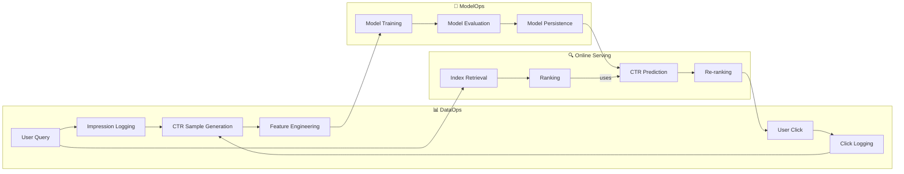

# 🏗️ AI System Testbed - Architecture & Modules

## 🎯 Architectural Overview

This system is designed with a **service-oriented MLOps architecture**. Core functionalities are encapsulated into independent services managed by a central `ServiceManager`, providing a decoupled and extensible framework. The user interface is built with Gradio, with different tabs corresponding to distinct functional modules.

##  diagrams

### High-Level System Architecture

The architecture is layered, separating the UI, application logic, core services, and data persistence.

```mermaid
graph TB
    subgraph "UI Layer (Gradio Tabs)"
        PORTAL[Portal UI]
        SEARCH_TAB[Search & Ranking]
        TRAINING_TAB[Model Training]
        INDEX_TAB[Index & KG Management]
        RAG_TAB[RAG Chat]
        IMAGE_TAB[Image Search]
        MONITOR_TAB[System Monitoring]
    end

    subgraph "Application & Service Layer"
        SM[ServiceManager]
        DS[DataService]
        IS[IndexService]
        MS[ModelService]
        IMS[ImageService]
    end

    subgraph "Data Persistence Layer"
        CTR_DATA[CTR Data]
        INDEX_DATA[Inverted Index]
        KG_DATA[Knowledge Graph]
        MODEL_DATA[Trained Models]
        IMAGE_DATA[Image Files & Index]
    end

    subgraph "External Dependencies"
        OLLAMA[Ollama (LLM Inference)]
    end

    PORTAL --> SEARCH_TAB
    PORTAL --> TRAINING_TAB
    PORTAL --> INDEX_TAB
    PORTAL --> RAG_TAB
    PORTAL --> IMAGE_TAB
    PORTAL --> MONITOR_TAB

    SEARCH_TAB --> SM
    TRAINING_TAB --> SM
    INDEX_TAB --> SM
    RAG_TAB --> IS
    RAG_TAB --> OLLAMA
    IMAGE_TAB --> SM
    MONITOR_TAB --> SM

    SM --> DS
    SM --> IS
    SM --> MS
    SM --> IMS

    DS --> CTR_DATA
    IS --> INDEX_DATA
    IS --> KG_DATA
    MS --> MODEL_DATA
    IMS --> IMAGE_DATA
```

### MLOps Data Flow

The system facilitates a complete MLOps loop for the Search & Recommendation module.



## 🔧 Core Services & Modules

### 📊 DataService
**Responsibility**: Manages the collection, storage, and retrieval of Click-Through Rate (CTR) data.
- **`record_impression()`**: Logs when a search result is shown to a user.
- **`record_click()`**: Logs a user's click on a result.
- **`get_samples_dataframe()`**: Provides CTR data as a Pandas DataFrame for training.
- **`get_stats()`**: Returns statistics about the collected data.

### 📚 IndexService
**Responsibility**: Handles document indexing, TF-IDF-based retrieval, and knowledge graph operations. This is a core service used by both traditional search and RAG.
- **`search()`**: Performs a search using the inverted index and TF-IDF scoring.
- **`retrieve()`**: Retrieves a list of document IDs for a given query.
- **`rank()`**: Ranks a list of documents based on TF-IDF or a CTR model.
- **`build_knowledge_graph()`**: Constructs the knowledge graph from documents using the NER service.
- **`query_entity_relations()`**: Queries the knowledge graph for entity information.

### 🤖 ModelService
**Responsibility**: Manages the lifecycle of machine learning models, primarily for CTR prediction.
- **`train_model()`**: Trains a CTR model (e.g., Logistic Regression, Wide & Deep) on the data collected by `DataService`.
- **`predict_ctr()`**: Predicts the CTR for a given set of features.
- **`save_model()` / `load_model()`**: Handles model persistence.
- **`get_model_info()`**: Provides metadata about the currently loaded model.

### 🖼️ ImageService
**Responsibility**: Manages all image search functionalities, powered by the CLIP model.
- **`add_image()`**: Adds an image to the library, generating a CLIP embedding.
- **`search_by_image()`**: Finds similar images based on a query image.
- **`search_by_text()`**: Retrieves images that match a natural language description.
- **`get_stats()`**: Returns statistics about the image library.

### 🤖 RAG & Knowledge Graph Module
This module provides advanced retrieval and generation capabilities. It is not a single, managed service but a collection of classes that work together.
- **`RAGService`**: Orchestrates the Retrieve-Augment-Generate process. It uses `IndexService` for retrieval and connects to an external Ollama instance for language generation.
- **`KGRetrievalService`**: Manages all knowledge graph operations, including building the graph and querying entities.
- **`NERService`**: Uses an LLM (via Ollama or another provider) to perform Named Entity Recognition (NER) on documents, extracting entities and relations to build the knowledge graph.

## 📁 File Structure

The source code is organized by service and UI tab.

```
src/search_engine/
├── portal.py                 # 🚪 Main UI Entrypoint
├── config.py                 # ⚙️ Centralized Configuration
├── service_manager.py        # 🔧 Manages service instances
│
├── data_service.py           # 📊 CTR Data Service
├── index_service.py          # 📚 Document Index & KG Service
├── model_service.py          # 🤖 ML Model Service
├── image_service.py          # 🖼️ Image Search Service
│
├── index_tab/
│   ├── index_tab.py          # 🏗️ UI for Indexing & KG
│   ├── knowledge_graph.py
│   ├── ner_service.py
│   └── ...
│
├── search_tab/
│   └── search_tab.py         # 🔍 UI for Search & Ranking
│
├── training_tab/
│   ├── training_tab.py       # 📈 UI for Model Training
│   └── ctr_model.py
│
├── rag_tab/
│   ├── rag_tab.py            # 🤖 UI for RAG
│   └── rag_service.py
│
├── image_tab/
│   └── image_tab.py          # 🖼️ UI for Image Search
│
└── monitoring_tab/
    └── monitoring_tab.py     # 🛡️ UI for System Monitoring
``` 