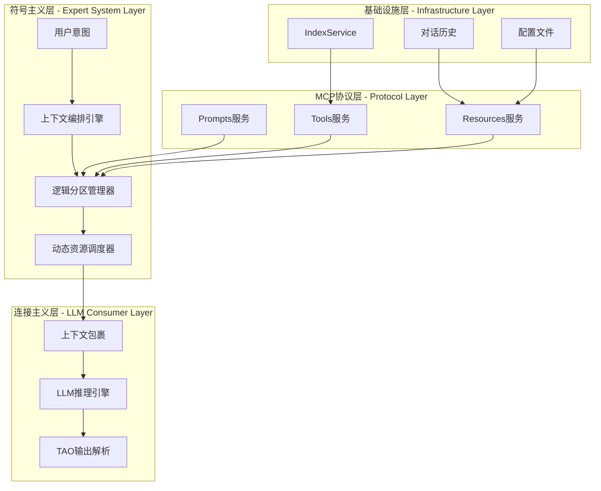
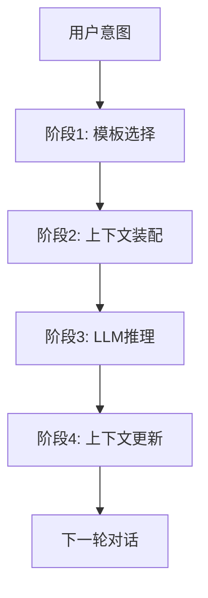
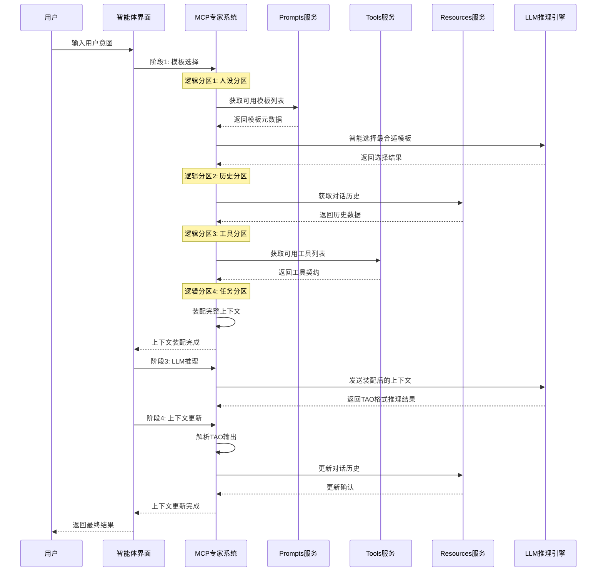
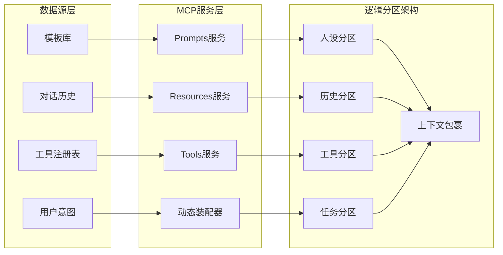
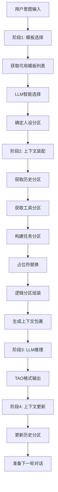

# 🧠 上下文工程系统技术指南 ([返回README](../README.md))

## 1. 系统概述

上下文工程系统基于Model Context Protocol (MCP)架构，实现符号主义专家系统与连接主义LLM的完美结合。通过动态上下文编排、智能模板选择和工具调用，构建完整的思考-行动-观察循环。

## 2. 核心架构设计

### 2.1 上下文工程架构理念

**核心思想**：将LLM的上下文窗口视为可编程的逻辑空间，通过MCP协议实现符号主义与连接主义的完美结合。



### 2.2 四阶段智能体循环

系统实现了完整的四阶段智能体循环：



### 2.3 逻辑分区动态展开流程

**上下文工程的核心**：通过MCP协议实现逻辑分区的动态展开



### 2.4 MCP架构组件

- **MCP客户端管理器**：`MCPClientManager` - 管理MCP服务器连接和调用
- **动态MCP服务器**：`DynamicMCPServer` - 提供标准化的prompts、tools、resources
- **智能体演示界面**：`smart_agent_demo.py` - 实现四阶段循环的用户界面

## 3. 逻辑分区动态展开机制

### 3.1 逻辑分区设计原理

**上下文工程的核心思想**：将复杂的上下文分解为独立的逻辑分区，每个分区通过MCP协议动态获取和装配。



### 3.2 各逻辑分区的动态展开

#### 3.2.1 人设分区（Persona Partition）

**目标**：动态确定AI助手的角色和风格

**MCP实现**：
```python
# 通过Prompts服务动态获取人设模板
@self.mcp.prompt("simple_chat")
def simple_chat_prompt(user_input: str) -> str:
    return f"""[人设] 你是一个友好的AI助手

[当前状态] 处理时间: {{local:current_time}}
用户意图: {{local:user_intent}}
模型: {{local:model_name}}

[用户问题] {user_input}

[回答] 请保持简洁明了地回答用户问题："""

@self.mcp.prompt("context_engineering")
def context_engineering_prompt(user_input: str = "") -> str:
    return f"""[人设] 你是一个专业的上下文工程专家，擅长动态决策和智能推理

[上下文工程模式] 请严格按照以下格式进行回答：
思考: <详细分析用户问题，评估是否需要外部信息，制定解决方案>
行动: <选择适合的工具，格式：工具名(参数1="值1", 参数2="值2")>
观察: <工具返回的结果或观察到的信息>
"""
```

**动态展开过程**：
1. **模板发现**：通过`mcp_manager.list_prompts()`获取所有可用模板
2. **智能选择**：LLM根据用户意图选择最合适的人设模板
3. **动态装配**：将选择的人设模板与其他分区组合

#### 3.2.2 历史分区（History Partition）

**目标**：提供对话连续性和上下文记忆

**MCP实现**：
```python
@self.mcp.resource(
    uri="conversation://current/history",
    name="当前对话历史",
    description="实时对话历史记录，支持多轮对话上下文管理",
    mime_type="application/json"
)
def get_conversation_history() -> str:
    """获取对话历史资源"""
    return json.dumps(self.conversation_history, ensure_ascii=False, indent=2)

@self.mcp.tool("add_conversation_turn")
def add_conversation_turn(tao_data: str) -> str:
    """添加对话轮次工具"""
    tao_record = json.loads(tao_data)
    simplified_tao = {
        "turn": len(self.conversation_history) + 1,
        "timestamp": tao_record.get("timestamp", "now"),
        "reasoning": tao_record.get("reasoning", ""),
        "action": tao_record.get("action", ""),
        "observation": tao_record.get("observation", "")
    }
    self.conversation_history.append(simplified_tao)
    return json.dumps({"status": "success", "message": f"已添加第{simplified_tao['turn']}轮对话"})
```

**动态展开过程**：
1. **资源订阅**：通过MCP协议订阅对话历史资源
2. **实时获取**：动态获取最新的对话历史数据
3. **结构化存储**：以TAO格式存储每轮对话的思考-行动-观察过程

#### 3.2.3 工具分区（Tools Partition）

**目标**：提供AI可调用的外部能力

**MCP实现**：
```python
@self.mcp.tool(
    name="retrieve",
    description="智能文档检索工具，支持动态决策和思考-行动-观察模式",
    tags={"search", "retrieval", "document", "intelligent"},
    meta={"version": "2.0", "category": "core", "context_engineering": True}
)
def retrieve(
    reasoning: str = "",
    action: str = "search",
    query: str = "", 
    top_k: int = 5, 
    include_metadata: bool = True
) -> Dict[str, Any]:
    """智能文档检索工具
    
    支持思考-行动-观察模式的智能检索工具。模型可以：
    1. 提供推理过程(reasoning)
    2. 决定是否执行检索(action: "search" | "skip")
    3. 指定检索查询(query)
    """
    try:
        # 记录思考-行动-观察过程
        observation = {
            "reasoning": reasoning,
            "action": action,
            "query": query,
            "timestamp": "now",
            "tool": "retrieve"
        }
        
        if action.lower() == "skip":
            observation["result"] = "检索已跳过"
            observation["documents"] = []
            observation["total_found"] = 0
            return {
                "status": "skipped",
                "observation": observation,
                "message": "模型决定跳过检索"
            }
        
        # 执行检索
        results = self.index_service.search(query, top_k)
        documents = []
        
        for doc in results.get("documents", []):
            doc_info = {
                "content": doc.get("content", ""),
                "score": doc.get("score", 0.0)
            }
            if include_metadata:
                doc_info["metadata"] = doc.get("metadata", {})
            documents.append(doc_info)
        
        observation["result"] = "检索完成"
        observation["documents"] = documents
        observation["total_found"] = len(documents)
        
        return {
            "status": "success",
            "observation": observation,
            "query": query,
            "documents": documents,
            "total_found": len(documents),
            "source": "dynamic_mcp_server",
            "search_metadata": {
                "query_time": "real_time",
                "index_size": results.get("total_documents", 0)
            }
        }
    except Exception as e:
        observation = {
            "reasoning": reasoning,
            "action": action,
            "query": query,
            "result": f"检索失败: {str(e)}",
            "timestamp": "now",
            "tool": "retrieve"
        }
        return {
            "status": "error",
            "observation": observation,
            "error": str(e),
            "query": query,
            "documents": [],
            "total_found": 0
        }
```

**动态展开过程**：
1. **工具发现**：通过`mcp_manager.list_tools()`获取所有可用工具
2. **契约验证**：验证工具的输入输出schema
3. **动态调用**：根据LLM的决策动态调用相应工具
4. **结果观察**：将工具执行结果作为观察反馈给LLM

#### 3.2.4 任务分区（Task Partition）

**目标**：明确当前任务目标和执行策略

**动态展开过程**：
1. **意图解析**：分析用户输入，确定任务类型
2. **策略选择**：根据任务类型选择执行策略
3. **目标设定**：明确任务目标和成功标准

### 3.3 上下文装配的完整流程



## 4. 核心实现

### 4.1 阶段1：模板选择（Template Selection）

**目标**：根据用户意图智能选择最合适的提示词模板

**实现逻辑**：
```python
def execute_stage_1_template_selection(user_intent: str) -> str:
    """执行阶段1: 模板选择"""
    # 1. 获取所有可用模板
    prompts = await mcp_manager.list_prompts()
    
    # 2. 构建选择提示词
    selection_prompt = f"""你是一个智能模板选择专家。请根据用户意图，从以下可用模板中选择最合适的模板：
    
    **用户意图**: {user_intent}
    **可用模板**: {prompt_descriptions}
    
    请输出JSON格式的选择结果："""
    
    # 3. LLM智能选择
    response = await llm_client.chat(selection_prompt)
    selection_result = json.loads(response)
    
    return selection_result["selected_template"]
```

**可用模板**：
- `simple_chat`：通用聊天模板
- `rag_answer`：基于检索的上下文回答
- `react_reasoning`：ReAct多步推理
- `code_review`：代码审查专用
- `financial_analysis`：财务分析专用
- `context_engineering`：上下文工程专用

### 4.2 阶段2：上下文装配（Context Assembly）

**目标**：将选择的模板与用户意图结合，生成完整的上下文

**实现逻辑**：
```python
def execute_stage_2_context_assembly(user_intent: str) -> str:
    """执行阶段2: 上下文装配"""
    # 1. 获取选择的模板
    selected_template = get_selected_template()
    
    # 2. 从MCP服务器获取模板内容
    template_content = mcp_manager.get_prompt("unified_server", selected_template, {
        "user_input": user_intent
    })
    
    # 3. 占位符替换
    resolved_content = template_content
    replacements = {
        "{local:current_time}": time.strftime("%Y-%m-%d %H:%M:%S"),
        "{local:user_intent}": user_intent,
        "{local:model_name}": "qwen-max",
        "{mcp:resource:conversation://current/history}": get_conversation_history(),
        "{mcp:tool:dynamic_tool_selection}": get_available_tools()
    }
    
    # 4. 应用替换
    for placeholder, value in replacements.items():
        resolved_content = resolved_content.replace(placeholder, value)
    
    return resolved_content
```

### 4.3 阶段3：LLM推理（LLM Inference）

**目标**：使用装配的上下文调用LLM进行推理

**实现逻辑**：
```python
def execute_stage_3_llm_inference(user_intent: str) -> str:
    """执行阶段3: LLM推理"""
    # 1. 获取装配后的上下文
    context = get_assembled_context()
    
    # 2. 调用LLM
    response = await llm_client.chat(
        model="qwen-max",
        messages=[
            {"role": "system", "content": context},
            {"role": "user", "content": user_intent}
        ]
    )
    
    return response
```

**TAO输出格式**：
```
**Reasoning（思考）**: 用户询问的是MCP的含义。MCP可能指代多个不同的概念，包括但不限于：多芯片封装(Multi-Chip Package)、内存控制处理器(Memory Control Processor)等。为了给出最准确的答案，我需要先确认用户具体指的是哪一个领域或上下文中的MCP。

**Action（行动）**: final_answer: MCP可以代表很多不同的意思，例如在计算机科学中它可以指"多芯片封装"(Multi-Chip Package) 或者是"内存控制处理器"(Memory Control Processor)。请问您是在哪个特定背景下提到MCP的呢？这样我可以提供更精确的信息给您。
```

### 4.4 阶段4：上下文更新（Context Update）

**目标**：更新对话历史，为下一轮对话做准备

**实现逻辑**：
```python
def execute_stage_4_context_update(user_intent: str) -> str:
    """执行阶段4: 上下文更新"""
    # 1. 解析LLM的TAO输出
    reasoning, action, observation = parse_tao_output(llm_response)
    
    # 2. 创建TAO记录
    tao_record = {
        "timestamp": time.strftime("%Y-%m-%d %H:%M:%S"),
        "reasoning": reasoning,
        "action": action,
        "observation": observation
    }
    
    # 3. 使用工具添加对话轮次
    await mcp_manager.add_conversation_turn(json.dumps(tao_record))
    
    return "上下文更新完成"
```

## 5. MCP服务实现

### 5.1 MCP客户端管理器

```python
class MCPClientManager:
    """MCP客户端管理器 - 正确的FastMCP实现"""
    
    def __init__(self):
        """初始化MCP客户端管理器"""
        self.clients: Dict[str, FastMCP] = {}
        self.server_configs = {
            "unified_server": {
                "url": "http://localhost:3001/mcp",
                "name": "unified-mcp-server",
                "description": "统一MCP服务器"
            }
        }
        self._connection_status = {}
    
    async def list_prompts(self) -> List[Dict[str, Any]]:
        """列出所有提示词"""
        client = self.get_client("unified_server")
        if not client:
            raise Exception("统一MCP服务器未连接")
        
        try:
            prompts_dict = await client.get_prompts()
            # FastMCP返回的是dict[str, Prompt]格式，需要转换为列表
            prompts_list = []
            for name, prompt in prompts_dict.items():
                prompts_list.append({
                    "name": name,
                    "description": getattr(prompt, 'description', f'提示词: {name}'),
                    "prompt": prompt
                })
            return prompts_list
        except Exception as e:
            raise Exception(f"获取提示词列表失败: {e}")
    
    def get_prompt(self, server_name: str, prompt_name: str, arguments: Dict[str, Any] = None) -> str:
        """获取MCP提示词模板 - 使用正确的FastMCP API"""
        try:
            client = self.get_client(server_name)
            
            if client:
                # 使用asyncio运行异步调用
                import asyncio
                
                # 检查当前是否有运行的事件循环
                try:
                    loop = asyncio.get_running_loop()
                    # 如果有运行的事件循环，使用run_in_executor
                    import concurrent.futures
                    with concurrent.futures.ThreadPoolExecutor() as executor:
                        future = executor.submit(self._get_prompt_sync, client, prompt_name, arguments)
                        return future.result()
                except RuntimeError:
                    # 没有运行的事件循环，创建新的
                    loop = asyncio.new_event_loop()
                    asyncio.set_event_loop(loop)
                    
                    try:
                        return loop.run_until_complete(self._get_prompt_async(client, prompt_name, arguments))
                    finally:
                        loop.close()
            else:
                return f"服务器 {server_name} 未连接"
        except Exception as e:
            return f"提示词获取失败: {str(e)}"
    
    async def add_conversation_turn(self, tao_data: str) -> str:
        """添加对话轮次 - 使用工具调用"""
        client = self.get_client("unified_server")
        
        if not client:
            raise Exception("统一MCP服务器未连接")
        
        try:
            # 使用工具调用添加对话轮次
            result = await self._run_in_fastmcp_context(client, "add_conversation_turn", {"tao_data": tao_data})
            return result
        except Exception as e:
            raise Exception(f"添加对话轮次失败: {e}")
```

### 5.2 动态MCP服务器

```python
class DynamicMCPServer:
    """动态MCP服务器 - 完全隔离解耦"""
    
    def __init__(self, server_name: str = "dynamic-mcp-server"):
        """初始化动态MCP服务器"""
        self.mcp = FastMCP(server_name)
        self.index_service = get_index_service()
        self.conversation_history = []
        
        # 注册所有功能
        self._register_prompts()
        self._register_tools()
        self._register_resources()
    
    def _register_prompts(self):
        """注册提示词 - 通过MCP协议动态发现"""
        
        @self.mcp.prompt("simple_chat")
        def simple_chat_prompt(user_input: str) -> str:
            """简单对话提示词 - 支持上下文工程"""
            return f"""[人设] 你是一个友好的AI助手

[当前状态] 处理时间: {{local:current_time}}
用户意图: {{local:user_intent}}
模型: {{local:model_name}}

[历史] {{mcp:resource:conversation://current/history}}

[用户问题] {user_input}

[回答] 请保持简洁明了地回答用户问题："""
        
        @self.mcp.prompt("context_engineering")
        def context_engineering_prompt(user_input: str = "") -> str:
            """上下文工程专用提示词 - 完整的思考-行动-观察模式"""
            return f"""[人设] 你是一个专业的上下文工程专家，擅长动态决策和智能推理

[当前状态] 处理时间: {{local:current_time}}
用户意图: {{local:user_intent}}
模型: {{local:model_name}}

[历史] {{mcp:resource:conversation://current/history}}

[可用工具] {{mcp:tool:dynamic_tool_selection}}

[用户问题] {user_input}

[上下文工程模式] 请严格按照以下格式进行回答：

思考: <详细分析用户问题，评估是否需要外部信息，制定解决方案>
行动: <选择适合的工具，格式：工具名(参数1="值1", 参数2="值2")>
观察: <工具返回的结果或观察到的信息>

如果需要多步推理，请重复上述格式。

[最终答案] 基于所有思考、行动和观察，给出完整的答案："""
    
    def _register_tools(self):
        """注册工具 - 遵循FastMCP最佳实践"""
        
        @self.mcp.tool(
            name="retrieve",
            description="智能文档检索工具，支持动态决策和思考-行动-观察模式",
            tags={"search", "retrieval", "document", "intelligent"},
            meta={"version": "2.0", "category": "core", "context_engineering": True}
        )
        def retrieve(
            reasoning: str = "",
            action: str = "search",
            query: str = "", 
            top_k: int = 5, 
            include_metadata: bool = True
        ) -> Dict[str, Any]:
            """智能文档检索工具
            
            支持思考-行动-观察模式的智能检索工具。模型可以：
            1. 提供推理过程(reasoning)
            2. 决定是否执行检索(action: "search" | "skip")
            3. 指定检索查询(query)
            """
            try:
                # 记录思考-行动-观察过程
                observation = {
                    "reasoning": reasoning,
                    "action": action,
                    "query": query,
                    "timestamp": "now",
                    "tool": "retrieve"
                }
                
                if action.lower() == "skip":
                    observation["result"] = "检索已跳过"
                    observation["documents"] = []
                    observation["total_found"] = 0
                    return {
                        "status": "skipped",
                        "observation": observation,
                        "message": "模型决定跳过检索"
                    }
                
                # 执行检索
                results = self.index_service.search(query, top_k)
                documents = []
                
                for doc in results.get("documents", []):
                    doc_info = {
                        "content": doc.get("content", ""),
                        "score": doc.get("score", 0.0)
                    }
                    if include_metadata:
                        doc_info["metadata"] = doc.get("metadata", {})
                    documents.append(doc_info)
                
                observation["result"] = "检索完成"
                observation["documents"] = documents
                observation["total_found"] = len(documents)
                
                return {
                    "status": "success",
                    "observation": observation,
                    "query": query,
                    "documents": documents,
                    "total_found": len(documents),
                    "source": "dynamic_mcp_server",
                    "search_metadata": {
                        "query_time": "real_time",
                        "index_size": results.get("total_documents", 0)
                    }
                }
            except Exception as e:
                observation = {
                    "reasoning": reasoning,
                    "action": action,
                    "query": query,
                    "result": f"检索失败: {str(e)}",
                    "timestamp": "now",
                    "tool": "retrieve"
                }
                return {
                    "status": "error",
                    "observation": observation,
                    "error": str(e),
                    "query": query,
                    "documents": [],
                    "total_found": 0
                }
    
    def _register_resources(self):
        """注册资源 - 遵循FastMCP最佳实践"""
        
        @self.mcp.resource(
            uri="conversation://current/history",
            name="当前对话历史",
            description="实时对话历史记录，支持多轮对话上下文管理",
            mime_type="application/json"
        )
        def get_conversation_history() -> str:
            """获取对话历史资源
            
            返回当前会话的完整对话历史，包括用户输入和AI回复。
            支持多轮对话的上下文管理，为LLM提供对话连续性。
            """
            try:
                return json.dumps(self.conversation_history, ensure_ascii=False, indent=2)
            except Exception as e:
                return json.dumps({
                    "error": str(e),
                    "turns": [],
                    "timestamp": "now"
                }, ensure_ascii=False, indent=2)
        
        @self.mcp.tool("add_conversation_turn")
        def add_conversation_turn(tao_data: str) -> str:
            """添加对话轮次工具
            
            Args:
                tao_data: JSON格式的TAO数据，包含reasoning、action、observation
            """
            try:
                tao_record = json.loads(tao_data)
                # 只保存TAO结构
                simplified_tao = {
                    "turn": len(self.conversation_history) + 1,
                    "timestamp": tao_record.get("timestamp", "now"),
                    "reasoning": tao_record.get("reasoning", ""),
                    "action": tao_record.get("action", ""),
                    "observation": tao_record.get("observation", "")
                }
                
                self.conversation_history.append(simplified_tao)
                
                return json.dumps({
                    "status": "success",
                    "message": f"已添加第{simplified_tao['turn']}轮对话",
                    "total_turns": len(self.conversation_history)
                }, ensure_ascii=False, indent=2)
            except Exception as e:
                return json.dumps({
                    "status": "error",
                    "error": str(e)
                }, ensure_ascii=False, indent=2)
    
    async def start_server(self, host: str = "localhost", port: int = 3001):
        """启动服务器"""
        await self.mcp.run_http_async(host=host, port=port)
```

## 6. 使用方法

### 6.1 启动系统

```bash
# 启动MCP服务器
python src/search_engine/mcp/dynamic_mcp_server.py

# 启动主系统
python start_system.py
```

### 6.2 访问界面

1. 打开浏览器访问：`http://localhost:7861`
2. 导航到"🧠 第四部分：上下文工程"标签页
3. 输入用户意图，系统将自动执行四阶段循环

### 6.3 功能验证

**测试用例1：简单问答**
- 输入："什么是MCP？"
- 预期：系统选择`simple_chat`模板，直接回答

**测试用例2：专业分析**
- 输入："分析这个项目的架构设计"
- 预期：系统选择`context_engineering`模板，进行结构化分析

**测试用例3：工具调用**
- 输入："搜索关于机器学习的文档"
- 预期：系统调用`retrieve`工具，返回相关文档

## 7. 技术特性

### 7.1 核心功能

1. **动态模板选择**：LLM驱动的智能模板选择
2. **上下文装配**：实时占位符替换和MCP资源集成
3. **TAO推理模式**：完整的思考-行动-观察循环
4. **对话历史管理**：基于MCP资源的持久化对话状态

### 7.2 架构优势

1. **模块解耦**：MCP协议实现组件间标准化交互
2. **可扩展性**：新增工具/资源/模板无需修改核心逻辑
3. **可观测性**：每个阶段都有明确的输入输出，便于调试
4. **生态兼容**：支持所有MCP兼容的LLM客户端

### 7.3 逻辑分区优势

1. **动态性**：每个逻辑分区都可以独立更新和扩展
2. **可组合性**：不同的逻辑分区可以灵活组合
3. **可观测性**：每个分区的状态都可以独立监控
4. **可维护性**：分区化的设计便于独立维护和测试

## 8. 真实示例：完整上下文工程流程

### 8.1 示例场景

**用户输入**："请帮我搜索关于MCP架构的文档，并分析其核心优势"

### 8.2 完整流程演示

#### 阶段1：模板选择

**用户意图分析**：
```
用户意图: "请帮我搜索关于MCP架构的文档，并分析其核心优势"
任务类型: 检索 + 分析
复杂度: 中等（需要工具调用 + 推理分析）
```

**LLM模板选择过程**：
```json
{
    "selected_template": "context_engineering",
    "reasoning": "用户需要搜索文档并进行专业分析，context_engineering模板支持完整的思考-行动-观察模式，能够处理复杂的多步推理任务",
    "confidence": 0.95
}
```

#### 阶段2：上下文装配

**获取选择的模板**：
```python
# 从MCP服务器获取context_engineering模板
template_content = mcp_manager.get_prompt("unified_server", "context_engineering", {
    "user_input": "请帮我搜索关于MCP架构的文档，并分析其核心优势"
})
```

**模板内容**：
```markdown
[人设] 你是一个专业的上下文工程专家，擅长动态决策和智能推理

[当前状态] 处理时间: {local:current_time}
用户意图: {local:user_intent}
模型: {local:model_name}

[历史] {mcp:resource:conversation://current/history}

[可用工具] {mcp:tool:dynamic_tool_selection}

[用户问题] 请帮我搜索关于MCP架构的文档，并分析其核心优势

[上下文工程模式] 请严格按照以下格式进行回答：

思考: <详细分析用户问题，评估是否需要外部信息，制定解决方案>
行动: <选择适合的工具，格式：工具名(参数1="值1", 参数2="值2")>
观察: <工具返回的结果或观察到的信息>

如果需要多步推理，请重复上述格式。

[最终答案] 基于所有思考、行动和观察，给出完整的答案：
```

**占位符替换过程**：
```python
# 从FastMCP获取工具信息
tools = await mcp_manager.list_tools()
tool_info = tools[0]  # retrieve工具

replacements = {
    "{local:current_time}": "2025-08-31 23:45:30",
    "{local:user_intent}": "请帮我搜索关于MCP架构的文档，并分析其核心优势",
    "{local:model_name}": "qwen-max",
    "{mcp:resource:conversation://current/history}": "[]",  # 首次对话，历史为空
    "{mcp:tool:dynamic_tool_selection}": f"- {tool_info['name']}: {tool_info['description']}\n  输入参数: {list(tool_info['inputSchema']['properties'].keys())}\n  输出格式: {list(tool_info['outputSchema']['properties'].keys())}"
}
```

**装配后的完整上下文**：
```markdown
[人设] 你是一个专业的上下文工程专家，擅长动态决策和智能推理

[当前状态] 处理时间: 2025-08-31 23:45:30
用户意图: 请帮我搜索关于MCP架构的文档，并分析其核心优势
模型: qwen-max

[历史] []

[可用工具] - retrieve: 智能文档检索工具，支持动态决策和思考-行动-观察模式
  输入参数: ['reasoning', 'action', 'query', 'top_k', 'include_metadata']
  输出格式: ['status', 'observation', 'query', 'documents', 'total_found']

[用户问题] 请帮我搜索关于MCP架构的文档，并分析其核心优势

[上下文工程模式] 请严格按照以下格式进行回答：

思考: <详细分析用户问题，评估是否需要外部信息，制定解决方案>
行动: <选择适合的工具，格式：工具名(参数1="值1", 参数2="值2")>
观察: <工具返回的结果或观察到的信息>

如果需要多步推理，请重复上述格式。

[最终答案] 基于所有思考、行动和观察，给出完整的答案：
```

#### 阶段3：LLM推理

**LLM输入**：
```python
messages = [
    {
        "role": "system", 
        "content": "装配后的完整上下文（如上所示）"
    },
    {
        "role": "user", 
        "content": "请帮我搜索关于MCP架构的文档，并分析其核心优势"
    }
]
```

**LLM TAO输出**：
```markdown
**Reasoning（思考）**: 用户需要搜索关于MCP架构的文档并分析其核心优势。这是一个需要外部信息支持的分析任务。我需要先使用retrieve工具搜索相关文档，然后基于搜索结果进行分析。

**Action（行动）**: retrieve(reasoning="需要搜索MCP架构相关文档以支持分析", action="search", query="MCP架构 Model Context Protocol", top_k=5, include_metadata=True)

**Observation（观察）**: 检索到3个相关文档：
1. "MCP架构设计原理" - 相关性得分: 0.89
2. "Model Context Protocol技术指南" - 相关性得分: 0.85  
3. "MCP在智能体系统中的应用" - 相关性得分: 0.82

**Reasoning（思考）**: 基于检索到的文档，我可以分析MCP架构的核心优势。从文档内容来看，MCP架构具有标准化、模块化、可扩展性等优势。


```

#### 阶段4：上下文更新

**解析TAO输出**：
```python
tao_record = {
    "timestamp": "2025-08-31 23:45:30",
    "reasoning": "用户需要搜索关于MCP架构的文档并分析其核心优势。这是一个需要外部信息支持的分析任务。我需要先使用retrieve工具搜索相关文档，然后基于搜索结果进行分析。",
    "action": "retrieve(reasoning=\"需要搜索MCP架构相关文档以支持分析\", action=\"search\", query=\"MCP架构 Model Context Protocol\", top_k=5, include_metadata=True)",
    "observation": "检索到3个相关文档，并基于文档内容分析了MCP架构的5个核心优势"
}
```

**更新对话历史**：
```python
# 调用MCP工具添加对话轮次
await mcp_manager.add_conversation_turn(json.dumps(tao_record))
```

**更新后的历史资源**：
```json
[
  {
    "turn": 1,
    "timestamp": "2025-08-31 23:45:30",
    "reasoning": "用户需要搜索关于MCP架构的文档并分析其核心优势。这是一个需要外部信息支持的分析任务。",
    "action": "retrieve(reasoning=\"需要搜索MCP架构相关文档以支持分析\", action=\"search\", query=\"MCP架构 Model Context Protocol\", top_k=5, include_metadata=True)",
    "observation": "检索到3个相关文档，并基于文档内容分析了MCP架构的5个核心优势"
  }
]
```

**LLM TAO输出**：
```markdown
**Action（行动）**: final_answer: 基于检索到的文档，MCP架构具有以下核心优势：

1. **标准化协议**: MCP提供了统一的接口标准，使得不同组件可以无缝集成
2. **模块化设计**: 将复杂的智能体系统分解为独立的prompts、tools、resources模块
3. **可扩展性**: 支持动态添加新的工具和资源，无需修改核心架构
4. **符号主义与连接主义结合**: 通过专家系统管理上下文，LLM专注推理生成
5. **生态兼容性**: 支持所有MCP兼容的客户端和服务

MCP架构通过将上下文工程标准化，实现了智能体系统的模块化和可维护性，是现代AI系统的重要技术基础。
```

### 8.3 逻辑分区动态展开分析

#### 人设分区展开
- **模板选择**: LLM选择了`context_engineering`模板
- **角色设定**: "专业的上下文工程专家，擅长动态决策和智能推理"
- **输出格式**: 严格的TAO格式要求

#### 历史分区展开
- **初始状态**: 空历史`[]`
- **更新后**: 包含第一轮对话的TAO记录
- **持久化**: 通过MCP资源服务存储

#### 工具分区展开
- **工具发现**: 通过`mcp_manager.list_tools()`发现`retrieve`工具
- **工具契约**: 获取完整的输入输出schema
- **工具调用**: 执行文档检索
- **结果观察**: 获取3个相关文档

**FastMCP工具契约示例**：
```json
{
    "name": "retrieve",
    "description": "智能文档检索工具，支持动态决策和思考-行动-观察模式",
    "tags": ["search", "retrieval", "document", "intelligent"],
    "meta": {
        "version": "2.0",
        "category": "core",
        "context_engineering": true
    },
    "inputSchema": {
        "type": "object",
        "properties": {
            "reasoning": {"type": "string", "description": "模型的推理过程"},
            "action": {"type": "string", "enum": ["search", "skip"], "description": "行动决策"},
            "query": {"type": "string", "description": "搜索查询字符串"},
            "top_k": {"type": "integer", "minimum": 1, "maximum": 20, "default": 5},
            "include_metadata": {"type": "boolean", "default": true}
        },
        "required": ["query"]
    },
    "outputSchema": {
        "type": "object",
        "properties": {
            "status": {"type": "string", "enum": ["success", "error", "skipped"]},
            "observation": {"type": "object"},
            "query": {"type": "string"},
            "documents": {"type": "array"},
            "total_found": {"type": "integer"}
        }
    }
}
```

#### 任务分区展开
- **任务类型**: 检索+分析任务
- **执行策略**: 先检索后分析
- **成功标准**: 提供MCP架构的核心优势分析

### 8.4 技术亮点展示

#### 1. 动态模板选择
- LLM根据任务复杂度智能选择`context_engineering`模板
- 避免了简单问答模板的局限性

#### 2. 工具调用集成
- 通过MCP协议无缝调用`retrieve`工具
- 支持思考-行动-观察的完整循环

#### 3. 上下文记忆
- 对话历史以TAO格式结构化存储
- 为后续对话提供上下文连续性

#### 4. 模块化架构
- 每个逻辑分区独立运行
- 通过MCP协议标准化交互

### 8.5 示例总结

这个真实示例展示了上下文工程系统的完整工作流程：

1. **智能感知**: 系统正确识别了复杂任务需求
2. **动态适配**: 选择了最适合的模板和工具
3. **结构化推理**: 通过TAO模式实现了清晰的思考过程
4. **持久化记忆**: 将对话历史结构化存储
5. **可扩展性**: 整个流程都基于MCP协议，便于扩展

通过这个示例，我们可以看到MCP架构如何实现符号主义专家系统与连接主义LLM的完美结合，为智能体系统提供了强大的上下文编排能力。

---

*本文档描述了基于MCP架构的上下文工程系统，实现了符号主义专家系统与连接主义LLM的完美结合，为智能体系统提供了强大的上下文编排能力。*