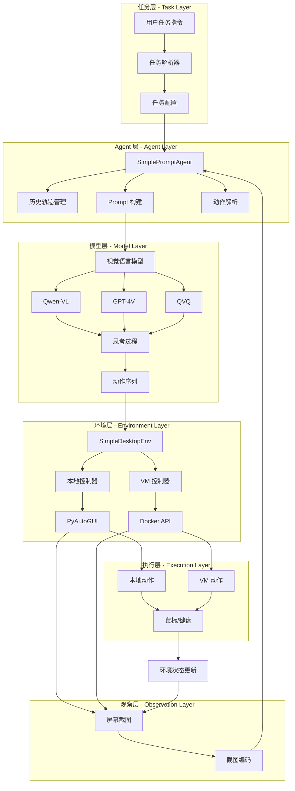
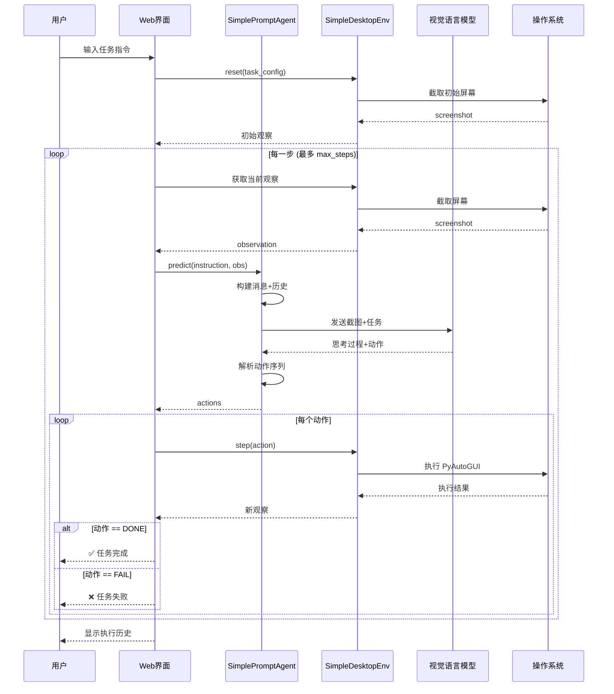

# 🤖 GUI-Agent 系统技术指南 ([返回README](../README.md))

## 📋 目录

- [1. 系统概述](#1-系统概述)
- [2. 技术架构设计](#2-技术架构设计)
- [3. 核心组件实现](#3-核心组件实现)
- [4. 关键技术详解](#4-关键技术详解)
- [5. 使用指南](#5-使用指南)
- [6. 性能与优化](#6-性能与优化)
- [7. 故障排除](#7-故障排除)
- [8. 最佳实践](#8-最佳实践)
- [9. 进阶扩展](#9-进阶扩展)

---

## 1. 系统概述

### 1.1 功能介绍

GUI-Agent 是一个基于 OSWorld 架构的智能桌面自动化代理系统，支持：

- 👀 **智能观察**：自动截取屏幕并理解当前状态
- 🧠 **视觉推理**：基于视觉语言模型（VLM）理解任务并决策
- 🖱️ **精确执行**：在虚拟机或本地系统中执行鼠标、键盘操作
- 🔄 **持续循环**：观察-思考-行动循环直到任务完成
- 🛡️ **安全隔离**：支持虚拟机模式，保护主机系统安全

### 1.2 技术特点

| 特性 | 说明 |
|------|------|
| **核心技术** | VLM + 环境控制 |
| **主要功能** | 桌面任务自动化 |
| **输入方式** | 任务指令 + 屏幕截图 |
| **输出结果** | 自动化操作序列 |
| **应用场景** | RPA、UI 测试、任务执行 |
| **部署模式** | 本地/虚拟机隔离 |

---

## 2. 技术架构设计

### 2.1 整体架构图



### 2.2 OSWorld 核心思想

**参考**: [OSWorld GitHub](https://github.com/xlang-ai/OSWorld)

GUI-Agent 基于 OSWorld 的核心架构实现：

1. **环境抽象**：`SimpleDesktopEnv` 对应 OSWorld 的 `DesktopEnv`
2. **Agent 设计**：`SimplePromptAgent` 对应 OSWorld 的 `PromptAgent`
3. **观察-行动循环**：截图 → 模型推理 → 动作执行 → 重复
4. **动作空间**：使用 PyAutoGUI 命令（与 OSWorld 一致）

---

## 3. 核心组件实现

### 3.1 SimpleDesktopEnv - 环境控制

```python
# 文件: src/search_engine/gui_agent_service.py
class SimpleDesktopEnv:
    """简化版桌面环境 - 基于 OSWorld DesktopEnv"""
    
    def __init__(
        self,
        provider_name: str = "local",
        os_type: str = "macOS",
        action_space: str = "pyautogui",
        screen_size: Tuple[int, int] = (1920, 1080)
    ):
        self.provider_name = provider_name
        self.os_type = os_type
        self.action_space = action_space
        self.screen_size = screen_size
        
        # 初始化控制器
        self._init_controller()
    
    def reset(self, task_config: Optional[Dict] = None) -> Dict:
        """重置环境并加载任务"""
        self.current_task = task_config or {}
        self.step_count = 0
        self.history = []
        
        # 捕获初始观察
        obs = self._get_observation()
        obs['instruction'] = self.current_task.get('instruction', '未指定任务')
        
        return obs
    
    def step(self, action: str) -> Tuple[Dict, float, bool, Dict]:
        """执行动作并返回新的观察"""
        try:
            # 执行动作
            self._execute_action(action)
            
            # 获取新观察
            obs = self._get_observation()
            
            # 更新历史
            self.history.append({
                'step': self.step_count,
                'action': action,
                'timestamp': datetime.now().isoformat()
            })
            
            self.step_count += 1
            
            # 检查是否完成
            done = action in ['DONE', 'FAIL'] or self.step_count >= self.max_steps
            reward = 1.0 if action == 'DONE' else 0.0
            
            return obs, reward, done, {}
            
        except Exception as e:
            print(f"❌ 动作执行失败: {e}")
            return self._get_observation(), 0.0, True, {'error': str(e)}
```

### 3.2 SimplePromptAgent - 智能决策

```python
class SimplePromptAgent:
    """基于 Prompt 的智能 Agent - OSWorld 风格"""
    
    def __init__(
        self,
        model: str = "qwen3-vl-plus",
        api_key: str = None,
        base_url: str = None,
        max_tokens: int = 512,
        temperature: float = 0.0,
        enable_thinking: bool = False,
        use_trajectory: bool = True
    ):
        self.model = model
        self.api_key = api_key or os.getenv('DASHSCOPE_API_KEY')
        self.base_url = base_url
        self.max_tokens = max_tokens
        self.temperature = temperature
        self.enable_thinking = enable_thinking
        self.use_trajectory = use_trajectory
        
        # 初始化客户端
        self._init_client()
        
        # 历史轨迹
        self.trajectory_screenshots = []
        self.trajectory_actions = []
    
    def predict(self, instruction: str, observation: Dict) -> Tuple[str, List[str]]:
        """根据观察预测下一步动作"""
        
        # 1. 构建消息（包含历史轨迹）
        messages = self._build_messages(instruction, observation)
        
        # 2. 调用模型
        response_text = self._call_model(messages)
        
        # 3. 解析动作
        actions = self._parse_actions(response_text)
        
        # 4. 更新轨迹
        self._update_trajectory(instruction, observation, response_text, actions)
        
        return response_text, actions
    
    def _build_messages(self, instruction: str, observation: Dict) -> List[Dict]:
        """构建 VLM 消息 - 使用 OSWorld 官方 Prompt"""
        
        # 系统 Prompt - OSWorld 官方版本 (SYS_PROMPT_IN_SCREENSHOT_OUT_CODE)
        # 参考: https://github.com/xlang-ai/OSWorld/blob/main/mm_agents/prompts.py
        system_prompt = """You are an agent which follow my instruction and perform desktop computer tasks as instructed.
You have good knowledge of computer and good internet connection and assume your code will run on a computer for controlling the mouse and keyboard.
For each step, you will get an observation of an image, which is the screenshot of the computer screen and you will predict the action of the computer based on the image.

You are required to use `pyautogui` to perform the action grounded to the observation, but DONOT use the `pyautogui.locateCenterOnScreen` function to locate the element you want to operate with since we have no image of the element you want to operate with. DONOT USE `pyautogui.screenshot()` to make screenshot.
Return one line or multiple lines of python code to perform the action each time, be time efficient. When predicting multiple lines of code, make some small sleep like `time.sleep(0.5);` interval so that the machine could take; Each time you need to predict a complete code, no variables or function can be shared from history
You need to to specify the coordinates of by yourself based on your observation of current observation, but you should be careful to ensure that the coordinates are correct.

Specially, it is also allowed to return the following special code:
When you think you have to wait for some time, return ```WAIT```;
When you think the task can not be done, return ```FAIL```, don't easily say ```FAIL```, try your best to do the task;
When you think the task is done, return ```DONE```.

IMPORTANT - Coordinate System Enhancement:
The screenshot has been annotated with 5 red coordinate reference points to help you locate elements accurately:
- Top-left corner: (0, 0)
- Top-right corner: (width-1, 0)
- Bottom-left corner: (0, height-1)
- Bottom-right corner: (width-1, height-1)
- Center point: (width/2, height/2)
The screen resolution is displayed at the top center of the screenshot. Please use these reference points to accurately estimate the coordinates of target elements.

First give the current screenshot and previous things we did a short reflection, then RETURN ME THE CODE OR SPECIAL CODE I ASKED FOR. NEVER EVER RETURN ME ANYTHING ELSE.
"""
        
        messages = [{"role": "system", "content": system_prompt}]
        
        # 添加历史轨迹（如果启用）
        if self.use_trajectory and len(self.trajectory_screenshots) > 0:
            # 最多保留最近 3 步的历史
            recent_history = min(3, len(self.trajectory_screenshots))
            for i in range(-recent_history, 0):
                # 历史截图
                hist_content = [
                    {
                        "type": "text",
                        "text": f"[历史步骤 {len(self.trajectory_screenshots) + i + 1}]"
                    },
                    {
                        "type": "image_url",
                        "image_url": {"url": f"data:image/png;base64,{self.trajectory_screenshots[i]}"}
                    }
                ]
                
                # 历史动作
                if i < len(self.trajectory_actions):
                    hist_content.append({
                        "type": "text",
                        "text": f"执行的动作: {', '.join(self.trajectory_actions[i])}"
                    })
                
                messages.append({"role": "user", "content": hist_content})
                messages.append({"role": "assistant", "content": "好的，我已记录。"})
        
        # 当前任务和截图
        screenshot_b64 = base64.b64encode(observation['screenshot']).decode('utf-8')
        
        current_content = [
            {
                "type": "text",
                "text": f"[当前任务]\n任务指令: {instruction}\n\n请分析当前屏幕并返回下一步动作："
            },
            {
                "type": "image_url",
                "image_url": {"url": f"data:image/png;base64,{screenshot_b64}"}
            }
        ]
        
        messages.append({"role": "user", "content": current_content})
        
        return messages
```

### 3.3 执行流程图



---

## 4. 关键技术详解

### 4.1 历史轨迹管理

```python
def _update_trajectory(self, instruction: str, observation: Dict, 
                       response: str, actions: List[str]):
    """更新轨迹历史 - 为模型提供上下文"""
    if self.use_trajectory:
        # 保存截图（Base64 编码）
        screenshot_b64 = base64.b64encode(observation['screenshot']).decode('utf-8')
        self.trajectory_screenshots.append(screenshot_b64)
        
        # 保存动作
        self.trajectory_actions.append(actions)
        
        # 限制历史长度（最多保留 5 步）
        if len(self.trajectory_screenshots) > 5:
            self.trajectory_screenshots = self.trajectory_screenshots[-5:]
            self.trajectory_actions = self.trajectory_actions[-5:]
```

### 4.2 动作解析 - OSWorld 风格

```python
def _parse_actions(self, response_text: str) -> List[str]:
    """从模型响应中提取 PyAutoGUI 动作"""
    actions = []
    
    # 提取所有 pyautogui 命令
    lines = response_text.split('\n')
    for line in lines:
        line = line.strip()
        
        # 匹配 pyautogui.xxx(...) 格式
        if line.startswith('pyautogui.'):
            actions.append(line)
        
        # 匹配控制符
        elif line in ['DONE', 'FAIL', 'WAIT']:
            actions.append(line)
    
    return actions
```

### 4.3 动作执行 - 直接 exec()

```python
def _execute_action(self, action: str):
    """执行 PyAutoGUI 动作 - OSWorld 方式"""
    if action.startswith('pyautogui.'):
        # 在安全的命名空间中执行
        namespace = {'pyautogui': self.controller}
        exec(action, namespace)
    elif action == 'WAIT':
        time.sleep(1.0)
    elif action in ['DONE', 'FAIL']:
        pass  # 控制符，不执行
```

### 4.4 任务中断机制

**全局状态管理**：
```python
# 任务状态标志
_task_running = False
_task_stop_flag = False
_task_lock = threading.Lock()

def should_stop_task() -> bool:
    """检查是否应该停止任务"""
    with _task_lock:
        return _task_stop_flag

def set_task_stop_flag(flag: bool):
    """设置停止标志"""
    with _task_lock:
        global _task_stop_flag
        _task_stop_flag = flag
```

**中断检查点**：
```python
while not done and step_count < max_steps:
    # 检查点 1: 步骤开始
    if should_stop_task():
        break
    
    # 检查点 2: 等待弹窗时
    for _ in range(25):
        if should_stop_task():
            break
        time.sleep(0.1)
    
    # 检查点 3: 调用模型前
    if should_stop_task():
        break
    
    # 检查点 4: 执行动作前
    for action in actions:
        if should_stop_task():
            break
```

**ESC 键监听**：
```python
def _on_esc_pressed():
    """ESC 键按下回调"""
    global _task_stop_flag
    if is_task_running():
        set_task_stop_flag(True)
        _show_autopilot_notification("⚠️ ESC 键中断\n\n任务正在停止...")

def start_keyboard_listener():
    """启动键盘监听"""
    from pynput import keyboard
    
    def on_press(key):
        if key == keyboard.Key.esc:
            _on_esc_pressed()
    
    listener = keyboard.Listener(on_press=on_press)
    listener.daemon = True
    listener.start()
```

### 4.5 弹窗通知系统

**跨平台实现**：
```python
def _show_autopilot_notification(message: str):
    """显示 Autopilot 状态通知"""
    system = platform.system()
    
    if system == "Darwin":  # macOS
        # osascript 显示对话框
        script = f'''
        display dialog "🤖 Autopilot\\n\\n{message}" \\
        with title "Autopilot 正在执行" \\
        buttons {{"执行中..."}} \\
        default button 1 \\
        giving up after 2
        '''
        subprocess.Popen(['osascript', '-e', script])
        
    elif system == "Linux":
        # notify-send 通知
        subprocess.Popen(['notify-send', 'Autopilot', message])
        
    elif system == "Windows":
        # msg 命令
        subprocess.Popen(['msg', '*', f'Autopilot: {message}'])
```

### 4.6 截图目录管理

**任务专属目录**：
```python
# 为每个任务创建独立目录
task_timestamp = datetime.now().strftime("%Y%m%d_%H%M%S")
task_id = f"task_{task_timestamp}"
task_screenshot_dir = Path("data/gui_screenshots") / task_id
task_screenshot_dir.mkdir(parents=True, exist_ok=True)

# 保存截图
screenshot_path = task_screenshot_dir / f"step_{step_count}_{timestamp}.png"
screenshot.save(screenshot_path)
```

**目录结构**：
```
data/gui_screenshots/              # 主截图目录（Web 界面使用）
├── task_20231115_120000/        # 任务 1（Autopilot 自动执行）
│   ├── step_1_20231115_120005.png
│   ├── step_2_20231115_120020.png
│   └── step_3_20231115_120035.png
├── task_20231115_120100/        # 任务 2
│   └── ...
└── manual_20231115_115900.png   # 手动截图

data/gui_agent/screenshots/       # 备用截图目录（SimpleDesktopEnv 使用）
└── step_*.png
```

---

## 5. 使用指南

### 5.1 虚拟机模式（推荐）

**启动虚拟机**：
```bash
# 使用 OSWorld Docker 镜像
docker run -d \
  --name osworld-vm \
  -p 55000:5000 \
  -p 5901:5900 \
  xlangai/osworld:latest
```

**UI 操作**：
1. 进入 `🤖 GUI-Agent` 标签页
2. 点击 "🚀 启动虚拟机"
3. 等待容器启动（约 30 秒）
4. 看到 "✅ 运行中" 状态

### 5.2 本地模式

**权限配置**（macOS）：
```
1. 系统设置 → 隐私与安全性 → 辅助功能
   - 添加 Terminal/iTerm2
   - 添加 Python
   
2. 系统设置 → 隐私与安全性 → 屏幕录制
   - 添加 Terminal/ITerm2
   - 添加 Python
   
3. 重启应用生效
```

**UI 操作**：
1. 选择 "本地系统 (Local)"
2. 配置模型和 API Key
3. 输入任务指令
4. 点击 "▶️ 执行任务"

### 5.3 手动控制

**直接发送动作**：
```json
// 点击
{"x": 500, "y": 300}

// 输入文本
{"text": "Hello World"}

// 按键
{"key": "enter"}

// 自定义命令
{"command": "pyautogui.hotkey('command', 't')"}
```

### 5.4 模型交互

**单次交互**：
1. 在 "📸 手动截图" 中截取屏幕
2. 在 "🤖 模型交互" 中：
   - 选择截图来源
   - 输入任务指令
   - 配置模型（Qwen-VL 推荐）
   - 点击 "🚀 发送给模型"
3. 查看模型响应和解析的动作
4. 点击 "▶️ 执行模型返回的动作"

### 5.5 自动执行任务

**完整流程**：
```python
任务示例：
- "打开浏览器并搜索 Python"
- "创建一个新文件夹叫 test"
- "打开终端并输入 ls"

配置：
- 最大步数：15
- 每步等待：1.5 秒
- 模型：qwen3-vl-plus
- 启用思考过程：True
- 使用历史轨迹：True
```

**执行监控**：
- 📍 步骤进度弹窗
- 🧠 模型思考提示
- 🤖 动作执行通知
- ✅/❌ 任务完成状态

**中断任务**：
- 按 ESC 键（需要辅助功能权限）
- 点击执行新任务（自动中断旧任务）

---

## 6. 性能与优化

### 6.1 性能指标

| 阶段 | 耗时 | 优化方向 |
|------|------|---------|
| **截图** | ~0.1s | 降低分辨率 |
| **模型推理** | 5-15s | 使用 Flash 模型 |
| **动作执行** | ~0.5s | 减少等待时间 |
| **总耗时/步** | ~10-20s | 并行化处理 |

### 6.2 优化策略

```python
# 1. 截图分辨率优化
screenshot = screenshot.resize((1280, 720))

# 2. 使用快速模型
model = "qwen3-vl-flash"  # 代替 qwen3-vl-plus

# 3. 减少历史上下文
MAX_HISTORY = 3  # 代替 5

# 4. 异步通知
subprocess.Popen(['osascript', ...])  # 非阻塞
```

### 6.3 支持的模型

| 模型 | 提供商 | 思考过程 | 推荐场景 |
|------|--------|---------|---------|
| **qwen3-vl-plus** | 阿里云 | ✅ | 通用任务，中文优秀 |
| **qwen3-vl-flash** | 阿里云 | ✅ | 快速响应 |
| **qvq-max** | 阿里云 | ✅ | 复杂推理 |
| **qvq-plus** | 阿里云 | ✅ | 视觉问答 |
| **gpt-4o** | OpenAI | ❌ | 高精度任务 |
| **gpt-4-vision-preview** | OpenAI | ❌ | 通用视觉理解 |

---

## 7. 故障排除

### 7.1 虚拟机启动失败

**问题**：`❌ Docker 库未安装` 或 `❌ 无法连接到 VM API`

**解决方案**：
```bash
# 1. 安装 Docker
brew install --cask docker  # macOS
sudo apt install docker.io   # Ubuntu

# 2. 启动 Docker 服务
sudo systemctl start docker  # Linux
# macOS: 启动 Docker Desktop

# 3. 拉取镜像
docker pull xlangai/osworld:latest

# 4. 检查容器状态
docker ps -a | grep osworld
docker logs osworld-vm
```

### 7.2 权限问题（macOS）

**问题**：`⚠️ 需要辅助功能权限` 或 截图失败

**解决步骤**：
```
1. 打开 "系统设置"
2. 进入 "隐私与安全性"
3. 点击 "辅助功能"
4. 点击 "+" 添加应用：
   - Terminal (或 iTerm2)
   - Python
5. 勾选允许
6. 重启应用
```

**验证权限**：
```bash
# 测试屏幕截图
python3 -c "import pyautogui; pyautogui.screenshot()"

# 测试键盘监听
python3 -c "from pynput import keyboard; l = keyboard.Listener(lambda k: None); l.start(); import time; time.sleep(0.5); print('OK' if l.is_alive() else 'FAILED')"
```

### 7.3 模型调用失败

**问题**：`❌ 模型调用失败` 或 API 错误

**检查清单**：
- [ ] API Key 是否正确
- [ ] Base URL 是否正确
- [ ] 网络连接是否正常
- [ ] 模型名称是否正确
- [ ] API 额度是否充足

**Qwen-VL 配置**：
```bash
# 设置环境变量
export DASHSCOPE_API_KEY="your_api_key"

# 测试 API
curl -X POST https://dashscope.aliyuncs.com/compatible-mode/v1/chat/completions \
  -H "Authorization: Bearer $DASHSCOPE_API_KEY" \
  -H "Content-Type: application/json" \
  -d '{"model": "qwen3-vl-plus", "messages": [{"role": "user", "content": "test"}]}'
```

### 7.4 动作执行失败

**问题**：`❌ 动作执行失败: list index out of range`

**排查步骤**：
1. **VM 模式**：
   ```bash
   # 检查 VM 状态
   docker exec osworld-vm ps aux | grep python
   
   # 重启容器
   docker restart osworld-vm
   
   # 查看日志
   docker logs osworld-vm --tail 50
   ```

2. **本地模式**：
   ```python
   # 检查屏幕分辨率
   import pyautogui
   print(pyautogui.size())  # 确保坐标在范围内
   
   # 测试单个动作
   pyautogui.click(100, 100)
   ```

3. **坐标验证**：
   ```python
   # 确保坐标有效
   screen_width, screen_height = pyautogui.size()
   if not (0 <= x < screen_width and 0 <= y < screen_height):
       print(f"坐标超出范围: ({x}, {y})")
   ```

---

## 8. 最佳实践

### 8.1 任务设计

```python
# ✅ 好的任务描述
instruction = "打开浏览器，访问 google.com，搜索 'Python tutorial'"

# ❌ 不好的任务描述
instruction = "搜索"  # 太模糊
```

### 8.2 步骤控制

```python
# 简单任务
max_steps = 5-10

# 复杂任务
max_steps = 15-30

# 避免过长
max_steps > 50  # 可能导致低效
```

### 8.3 模型选择

```python
# 快速原型 - 使用 Flash
model = "qwen3-vl-flash"

# 复杂任务 - 使用 Plus
model = "qwen3-vl-plus"
enable_thinking = True

# 最高精度 - 使用 GPT-4V
model = "gpt-4o"
```

### 8.4 环境准备

```python
# 本地模式：清理桌面
# - 关闭不相关窗口
# - 放大目标窗口
# - 确保充足的空间

# VM 模式：快照备份
docker commit osworld-vm osworld-vm-backup
```

---

## 9. 进阶扩展

### 9.1 自定义 Agent

```python
class CustomAgent(SimplePromptAgent):
    """自定义 Agent - 添加规划能力"""
    
    def predict_with_planning(self, instruction: str, observation: Dict):
        """带规划的预测"""
        
        # 1. 生成高层计划
        plan = self._generate_plan(instruction, observation)
        
        # 2. 执行当前步骤
        current_step = plan[0]
        response, actions = self.predict(current_step, observation)
        
        return response, actions, plan
    
    def _generate_plan(self, instruction: str, observation: Dict):
        """生成任务计划"""
        plan_prompt = f"""
        将以下任务分解为具体步骤：
        任务: {instruction}
        
        返回步骤列表（每行一个步骤）：
        """
        
        response = self._call_model([{"role": "user", "content": plan_prompt}])
        steps = [s.strip() for s in response.split('\n') if s.strip()]
        
        return steps
```

### 9.2 多模态感知

```python
class MultimodalAgent(SimplePromptAgent):
    """多模态 Agent - 支持 OCR 和目标检测"""
    
    def __init__(self, *args, **kwargs):
        super().__init__(*args, **kwargs)
        self.ocr_model = self._init_ocr()
        self.detector = self._init_detector()
    
    def predict(self, instruction: str, observation: Dict):
        """增强的预测 - 添加 OCR 和检测信息"""
        
        # 1. OCR 提取文本
        ocr_text = self.ocr_model.extract(observation['screenshot'])
        
        # 2. 目标检测
        objects = self.detector.detect(observation['screenshot'])
        
        # 3. 增强观察
        enhanced_obs = observation.copy()
        enhanced_obs['ocr_text'] = ocr_text
        enhanced_obs['detected_objects'] = objects
        
        # 4. 调用基础预测
        return super().predict(instruction, enhanced_obs)
```

### 9.3 安全机制

#### 9.3.1 虚拟机隔离

**Docker 容器模式**：
```yaml
# OSWorld Docker 配置
services:
  osworld-vm:
    image: xlangai/osworld:latest
    ports:
      - "55000:5000"  # API 端口
      - "5901:5900"   # VNC 端口
    environment:
      - DISPLAY=:1
    volumes:
      - ./data:/data
```

**隔离特性**：
- ✅ 与主机完全隔离
- ✅ 可以安全测试危险操作
- ✅ 支持快照和回滚
- ✅ 多实例并行执行

---

## 附录

### A. 配置参考

```python
# GUI-Agent 配置
GUI_AGENT_CONFIG = {
    "screenshot_dir": "data/gui_screenshots",
    "max_steps": 50,
    "step_delay": 1.5,
    "max_history": 5,
    "screenshot_quality": 85,
    "screenshot_size": (1280, 720)
}

# Qwen-VL 配置
QWEN_VL_CONFIG = {
    "model": "qwen3-vl-plus",
    "api_key": os.getenv("DASHSCOPE_API_KEY"),
    "base_url": "https://dashscope.aliyuncs.com/compatible-mode/v1",
    "max_tokens": 512,
    "temperature": 0.0,
    "enable_thinking": True
}

# GPT-4V 配置
GPT4V_CONFIG = {
    "model": "gpt-4o",
    "api_key": os.getenv("OPENAI_API_KEY"),
    "base_url": "https://api.openai.com/v1",
    "max_tokens": 1024,
    "temperature": 0.0
}
```

### B. API 参考

```python
# 创建环境
env = SimpleDesktopEnv(
    provider_name="local",
    os_type="macOS",
    action_space="pyautogui"
)

# 重置环境
obs = env.reset(task_config={"instruction": "任务指令"})

# 执行步骤
obs, reward, done, info = env.step("pyautogui.click(x=100, y=200)")

# 创建 Agent
agent = SimplePromptAgent(
    model="qwen3-vl-plus",
    api_key="your_api_key",
    enable_thinking=True
)

# 预测动作
response, actions = agent.predict(instruction, observation)
```

### C. 相关资源

- [OSWorld 项目](https://github.com/xlang-ai/OSWorld)
- [Qwen-VL 文档](https://help.aliyun.com/zh/model-studio/visual-reasoning)
- [PyAutoGUI 文档](https://pyautogui.readthedocs.io/)
- [Gradio 文档](https://gradio.app/docs/)

