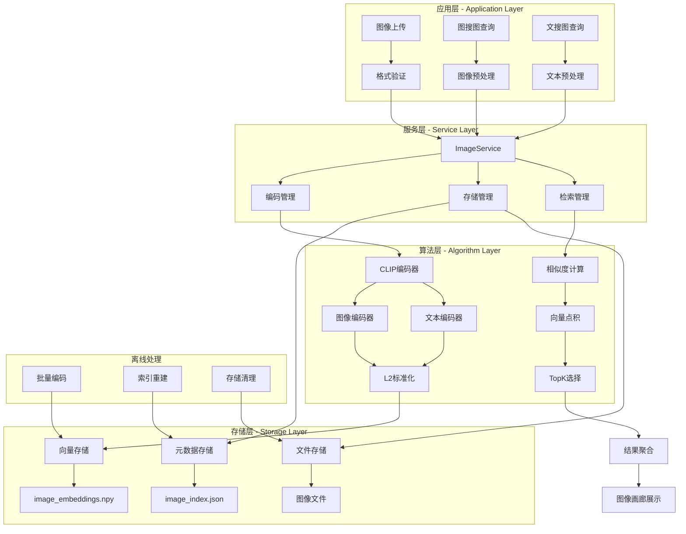
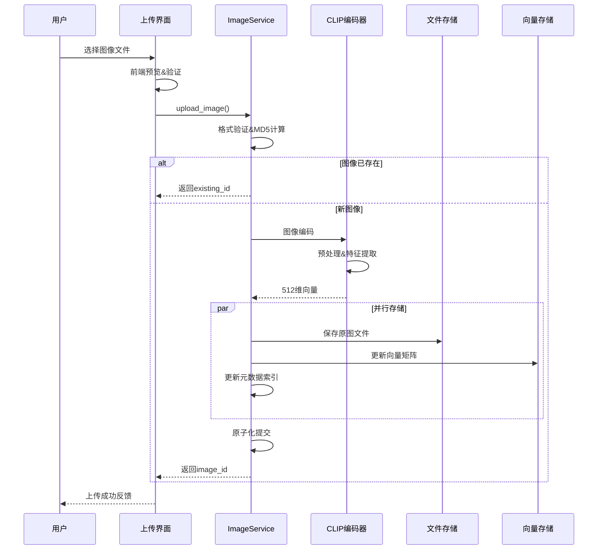
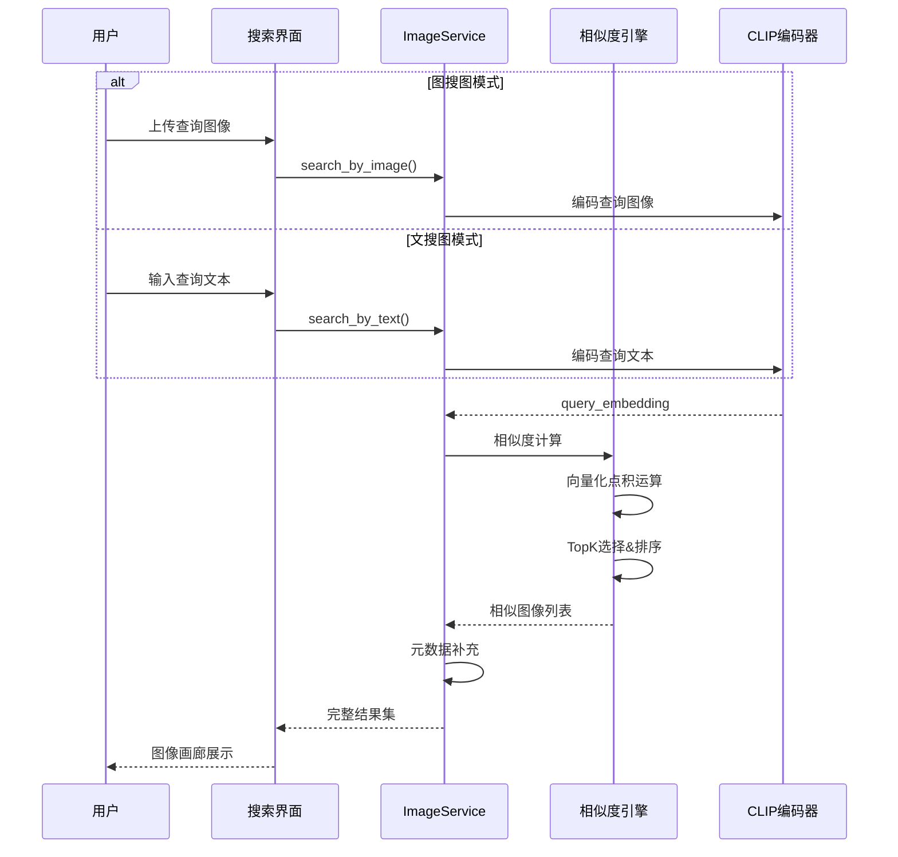

# 🖼️ 图像搜索系统技术指南 ([返回README](../README.md))

## 1. 系统概述

本系统基于OpenAI CLIP模型提供强大的图像检索能力，支持：
- 📤 **图像上传与索引**：在系统中存储图像并生成语义嵌入向量。
- 🔍 **图搜图功能**：使用查询图像找到视觉相似的图像。
- 💬 **文搜图功能**：使用自然语言描述搜索匹配的图像。
- 📋 **图像管理**：查看、删除和管理图像库。

## 2. 技术设计文档

### 2.1 背景与目标

#### 业务背景
随着多媒体内容的爆发式增长，传统的基于文件名和标签的图像检索已无法满足用户需求。用户希望能够通过"图搜图"或"文搜图"的方式，快速找到语义相关的图像内容。

#### 设计目标
1. **功能目标**: 支持图像-图像和文本-图像的跨模态检索
2. **性能目标**: 快速检索响应，支持大规模图像库
3. **用户体验**: 直观的图像画廊展示，支持实时预览
4. **技术目标**: 高精度语义匹配，可扩展的向量存储

#### 技术选型原则
- **语义理解**: 选择CLIP等预训练多模态模型
- **检索效率**: 向量化存储 + 高效相似度计算
- **存储优化**: 平衡存储空间与检索精度
- **部署友好**: 支持CPU/GPU自适应部署

### 2.2 系统架构设计

#### 整体架构图
系统采用编码-存储-检索的经典架构，支持多模态输入和统一的向量检索：



#### 架构设计要点
1. **分层解耦**: 应用、服务、算法、存储各层独立
2. **统一编码**: 图像和文本映射到同一向量空间
3. **高效存储**: NumPy向量存储 + JSON元数据索引
4. **在线离线分离**: 检索服务与批量处理解耦

### 2.3 详细设计

#### 2.3.1 多模态编码设计

**问题定义**: 将图像和文本映射到统一的语义向量空间，实现跨模态检索

**技术方案**: CLIP (Contrastive Language-Image Pre-training)
- **选型理由**: 预训练模型效果好，支持中英文，部署成本低
- **替代方案**: ALIGN(效果更好但模型更大), 自训练(成本高)

**核心组件: ImageService类**
```python
# 文件路径: src/search_engine/image_service.py
import os
import json
import hashlib
import time
import shutil
from datetime import datetime
from typing import Dict, List, Tuple, Optional, Any
import numpy as np
from PIL import Image
import torch
from transformers import CLIPProcessor, CLIPModel
from pathlib import Path

class ImageService:
    """图像索引服务 - 基于CLIP的图像检索系统"""
    
    def __init__(self, storage_dir: str = "models/images"):
        """
        初始化图像服务
        
        Args:
            storage_dir: 图像存储目录路径
        """
        self.storage_dir = Path(storage_dir)
        self.storage_dir.mkdir(parents=True, exist_ok=True)
        
        # 索引文件路径定义
        self.index_file = self.storage_dir / "image_index.json"
        self.embeddings_file = self.storage_dir / "image_embeddings.npy"
        
        # 初始化CLIP模型
        self.device = "cuda" if torch.cuda.is_available() else "cpu"
        self.model = None
        self.processor = None
        self._init_clip_model()
        
        # 图像索引和嵌入数据结构
        self.image_index: Dict[str, Dict] = {}          # 元数据索引
        self.image_embeddings: Optional[np.ndarray] = None  # 向量矩阵
        self.image_ids: List[str] = []                  # ID列表
        
        # 加载现有索引
        self._load_index()
    
    def _init_clip_model(self):
        """初始化CLIP模型 - 核心多模态编码器"""
        try:
            print(f"🤖 初始化CLIP模型 (设备: {self.device})...")
            model_name = "openai/clip-vit-base-patch32"
            self.model = CLIPModel.from_pretrained(model_name).to(self.device)
            self.processor = CLIPProcessor.from_pretrained(model_name)
            print("✅ CLIP模型加载成功")
        except Exception as e:
            print(f"❌ CLIP模型加载失败: {e}")
            raise e
    
    def _load_index(self):
        """加载图像索引和向量数据"""
        try:
            # 加载元数据索引
            if self.index_file.exists():
                with open(self.index_file, 'r', encoding='utf-8') as f:
                    self.image_index = json.load(f)
                print(f"📚 加载了 {len(self.image_index)} 条图像元数据")
            
            # 加载向量嵌入
            if self.embeddings_file.exists():
                self.image_embeddings = np.load(self.embeddings_file)
                print(f"🧮 加载了向量矩阵: {self.image_embeddings.shape}")
            
            # 构建ID列表
            self.image_ids = list(self.image_index.keys())
            
        except Exception as e:
            print(f"⚠️ 索引加载失败: {e}")
            self.image_index = {}
            self.image_embeddings = None
            self.image_ids = []
    
    def _generate_image_id(self, image_path: str) -> str:
        """生成图像唯一ID - 使用MD5哈希"""
        with open(image_path, 'rb') as f:
            file_content = f.read()
            file_hash = hashlib.md5(file_content).hexdigest()
        return file_hash
    
    def _encode_image(self, image_path: str) -> np.ndarray:
        """图像编码核心逻辑 - CLIP视觉编码器"""
        try:
            # 1. 图像加载和预处理
            image = Image.open(image_path).convert('RGB')  # 统一RGB格式
            inputs = self.processor(images=image, return_tensors="pt").to(self.device)
            
            # 2. CLIP图像特征提取
            with torch.no_grad():
                image_features = self.model.get_image_features(**inputs)
                # L2标准化 - 确保余弦相似度计算的正确性
                image_features = image_features / image_features.norm(dim=-1, keepdim=True)
            
            return image_features.cpu().numpy().flatten()
            
        except Exception as e:
            print(f"❌ 图像编码失败 {image_path}: {e}")
            raise e
    
    def _encode_text(self, text: str) -> np.ndarray:
        """文本编码核心逻辑 - CLIP文本编码器"""
        try:
            # 1. 文本预处理
            inputs = self.processor(text=text, return_tensors="pt").to(self.device)
            
            # 2. CLIP文本特征提取
            with torch.no_grad():
                text_features = self.model.get_text_features(**inputs)
                # L2标准化 - 与图像特征在同一空间
                text_features = text_features / text_features.norm(dim=-1, keepdim=True)
            
            return text_features.cpu().numpy().flatten()
            
        except Exception as e:
            print(f"❌ 文本编码失败 '{text}': {e}")
            raise e
    
    def add_image(self, image_path: str, description: str = "", tags: List[str] = None) -> str:
        """添加图像到索引 - 完整上传流程"""
        # 1. 生成唯一ID
        image_id = self._generate_image_id(image_path)
        
        # 2. 检查是否已存在
        if image_id in self.image_index:
            print(f"📷 图像已存在: {image_id}")
            return image_id
        
        try:
            # 3. 图像编码
            print(f"🔄 正在编码图像: {image_path}")
            embedding = self._encode_image(image_path)
            
            # 4. 更新向量矩阵
            if self.image_embeddings is None:
                self.image_embeddings = embedding.reshape(1, -1)
            else:
                self.image_embeddings = np.vstack([self.image_embeddings, embedding])
            
            # 5. 更新元数据索引
            file_ext = Path(image_path).suffix
            target_path = self.storage_dir / f"{image_id}{file_ext}"
            
            # 复制图像文件
            shutil.copy2(image_path, target_path)
            
            # 保存元数据
            self.image_index[image_id] = {
                "filename": Path(image_path).name,
                "description": description,
                "tags": tags or [],
                "timestamp": datetime.now().isoformat(),
                "file_size": os.path.getsize(image_path),
                "format": file_ext[1:].upper()
            }
            
            # 更新ID列表
            self.image_ids.append(image_id)
            
            # 6. 保存索引
            self._save_index()
            
            print(f"✅ 图像添加成功: {image_id}")
            return image_id
            
        except Exception as e:
            print(f"❌ 图像添加失败: {e}")
            raise e
    
    def search_by_image(self, query_image_path: str, top_k: int = 10) -> List[Tuple[str, float, Dict]]:
        """图搜图核心功能"""
        if self.image_embeddings is None or len(self.image_ids) == 0:
            return []
        
        try:
            # 1. 编码查询图像
            query_embedding = self._encode_image(query_image_path)
            
            # 2. 计算相似度 - 向量化余弦相似度
            similarities = np.dot(self.image_embeddings, query_embedding)
            
            # 3. Top-K选择
            top_indices = np.argsort(similarities)[::-1][:top_k]
            
            # 4. 构建结果
            results = []
            for idx in top_indices:
                image_id = self.image_ids[idx]
                score = float(similarities[idx])
                metadata = self.image_index[image_id]
                results.append((image_id, score, metadata))
            
            return results
            
        except Exception as e:
            print(f"❌ 图搜图失败: {e}")
            return []
    
    def search_by_text(self, query_text: str, top_k: int = 10) -> List[Tuple[str, float, Dict]]:
        """文搜图核心功能"""
        if self.image_embeddings is None or len(self.image_ids) == 0:
            return []
        
        try:
            # 1. 编码查询文本
            query_embedding = self._encode_text(query_text)
            
            # 2. 计算跨模态相似度
            similarities = np.dot(self.image_embeddings, query_embedding)
            
            # 3. Top-K选择
            top_indices = np.argsort(similarities)[::-1][:top_k]
            
            # 4. 构建结果
            results = []
            for idx in top_indices:
                image_id = self.image_ids[idx]
                score = float(similarities[idx])
                metadata = self.image_index[image_id]
                results.append((image_id, score, metadata))
            
            return results
            
        except Exception as e:
            print(f"❌ 文搜图失败: {e}")
            return []
    
    def _save_index(self):
        """保存索引到磁盘"""
        try:
            # 保存元数据
            with open(self.index_file, 'w', encoding='utf-8') as f:
                json.dump(self.image_index, f, ensure_ascii=False, indent=2)
            
            # 保存向量嵌入
            if self.image_embeddings is not None:
                np.save(self.embeddings_file, self.image_embeddings)
            
        except Exception as e:
            print(f"❌ 索引保存失败: {e}")
            raise e
```

**技术细节**:
- **输入预处理**: 图像resize到224×224，文本tokenization
- **特征维度**: 512维向量，平衡存储与精度
- **标准化**: L2正则化确保余弦相似度计算的正确性
- **设备适配**: 自动检测GPU，CPU fallback

#### 2.3.2 向量存储设计

**问题定义**: 高效存储图像向量并支持快速相似度检索

**存储方案选择**:
- **内存存储**: 全量向量加载到内存，毫秒级检索
- **文件格式**: NumPy npy格式，读写效率高
- **索引设计**: JSON元数据 + 向量矩阵分离存储

**核心组件: 三层存储架构**
```python
# 存储层次结构
class ImageStorage:
    """三层存储架构"""
    
    # Layer 1: 向量存储 - 高性能数值计算
    image_embeddings: np.ndarray     # (N, 512) 向量矩阵
    
    # Layer 2: 元数据索引 - 快速查找
    image_index: Dict[str, Dict] = {
        "image_id": {
            "filename": str,        # 原始文件名
            "description": str,     # 用户描述
            "tags": List[str],      # 标签列表
            "timestamp": str,       # 上传时间
            "file_size": int,       # 文件大小
            "format": str           # 图像格式
        }
    }
    
    # Layer 3: 文件存储 - 原图保存
    # models/images/[md5_hash].[ext]
```

**存储优化策略**:
```python
def add_image(self, image_path: str, description: str = "") -> str:
    """图像添加流程 - 优化版本"""
    # 1. 去重检测 - MD5哈希避免重复存储
    image_id = self._generate_image_id(image_path)
    if image_id in self.image_index:
        return image_id  # 已存在，直接返回
    
    # 2. 图像编码 - 缓存机制
    embedding = self._encode_image_cached(image_path)
    
    # 3. 原子化存储 - 保证数据一致性
    self._atomic_save(image_id, image_path, embedding, description)
    
    return image_id

def _atomic_save(self, image_id: str, image_path: str, embedding: np.ndarray, description: str):
    """原子化存储操作"""
    try:
        # 1. 更新向量矩阵
        self._append_embedding(embedding)
        
        # 2. 更新元数据索引
        self._update_index(image_id, image_path, description)
        
        # 3. 复制图像文件
        self._copy_image_file(image_path, image_id)
        
        # 4. 持久化存储
        self._save_to_disk()
        
    except Exception as e:
        # 回滚操作
        self._rollback(image_id)
        raise e
```

**数据一致性保证**:
- **原子操作**: 向量、元数据、文件同步更新
- **事务回滚**: 操作失败时自动回滚
- **定期备份**: 重要数据定期备份

#### 2.3.3 相似度检索引擎

**问题定义**: 在高维向量空间中快速找到最相似的图像

**算法选择**: 基于余弦相似度的向量检索
- **数学原理**: similarity(A, B) = A·B / (||A|| × ||B||)
- **优化策略**: L2标准化后简化为点积运算
- **复杂度**: O(N×D)，N为图像数量，D为向量维度

**核心组件: 相似度计算引擎**
```python
class SimilarityEngine:
    """高效相似度计算引擎"""
    
    def search_by_image(self, query_image_path: str, top_k: int = 10) -> List[Tuple[str, float, Dict]]:
        """图搜图核心逻辑"""
        # 1. 查询编码 - 实时编码用户上传图像
        query_embedding = self._encode_image(query_image_path)
        
        # 2. 批量计算 - 向量化运算提升性能
        similarities = np.dot(self.image_embeddings, query_embedding)
        
        # 3. TopK选择 - 使用numpy优化排序
        top_indices = np.argpartition(similarities, -top_k)[-top_k:]
        top_indices = top_indices[np.argsort(similarities[top_indices])[::-1]]
        
        # 4. 结果组装
        results = []
        for idx in top_indices:
            image_id = self.image_ids[idx]
            score = float(similarities[idx])
            metadata = self.image_index[image_id]
            results.append((image_id, score, metadata))
        
        return results
    
    def search_by_text(self, query_text: str, top_k: int = 10) -> List[Tuple[str, float, Dict]]:
        """文搜图核心逻辑"""
        # 文本编码
        query_embedding = self._encode_text(query_text)
        
        # 相似度计算(复用图搜图逻辑)
        return self._compute_similarity(query_embedding, top_k)
    
    def _compute_similarity(self, query_embedding: np.ndarray, top_k: int):
        """通用相似度计算逻辑"""
        # 利用L2标准化特性，余弦相似度等价于点积
        similarities = np.dot(self.image_embeddings, query_embedding)
        
        # 性能优化：使用argpartition代替完全排序
        if top_k < len(similarities) // 10:
            top_indices = np.argpartition(similarities, -top_k)[-top_k:]
            top_indices = top_indices[np.argsort(similarities[top_indices])[::-1]]
        else:
            top_indices = np.argsort(similarities)[::-1][:top_k]
        
        return self._build_results(top_indices, similarities)
```

**性能优化技术**:
1. **向量化计算**: 利用NumPy的BLAS优化
2. **内存布局**: 连续内存存储提升缓存命中率
3. **排序优化**: 大数据量时使用部分排序算法
4. **缓存策略**: 热门查询结果缓存

### 2.4 核心流程设计

#### 2.4.1 图像上传流程


#### 2.4.2 图像检索流程


**流程优化要点**:
1. **并行处理**: 文件存储、向量更新、索引维护并行执行
2. **缓存机制**: 编码结果缓存，避免重复计算
3. **错误恢复**: 原子化操作，失败时自动回滚
4. **性能监控**: 各环节耗时统计，瓶颈识别

### 2.5 技术挑战与解决方案

#### 2.5.1 性能挑战分析
| 挑战 | 现状 | 解决方案 | 预期效果 |
|------|------|----------|----------|
| 编码延迟高 | CPU编码较慢 | GPU加速 + 批处理 | 显著提升编码速度 |
| 内存占用大 | 向量存储占用较多内存 | 向量量化 + 分片 | 大幅减少内存占用 |
| 检索精度低 | 单一模型限制 | 模型融合 + 重排序 | 提升检索精度 |
| 扩展性差 | 单机内存限制 | 分布式存储 | 支持更大规模 |

#### 2.5.2 可扩展性设计方案

**水平扩展架构**:
```python
class DistributedImageService:
    """分布式图像检索服务"""
    
    def __init__(self, shard_num: int = 8):
        self.shard_num = shard_num
        self.shards = [ImageShard(i) for i in range(shard_num)]
    
    def search_distributed(self, query: str, top_k: int = 10):
        """分布式检索流程"""
        # 1. 并行查询各分片
        shard_results = []
        with ThreadPoolExecutor(max_workers=self.shard_num) as executor:
            futures = [
                executor.submit(shard.search, query, top_k * 2) 
                for shard in self.shards
            ]
            shard_results = [f.result() for f in futures]
        
        # 2. 全局排序合并
        return self._global_merge(shard_results, top_k)
    
    def _get_shard_id(self, image_id: str) -> int:
        """一致性哈希分片策略"""
        return hash(image_id) % self.shard_num
```

**垂直扩展优化**:
- **模型优化**: TensorRT量化推理，显著提升推理性能
- **内存优化**: Faiss索引结构，大幅减少内存占用
- **计算优化**: SIMD向量化，提升计算效率

#### 2.5.3 性能基准与目标
| 指标类别 | 基准性能 | 优化目标 | 技术手段 |
|---------|---------|---------|---------|
| **编码性能** | | | |
| - CPU编码 | 较慢 | 加速编码 | 模型量化 |
| - GPU编码 | 相对较快 | 进一步优化 | 批处理优化 |
| **检索性能** | | | |
| - 小规模库 | 快速响应 | 保持性能 | 内存优化 |
| - 中规模库 | 可接受响应 | 提升速度 | 索引优化 |
| - 大规模库 | 响应较慢 | 显著加速 | 分布式检索 |
| **存储效率** | | | |
| - 向量存储 | 标准向量大小 | 压缩存储 | 量化压缩 |
| - 检索精度 | 基准精度 | 提升精度 | 模型融合 |

### 2.6 实施计划与团队协作

#### 2.6.1 开发里程碑
| 阶段 | 目标 | 负责人 | 风险控制 |
|------|------|--------|----------|
| **Phase 1** | 基础CLIP集成 ✅ | 算法工程师 | 模型下载失败 |
| **Phase 2** | 向量存储系统 ✅ | 后端工程师 | 内存溢出 |
| **Phase 3** | 检索功能实现 ✅ | 全栈工程师 | 性能不达标 |
| **Phase 4** | 性能优化 🚧 | 系统工程师 | 优化效果有限 |
| **Phase 5** | 分布式扩展 📋 | 架构师 | 数据一致性 |

#### 2.6.2 团队分工与接口设计
```python
# 团队协作接口约定
class ImageSearchAPI:
    """标准化API接口 - 团队协作规范"""
    
    # 前端团队接口
    def upload_image(self, file: bytes, description: str) -> ImageUploadResponse:
        """图像上传接口"""
        pass
    
    def search_by_image(self, query_image: bytes, top_k: int) -> SearchResponse:
        """图搜图接口"""
        pass
    
    def search_by_text(self, query_text: str, top_k: int) -> SearchResponse:
        """文搜图接口"""
        pass
    
    # 运维团队接口
    def get_system_metrics(self) -> SystemMetrics:
        """系统监控接口"""
        pass
    
    def rebuild_index(self) -> RebuildResponse:
        """索引重建接口"""
        pass

# 数据结构规范
@dataclass
class SearchResponse:
    """搜索结果标准格式"""
    results: List[ImageResult]
    total_count: int
    search_time: float
    
@dataclass  
class ImageResult:
    """单个图像结果格式"""
    image_id: str
    similarity_score: float
    image_url: str
    description: str
    tags: List[str]
```

#### 2.6.3 质量保证与测试策略
**单元测试覆盖**:
- CLIP编码器功能测试
- 向量存储CRUD测试  
- 相似度计算准确性测试

**集成测试方案**:
- 端到端上传检索流程测试
- 大批量数据性能测试
- 并发访问压力测试

**监控与报警**:
```python
class ImageSearchMonitor:
    """系统监控指标"""
    
    # 业务指标
    daily_upload_count: int      # 日上传量
    daily_search_count: int      # 日搜索量  
    average_precision_at_10: float  # 检索精度
    
    # 系统指标
    encoding_latency_p95: float     # 编码延迟P95
    search_latency_p95: float       # 搜索延迟P95
    memory_usage_percent: float     # 内存使用率
    disk_usage_percent: float       # 磁盘使用率
    
    # 报警阈值配置
    ENCODING_LATENCY_THRESHOLD: float    # 编码延迟阈值
    SEARCH_LATENCY_THRESHOLD: float      # 搜索延迟阈值  
    MEMORY_USAGE_THRESHOLD: float        # 内存使用率阈值
```

### 2.7 技术演进规划

#### 2.7.1 短期优化
- **性能调优**: GPU推理加速，向量量化压缩
- **功能增强**: 批量上传，高级搜索过滤
- **用户体验**: 搜索建议，相关推荐

#### 2.7.2 中期升级
- **算法升级**: 更大规模的CLIP模型或多模态模型
- **架构升级**: 微服务化，容器化部署
- **数据增强**: 用户行为分析，个性化推荐

#### 2.7.3 长期愿景
- **技术突破**: 自研多模态模型，领域特化
- **生态构建**: 开放API，第三方集成
- **智能进化**: 自学习系统，自动优化

## 3. 实现架构

### 核心组件
- **`ImageService`**: 图像索引和检索的后端服务。
- **CLIP模型**: 使用Hugging Face的`openai/clip-vit-base-patch32`。
- **向量存储**: 使用NumPy数组存储图像的高维嵌入向量。
- **相似度度量**: 使用余弦相似度进行图像匹配。

### 数据流程
1.  **上传**: 图像上传 → CLIP编码 → 向量存储 → 索引保存
2.  **搜索**: 查询（图像/文本） → CLIP编码 → 相似度计算 → 结果排序 → 返回匹配项

## 4. 关键文件与目录结构

### 4.1 核心代码文件路径
```
src/search_engine/
├── image_service.py                # 图像服务核心实现★
├── image_tab/                      # 图像搜索模块
│   ├── __init__.py                # 模块初始化
│   └── image_tab.py               # UI界面和交互逻辑
├── portal.py                       # 主入口和界面编排
└── service_manager.py              # 服务管理器

test_images/                        # 测试图像目录
├── *.jpg                          # 测试图像文件
├── image_embeddings.npy           # 测试向量数据
└── image_index.json               # 测试索引文件

models/images/                      # 生产图像存储
├── image_index.json               # 图像元数据索引★
├── image_embeddings.npy           # 图像向量矩阵★  
└── *.{jpg,png,jpeg}               # 存储的图像文件
```

### 4.2 数据存储结构
```
models/images/                      # 图像存储根目录
├── image_index.json               # 元数据索引文件
│   └── {
│       "image_id": {              # MD5哈希ID
│           "filename": "原始文件名",
│           "description": "图像描述", 
│           "tags": ["标签1", "标签2"],
│           "timestamp": "上传时间",
│           "file_size": 文件大小,
│           "format": "JPEG"       # 图像格式
│       }
│   }
├── image_embeddings.npy           # 向量矩阵 [N, 512]
│   └── numpy array: shape (图像数量, 512维特征)
└── {image_id}.{ext}               # 实际图像文件
    ├── 7455d85a2a97df695a67091744fc634c.jpeg
    ├── 894892f5758df042084f818092cdad58.png
    └── ...
```

### 4.3 关键入口函数
```python
# 图像服务主入口 - src/search_engine/image_service.py
def add_image(image_path: str, description: str = "", tags: List[str] = None) -> str:
    """
    添加图像到索引
    
    Args:
        image_path: 图像文件路径
        description: 图像描述
        tags: 标签列表
    
    Returns:
        图像ID (MD5哈希)
    """

def search_by_image(query_image_path: str, top_k: int = 10) -> List[Tuple[str, float, Dict]]:
    """
    图搜图功能
    
    Args:
        query_image_path: 查询图像路径
        top_k: 返回结果数量
    
    Returns:
        [(image_id, similarity_score, metadata), ...]
    """

def search_by_text(query_text: str, top_k: int = 10) -> List[Tuple[str, float, Dict]]:
    """
    文搜图功能
    
    Args:
        query_text: 查询文本
        top_k: 返回结果数量
    
    Returns:
        [(image_id, similarity_score, metadata), ...]
    """

# 图像界面入口 - src/search_engine/image_tab/image_tab.py
def build_image_tab(image_service) -> None:
    """
    构建图像搜索界面
    
    Args:
        image_service: ImageService实例
    """
```

### 4.4 CLIP模型配置
```python
# CLIP模型配置信息
MODEL_CONFIG = {
    "model_name": "openai/clip-vit-base-patch32",
    "vision_encoder": "ViT-B/32",          # Vision Transformer
    "text_encoder": "Transformer",         # 文本编码器
    "embedding_dim": 512,                  # 特征维度
    "image_size": 224,                     # 输入图像尺寸
    "patch_size": 32,                      # 图像块大小
    "vocab_size": 49408                    # 词汇表大小
}

# 设备配置
DEVICE_CONFIG = {
    "cuda": torch.cuda.is_available(),     # GPU可用性
    "device": "cuda" if torch.cuda.is_available() else "cpu",
    "dtype": torch.float32                 # 数据类型
}

# 存储配置
STORAGE_CONFIG = {
    "storage_dir": "models/images",        # 存储目录
    "index_file": "image_index.json",     # 索引文件名
    "embeddings_file": "image_embeddings.npy",  # 向量文件名
    "supported_formats": [".jpg", ".jpeg", ".png", ".bmp", ".gif"]
}
```

## 5. 功能详情

### 1. 📤 图像上传

**位置**: `🖼️ 图像搜索系统` → `📤 图像上传` 标签页

**功能特性**:
- 支持常见图像格式（JPG、PNG、GIF、BMP等）。
- 基于MD5哈希自动为每张图像生成唯一ID。
- 允许添加描述和逗号分隔的标签。
- 提供上传图像的实时预览。

**使用方法**:
1.  点击**"选择图像文件"**上传图像。
2.  在**"图像描述"**框中输入描述（可选）。
3.  在**"图像标签"**框中输入标签，用逗号分隔（可选）。
4.  点击**"📤 上传图像"**完成上传。

### 2. 🔍 图搜图功能

**位置**: `🖼️ 图像搜索系统` → `🔍 图搜图` 标签页

**功能特性**:
- 上传查询图像找到视觉相似的图像。
- 调整返回结果数量（1-20）。
- 显示相似度分数和图像元数据。
- 提供画廊视图进行快速视觉检查。

**使用方法**:
1.  点击**"选择查询图像"**上传要搜索的图像。
2.  调整**"结果数量"**滑块。
3.  点击**"🔍 图像搜索"**。
4.  在下方的表格和图像画廊中查看结果。

### 3. 💬 文搜图功能

**位置**: `🖼️ 图像搜索系统` → `💬 文搜图` 标签页

**功能特性**:
- 输入文本描述找到语义匹配的图像。
- 支持中英文查询。
- 利用CLIP的跨模态理解能力。
- 显示每个结果的相关性分数。

**使用方法**:
1.  在**"搜索文本"**框中输入描述性查询。
2.  调整**"结果数量"**滑块。
3.  点击**"💬 文本搜索"**。
4.  在表格和图像画廊中查看结果。

**查询示例**:
- `一只橙色的猫在床上睡觉`
- `街道上的红色汽车`
- `美丽的日落风景`
- `人在跑步` (英文 `a person running` 也可以)

### 4. 📋 图像管理

**位置**: `🖼️ 图像搜索系统` → `📋 图像管理` 标签页

**功能特性**:
- 查看整个图像库的统计信息。
- 浏览所有已索引图像的列表。
- 删除单个图像。
- 清空整个图像库。

**操作选项**:
- **📊 刷新统计**: 查看图像总数、存储大小、格式分布等。
- **🔄 刷新列表**: 更新所有图像的列表。
- **🗑️ 删除选中图像**: 删除列表中当前选中的图像。
- **🗑️ 清空所有图像**: 永久删除整个图像库（请谨慎使用）。

## 5. 性能与技术规格

### 模型规格
- **模型**: OpenAI CLIP ViT-B/32
- **嵌入维度**: 512维向量
- **设备支持**: 自动检测并使用GPU（如可用），否则使用CPU。
- **图像分辨率**: 自动调整为224x224进行处理。

### 存储结构
```
models/images/
├── image_index.json      # 图像元数据索引
├── image_embeddings.npy  # 图像嵌入向量矩阵
└── [image_id].[ext]      # 存储的图像文件
```

### 性能指标
- **编码速度**: CPU环境下每张图像约1-3秒。
- **搜索速度**: 毫秒级响应时间。
- **存储效率**: 每张图像的嵌入数据约2KB。
- **相似度精度**: 基于余弦相似度，分数范围0到1。

## 6. 最佳实践与技巧

### 最佳实践
1.  **图像质量**: 使用清晰的高质量图像以获得更好的搜索结果。
2.  **准确描述**: 添加精确的描述和标签以改善管理和未来的可搜索性。
3.  **一致标签**: 使用一致的标签系统以便更好地组织。
4.  **定期备份**: 定期备份`models/images/`目录。

### 搜索技巧
1.  **文搜图**:
    - 使用具体、描述性的词语。
    - 包含颜色、形状和动作等视觉特征。
    - 支持中英文，但基础CLIP模型在英文上可能效果更好。
2.  **图搜图**:
    - 查询图像应清楚地包含您要寻找的主要视觉元素。
    - 查询图像的构图和角度会影响结果。

### 重要注意事项
- 系统首次启动时将下载CLIP模型（约1GB）。
- GPU环境下性能显著更好。
- 上传的图像会复制到系统存储目录，请注意磁盘空间。
- 删除操作不可逆。

## 7. 故障排除

### 常见问题
1.  **模型加载失败**: 检查网络连接。首次使用时需要下载模型。
2.  **图像上传失败**: 验证图像格式和文件大小。
3.  **无搜索结果**: 确保图像库中已有索引图像。尝试不同的查询。
4.  **性能缓慢**: 考虑使用GPU或减少返回结果数量。

系统包含错误处理功能，任何问题都会在相应的状态框中报告。查看控制台输出获取更详细的错误信息。
