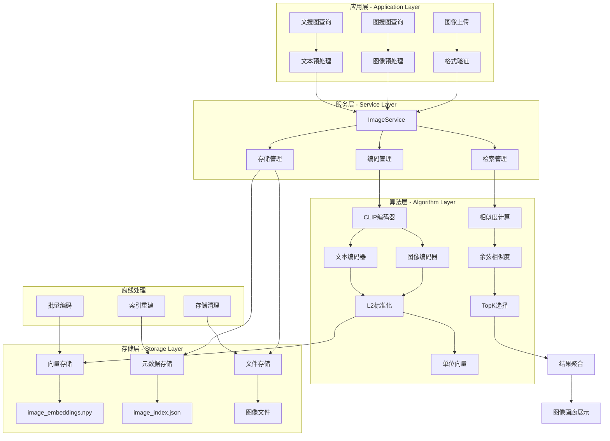
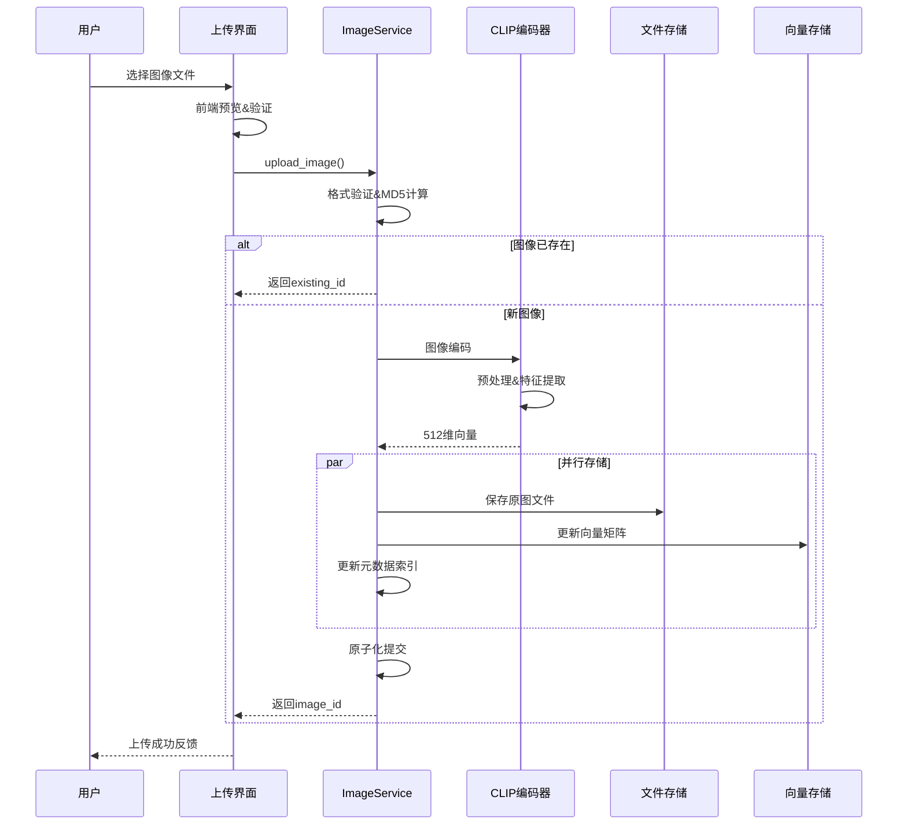
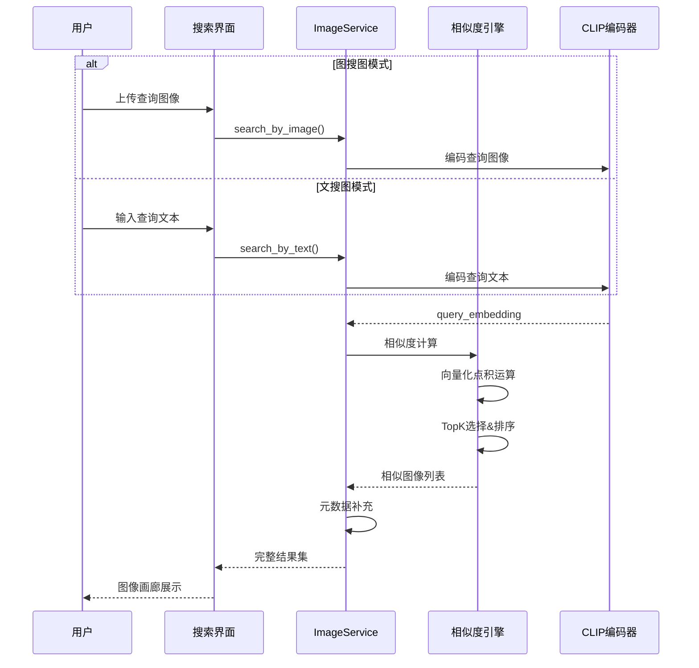
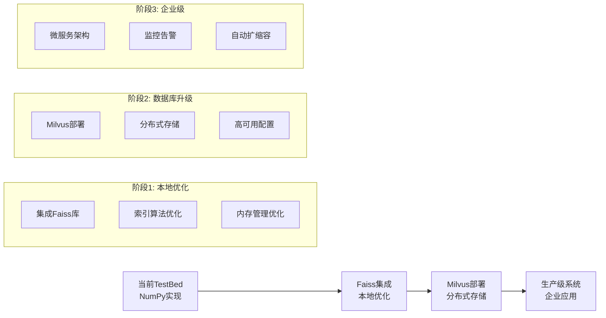

# 🖼️ 图像搜索系统技术指南 ([返回README](../README.md))

## 1. 系统概述

本系统基于OpenAI CLIP模型提供强大的图像检索能力，支持：
- 📤 **图像上传与索引**：在系统中存储图像并生成语义嵌入向量。
- 🔍 **图搜图功能**：使用查询图像找到视觉相似的图像。
- 💬 **文搜图功能**：使用自然语言描述搜索匹配的图像。
- 📋 **图像管理**：查看、删除和管理图像库。

## 2. 技术设计文档

### 2.1 背景与目标

#### 业务背景
随着多媒体内容的爆发式增长，传统的基于文件名和标签的图像检索已无法满足用户需求。用户希望能够通过"图搜图"或"文搜图"的方式，快速找到语义相关的图像内容。

#### 设计目标
1. **功能目标**: 支持图像-图像和文本-图像的跨模态检索
2. **性能目标**: 快速检索响应，支持大规模图像库
3. **用户体验**: 直观的图像画廊展示，支持实时预览
4. **技术目标**: 高精度语义匹配，可扩展的向量存储

#### 技术选型原则
- **语义理解**: 选择CLIP等预训练多模态模型
- **检索效率**: 向量化存储 + 高效相似度计算
- **存储优化**: 平衡存储空间与检索精度
- **部署友好**: 支持CPU/GPU自适应部署

### 2.2 系统架构设计

#### 整体架构图
系统采用编码-存储-检索的经典架构，支持多模态输入和统一的向量检索：



#### 架构设计要点
1. **分层解耦**: 应用、服务、算法、存储各层独立
2. **统一编码**: 图像和文本映射到同一向量空间
3. **L2标准化**: 将向量转换为单位向量，优化相似度计算
4. **高效存储**: NumPy向量存储 + JSON元数据索引
5. **在线离线分离**: 检索服务与批量处理解耦

### 2.3 详细设计

#### 2.3.1 多模态编码设计

**问题定义**: 将图像和文本映射到统一的语义向量空间，实现跨模态检索

**技术方案**: CLIP (Contrastive Language-Image Pre-training)
- **选型理由**: 预训练模型效果好，支持中英文，部署成本低
- **替代方案**: ALIGN(效果更好但模型更大), 自训练(成本高)

**核心组件: ImageService类**
```python
# 文件路径: src/search_engine/image_service.py
import os
import json
import hashlib
import time
import shutil
from datetime import datetime
from typing import Dict, List, Tuple, Optional, Any
import numpy as np
from PIL import Image
import torch
from transformers import CLIPProcessor, CLIPModel
import cv2
from pathlib import Path

class ImageService:
    """图片索引服务 - 基于CLIP的图片检索"""
    
    def __init__(self, storage_dir: str = "models/images"):
        """
        初始化图片服务
        
        Args:
            storage_dir: 图片存储目录
        """
        self.storage_dir = Path(storage_dir)
        self.storage_dir.mkdir(parents=True, exist_ok=True)
        
        # 索引文件路径
        self.index_file = self.storage_dir / "image_index.json"
        self.embeddings_file = self.storage_dir / "image_embeddings.npy"
        
        # 初始化CLIP模型
        self.device = "cuda" if torch.cuda.is_available() else "cpu"
        self.model = None
        self.processor = None
        self._init_clip_model()
        
        # 图片索引和嵌入
        self.image_index: Dict[str, Dict] = {}
        self.image_embeddings: Optional[np.ndarray] = None
        self.image_ids: List[str] = []
        
        # 加载现有索引
        self._load_index()
    
    def _init_clip_model(self):
        """初始化CLIP模型"""
        try:
            print(f"🤖 初始化CLIP模型 (设备: {self.device})...")
            model_name = "openai/clip-vit-base-patch32"
            self.model = CLIPModel.from_pretrained(model_name).to(self.device)
            self.processor = CLIPProcessor.from_pretrained(model_name)
            print("✅ CLIP模型加载成功")
        except Exception as e:
            print(f"❌ CLIP模型加载失败: {e}")
            raise e
    
    def _load_index(self):
        """加载图片索引"""
        try:
            if self.index_file.exists():
                with open(self.index_file, 'r', encoding='utf-8') as f:
                    data = json.load(f)
                    self.image_index = data.get('images', {})
                    self.image_ids = list(self.image_index.keys())
                    print(f"📸 加载图片索引: {len(self.image_index)} 张图片")
            
            if self.embeddings_file.exists() and len(self.image_ids) > 0:
                self.image_embeddings = np.load(self.embeddings_file)
                print(f"🔢 加载图片嵌入: {self.image_embeddings.shape}")
            
        except Exception as e:
            print(f"⚠️ 加载索引失败: {e}")
            self.image_index = {}
            self.image_embeddings = None
            self.image_ids = []
    
    def _generate_image_id(self, image_path: str) -> str:
        """生成图像唯一ID - 使用MD5哈希"""
        with open(image_path, 'rb') as f:
            file_content = f.read()
            file_hash = hashlib.md5(file_content).hexdigest()
        return file_hash
    
    def _encode_image(self, image_path: str) -> np.ndarray:
        """图像编码核心逻辑 - CLIP视觉编码器"""
        try:
            # 1. 图像加载和预处理
            image = Image.open(image_path).convert('RGB')  # 统一RGB格式
            inputs = self.processor(images=image, return_tensors="pt").to(self.device)
            
            # 2. CLIP图像特征提取
            with torch.no_grad():
                image_features = self.model.get_image_features(**inputs)
                # L2标准化 - 确保余弦相似度计算的正确性
                image_features = image_features / image_features.norm(dim=-1, keepdim=True)
            
            return image_features.cpu().numpy().flatten()
            
        except Exception as e:
            print(f"❌ 图像编码失败 {image_path}: {e}")
            raise e
    
    def _encode_text(self, text: str) -> np.ndarray:
        """文本编码核心逻辑 - CLIP文本编码器"""
        try:
            # 1. 文本预处理
            inputs = self.processor(text=text, return_tensors="pt").to(self.device)
            
            # 2. CLIP文本特征提取
            with torch.no_grad():
                text_features = self.model.get_text_features(**inputs)
                # L2标准化 - 与图像特征在同一空间
                text_features = text_features / text_features.norm(dim=-1, keepdim=True)
            
            return text_features.cpu().numpy().flatten()
            
        except Exception as e:
            print(f"❌ 文本编码失败 '{text}': {e}")
            raise e
    
    def add_image(self, image_path: str, description: str = "", tags: List[str] = None) -> str:
        """添加图片到索引"""
        try:
            if not os.path.exists(image_path):
                raise FileNotFoundError(f"图片文件不存在: {image_path}")
            
            # 生成图片ID
            image_id = self._generate_image_id(image_path)
            
            if image_id in self.image_index:
                print(f"📸 图片已存在: {image_id}")
                return image_id
            
            # 复制图片到存储目录
            file_ext = Path(image_path).suffix
            stored_path = self.storage_dir / f"{image_id}{file_ext}"
            shutil.copy2(image_path, stored_path)
            
            # 编码图片
            print(f"🔄 正在编码图片: {Path(image_path).name}")
            embedding = self._encode_image(image_path)
            
            # 获取图片信息
            image = Image.open(image_path)
            width, height = image.size
            file_size = os.path.getsize(image_path)
            
            # 添加到索引
            self.image_index[image_id] = {
                'id': image_id,
                'original_name': Path(image_path).name,
                'stored_path': str(stored_path),
                'description': description,
                'tags': tags or [],
                'width': width,
                'height': height,
                'file_size': file_size,
                'format': image.format,
                'created_at': datetime.now().isoformat(),
                'embedding_index': len(self.image_ids)
            }
            
            # 更新嵌入矩阵
            if self.image_embeddings is None:
                self.image_embeddings = embedding.reshape(1, -1)
            else:
                self.image_embeddings = np.vstack([self.image_embeddings, embedding])
            
            self.image_ids.append(image_id)
            
            # 保存索引
            self._save_index()
            
            print(f"✅ 图片添加成功: {image_id}")
            return image_id
            
        except Exception as e:
            print(f"❌ 添加图片失败: {e}")
            raise e
    
    def search_by_image(self, query_image_path: str, top_k: int = 10) -> List[Dict]:
        """图搜图"""
        try:
            if len(self.image_ids) == 0:
                return []
            
            # 编码查询图片
            query_embedding = self._encode_image(query_image_path)
            
            # 计算相似度
            similarities = np.dot(self.image_embeddings, query_embedding)
            
            # 获取最相似的图片
            top_indices = np.argsort(similarities)[::-1][:top_k]
            
            results = []
            for idx in top_indices:
                image_id = self.image_ids[idx]
                image_info = self.image_index[image_id].copy()
                image_info['similarity'] = float(similarities[idx])
                results.append(image_info)
            
            return results
            
        except Exception as e:
            print(f"❌ 图搜图失败: {e}")
            return []
    
    def search_by_text(self, query_text: str, top_k: int = 10) -> List[Dict]:
        """文搜图"""
        try:
            if len(self.image_ids) == 0:
                return []
            
            # 编码查询文本
            query_embedding = self._encode_text(query_text)
            
            # 计算相似度
            similarities = np.dot(self.image_embeddings, query_embedding)
            
            # 获取最相似的图片
            top_indices = np.argsort(similarities)[::-1][:top_k]
            
            results = []
            for idx in top_indices:
                image_id = self.image_ids[idx]
                image_info = self.image_index[image_id].copy()
                image_info['similarity'] = float(similarities[idx])
                results.append(image_info)
            
            return results
            
        except Exception as e:
            print(f"❌ 文搜图失败: {e}")
            return []
    
    def _save_index(self):
        """保存图片索引"""
        try:
            # 保存图片元数据
            index_data = {
                'images': self.image_index,
                'last_updated': datetime.now().isoformat(),
                'total_images': len(self.image_index)
            }
            
            with open(self.index_file, 'w', encoding='utf-8') as f:
                json.dump(index_data, f, ensure_ascii=False, indent=2)
            
            # 保存嵌入向量
            if self.image_embeddings is not None:
                np.save(self.embeddings_file, self.image_embeddings)
            
            print(f"💾 图片索引已保存: {len(self.image_index)} 张图片")
            
        except Exception as e:
            print(f"❌ 保存索引失败: {e}")
```

**技术细节**:
- **输入预处理**: 图像resize到224×224，文本tokenization
- **特征维度**: 512维向量，平衡存储与精度
- **L2标准化**: 将向量转换为单位向量，使余弦相似度等价于点积运算
- **设备适配**: 自动检测GPU，CPU fallback

**L2标准化详解**:
L2标准化是向量检索中的关键技术，其作用包括：

1. **数学原理**: 将向量 v 转换为单位向量 v̂ = v / ||v||
2. **相似度优化**: 标准化后，余弦相似度计算简化为点积运算
   - 原始公式: cos(θ) = A·B / (||A|| × ||B||)
   - 标准化后: cos(θ) = ·B̂ = ·B̂ (因为 ||Â|| = ||B̂|| = 1)
3. **计算效率**: 避免每次计算向量模长，显著提升检索速度
4. **数值稳定性**: 消除向量长度差异对相似度计算的影响

#### 2.3.2 向量存储设计

**问题定义**: 高效存储图像向量并支持快速相似度检索

**存储方案选择**:
- **内存存储**: 全量向量加载到内存，毫秒级检索
- **文件格式**: NumPy npy格式，读写效率高
- **索引设计**: JSON元数据 + 向量矩阵分离存储

**核心组件: 三层存储架构**
```python
# 存储层次结构
class ImageStorage:
    """三层存储架构"""
    
    # Layer 1: 向量存储 - 高性能数值计算
    image_embeddings: np.ndarray     # (N, 512) 向量矩阵
    
    # Layer 2: 元数据索引 - 快速查找
    image_index: Dict[str, Dict] = {
        "image_id": {
            "id": str,              # 图像ID (MD5哈希)
            "original_name": str,   # 原始文件名
            "stored_path": str,     # 存储路径
            "description": str,     # 用户描述
            "tags": List[str],      # 标签列表
            "width": int,           # 图像宽度
            "height": int,          # 图像高度
            "file_size": int,       # 文件大小
            "format": str,          # 图像格式
            "created_at": str,      # 创建时间
            "embedding_index": int  # 向量索引位置
        }
    }
    
    # Layer 3: 文件存储 - 原图保存
    # models/images/[md5_hash].[ext]
```

**存储优化策略**:
```python
def add_image(self, image_path: str, description: str = "", tags: List[str] = None) -> str:
    """图像添加流程"""
    try:
        if not os.path.exists(image_path):
            raise FileNotFoundError(f"图片文件不存在: {image_path}")
        
        # 1. 去重检测 - MD5哈希避免重复存储
        image_id = self._generate_image_id(image_path)
        if image_id in self.image_index:
            return image_id  # 已存在，直接返回
        
        # 2. 复制图像文件到存储目录
        file_ext = Path(image_path).suffix
        stored_path = self.storage_dir / f"{image_id}{file_ext}"
        shutil.copy2(image_path, stored_path)
        
        # 3. 图像编码
        embedding = self._encode_image(image_path)
        
        # 4. 获取图像信息并更新索引
        image = Image.open(image_path)
        width, height = image.size
        file_size = os.path.getsize(image_path)
        
        self.image_index[image_id] = {
            'id': image_id,
            'original_name': Path(image_path).name,
            'stored_path': str(stored_path),
            'description': description,
            'tags': tags or [],
            'width': width,
            'height': height,
            'file_size': file_size,
            'format': image.format,
            'created_at': datetime.now().isoformat(),
            'embedding_index': len(self.image_ids)
        }
        
        # 5. 更新向量矩阵和ID列表
        if self.image_embeddings is None:
            self.image_embeddings = embedding.reshape(1, -1)
        else:
            self.image_embeddings = np.vstack([self.image_embeddings, embedding])
        
        self.image_ids.append(image_id)
        
        # 6. 保存索引
        self._save_index()
        
        return image_id
        
    except Exception as e:
        print(f"❌ 添加图片失败: {e}")
        raise e
```

**数据管理特点**:
- **顺序更新**: 向量、元数据、文件按顺序更新
- **基础异常处理**: 操作失败时抛出异常
- **手动备份**: 需要用户手动备份数据目录

#### 2.3.3 相似度检索引擎

**问题定义**: 在高维向量空间中快速找到最相似的图像

**算法选择**: 基于余弦相似度的向量检索
- **数学原理**: similarity(A, B) = A·B / (||A|| × ||B||)
- **L2标准化优化**: 将向量转换为单位向量后，余弦相似度等价于点积运算 A·B
- **计算优势**: 避免每次计算向量模长，提升计算效率
- **复杂度**: O(N×D)，N为图像数量，D为向量维度
**核心实现: ImageService中的相似度计算**
```python
# 在ImageService类中的实际实现
def search_by_image(self, query_image_path: str, top_k: int = 10) -> List[Dict]:
    """图搜图功能"""
    try:
        if len(self.image_ids) == 0:
            return []
        
        # 编码查询图片
        query_embedding = self._encode_image(query_image_path)
        
        # 计算相似度 - 向量点积运算
        similarities = np.dot(self.image_embeddings, query_embedding)
        
        # 获取最相似的图片 - 简单排序
        top_indices = np.argsort(similarities)[::-1][:top_k]
        
        # 构建结果
        results = []
        for idx in top_indices:
            image_id = self.image_ids[idx]
            image_info = self.image_index[image_id].copy()
            image_info['similarity'] = float(similarities[idx])
            results.append(image_info)
        
        return results
        
    except Exception as e:
        print(f"❌ 图搜图失败: {e}")
        return []

def search_by_text(self, query_text: str, top_k: int = 10) -> List[Dict]:
    """文搜图功能"""
    try:
        if len(self.image_ids) == 0:
            return []
        
        # 编码查询文本
        query_embedding = self._encode_text(query_text)
        
        # 计算相似度 - 与图搜图相同逻辑
        similarities = np.dot(self.image_embeddings, query_embedding)
        top_indices = np.argsort(similarities)[::-1][:top_k]
        
        results = []
        for idx in top_indices:
            image_id = self.image_ids[idx]
            image_info = self.image_index[image_id].copy()
            image_info['similarity'] = float(similarities[idx])
            results.append(image_info)
        
        return results
        
    except Exception as e:
        print(f"❌ 文搜图失败: {e}")
        return []
```

**当前实现特点**:
1. **向量化计算**: 使用NumPy进行批量点积运算
2. **内存存储**: 全量向量加载到内存中
3. **简单排序**: 使用numpy.argsort进行完整排序
4. **实时编码**: 每次查询都重新编码，无缓存

### 2.4 核心流程设计

#### 2.4.1 图像上传流程


#### 2.4.2 图像检索流程


**流程特点**:
1. **顺序处理**: 文件存储、向量更新、索引维护按顺序执行
2. **实时编码**: 每次查询都会重新编码，无缓存机制
3. **简单错误处理**: 基础异常捕获和错误提示
4. **基础日志**: 控制台输出操作状态信息

### 2.5 当前实现特点

#### 2.5.1 系统特性
| 特性 | 实现状态 | 说明 |
|------|---------|------|
| 图像编码 | ✅ 已实现 | 使用CLIP模型进行图像特征提取 |
| 文本编码 | ✅ 已实现 | 支持中英文文本查询 |
| 向量存储 | ✅ 已实现 | NumPy数组内存存储，文件持久化 |
| 相似度检索 | ✅ 已实现 | 余弦相似度 + TopK选择 |
| 图像管理 | ✅ 已实现 | 支持增删查改操作 |

#### 2.5.2 技术限制
- **单机部署**: 当前为单机内存存储架构
- **同步处理**: 图像编码和检索为同步操作
- **基础索引**: 使用简单的线性搜索算法
- **CPU优先**: 虽支持GPU但未针对GPU优化

### 2.6 开发状态

#### 2.6.1 已完成功能
| 功能模块 | 实现状态 | 说明 |
|---------|---------|------|
| **CLIP集成** | ✅ 完成 | 基于transformers库的CLIP模型集成 |
| **向量存储** | ✅ 完成 | NumPy数组存储 + JSON元数据索引 |
| **图搜图** | ✅ 完成 | 支持上传图像进行相似度检索 |
| **文搜图** | ✅ 完成 | 支持中英文文本查询 |
| **图像管理** | ✅ 完成 | 增删查改 + 统计功能 |
| **Web界面** | ✅ 完成 | 基于Gradio的用户界面 |

## 3. 实现架构

### 核心组件
- **`ImageService`**: 图像索引和检索的后端服务。
- **CLIP模型**: 使用Hugging Face的`openai/clip-vit-base-patch32`。
- **向量存储**: 使用NumPy数组存储图像的高维嵌入向量。
- **相似度度量**: 使用余弦相似度进行图像匹配。

### 数据流程
1.  **上传**: 图像上传 → CLIP编码 → 向量存储 → 索引保存
2.  **搜索**: 查询（图像/文本） → CLIP编码 → 相似度计算 → 结果排序 → 返回匹配项

## 4. 关键文件与目录结构

### 4.1 核心代码文件路径
```
src/search_engine/
├── image_service.py                # 图像服务核心实现★
├── image_tab/                      # 图像搜索模块
│   ├── __init__.py                # 模块初始化
│   └── image_tab.py               # UI界面和交互逻辑
├── portal.py                       # 主入口和界面编排
└── service_manager.py              # 服务管理器

test_images/                        # 测试图像目录
├── *.jpg                          # 测试图像文件
├── image_embeddings.npy           # 测试向量数据
└── image_index.json               # 测试索引文件

models/images/                      # 生产图像存储
├── image_index.json               # 图像元数据索引★
├── image_embeddings.npy           # 图像向量矩阵★  
└── *.{jpg,png,jpeg}               # 存储的图像文件
```

### 4.2 数据存储结构
```
models/images/                      # 图像存储根目录
├── image_index.json               # 元数据索引文件
│   └── {
│       "images": {                # 图像数据集合
│           "image_id": {          # MD5哈希ID
│               "id": "image_id",
│               "original_name": "原始文件名",
│               "stored_path": "存储路径",
│               "description": "图像描述", 
│               "tags": ["标签1", "标签2"],
│               "width": 宽度,
│               "height": 高度,
│               "file_size": 文件大小,
│               "format": "JPEG",
│               "created_at": "创建时间",
│               "embedding_index": 向量索引位置
│           }
│       },
│       "last_updated": "最后更新时间",
│       "total_images": 总图像数
│   }
├── image_embeddings.npy           # 向量矩阵 [N, 512]
│   └── numpy array: shape (图像数量, 512维特征)
└── {image_id}.{ext}               # 实际图像文件
    ├── 7455d85a2a97df695a67091744fc634c.jpeg
    ├── 894892f5758df042084f818092cdad58.png
    └── ...
```

### 4.3 关键入口函数
```python
# 图像服务主入口 - src/search_engine/image_service.py
def add_image(image_path: str, description: str = "", tags: List[str] = None) -> str:
    """
    添加图像到索引
    
    Args:
        image_path: 图像文件路径
        description: 图像描述
        tags: 标签列表
    
    Returns:
        图像ID (MD5哈希)
    """

def search_by_image(query_image_path: str, top_k: int = 10) -> List[Dict]:
    """
    图搜图功能
    
    Args:
        query_image_path: 查询图像路径
        top_k: 返回结果数量
    
    Returns:
        包含相似度的图像信息字典列表
    """

def search_by_text(query_text: str, top_k: int = 10) -> List[Dict]:
    """
    文搜图功能
    
    Args:
        query_text: 查询文本
        top_k: 返回结果数量
    
    Returns:
        包含相似度的图像信息字典列表
    """

# 图像界面入口 - src/search_engine/image_tab/image_tab.py
def build_image_tab(image_service) -> None:
    """
    构建图像搜索界面
    
    Args:
        image_service: ImageService实例
    """
```

### 4.4 CLIP模型配置
```python
# CLIP模型配置信息
MODEL_CONFIG = {
    "model_name": "openai/clip-vit-base-patch32",
    "vision_encoder": "ViT-B/32",          # Vision Transformer
    "text_encoder": "Transformer",         # 文本编码器
    "embedding_dim": 512,                  # 特征维度
    "image_size": 224,                     # 输入图像尺寸
    "patch_size": 32,                      # 图像块大小
    "vocab_size": 49408                    # 词汇表大小
}

# 设备配置
DEVICE_CONFIG = {
    "cuda": torch.cuda.is_available(),     # GPU可用性
    "device": "cuda" if torch.cuda.is_available() else "cpu",
    "dtype": torch.float32                 # 数据类型
}

# 存储配置
STORAGE_CONFIG = {
    "storage_dir": "models/images",        # 存储目录
    "index_file": "image_index.json",     # 索引文件名
    "embeddings_file": "image_embeddings.npy",  # 向量文件名
    "supported_formats": [".jpg", ".jpeg", ".png", ".bmp", ".gif"]
}
```

## 5. 功能详情

### 1. 📤 图像上传

**位置**: `🖼️ 图像搜索系统` → `📤 图像上传` 标签页

**功能特性**:
- 支持常见图像格式（JPG、PNG、GIF、BMP等）。
- 基于MD5哈希自动为每张图像生成唯一ID。
- 允许添加描述和逗号分隔的标签。
- 提供上传图像的实时预览。

**使用方法**:
1.  点击**"选择图像文件"**上传图像。
2.  在**"图像描述"**框中输入描述（可选）。
3.  在**"图像标签"**框中输入标签，用逗号分隔（可选）。
4.  点击**"📤 上传图像"**完成上传。

### 2. 🔍 图搜图功能

**位置**: `🖼️ 图像搜索系统` → `🔍 图搜图` 标签页

**功能特性**:
- 上传查询图像找到视觉相似的图像。
- 调整返回结果数量（1-20）。
- 显示相似度分数和图像元数据。
- 提供画廊视图进行快速视觉检查。

**使用方法**:
1.  点击**"选择查询图像"**上传要搜索的图像。
2.  调整**"结果数量"**滑块。
3.  点击**"🔍 图像搜索"**。
4.  在下方的表格和图像画廊中查看结果。

### 3. 💬 文搜图功能

**位置**: `🖼️ 图像搜索系统` → `💬 文搜图` 标签页

**功能特性**:
- 输入文本描述找到语义匹配的图像。
- 支持中英文查询。
- 利用CLIP的跨模态理解能力。
- 显示每个结果的相关性分数。

**使用方法**:
1.  在**"搜索文本"**框中输入描述性查询。
2.  调整**"结果数量"**滑块。
3.  点击**"💬 文本搜索"**。
4.  在表格和图像画廊中查看结果。

**查询示例**:
- `一只橙色的猫在床上睡觉`
- `街道上的红色汽车`
- `美丽的日落风景`
- `人在跑步` (英文 `a person running` 也可以)

### 4. 📋 图像管理

**位置**: `🖼️ 图像搜索系统` → `📋 图像管理` 标签页

**功能特性**:
- 查看整个图像库的统计信息。
- 浏览所有已索引图像的列表。
- 删除单个图像。
- 清空整个图像库。

**操作选项**:
- **📊 刷新统计**: 查看图像总数、存储大小、格式分布等。
- **🔄 刷新列表**: 更新所有图像的列表。
- **🗑️ 删除选中图像**: 删除列表中当前选中的图像。
- **🗑️ 清空所有图像**: 永久删除整个图像库（请谨慎使用）。

## 5. 性能与技术规格

### 模型规格
- **模型**: OpenAI CLIP ViT-B/32
- **嵌入维度**: 512维向量
- **设备支持**: 自动检测并使用GPU（如可用），否则使用CPU。
- **图像分辨率**: 自动调整为224x224进行处理。

### 存储结构
```
models/images/
├── image_index.json      # 图像元数据索引
├── image_embeddings.npy  # 图像嵌入向量矩阵
└── [image_id].[ext]      # 存储的图像文件
```

### 性能指标
- **编码速度**: CPU环境下每张图像约1-3秒。
- **搜索速度**: 毫秒级响应时间。
- **存储效率**: 每张图像的嵌入数据约2KB。
- **相似度精度**: 基于余弦相似度，分数范围0到1。

## 6. 最佳实践与技巧

### 最佳实践
1.  **图像质量**: 使用清晰的高质量图像以获得更好的搜索结果。
2.  **准确描述**: 添加精确的描述和标签以改善管理和未来的可搜索性。
3.  **一致标签**: 使用一致的标签系统以便更好地组织。
4.  **定期备份**: 定期备份`models/images/`目录。

### 搜索技巧
1.  **文搜图**:
    - 使用具体、描述性的词语。
    - 包含颜色、形状和动作等视觉特征。
    - 支持中英文，但基础CLIP模型在英文上可能效果更好。
2.  **图搜图**:
    - 查询图像应清楚地包含您要寻找的主要视觉元素。
    - 查询图像的构图和角度会影响结果。

### 重要注意事项
- 系统首次启动时将下载CLIP模型（约1GB）。
- GPU环境下性能显著更好。
- 上传的图像会复制到系统存储目录，请注意磁盘空间。
- 删除操作不可逆。

## 7. 故障排除

### 常见问题
1.  **模型加载失败**: 检查网络连接。首次使用时需要下载模型。
2.  **图像上传失败**: 验证图像格式和文件大小。
3.  **无搜索结果**: 确保图像库中已有索引图像。尝试不同的查询。
4.  **性能缓慢**: 考虑使用GPU或减少返回结果数量。

系统包含错误处理功能，任何问题都会在相应的状态框中报告。查看控制台输出获取更详细的错误信息。

## 8. 系统定位与进阶优化

### 8.1 TestBed 练习定位

本系统是一个**技术学习和原型验证的TestBed项目**，主要用于：

- **📚 学习目的**: 理解CLIP模型、向量检索、多模态搜索等技术
- **🧪 原型验证**: 快速验证图像搜索功能的可行性  
- **🔬 技术探索**: 实践机器学习模型在实际应用中的集成
- **📖 教育演示**: 作为教学案例展示端到端的AI应用开发

### 8.2 当前实现的优势与限制

#### 8.2.1 TestBed实现优势
- **✅ 简单易懂**: 代码结构清晰，便于学习和修改
- **✅ 快速上手**: 依赖少，安装配置简单
- **✅ 功能完整**: 涵盖图像检索的核心流程
- **✅ 成本低**: 无需额外的数据库或云服务

#### 8.2.2 技术限制
- **⚠️ 性能限制**: 线性搜索，O(N)时间复杂度
- **⚠️ 内存限制**: 全量向量加载到内存
- **⚠️ 扩展性**: 单机部署，难以水平扩展
- **⚠️ 并发性**: 同步处理，无法支持高并发

### 8.3 生产级优化方向

#### 8.3.1 向量数据库升级

当需要支持大规模数据和高性能检索时，可以考虑集成专业的向量数据库：

```python
# 当前TestBed实现 - 基于NumPy
class CurrentImageService:
    """当前基于NumPy的简单实现"""
    def __init__(self):
        self.image_embeddings = np.array([])  # 内存存储
        
    def search(self, query_embedding, top_k=10):
        # 暴力搜索 O(N)
        similarities = np.dot(self.image_embeddings, query_embedding)
        return np.argsort(similarities)[::-1][:top_k]

# 生产级优化 - Milvus向量数据库
class MilvusImageService:
    """基于Milvus的生产级实现"""
    def __init__(self):
        from pymilvus import connections, Collection
        connections.connect("default", host="localhost", port="19530")
        self.collection = Collection("image_embeddings")
        
    def search(self, query_embedding, top_k=10):
        # 近似最近邻搜索 O(log N)
        search_params = {"metric_type": "IP", "params": {"nprobe": 10}}
        results = self.collection.search(
            data=[query_embedding],
            anns_field="embedding",
            param=search_params,
            limit=top_k
        )
        return results[0]
```

#### 8.3.2 推荐的向量数据库方案

| 数据库 | 适用场景 | 优势 | 部署方式 |
|-------|---------|------|----------|
| **Milvus** | 大规模AI应用 | 高性能、开源、云原生 | 本地/云端 |
| **Faiss** | 研究和原型 | Facebook开源、算法丰富 | 本地集成 |
| **Pinecone** | 快速上线 | 完全托管、易用 | 云服务 |
| **Qdrant** | 现代化部署 | Rust实现、高性能 | 容器化 |
| **Weaviate** | 语义搜索 | GraphQL API、模块化 | 本地/云端 |

#### 8.3.3 Milvus集成示例

```python
# Milvus升级示例
import numpy as np
from pymilvus import connections, FieldSchema, CollectionSchema, DataType, Collection

class MilvusImageService:
    """Milvus向量数据库集成"""
    
    def __init__(self):
        # 连接Milvus
        connections.connect("default", host="localhost", port="19530")
        
        # 定义集合schema
        fields = [
            FieldSchema(name="id", dtype=DataType.VARCHAR, max_length=32, is_primary=True),
            FieldSchema(name="embedding", dtype=DataType.FLOAT_VECTOR, dim=512),
            FieldSchema(name="metadata", dtype=DataType.JSON)
        ]
        schema = CollectionSchema(fields, "Image search collection")
        
        # 创建集合
        self.collection = Collection("image_embeddings", schema)
        
        # 创建索引
        index_params = {
            "metric_type": "IP",  # 内积相似度
            "index_type": "IVF_FLAT",
            "params": {"nlist": 128}
        }
        self.collection.create_index("embedding", index_params)
    
    def add_image(self, image_id: str, embedding: np.ndarray, metadata: dict):
        """添加图像向量"""
        entities = [
            [image_id],
            [embedding.tolist()],
            [metadata]
        ]
        self.collection.insert(entities)
    
    def search_by_embedding(self, query_embedding: np.ndarray, top_k: int = 10):
        """向量搜索"""
        search_params = {"metric_type": "IP", "params": {"nprobe": 10}}
        
        results = self.collection.search(
            data=[query_embedding.tolist()],
            anns_field="embedding",
            param=search_params,
            limit=top_k,
            output_fields=["metadata"]
        )
        
        return results[0]
```

### 8.4 技术演进路径



### 8.5 学习价值总结

通过这个TestBed项目，您可以掌握：

- **✅ 多模态AI**: CLIP模型的实际应用和跨模态理解
- **✅ 向量检索**: 高维向量相似度计算和L2标准化原理
- **✅ 系统集成**: AI模型与传统软件开发的结合
- **✅ 用户界面**: Gradio快速原型开发和交互设计
- **✅ 数据管理**: 向量数据的存储、索引和管理策略
- **✅ 性能优化**: 从简单实现到生产级优化的演进路径

**下一步学习建议**:
1. 尝试集成Faiss库优化本地检索性能
2. 学习Milvus等向量数据库的部署和使用
3. 探索更高级的多模态模型(如BLIP、ALBEF等)
4. 实践微服务架构和容器化部署

这为进一步学习生产级AI系统开发奠定了坚实的基础！
