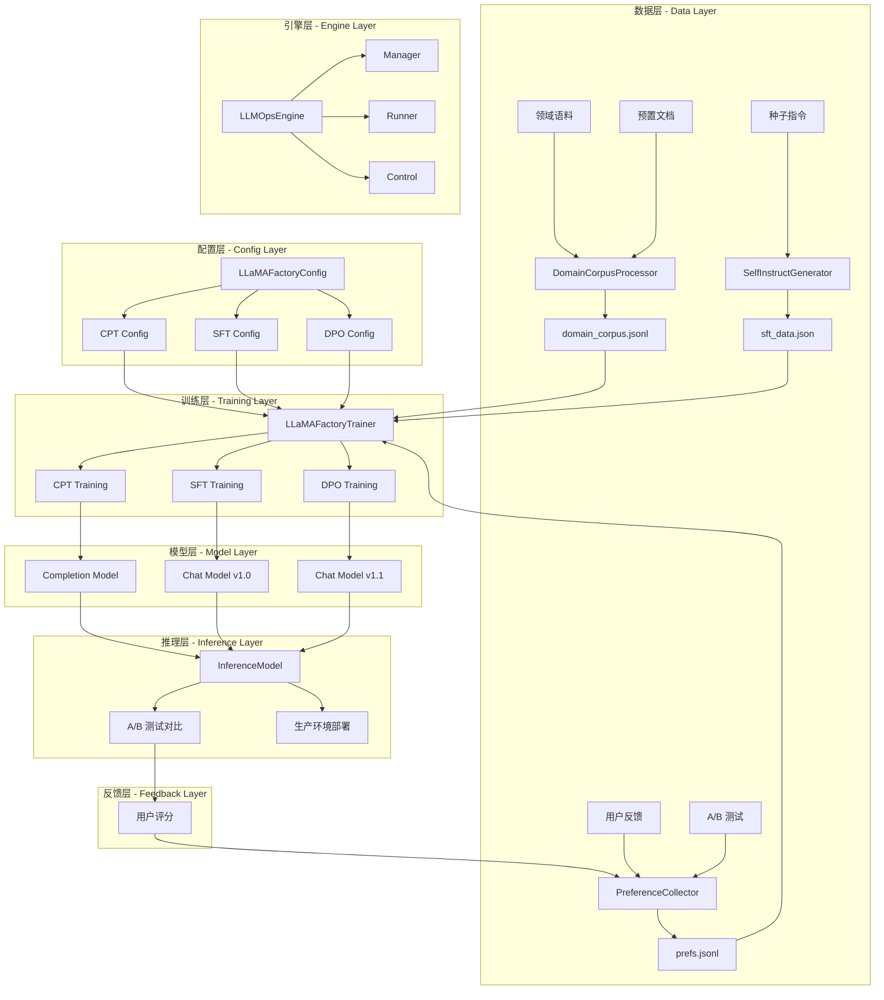
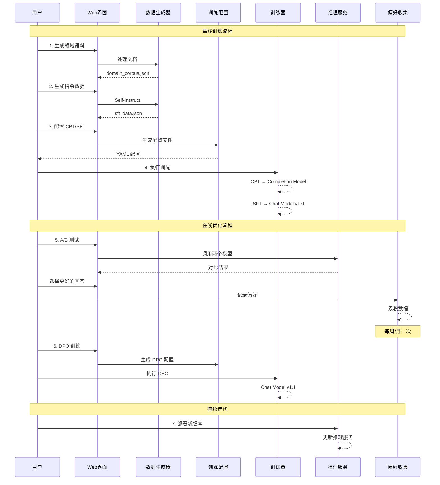
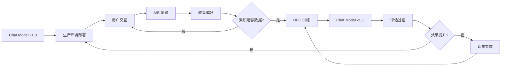

# 🔄 LLMOps 闭环系统技术指南 ([返回README](../README.md))

## 📋 目录

- [1. 系统概述](#1-系统概述)
- [2. 技术架构设计](#2-技术架构设计)
- [3. 训练流程详解](#3-训练流程详解)
- [4. 数据生成与管理](#4-数据生成与管理)
- [5. 核心组件实现](#5-核心组件实现)
- [6. 在线闭环优化](#6-在线闭环优化)
- [7. 配置与部署](#7-配置与部署)
- [8. 使用指南](#8-使用指南)
- [9. 最佳实践](#9-最佳实践)
- [10. 故障排除](#10-故障排除)

---

## 1. 系统概述

### 1.1 功能介绍

LLMOps 闭环系统是一个完整的大语言模型训练与优化平台，支持：

- 🔄 **完整训练流程**：CPT → SFT → DPO 三阶段训练
- 📊 **数据生成管道**：Self-Instruct 自动生成、偏好数据收集
- 🔁 **在线闭环优化**：A/B 测试 → 偏好收集 → DPO 训练 → 部署
- 📈 **实验管理**：配置管理、训练监控、结果对比
- 🎯 **离线/在线模式**：支持大版本开发和持续优化

### 1.2 核心概念

#### 离线训练 vs 在线优化

| 特性 | 离线训练 | 在线优化 |
|------|---------|---------|
| **用途** | 大版本开发（v1.0 → v2.0） | 持续迭代（v1.0 → v1.1） |
| **阶段** | CPT + SFT | DPO |
| **频率** | 数月一次 | 每周/月一次 |
| **成本** | 高（全参数或大规模 LoRA） | 低（仅 LoRA） |
| **数据** | 大规模语料 + 指令集 | 真实用户反馈 |
| **产出** | Completion + Chat 模型 | Chat 模型增量版本 |

### 1.3 系统特点

- ✅ **集成 LLaMA-Factory**：基于成熟的训练框架
- ✅ **Web 可视化界面**：基于 Gradio 的友好交互
- ✅ **模块化设计**：数据、训练、推理分离
- ✅ **自动化流程**：配置生成、数据转换、结果记录
- ✅ **演示模式**：无需 GPU 即可体验完整流程

---

## 2. 技术架构设计

### 2.1 整体架构图



### 2.2 目录结构

```
src/search_engine/training_tab/
├── llmops_tab.py                    # 主界面入口
├── llmops_engine.py                 # 引擎协调器
├── llmops_manager.py                # 组件管理器
├── llmops_runner.py                 # 训练运行器
├── llmops_control.py                # 控制逻辑
├── llmops_models.py                 # 模型配置
├── llama_factory_config.py          # LLaMA-Factory 配置生成
├── llamafactory_trainer.py          # 训练服务
├── self_instruct_generator.py       # Self-Instruct 数据生成
├── domain_corpus_processor.py       # 领域语料处理
├── preference_collector.py          # 偏好数据收集
├── inference_model.py               # 推理服务
└── README_LLMOPS.md                 # 快速入门

data/llmops/
├── dataset_info.json                # 数据集注册表
├── cpt/                            # CPT 数据
│   └── domain_corpus_*.jsonl
├── sft/                            # SFT 数据
│   └── sft_data_*.json
└── dpo/                            # DPO 数据
    └── prefs.jsonl

checkpoints/
├── cpt/                            # CPT 模型输出
├── sft/                            # SFT 模型输出
└── dpo/                            # DPO 模型输出

configs/llmops/
├── cpt_config_*.yaml               # CPT 配置文件
├── sft_config_*.yaml               # SFT 配置文件
└── dpo_config_*.yaml               # DPO 配置文件
```

### 2.3 数据流设计



---

## 3. 训练流程详解

### 3.1 CPT - 继续预训练 (Continued Pre-Training)

#### 3.1.1 目标与用途

**训练目标**：
- 在基础模型上注入领域知识
- 提升特定领域的语言理解能力
- 为后续 SFT 打下领域基础

**适用场景**：
- 医疗、法律、金融等专业领域
- 特定语言或方言适配
- 代码生成等专项任务

**产出模型**：
- **Completion Model**：可直接用于文本补全、代码生成等任务

#### 3.1.2 数据要求

```python
# CPT 数据格式：纯文本
{
    "text": "这是一段领域文本。可以是完整的段落、文档或代码片段。"
}
```

**数据特点**：
- 大规模：通常 10M-100M tokens
- 高质量：领域相关性强
- 无标注：不需要问答对

#### 3.1.3 核心配置

```python
# 文件: src/search_engine/training_tab/llama_factory_config.py
@staticmethod
def create_cpt_config(
    model_name: str = "Qwen/Qwen2-1.5B",
    dataset: str = "domain_corpus",
    output_dir: str = "checkpoints/cpt/domain-cpt",
    num_train_epochs: int = 1,
    learning_rate: float = 1e-5,
    per_device_train_batch_size: int = 2,
    gradient_accumulation_steps: int = 8,
    max_seq_length: int = 2048,
    lora_r: int = 16,
    lora_alpha: int = 32
) -> Dict[str, Any]:
    """CPT 配置生成"""
    return {
        "stage": "pt",  # pretrain
        "model_name_or_path": model_name,
        "dataset": dataset,
        "finetuning_type": "lora",
        "lora_rank": lora_r,
        "lora_alpha": lora_alpha,
        "num_train_epochs": num_train_epochs,
        "learning_rate": learning_rate,
        ...
    }
```

#### 3.1.4 训练流程

```bash
# 1. 生成配置
llamafactory-cli export configs/llmops/cpt_config_20231115.yaml

# 2. 执行训练
llamafactory-cli train configs/llmops/cpt_config_20231115.yaml

# 3. 训练输出
checkpoints/cpt/domain-cpt/
├── adapter_config.json      # LoRA 配置
├── adapter_model.safetensors # LoRA 权重
├── trainer_log.jsonl        # 训练日志
└── training_args.bin        # 训练参数
```

### 3.2 SFT - 监督微调 (Supervised Fine-Tuning)

#### 3.2.1 目标与用途

**训练目标**：
- 将基础模型转换为对话模型
- 学习指令遵循能力
- 适配特定任务格式

**适用场景**：
- 通用对话助手
- 任务型对话系统
- 多轮对话场景

**产出模型**：
- **Chat Model**：可用于生产环境的对话服务

#### 3.2.2 数据要求

```python
# SFT 数据格式：messages 格式（OpenAI 风格）
{
    "messages": [
        {
            "role": "system",
            "content": "You are a helpful assistant."
        },
        {
            "role": "user",
            "content": "什么是机器学习？"
        },
        {
            "role": "assistant",
            "content": "机器学习是人工智能的一个子领域..."
        }
    ]
}
```

**数据特点**：
- 中等规模：10K-100K 样本
- 高质量：人工标注或 GPT 生成
- 多样性：覆盖多种任务类型

#### 3.2.3 核心配置

```python
@staticmethod
def create_sft_config(
    model_name: str = "Qwen/Qwen2-1.5B",
    dataset: str = "sft_data",
    output_dir: str = "checkpoints/sft/sft-lora",
    num_train_epochs: int = 3,
    learning_rate: float = 5e-5,
    template: str = "qwen"
) -> Dict[str, Any]:
    """SFT 配置生成"""
    return {
        "stage": "sft",
        "model_name_or_path": model_name,
        "dataset": dataset,
        "template": template,  # 模型对话模板
        "finetuning_type": "lora",
        ...
    }
```

#### 3.2.4 训练流程

```bash
# 1. 从 CPT 模型继续训练
llamafactory-cli train configs/llmops/sft_config.yaml \
    --model_name_or_path checkpoints/cpt/domain-cpt

# 2. 或从原始模型直接 SFT
llamafactory-cli train configs/llmops/sft_config.yaml \
    --model_name_or_path Qwen/Qwen2-1.5B

# 3. 训练输出
checkpoints/sft/sft-lora/
├── adapter_config.json
├── adapter_model.safetensors
└── trainer_log.jsonl
```

### 3.3 DPO - 直接偏好优化 (Direct Preference Optimization)

#### 3.3.1 目标与用途

**训练目标**：
- 根据人类偏好优化模型输出
- 提升生成质量和用户满意度
- 实现在线闭环迭代

**适用场景**：
- 模型上线后持续优化
- 修正模型偏差
- 适配用户偏好

**产出模型**：
- **Chat Model v1.1, v1.2...**：增量优化版本

#### 3.3.2 数据要求

```python
# DPO 数据格式：偏好对比
{
    "conversations": [
        {
            "role": "user",
            "content": "Python 和 Java 哪个更好？"
        }
    ],
    "chosen": {
        "role": "assistant",
        "content": "Python 和 Java 各有优势，取决于具体场景..."
    },
    "rejected": {
        "role": "assistant",
        "content": "Python 更好。"
    }
}
```

**数据特点**：
- 小规模：100-1000 样本即可生效
- 真实性：来自真实用户反馈
- 对比性：必须有 chosen/rejected 对

#### 3.3.3 核心配置

```python
@staticmethod
def create_dpo_config(
    model_name: str = "Qwen/Qwen2-1.5B",
    adapter_path: str = "checkpoints/sft/sft-lora",
    dataset: str = "prefs",
    output_dir: str = "checkpoints/dpo/dpo-lora",
    num_train_epochs: int = 1,
    learning_rate: float = 5e-6,
    pref_beta: float = 0.1
) -> Dict[str, Any]:
    """DPO 配置生成"""
    return {
        "stage": "dpo",
        "model_name_or_path": model_name,
        "adapter_name_or_path": adapter_path,  # 加载 SFT 权重
        "dataset": dataset,
        "pref_beta": pref_beta,  # KL 散度权重
        "pref_loss": "sigmoid",  # 损失函数
        ...
    }
```

#### 3.3.4 训练流程

```bash
# 1. DPO 必须从 SFT 模型继续
llamafactory-cli train configs/llmops/dpo_config.yaml

# 2. 快速迭代（通常 30 分钟 - 2 小时）
# 3. 训练输出
checkpoints/dpo/dpo-lora/
├── adapter_config.json
├── adapter_model.safetensors
└── trainer_log.jsonl
```

### 3.4 训练阶段对比

| 阶段 | 数据量 | 训练时间 | 成本 | 频率 | 产出 |
|------|--------|---------|------|------|------|
| **CPT** | 10M-100M tokens | 2-8 小时 | 高 | 数月一次 | Completion Model |
| **SFT** | 10K-100K 样本 | 1-4 小时 | 中 | 数月一次 | Chat Model v1.0 |
| **DPO** | 100-1K 样本 | 0.5-2 小时 | 低 | 每周/月 | Chat Model v1.x |

---

## 4. 数据生成与管理

### 4.1 领域语料处理

#### 4.1.1 DomainCorpusProcessor

```python
# 文件: src/search_engine/training_tab/domain_corpus_processor.py
class DomainCorpusProcessor:
    """领域语料处理器 - 用于 CPT"""
    
    def process_documents(
        self, 
        documents: List[str], 
        chunk_size: int = 512
    ) -> List[Dict[str, str]]:
        """
        处理文档为 CPT 训练格式
        
        Args:
            documents: 原始文档列表
            chunk_size: 分块大小（tokens）
        
        Returns:
            格式化的训练数据
        """
        corpus = []
        for doc in documents:
            # 分块
            chunks = self._chunk_text(doc, chunk_size)
            for chunk in chunks:
                corpus.append({"text": chunk})
        
        return corpus
```

#### 4.1.2 数据格式

```jsonl
# data/llmops/cpt/domain_corpus_20231115.jsonl
{"text": "第一段领域文本..."}
{"text": "第二段领域文本..."}
{"text": "第三段领域文本..."}
```

#### 4.1.3 数据集注册

```json
// data/llmops/dataset_info.json
{
    "domain_corpus_20231115": {
        "file_name": "cpt/domain_corpus_20231115.jsonl",
        "columns": {
            "prompt": "text"
        }
    }
}
```

### 4.2 Self-Instruct 数据生成

#### 4.2.1 SelfInstructGenerator

```python
# 文件: src/search_engine/training_tab/self_instruct_generator.py
class SelfInstructGenerator:
    """Self-Instruct 数据生成器 - 用于 SFT"""
    
    def generate_instructions(
        self, 
        num_instructions: int = 100,
        use_mock: bool = True
    ) -> List[Dict[str, Any]]:
        """
        生成指令数据
        
        Args:
            num_instructions: 生成数量
            use_mock: 是否使用模拟数据（演示模式）
        
        Returns:
            ShareGPT 格式的指令数据
        """
        if use_mock:
            return self._generate_mock_data(num_instructions)
        else:
            return self._generate_with_llm(num_instructions)
```

#### 4.2.2 数据格式

```json
// data/llmops/sft/sft_data_20231115.json
[
    {
        "messages": [
            {
                "role": "system",
                "content": "You are a helpful assistant."
            },
            {
                "role": "user",
                "content": "判断这条评论是好评还是差评\n\n物流速度很快，包装完好，质量不错"
            },
            {
                "role": "assistant",
                "content": "好评"
            }
        ]
    },
    {
        "messages": [
            {
                "role": "user",
                "content": "将下面的文本总结为一句话\n\n人工智能是..."
            },
            {
                "role": "assistant",
                "content": "人工智能是创建能执行类人智能任务的计算机系统。"
            }
        ]
    }
]
```

#### 4.2.3 任务类型模板

```python
TASK_TYPES = {
    "classification": "分类任务",
    "generation": "生成任务",
    "summarization": "总结任务",
    "qa": "问答任务",
    "rewrite": "改写任务",
    "reasoning": "推理任务"
}
```

### 4.3 偏好数据收集

#### 4.3.1 PreferenceCollector

```python
# 文件: src/search_engine/training_tab/preference_collector.py
class PreferenceCollector:
    """偏好数据收集器 - 用于 DPO"""
    
    def collect_preference(
        self,
        question: str,
        response_a: str,
        response_b: str,
        choice: str,  # "A" or "B"
        metadata: Dict[str, Any] = None
    ):
        """
        收集用户偏好
        
        Args:
            question: 用户问题
            response_a: 回答 A
            response_b: 回答 B
            choice: 用户选择（"A" 或 "B"）
            metadata: 附加信息（模型版本等）
        """
        chosen = response_a if choice == "A" else response_b
        rejected = response_b if choice == "A" else response_a
        
        preference = {
            "conversations": [
                {"role": "user", "content": question}
            ],
            "chosen": {"role": "assistant", "content": chosen},
            "rejected": {"role": "assistant", "content": rejected},
            "metadata": metadata
        }
        
        self._save_preference(preference)
```

#### 4.3.2 数据格式

```jsonl
# data/llmops/dpo/prefs.jsonl
{"conversations": [{"role": "user", "content": "Python和Java哪个更好？"}], "chosen": {"role": "assistant", "content": "Python 和 Java 各有优势..."}, "rejected": {"role": "assistant", "content": "Python 更好。"}}
{"conversations": [{"role": "user", "content": "如何学习机器学习？"}], "chosen": {"role": "assistant", "content": "系统学习，从基础到实践..."}, "rejected": {"role": "assistant", "content": "看书就行。"}}
```

#### 4.3.3 数据集注册

```json
// data/llmops/dataset_info.json
{
    "prefs": {
        "file_name": "dpo/prefs.jsonl",
        "formatting": "sharegpt",
        "ranking": true,
        "columns": {
            "messages": "conversations",
            "chosen": "chosen",
            "rejected": "rejected"
        }
    }
}
```

### 4.4 数据管理最佳实践

#### 4.4.1 数据质量控制

```python
# 数据验证
def validate_data(data: List[Dict]) -> bool:
    """验证数据格式"""
    for item in data:
        # 检查必要字段
        if "conversations" not in item:
            return False
        
        # 检查对话格式
        for conv in item["conversations"]:
            if "from" not in conv or "value" not in conv:
                return False
    
    return True
```

#### 4.4.2 数据去重

```python
def deduplicate_data(data: List[Dict]) -> List[Dict]:
    """数据去重"""
    seen = set()
    unique_data = []
    
    for item in data:
        # 使用问题的哈希作为唯一标识
        question = item["conversations"][0]["value"]
        hash_key = hashlib.md5(question.encode()).hexdigest()
        
        if hash_key not in seen:
            seen.add(hash_key)
            unique_data.append(item)
    
    return unique_data
```

#### 4.4.3 数据版本管理

```bash
# 使用时间戳作为版本标识
data/llmops/
├── cpt/
│   ├── domain_corpus_20231115_120000.jsonl
│   └── domain_corpus_20231116_093000.jsonl
├── sft/
│   ├── sft_data_20231115.json
│   └── sft_data_20231116.json
└── dpo/
    └── prefs.jsonl  # 持续追加
```

---

## 5. 核心组件实现

### 5.1 LLaMAFactoryTrainer - 训练服务

```python
# 文件: src/search_engine/training_tab/llamafactory_trainer.py
class LLaMAFactoryTrainer:
    """LLaMA-Factory 训练服务（使用 subprocess 启动独立进程）"""
    
    def __init__(self):
        self.current_process: Optional[subprocess.Popen] = None
        self.training_status = {
            'running': False,
            'stage': None,
            'output_dir': None
        }
    
    def start_training(self, config: Dict[str, Any]) -> bool:
        """
        启动训练
        
        Args:
            config: 训练配置字典
        
        Returns:
            是否成功启动
        """
        try:
            # 1. 构建训练参数
            args = self._build_train_args(config)
            
            # 2. 生成临时配置文件
            config_file = self._create_temp_config(args)
            
            # 3. 构建训练命令
            cmd = [
                "llamafactory-cli",
                "train",
                config_file
            ]
            
            # 4. 启动训练进程
            self.current_process = subprocess.Popen(
                cmd,
                stdout=subprocess.PIPE,
                stderr=subprocess.STDOUT,
                text=True,
                bufsize=1
            )
            
            # 5. 更新状态
            self.training_status['running'] = True
            self.training_status['stage'] = config.get('stage')
            self.training_status['output_dir'] = config.get('output_dir')
            
            return True
            
        except Exception as e:
            print(f"❌ 启动训练失败: {e}")
            return False
```

### 5.2 LLMOpsEngine - 引擎协调

```python
# 文件: src/search_engine/training_tab/llmops_engine.py
class LLMOpsEngine:
    """LLMOps 引擎（参考 LLaMA-Factory 的 Engine 设计）"""
    
    def __init__(self, demo_mode: bool = False):
        self.demo_mode = demo_mode
        self.manager = LLMOpsManager()  # 组件管理
        self.runner = LLMOpsRunner(self.manager)  # 训练运行
    
    def resume(self):
        """恢复组件初始状态"""
        user_config = load_config() if not self.demo_mode else {}
        
        init_dict = {
            "train.output_dir": {"value": f"train_{get_time()}"}
        }
        
        yield self._update_component(init_dict)
        
        # 如果训练正在运行，恢复训练状态
        if self.runner.running and self.runner.running_data:
            output_dict = {}
            for elem, value in self.runner.running_data.items():
                output_dict[elem] = gr.update(value=value)
            yield output_dict
```

### 5.3 InferenceModel - 推理服务

```python
# 文件: src/search_engine/training_tab/inference_model.py
class InferenceModel:
    """推理服务 - 用于 A/B 测试"""
    
    def __init__(self):
        self.models = {}  # 模型缓存
    
    def load_model(
        self,
        model_name: str,
        base_model: str,
        adapter_path: str = None
    ):
        """
        加载模型
        
        Args:
            model_name: 模型标识
            base_model: 基础模型路径
            adapter_path: LoRA 适配器路径
        """
        if model_name in self.models:
            return
        
        # 实际生产中应该使用 vLLM 或 TGI
        # 这里使用简化的 Transformers 实现
        from transformers import AutoModelForCausalLM, AutoTokenizer
        
        tokenizer = AutoTokenizer.from_pretrained(base_model)
        model = AutoModelForCausalLM.from_pretrained(base_model)
        
        if adapter_path:
            # 加载 LoRA 权重
            from peft import PeftModel
            model = PeftModel.from_pretrained(model, adapter_path)
        
        self.models[model_name] = {
            'model': model,
            'tokenizer': tokenizer
        }
    
    def generate(
        self,
        model_name: str,
        prompt: str,
        max_length: int = 512,
        temperature: float = 0.7
    ) -> str:
        """
        生成回答
        
        Args:
            model_name: 模型标识
            prompt: 输入提示
            max_length: 最大生成长度
            temperature: 温度参数
        
        Returns:
            生成的文本
        """
        if model_name not in self.models:
            raise ValueError(f"模型 {model_name} 未加载")
        
        model_dict = self.models[model_name]
        tokenizer = model_dict['tokenizer']
        model = model_dict['model']
        
        inputs = tokenizer(prompt, return_tensors="pt")
        outputs = model.generate(
            **inputs,
            max_length=max_length,
            temperature=temperature,
            do_sample=True
        )
        
        response = tokenizer.decode(outputs[0], skip_special_tokens=True)
        return response
```

---

## 6. 在线闭环优化

### 6.1 闭环流程图



### 6.2 A/B 测试实现

#### 6.2.1 测试界面

```python
def create_ab_test_interface():
    """创建 A/B 测试界面"""
    with gr.Tab("A/B 测试与反馈闭环"):
        with gr.Row():
            with gr.Column():
                question_input = gr.Textbox(
                    label="用户问题",
                    placeholder="输入要测试的问题..."
                )
                generate_btn = gr.Button("🎲 生成对比回答")
            
            with gr.Column():
                model_a_config = gr.Dropdown(
                    label="模型 A",
                    choices=get_trained_models("sft")
                )
                model_b_config = gr.Dropdown(
                    label="模型 B",
                    choices=get_trained_models("dpo")
                )
        
        with gr.Row():
            with gr.Column():
                response_a = gr.Textbox(
                    label="回答 A",
                    lines=8,
                    interactive=False
                )
                vote_a_btn = gr.Button("👍 A 更好")
            
            with gr.Column():
                response_b = gr.Textbox(
                    label="回答 B",
                    lines=8,
                    interactive=False
                )
                vote_b_btn = gr.Button("👍 B 更好")
        
        feedback_status = gr.Textbox(label="反馈状态")
        
        # 绑定事件
        generate_btn.click(
            fn=generate_ab_responses,
            inputs=[question_input, model_a_config, model_b_config],
            outputs=[response_a, response_b]
        )
        
        vote_a_btn.click(
            fn=lambda q, a, b: record_preference(q, a, b, "A"),
            inputs=[question_input, response_a, response_b],
            outputs=[feedback_status]
        )
        
        vote_b_btn.click(
            fn=lambda q, a, b: record_preference(q, a, b, "B"),
            inputs=[question_input, response_a, response_b],
            outputs=[feedback_status]
        )
```

#### 6.2.2 偏好记录

```python
def record_preference(
    question: str,
    response_a: str,
    response_b: str,
    choice: str
) -> str:
    """记录用户偏好"""
    try:
        collector = PreferenceCollector()
        collector.collect_preference(
            question=question,
            response_a=response_a,
            response_b=response_b,
            choice=choice,
            metadata={
                "timestamp": datetime.now().isoformat(),
                "model_a": "v1.0",
                "model_b": "v1.1"
            }
        )
        
        return f"✅ 偏好已记录！选择了回答 {choice}"
        
    except Exception as e:
        return f"❌ 记录失败: {e}"
```

### 6.3 迭代策略

#### 6.3.1 数据收集计划

```python
# 每周收集目标
WEEKLY_COLLECTION_TARGET = {
    "min_samples": 100,      # 最少样本数
    "target_samples": 300,   # 目标样本数
    "optimal_samples": 500   # 最佳样本数
}

# 每月迭代计划
MONTHLY_ITERATION_PLAN = {
    "week_1": "收集偏好数据",
    "week_2": "收集偏好数据",
    "week_3": "DPO 训练",
    "week_4": "部署和验证"
}
```

#### 6.3.2 训练触发条件

```python
def should_trigger_dpo_training() -> bool:
    """判断是否应该触发 DPO 训练"""
    prefs_file = "data/llmops/dpo/prefs.jsonl"
    
    if not os.path.exists(prefs_file):
        return False
    
    # 统计偏好数据量
    with open(prefs_file, 'r') as f:
        count = sum(1 for _ in f)
    
    # 判断条件
    min_samples = 100
    time_since_last_training = get_time_since_last_training()
    days_threshold = 7  # 每周至少一次
    
    return (
        count >= min_samples and
        time_since_last_training >= days_threshold
    )
```

#### 6.3.3 效果评估

```python
def evaluate_model_improvement(
    old_model: str,
    new_model: str,
    test_set: List[Dict]
) -> Dict[str, float]:
    """评估模型改进效果"""
    results = {
        "win_rate": 0.0,      # 新模型胜率
        "avg_score": 0.0,     # 平均评分
        "consistency": 0.0    # 一致性
    }
    
    inference = InferenceModel()
    inference.load_model("old", old_model)
    inference.load_model("new", new_model)
    
    wins = 0
    total = len(test_set)
    
    for item in test_set:
        question = item["question"]
        
        old_response = inference.generate("old", question)
        new_response = inference.generate("new", question)
        
        # 人工评分或自动评估
        score = compare_responses(old_response, new_response)
        if score > 0:
            wins += 1
    
    results["win_rate"] = wins / total
    return results
```

### 6.4 生产部署流程

```bash
# 1. 训练完成后的模型路径
MODEL_PATH="checkpoints/dpo/chat-v1.1"

# 2. 评估验证
python tools/evaluate_model.py --model $MODEL_PATH

# 3. 灰度发布（5% 流量）
python tools/deploy_model.py --model $MODEL_PATH --traffic 0.05

# 4. 监控指标
python tools/monitor_metrics.py --model $MODEL_PATH

# 5. 全量发布（100% 流量）
python tools/deploy_model.py --model $MODEL_PATH --traffic 1.0
```

---

## 7. 配置与部署

### 7.1 环境配置

#### 7.1.1 依赖安装

```bash
# 基础依赖
pip install torch transformers datasets
pip install accelerate peft bitsandbytes

# LLaMA-Factory
pip install llamafactory

# Web 界面
pip install gradio

# 可选：推理加速
pip install vllm  # 生产环境推荐
```

#### 7.1.2 目录初始化

```bash
# 创建必要目录
mkdir -p data/llmops/{cpt,sft,dpo}
mkdir -p checkpoints/{cpt,sft,dpo}
mkdir -p configs/llmops

# 初始化数据集配置
cat > data/llmops/dataset_info.json << 'EOF'
{}
EOF
```

### 7.2 训练配置模板

#### 7.2.1 CPT 配置示例

```yaml
# configs/llmops/cpt_config_template.yaml
model_name_or_path: Qwen/Qwen2-1.5B
stage: pt
do_train: true
dataset: domain_corpus
dataset_dir: data/llmops
template: default
finetuning_type: lora
lora_target: all
lora_rank: 16
lora_alpha: 32
lora_dropout: 0.05
output_dir: checkpoints/cpt/domain-cpt
overwrite_output_dir: true
num_train_epochs: 1
learning_rate: 1.0e-5
per_device_train_batch_size: 2
gradient_accumulation_steps: 8
lr_scheduler_type: cosine
warmup_steps: 100
logging_steps: 10
save_steps: 500
fp16: true
cutoff_len: 2048
plot_loss: true
```

#### 7.2.2 SFT 配置示例

```yaml
# configs/llmops/sft_config_template.yaml
model_name_or_path: Qwen/Qwen2-1.5B
stage: sft
do_train: true
dataset: sft_data
dataset_dir: data/llmops
template: qwen
finetuning_type: lora
lora_target: all
lora_rank: 8
lora_alpha: 16
lora_dropout: 0.05
output_dir: checkpoints/sft/sft-lora
num_train_epochs: 3
learning_rate: 5.0e-5
per_device_train_batch_size: 4
gradient_accumulation_steps: 4
fp16: true
cutoff_len: 1024
plot_loss: true
```

#### 7.2.3 DPO 配置示例

```yaml
# configs/llmops/dpo_config_template.yaml
model_name_or_path: Qwen/Qwen2-1.5B
adapter_name_or_path: checkpoints/sft/sft-lora
stage: dpo
do_train: true
dataset: prefs
dataset_dir: data/llmops
template: qwen
finetuning_type: lora
lora_target: all
lora_rank: 8
lora_alpha: 16
output_dir: checkpoints/dpo/dpo-lora
num_train_epochs: 1
learning_rate: 5.0e-6
per_device_train_batch_size: 2
gradient_accumulation_steps: 8
pref_beta: 0.1
pref_loss: sigmoid
fp16: true
cutoff_len: 1024
```

### 7.3 模型部署

#### 7.3.1 本地部署

```bash
# 使用 LLaMA-Factory CLI 快速部署
llamafactory-cli api \
    --model_name_or_path Qwen/Qwen2-1.5B \
    --adapter_name_or_path checkpoints/dpo/dpo-lora \
    --template qwen \
    --port 8000
```

#### 7.3.2 生产部署（vLLM）

```bash
# 先合并 LoRA 权重
llamafactory-cli export \
    --model_name_or_path Qwen/Qwen2-1.5B \
    --adapter_name_or_path checkpoints/dpo/dpo-lora \
    --template qwen \
    --export_dir models/merged/chat-v1.1

# 使用 vLLM 部署
python -m vllm.entrypoints.openai.api_server \
    --model models/merged/chat-v1.1 \
    --port 8000 \
    --tensor-parallel-size 2
```

---

## 8. 使用指南

### 8.1 快速开始

#### 8.1.1 启动系统

```bash
cd /Users/tyler/courseware-1/projects/Testbed
python start_system.py
```

访问 Web 界面，进入 **训练 & 实验** → **LLMOps 闭环** 标签页。

### 8.2 离线训练流程

#### 步骤 1: 数据生成

1. **领域语料**：
   - 点击"加载预置文档"
   - 点击"处理语料"
   - 点击"保存语料"

2. **指令数据**：
   - 设置生成数量（50-100）
   - 点击"生成指令数据"
   - 点击"保存指令数据"

#### 步骤 2: 配置训练

1. **CPT 配置**：
   - 进入"训练配置" → "CPT"
   - 设置基础模型：`Qwen/Qwen2-1.5B`
   - 点击"生成 CPT 配置"

2. **SFT 配置**：
   - 进入"训练配置" → "SFT"
   - 设置模型路径：`checkpoints/cpt/domain-cpt`
   - 点击"生成 SFT 配置"

#### 步骤 3: 执行训练

```bash
# CPT 训练
llamafactory-cli train configs/llmops/cpt_config_*.yaml

# SFT 训练
llamafactory-cli train configs/llmops/sft_config_*.yaml
```

### 8.3 在线优化流程（推荐）

#### 步骤 1: 收集偏好

1. 进入 "A/B 测试与反馈闭环"
2. 输入问题，生成对比回答
3. 选择更好的回答
4. 系统自动记录

**目标**：每周收集 100-200 条真实偏好

#### 步骤 2: DPO 训练

1. 进入"训练配置" → "DPO"
2. 设置模型路径（当前版本）
3. 点击"生成 DPO 配置"
4. 执行训练：

```bash
llamafactory-cli train configs/llmops/dpo_config_*.yaml
```

#### 步骤 3: 部署新版本

1. 训练完成后得到新的 LoRA
2. 更新推理服务配置
3. 继续收集反馈

---

## 9. 最佳实践

### 9.1 数据最佳实践

#### 9.1.1 CPT 数据

- ✅ 高质量：确保领域相关性强
- ✅ 大规模：至少 10M tokens
- ✅ 清洗：去除噪声和重复
- ✅ 分块：合理的 chunk_size（512-2048）

#### 9.1.2 SFT 数据

- ✅ 多样性：覆盖多种任务类型
- ✅ 高质量：人工标注或 GPT 生成
- ✅ 格式规范：严格遵循 ShareGPT 格式
- ✅ 规模适中：10K-100K 样本

#### 9.1.3 DPO 数据

- ✅ 真实性：来自真实用户反馈
- ✅ 对比性：明确的好坏对比
- ✅ 持续收集：每周 100-200 条
- ✅ 质量控制：定期审查偏好数据

### 9.2 训练最佳实践

#### 9.2.1 超参数调优

```python
# CPT 参数建议
CPT_PARAMS = {
    "learning_rate": 1e-5,  # 较小的学习率
    "num_epochs": 1,        # 1-3 个 epoch
    "lora_rank": 16,        # 较大的 rank
    "batch_size": 2-4,      # 根据显存调整
}

# SFT 参数建议
SFT_PARAMS = {
    "learning_rate": 5e-5,  # 中等学习率
    "num_epochs": 3,        # 3-5 个 epoch
    "lora_rank": 8,         # 中等 rank
    "batch_size": 4-8,      # 根据显存调整
}

# DPO 参数建议
DPO_PARAMS = {
    "learning_rate": 5e-6,  # 很小的学习率
    "num_epochs": 1,        # 1 个 epoch
    "lora_rank": 8,         # 与 SFT 保持一致
    "pref_beta": 0.1,       # KL 散度权重
}
```

#### 9.2.2 训练监控

```python
# 监控关键指标
MONITOR_METRICS = {
    "loss": "训练损失（应持续下降）",
    "learning_rate": "学习率变化",
    "gradient_norm": "梯度范数（避免梯度爆炸）",
    "samples_per_second": "训练速度"
}

# 早停条件
EARLY_STOPPING = {
    "patience": 3,          # 3 个 epoch 无改进即停止
    "min_delta": 0.001,     # 最小改进阈值
    "monitor": "eval_loss"  # 监控验证集损失
}
```

### 9.3 部署最佳实践

#### 9.3.1 灰度发布

```python
# 灰度发布策略
GRADUAL_ROLLOUT = {
    "stage_1": {"traffic": 0.05, "duration": "1 day"},   # 5% 流量
    "stage_2": {"traffic": 0.20, "duration": "2 days"},  # 20% 流量
    "stage_3": {"traffic": 0.50, "duration": "3 days"},  # 50% 流量
    "stage_4": {"traffic": 1.00, "duration": "stable"}   # 100% 流量
}
```

#### 9.3.2 回滚策略

```python
# 自动回滚条件
ROLLBACK_CONDITIONS = {
    "error_rate": 0.05,      # 错误率超过 5%
    "latency_p99": 2000,     # P99 延迟超过 2s
    "user_feedback": -0.2    # 用户反馈下降 20%
}
```

---

## 10. 故障排除

### 10.1 训练问题

#### 10.1.1 OOM (内存不足)

**问题**：`RuntimeError: CUDA out of memory`

**解决方案**：
```yaml
# 减小 batch size
per_device_train_batch_size: 1

# 增大梯度累积
gradient_accumulation_steps: 16

# 减小序列长度
cutoff_len: 512

# 使用 gradient checkpointing
gradient_checkpointing: true

# 使用 8-bit 量化
quantization_bit: 8
```

#### 10.1.2 训练不收敛

**问题**：Loss 不下降或震荡

**解决方案**：
```yaml
# 降低学习率
learning_rate: 1.0e-6

# 增加 warmup
warmup_steps: 500

# 使用梯度裁剪
max_grad_norm: 1.0

# 检查数据质量
# - 确保数据格式正确
# - 去除异常样本
```

#### 10.1.3 训练速度慢

**问题**：训练速度很慢

**解决方案**：
```python
# 1. 使用多 GPU
# 启动 DeepSpeed
deepspeed --num_gpus=4 llamafactory-cli train config.yaml

# 2. 使用混合精度
fp16: true  # 或 bf16: true

# 3. 增大 batch size
per_device_train_batch_size: 8

# 4. 优化数据加载
dataloader_num_workers: 4
preprocessing_num_workers: 8
```

### 10.2 数据问题

#### 10.2.1 数据格式错误

**问题**：`KeyError: 'conversations'`

**解决方案**：
```python
# 检查数据格式
def validate_sft_data(data_file):
    with open(data_file, 'r') as f:
        data = json.load(f)
    
    for i, item in enumerate(data):
        # 检查必要字段
        assert "conversations" in item, f"第 {i} 条缺少 conversations"
        
        # 检查对话格式
        for conv in item["conversations"]:
            assert "from" in conv, f"第 {i} 条对话缺少 from"
            assert "value" in conv, f"第 {i} 条对话缺少 value"
            assert conv["from"] in ["human", "gpt"], f"from 字段值错误"
```

#### 10.2.2 数据集未注册

**问题**：`Dataset 'xxx' not found in dataset_info.json`

**解决方案**：
```json
// 手动添加到 data/llmops/dataset_info.json
{
    "your_dataset_name": {
        "file_name": "path/to/your_data.jsonl",
        "columns": {
            "prompt": "text"  // CPT
            // 或
            "messages": "conversations"  // SFT/DPO
        },
        "formatting": "sharegpt",  // SFT/DPO 必需
        "ranking": true  // 仅 DPO 需要
    }
}
```

### 10.3 模型问题

#### 10.3.1 模型加载失败

**问题**：`OSError: Unable to load weights`

**解决方案**：
```bash
# 1. 检查模型路径
ls -la checkpoints/sft/sft-lora/
# 应该包含：adapter_config.json, adapter_model.safetensors

# 2. 检查文件权限
chmod -R 755 checkpoints/

# 3. 重新下载基础模型
huggingface-cli download Qwen/Qwen2-1.5B
```

#### 10.3.2 推理效果差

**问题**：模型输出质量不好

**解决方案**：
```python
# 1. 检查推理参数
INFERENCE_PARAMS = {
    "temperature": 0.7,      # 降低随机性
    "top_p": 0.9,            # 核采样
    "top_k": 50,             # Top-K 采样
    "repetition_penalty": 1.1,  # 重复惩罚
    "max_length": 512        # 最大长度
}

# 2. 检查 Prompt 模板
# 确保使用正确的对话模板（如 Qwen 模板）

# 3. 尝试不同的 checkpoint
# 有时最后的 checkpoint 不是最好的
```

---

## 附录

### A. 配置参考

```python
# 完整配置示例
FULL_CONFIG = {
    # 模型配置
    "model_name_or_path": "Qwen/Qwen2-1.5B",
    "adapter_name_or_path": "checkpoints/sft/sft-lora",
    
    # 训练阶段
    "stage": "dpo",  # pt, sft, dpo, rm, ppo
    
    # 数据配置
    "dataset": "prefs",
    "dataset_dir": "data/llmops",
    "template": "qwen",
    
    # LoRA 配置
    "finetuning_type": "lora",
    "lora_target": "all",
    "lora_rank": 8,
    "lora_alpha": 16,
    "lora_dropout": 0.05,
    
    # 训练参数
    "num_train_epochs": 1,
    "learning_rate": 5e-6,
    "per_device_train_batch_size": 2,
    "gradient_accumulation_steps": 8,
    "lr_scheduler_type": "cosine",
    "warmup_steps": 100,
    
    # 优化配置
    "fp16": True,
    "bf16": False,
    "gradient_checkpointing": True,
    "max_grad_norm": 1.0,
    
    # DPO 特定
    "pref_beta": 0.1,
    "pref_loss": "sigmoid",
    "pref_ftx": 0.0,
    
    # 输出配置
    "output_dir": "checkpoints/dpo/dpo-lora",
    "logging_steps": 10,
    "save_steps": 100,
    "plot_loss": True
}
```

### B. API 参考

```python
# 训练 API
from llamafactory_trainer import get_trainer

trainer = get_trainer()
trainer.start_training(config)
trainer.stop_training()
trainer.get_status()

# 数据生成 API
from self_instruct_generator import SelfInstructGenerator

generator = SelfInstructGenerator()
data = generator.generate_instructions(num_instructions=100)
generator.save_data(data, "data/llmops/sft/sft_data.json")

# 偏好收集 API
from preference_collector import PreferenceCollector

collector = PreferenceCollector()
collector.collect_preference(
    question="...",
    response_a="...",
    response_b="...",
    choice="A"
)

# 推理 API
from inference_model import InferenceModel

model = InferenceModel()
model.load_model("chat-v1", "Qwen/Qwen2-1.5B", "checkpoints/sft/sft-lora")
response = model.generate("chat-v1", "你好", max_length=512)
```

### C. 相关资源

- [LLaMA-Factory 文档](https://github.com/hiyouga/LLaMA-Factory)
- [Qwen2 模型](https://huggingface.co/Qwen)
- [LoRA 论文](https://arxiv.org/abs/2106.09685)
- [DPO 论文](https://arxiv.org/abs/2305.18290)
- [Self-Instruct 论文](https://arxiv.org/abs/2212.10560)

### D. 术语表

| 术语 | 全称 | 说明 |
|------|------|------|
| **CPT** | Continued Pre-Training | 继续预训练 |
| **SFT** | Supervised Fine-Tuning | 监督微调 |
| **DPO** | Direct Preference Optimization | 直接偏好优化 |
| **LoRA** | Low-Rank Adaptation | 低秩适配 |
| **RLHF** | Reinforcement Learning from Human Feedback | 基于人类反馈的强化学习 |
| **PPO** | Proximal Policy Optimization | 近端策略优化 |

