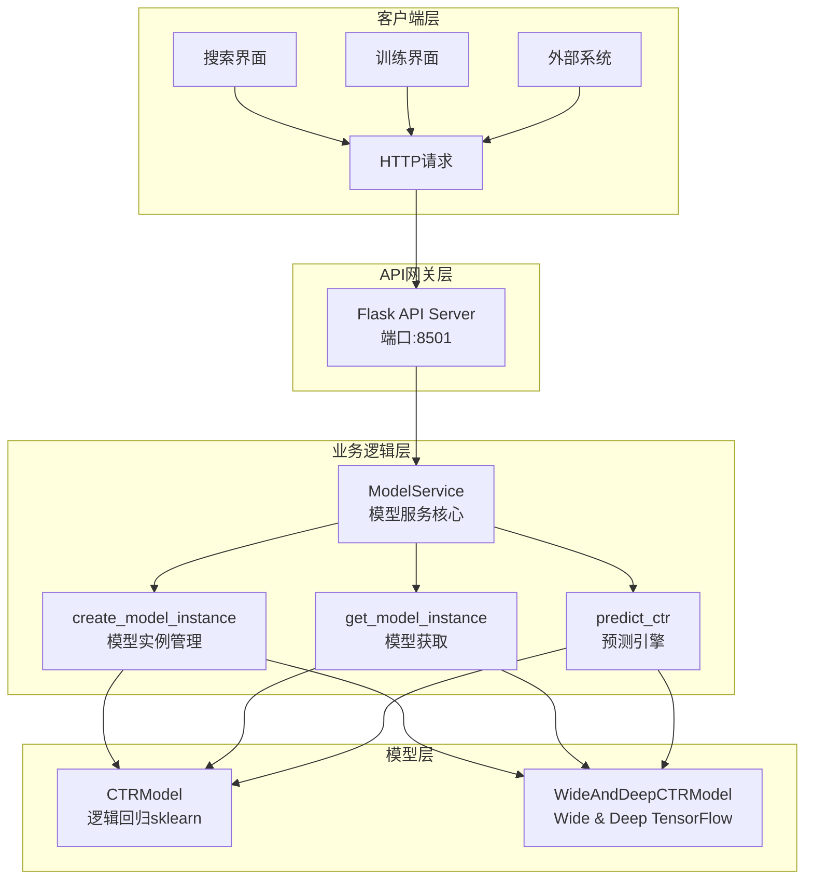

# 🤖 模型服务技术指南 ([返回README](../README.md))

## 1. 概述

本指南详细介绍MLOps搜索引擎测试床中的模型服务(Model Serving)系统，包括架构设计、API接口、部署方式和运维管理。

## 2. 系统架构

### 2.1 整体架构

模型服务采用**独立进程架构**，从外到内分为4层：

1. **客户端层**: 各种客户端通过HTTP请求访问服务
2. **API网关层**: Flask服务器处理HTTP请求和响应
3. **业务逻辑层**: ModelService核心业务逻辑
4. **模型层**: 具体的机器学习模型实现

#### 独立进程架构优势

- **高可用性**: 模型服务崩溃不影响主系统
- **独立扩展**: 可以独立扩展模型服务资源
- **进程隔离**: 内存和CPU资源隔离
- **独立监控**: 可以独立监控模型服务性能
- **易于部署**: 支持容器化部署

#### 架构分层说明

**客户端层**:
- 搜索界面、训练界面、外部系统等客户端
- 通过HTTP协议与模型服务通信

**API网关层**:
- Flask Web服务器，监听8501端口
- 处理HTTP请求路由、参数验证、响应格式化
- 提供RESTful API接口

**业务逻辑层**:
- `ModelService`类：核心业务逻辑编排
- `create_model_instance()`：创建指定类型的模型实例
- `get_model_instance()`：获取模型实例，支持动态加载
- `predict_ctr()`：执行CTR预测，协调不同模型
- `switch_model()`：切换当前使用的模型类型

**模型层**:
- `CTRModel`：逻辑回归模型实现（sklearn）
- `WideAndDeepCTRModel`：Wide & Deep模型实现（TensorFlow）
- 特征提取：每个模型都有自己的特征工程逻辑
- 模型训练：支持在线训练和模型更新




### 2.2 核心组件

#### 2.2.1 ModelService类
```python
# 文件路径: src/search_engine/model_service.py
class ModelService:
    """模型服务：负责模型训练、配置管理、模型文件等"""
    
    def __init__(self, model_file: str = None):
        if model_file is None:
            model_file = os.path.join(os.getcwd(), "models", "ctr_model.pkl")
        self.model_file = model_file
        self.ctr_model = CTRModel()  # 默认使用LR模型
        self.current_model_type = "logistic_regression"
        self.model_instances = {}  # 存储不同类型的模型实例
        self._load_model()
        
        # Flask API 服务相关
        self.flask_app = None
        self.api_running = False
```

#### 2.2.2 API路由设计
```python
def _setup_api_routes(self):
    """设置API路由"""
    
    @self.flask_app.route('/health', methods=['GET'])
    def health():
        """健康检查"""
        return jsonify({
            "status": "healthy",
            "model_type": self.current_model_type,
            "model_trained": self.ctr_model.is_trained
        })
    
    @self.flask_app.route('/v1/models', methods=['GET'])
    def list_models():
        """列出所有模型"""
        models = []
        for model_type in ['logistic_regression', 'wide_and_deep']:
            try:
                model_instance = self.get_model_instance(model_type)
                models.append({
                    "name": model_type,
                    "status": "loaded" if model_instance.is_trained else "unloaded",
                    "type": "pickle" if model_type == 'logistic_regression' else "tensorflow"
                })
            except:
                models.append({
                    "name": model_type,
                    "status": "error",
                    "type": "pickle" if model_type == 'logistic_regression' else "tensorflow"
                })
        
        return jsonify({"model": models})
    
    @self.flask_app.route('/v1/models/<model_name>/predict', methods=['POST'])
    def predict(model_name):
        """模型预测"""
        try:
            data = request.get_json()
            if not data:
                return jsonify({"error": "No JSON data provided"}), 400
            
            # 提取输入数据
            inputs = data.get('inputs', {})
            if not inputs:
                return jsonify({"error": "No inputs provided"}), 400
            
            # 执行预测
            ctr_score = self.predict_ctr(inputs, model_name)
            
            return jsonify({
                "outputs": {"ctr_score": ctr_score}
            })
            
        except ValueError as e:
            return jsonify({"error": str(e)}), 404
        except Exception as e:
            return jsonify({"error": str(e)}), 500
```

## 3. API接口规范

### 3.1 健康检查接口

**接口地址**: `GET /health`

**请求示例**:
```bash
curl -X GET http://localhost:8501/health
```

**响应示例**:
```json
{
    "status": "healthy",
    "model_type": "logistic_regression",
    "model_trained": true
}
```

**响应字段说明**:
- `status`: 服务状态，`healthy`表示正常
- `model_type`: 当前使用的模型类型
- `model_trained`: 模型是否已训练

### 3.2 模型列表接口

**接口地址**: `GET /v1/models`

**请求示例**:
```bash
curl -X GET http://localhost:8501/v1/models
```

**响应示例**:
```json
{
    "model": [
        {
            "name": "logistic_regression",
            "status": "loaded",
            "type": "pickle"
        },
        {
            "name": "wide_and_deep",
            "status": "loaded", 
            "type": "tensorflow"
        }
    ]
}
```

**响应字段说明**:
- `name`: 模型名称
- `status`: 模型状态，`loaded`表示已加载，`unloaded`表示未加载
- `type`: 模型类型，`pickle`表示sklearn模型，`tensorflow`表示TensorFlow模型

### 3.3 模型信息接口

**接口地址**: `GET /v1/models/{model_name}`

**请求示例**:
```bash
curl -X GET http://localhost:8501/v1/models/logistic_regression
```

**响应示例**:
```json
{
    "model": {
        "name": "logistic_regression",
        "status": "loaded",
        "type": "pickle"
    }
}
```

### 3.4 单次预测接口

**接口地址**: `POST /v1/models/{model_name}:predict`

**请求示例**:
```bash
curl -X POST http://localhost:8501/v1/models/logistic_regression:predict \
  -H "Content-Type: application/json" \
  -d '{
    "inputs": {
      "query": "人工智能",
      "doc_id": "test_doc_001",
      "position": 1,
      "score": 0.8,
      "summary": "人工智能技术介绍"
    }
  }'
```

**请求参数说明**:
- `query`: 用户查询词
- `doc_id`: 文档ID
- `position`: 文档位置
- `score`: 基础分数
- `summary`: 文档摘要

**响应示例**:
```json
{
    "outputs": {
        "ctr_score": 0.123456
    }
}
```

### 3.5 批量预测接口

**接口地址**: `POST /v1/models/{model_name}/batch_predict`

**请求示例**:
```bash
curl -X POST http://localhost:8501/v1/models/logistic_regression/batch_predict \
  -H "Content-Type: application/json" \
  -d '{
    "inputs": [
      {
        "query": "机器学习",
        "doc_id": "doc1",
        "position": 1,
        "score": 0.9,
        "summary": "机器学习介绍"
      },
      {
        "query": "深度学习", 
        "doc_id": "doc2",
        "position": 2,
        "score": 0.7,
        "summary": "深度学习介绍"
      }
    ]
  }'
```

**响应示例**:
```json
{
    "outputs": [
        {
            "ctr_score": 0.234567
        },
        {
            "ctr_score": 0.345678
        }
    ]
}
```

## 4. 模型管理

### 4.1 支持的模型类型

#### 4.1.1 逻辑回归模型 (Logistic Regression)
- **文件格式**: `.pkl` (pickle)
- **存储路径**: `models/ctr_model.pkl`
- **特征维度**: 7维特征向量
- **适用场景**: 快速预测，资源消耗低

#### 4.1.2 Wide & Deep模型
- **文件格式**: TensorFlow SavedModel + H5格式
- **存储路径**: `models/wide_deep_ctr_model.h5` (主模型) + `models/wide_deep_ctr_model_tf_serving/` (TF Serving格式)
- **特征维度**: 多维度特征 (Wide特征 + Deep特征)
- **适用场景**: 高精度预测，支持特征交互

### 4.2 模型加载机制

```python
def get_model_instance(self, model_type: str):
    """获取指定类型的模型实例"""
    # 每次都重新创建实例，确保加载最新的模型文件
    # 这解决了训练后模型不同步的问题
    self.model_instances[model_type] = self.create_model_instance(model_type)
    return self.model_instances[model_type]

def create_model_instance(self, model_type: str):
    """创建指定类型的模型实例"""
    try:
        if model_type in self.model_instances:
            return self.model_instances[model_type]
        
        if model_type == 'logistic_regression':
            from .training_tab.ctr_model import CTRModel
            model_instance = CTRModel()
            model_file = os.path.join(os.getcwd(), "models", "ctr_model.pkl")
        elif model_type == 'wide_and_deep':
            from .training_tab.ctr_wide_deep_model import WideAndDeepCTRModel
            model_instance = WideAndDeepCTRModel()
            model_file = os.path.join(os.getcwd(), "models", "wide_deep_ctr_model")
        else:
            raise ValueError(f"未实现的模型类型: {model_type}")
        
        model_instance.load_model(model_file)
        self.model_instances[model_type] = model_instance
        return model_instance
        
    except Exception as e:
        print(f"创建模型实例失败: {e}")
        # 回退到默认LR模型
        from .training_tab.ctr_model import CTRModel
        return CTRModel()
```

### 4.3 特征工程

#### 4.3.1 逻辑回归模型特征
```python
def _prepare_features(self, features: Dict[str, Any]) -> Optional[List[float]]:
    """准备特征向量"""
    try:
        # 这里需要根据实际的模型特征进行转换
        # 简化版本，实际应该根据训练时的特征工程逻辑
        feature_vector = []
        
        # 基本特征
        feature_vector.append(features.get('position', 1))
        feature_vector.append(features.get('score', 0.0))
        feature_vector.append(features.get('match_score', 0.0))
        feature_vector.append(features.get('query_ctr', 0.1))
        feature_vector.append(features.get('doc_ctr', 0.1))
        
        return feature_vector
    except Exception as e:
        print(f"特征准备失败: {e}")
        return None
```

#### 4.3.2 Wide & Deep模型特征
```python
def extract_features(self, ctr_data: List[Dict[str, Any]], is_training: bool = True, train_indices: Optional[np.ndarray] = None) -> Tuple[Dict[str, np.ndarray], np.ndarray]:
    """
    从CTR数据中提取Wide和Deep特征（修复数据泄露问题）
    
    Args:
        ctr_data: CTR数据列表
        is_training: 是否为训练模式
        train_indices: 训练集索引（用于避免数据泄露）
    
    Returns:
        Tuple[Dict[str, np.ndarray], np.ndarray]: (特征字典, 标签数组)
    """
    # Wide特征：线性特征，如位置、文档长度等
    # Deep特征：高维特征，如文本嵌入、类别特征等
    # 具体实现请参考 ctr_wide_deep_model.py 中的 extract_features 方法
```

## 5. 部署与启动

### 5.1 自动启动集成

模型服务已集成到系统启动流程中，在`start_system.py`的步骤7自动检查和启动独立进程：

```python
def check_and_start_model_service():
    """检查并启动模型服务（独立进程）"""
    # 1. 检查服务是否已运行
    model_service_url = "http://localhost:8501/health"
    try:
        req = request.Request(model_service_url, method="GET")
        with request.urlopen(req, timeout=2) as resp:
            if 200 <= resp.status < 300:
                print("✅ 检测到已运行的模型服务，直接复用")
                return True
    except Exception:
        pass
    
    # 2. 启动独立进程
    model_service_script = os.path.join(os.path.dirname(__file__), 'start_model_serving.py')
    process = subprocess.Popen(
        [sys.executable, model_service_script],
        stdout=subprocess.PIPE,
        stderr=subprocess.PIPE,
        cwd=os.path.dirname(__file__)
    )
    
    # 3. 等待服务启动并验证
    time.sleep(3)
    try:
        req = request.Request(model_service_url, method="GET")
        with request.urlopen(req, timeout=5) as resp:
            if 200 <= resp.status < 300:
                print("✅ 模型服务独立进程启动成功")
                return True
    except Exception as e:
        print(f"❌ 模型服务启动后健康检查失败: {e}")
        return False
```

### 5.2 独立启动

#### 5.2.1 使用启动脚本
```bash
# 启动模型服务独立进程
python start_model_serving.py

# 后台启动
python start_model_serving.py &

# 使用进程管理器
python tools/model_service_manager.py start
python tools/model_service_manager.py stop
python tools/model_service_manager.py restart
python tools/model_service_manager.py status
python tools/model_service_manager.py health
```

**启动脚本内容**:
```python
#!/usr/bin/env python3
"""
启动Model Serving API服务
"""

import sys
import os
import signal

# 添加src目录到Python路径
sys.path.insert(0, os.path.join(os.path.dirname(__file__), 'src'))

from search_engine.model_service import ModelService

def signal_handler(signum, frame):
    """信号处理器"""
    print("\n🛑 收到停止信号，正在关闭服务...")
    sys.exit(0)

def main():
    """主函数"""
    print("🚀 启动Model Serving API服务...")
    print("=" * 50)
    
    # 注册信号处理器
    signal.signal(signal.SIGINT, signal_handler)
    signal.signal(signal.SIGTERM, signal_handler)
    
    try:
        # 创建并启动服务
        model_service = ModelService()
        
        print("📋 服务信息:")
        print(f"   地址: http://0.0.0.0:8501")
        print(f"   健康检查: http://localhost:8501/health")
        print(f"   模型列表: http://localhost:8501/v1/models")
        print("   按 Ctrl+C 停止服务")
        print("=" * 50)
        
        # 启动服务（这会阻塞进程）
        model_service.start_api_server(port=8501)
        
    except KeyboardInterrupt:
        print("\n🛑 服务已停止")
    except Exception as e:
        print(f"❌ 启动服务失败: {e}")
        sys.exit(1)

if __name__ == "__main__":
    main()
```

#### 5.2.2 直接调用API
```python
import sys
sys.path.append('src')
from search_engine.model_service import ModelService

# 创建并启动服务
model_service = ModelService()
model_service.start_api_server(port=8501)
```

### 5.3 配置参数

#### 5.3.1 服务配置
```python
# 默认配置
DEFAULT_HOST = "0.0.0.0"
DEFAULT_PORT = 8501
DEFAULT_DEBUG = False
DEFAULT_THREADED = True
```

#### 5.3.2 模型配置
```python
# 模型文件路径
CTR_MODEL_PATH = "models/ctr_model.pkl"
WIDE_DEEP_MODEL_PATH = "models/wide_deep_ctr_model"  # 注意：没有.h5扩展名
WIDE_DEEP_H5_PATH = "models/wide_deep_ctr_model.h5"
WIDE_DEEP_TF_SERVING_PATH = "models/wide_deep_ctr_model_tf_serving/"

# 特征配置
FEATURE_DIMENSIONS = {
    'logistic_regression': 5,  # 实际是5维特征
    'wide_and_deep': 'variable'
}
```

## 6. 性能优化

### 6.1 并发处理

#### 6.1.1 多线程支持
```python
    def start_api_server(self, host="0.0.0.0", port=8501, debug=False):
        """启动Flask API服务器（独立进程模式）"""
        try:
            if self.api_running:
                print("⚠️ API服务器已在运行")
                return True
            
            self.flask_app = Flask(__name__)
            self._setup_api_routes()
            
            self.api_running = True
            print(f"🚀 Model Serving API启动在 {host}:{port}")
            print("📋 可用接口:")
            print("   - 健康检查: http://localhost:8501/health")
            print("   - 模型列表: http://localhost:8501/v1/models")
            print("   - 预测接口: http://localhost:8501/v1/models/<model_name>/predict")
            print("   - 批量预测: http://localhost:8501/v1/models/<model_name>/batch_predict")
            print("=" * 50)
            
            # 直接运行Flask服务器（独立进程模式）
            self.flask_app.run(host=host, port=port, debug=debug, threaded=True, use_reloader=False)
            
        except Exception as e:
            print(f"❌ 启动API服务器失败: {e}")
            return False
```

#### 6.1.2 批量预测优化
```python
@self.flask_app.route('/v1/models/<model_name>/batch_predict', methods=['POST'])
def batch_predict(model_name):
    """批量预测"""
    try:
        data = request.get_json()
        if not data:
            return jsonify({"error": "No JSON data provided"}), 400
        
        # 提取输入数据
        inputs_list = data.get('inputs', [])
        if not inputs_list:
            return jsonify({"error": "No inputs provided"}), 400
        
        # 执行批量预测
        results = []
        for inputs in inputs_list:
            ctr_score = self.predict_ctr(inputs, model_name)
            results.append({"ctr_score": ctr_score})
        
        return jsonify({
            "outputs": results
        })
        
    except Exception as e:
        return jsonify({"error": str(e)}), 500
```

### 6.2 内存管理

#### 6.2.1 模型缓存
```python
class ModelService:
    def __init__(self, model_file: str = None):
        if model_file is None:
            model_file = os.path.join(os.getcwd(), "models", "ctr_model.pkl")
        self.model_file = model_file
        self.ctr_model = CTRModel()  # 默认使用LR模型
        self.current_model_type = "logistic_regression"
        self.model_instances = {}  # 存储不同类型的模型实例
        self._load_model()
        
        # Flask API 服务相关
        self.flask_app = None
        self.api_running = False
```

#### 6.2.2 内存监控
```python
def get_memory_usage(self) -> Dict[str, float]:
    """获取内存使用情况"""
    import psutil
    process = psutil.Process()
    memory_info = process.memory_info()
    
    return {
        "rss": memory_info.rss / 1024 / 1024,  # MB
        "vms": memory_info.vms / 1024 / 1024,  # MB
        "percent": process.memory_percent()
    }
```

## 7. 监控与运维

### 7.1 健康检查

#### 7.1.1 服务健康检查
```python
def health_check(self) -> Dict[str, Any]:
    """服务健康检查"""
    return {
        "status": "healthy" if self.api_running else "unhealthy",
        "model_type": self.current_model_type,
        "model_trained": self.ctr_model.is_trained,
        "uptime": time.time() - self.start_time,
        "memory_usage": self.get_memory_usage()
    }
```

#### 7.1.2 模型健康检查
```python
def model_health_check(self, model_type: str) -> bool:
    """模型健康检查"""
    try:
        model_instance = self.get_model_instance(model_type)
        if not model_instance.is_trained:
            return False
        
        # 测试预测
        test_inputs = {
            'query': 'test',
            'doc_id': 'test',
            'position': 1,
            'score': 0.5,
            'summary': 'test summary'
        }
        result = self.predict_ctr(test_inputs, model_type)
        return isinstance(result, (int, float)) and 0 <= result <= 1
    except Exception:
        return False
```

### 7.2 日志管理

#### 7.2.1 请求日志
```python
import logging

# 配置日志
logging.basicConfig(
    level=logging.INFO,
    format='%(asctime)s - %(name)s - %(levelname)s - %(message)s',
    handlers=[
        logging.FileHandler('logs/model_serving.log'),
        logging.StreamHandler()
    ]
)

logger = logging.getLogger(__name__)

@self.flask_app.before_request
def log_request_info():
    logger.info(f"Request: {request.method} {request.url}")
```

#### 7.2.2 性能日志
```python
import time

@self.flask_app.before_request
def before_request():
    request.start_time = time.time()

@self.flask_app.after_request
def after_request(response):
    duration = time.time() - request.start_time
    logger.info(f"Response time: {duration:.3f}s")
    return response
```

### 7.3 错误处理

#### 7.3.1 异常处理
```python
@app.errorhandler(404)
def not_found(error):
    return jsonify({"error": "接口不存在"}), 404

@app.errorhandler(500)
def internal_error(error):
    return jsonify({"error": "内部服务器错误"}), 500

@app.errorhandler(ValueError)
def value_error(error):
    return jsonify({"error": str(error)}), 400
```

#### 7.3.2 降级策略
```python
def predict_ctr(self, features: Dict[str, Any], model_type: Optional[str] = None) -> float:
    """预测CTR"""
    try:
        # 始终使用指定类型的模型实例，确保使用最新训练的模型
        if model_type:
            model_instance = self.get_model_instance(model_type)
        else:
            # 如果没有指定模型类型，使用当前默认模型类型
            model_instance = self.get_model_instance(self.current_model_type)
        
        if not model_instance.is_trained:
            return 0.1  # 默认CTR
        
        # 使用指定模型的predict_ctr方法
        query = features.get('query', '')
        doc_id = features.get('doc_id', '')
        position = features.get('position', 1)
        score = features.get('score', 0.0)
        summary = features.get('summary', '')
        current_timestamp = features.get('timestamp')
        
        return model_instance.predict_ctr(query, doc_id, position, score, summary, current_timestamp)
        
    except Exception as e:
        print(f"❌ 预测失败: {e}")
        return 0.1  # 默认CTR值
```

## 8. 测试与验证

### 8.1 单元测试

#### 8.1.1 API接口测试
```python
import unittest
import requests

class TestModelServingAPI(unittest.TestCase):
    def setUp(self):
        self.base_url = "http://localhost:8501"
    
    def test_health_check(self):
        response = requests.get(f"{self.base_url}/health")
        self.assertEqual(response.status_code, 200)
        data = response.json()
        self.assertIn("status", data)
    
    def test_model_list(self):
        response = requests.get(f"{self.base_url}/v1/models")
        self.assertEqual(response.status_code, 200)
        data = response.json()
        self.assertIn("model", data)
    
    def test_predict(self):
        test_data = {
            "inputs": {
                "query": "人工智能",
                "doc_id": "test",
                "position": 1,
                "score": 0.8,
                "summary": "AI介绍"
            }
        }
        response = requests.post(
            f"{self.base_url}/v1/models/logistic_regression:predict",
            json=test_data
        )
        self.assertEqual(response.status_code, 200)
        data = response.json()
        self.assertIn("outputs", data)
```

### 8.2 性能测试

#### 8.2.1 压力测试
```python
import concurrent.futures
import time

def stress_test():
    """压力测试"""
    def make_request():
        test_data = {
            "inputs": {
                "query": "test",
                "doc_id": "test",
                "position": 1,
                "score": 0.5,
                "summary": "test"
            }
        }
        start_time = time.time()
        response = requests.post(
            "http://localhost:8501/v1/models/logistic_regression:predict",
            json=test_data
        )
        duration = time.time() - start_time
        return response.status_code, duration
    
    # 并发测试
    with concurrent.futures.ThreadPoolExecutor(max_workers=10) as executor:
        futures = [executor.submit(make_request) for _ in range(100)]
        results = [future.result() for future in futures]
    
    # 统计结果
    success_count = sum(1 for status, _ in results if status == 200)
    avg_duration = sum(duration for _, duration in results) / len(results)
    
    print(f"成功率: {success_count/len(results)*100:.1f}%")
    print(f"平均响应时间: {avg_duration:.3f}s")
```

### 8.3 集成测试

#### 8.3.1 端到端测试
```python
def test_end_to_end():
    """端到端测试"""
    # 1. 启动服务
    model_service = ModelService()
    model_service.start_api_server(port=8501)
    time.sleep(3)
    
    # 2. 健康检查
    response = requests.get("http://localhost:8501/health")
    assert response.status_code == 200
    
    # 3. 模型列表
    response = requests.get("http://localhost:8501/v1/models")
    assert response.status_code == 200
    
    # 4. 预测测试
    test_data = {
        "inputs": {
            "query": "人工智能",
            "doc_id": "test_doc",
            "position": 1,
            "score": 0.8,
            "summary": "AI技术介绍"
        }
    }
    response = requests.post(
        "http://localhost:8501/v1/models/logistic_regression:predict",
        json=test_data
    )
    assert response.status_code == 200
    
    # 5. 停止服务（独立进程会自动停止）
```

## 9. 故障排查

### 9.1 常见问题

#### 9.1.1 端口占用
**问题**: `Address already in use`
**解决方案**:
```bash
# 查找占用端口的进程
lsof -i :8501

# 杀死进程
kill -9 <PID>

# 或使用不同端口
model_service.start_api_server(port=8502)
```

#### 9.1.2 模型加载失败
**问题**: `模型加载失败`
**解决方案**:
```python
# 检查模型文件是否存在
import os
model_path = "models/ctr_model.pkl"
if not os.path.exists(model_path):
    print(f"模型文件不存在: {model_path}")

# 检查模型文件权限
if not os.access(model_path, os.R_OK):
    print(f"模型文件无读取权限: {model_path}")
```

#### 9.1.3 预测结果异常
**问题**: `预测结果不在[0,1]范围内`
**解决方案**:
```python
def validate_prediction_result(result: float) -> bool:
    """验证预测结果"""
    if not isinstance(result, (int, float)):
        return False
    if not (0 <= result <= 1):
        return False
    return True
```

### 9.2 调试工具

#### 9.2.1 调试模式
```python
# 启用调试模式
model_service.start_api_server(port=8501, debug=True)
```

#### 9.2.2 日志级别
```python
import logging

# 设置详细日志
logging.getLogger().setLevel(logging.DEBUG)
```

#### 9.2.3 性能分析
```python
import cProfile
import pstats

def profile_prediction():
    """性能分析"""
    profiler = cProfile.Profile()
    profiler.enable()
    
    # 执行预测
    result = model_service.predict_ctr(test_inputs, "logistic_regression")
    
    profiler.disable()
    stats = pstats.Stats(profiler)
    stats.sort_stats('cumulative')
    stats.print_stats(10)
```

## 10. 最佳实践

### 10.1 开发建议

1. **错误处理**: 始终包含适当的异常处理
2. **输入验证**: 验证所有输入参数
3. **日志记录**: 记录关键操作和错误
4. **性能监控**: 监控响应时间和资源使用
5. **版本管理**: 使用语义化版本号

### 10.2 部署建议

1. **环境隔离**: 使用虚拟环境
2. **配置管理**: 使用配置文件管理参数
3. **健康检查**: 实现完整的健康检查机制
4. **监控告警**: 设置性能监控和告警
5. **备份恢复**: 定期备份模型文件

### 10.3 安全建议

1. **输入验证**: 严格验证所有输入
2. **访问控制**: 实现适当的访问控制
3. **数据加密**: 敏感数据传输加密
4. **日志安全**: 避免在日志中记录敏感信息
5. **定期更新**: 定期更新依赖包

## 11. 扩展开发

### 11.1 添加新模型

#### 11.1.1 实现模型类
```python
class NewCTRModel:
    """新CTR模型实现"""
    
    def __init__(self):
        self.model = None
        self.is_trained = False
    
    def train(self, data):
        """训练模型"""
        pass
    
    def predict(self, features):
        """预测"""
        pass
```

#### 11.1.2 集成到ModelService
```python
class ModelService:
    def __init__(self):
        self.new_model = NewCTRModel()
    
    def get_model_instance(self, model_type: str):
        if model_type == 'new_model':
            return self.new_model
        # ... 其他模型
```

### 11.2 添加新接口

#### 11.2.1 定义路由
```python
@self.flask_app.route('/v1/models/<model_name>/evaluate', methods=['POST'])
def evaluate_model(model_name):
    """模型评估接口"""
    try:
        data = request.get_json()
        # 实现评估逻辑
        return jsonify({"evaluation": "success"})
    except Exception as e:
        return jsonify({"error": str(e)}), 500
```

### 11.3 性能优化

#### 11.3.1 缓存机制
```python
from functools import lru_cache

@lru_cache(maxsize=1000)
def cached_predict(features_hash: str, model_type: str) -> float:
    """缓存预测结果"""
    return self.predict_ctr(features, model_type)
```

#### 11.3.2 异步处理
```python
import asyncio
import aiohttp

async def async_batch_predict(inputs_list, model_type):
    """异步批量预测"""
    tasks = []
    for inputs in inputs_list:
        task = asyncio.create_task(
            self.predict_ctr_async(inputs, model_type)
        )
        tasks.append(task)
    
    results = await asyncio.gather(*tasks)
    return results
```

## 12. 总结

模型服务系统提供了完整的CTR预测能力，支持多种模型类型和灵活的API接口。通过Flask-based架构，实现了高性能、高可用的模型服务，为搜索推荐系统提供了强大的机器学习支持。

### 12.1 核心特性
- ✅ **多模型支持**: 逻辑回归、Wide & Deep
- ✅ **RESTful API**: 标准化的HTTP接口
- ✅ **自动启动**: 集成到系统启动流程
- ✅ **健康检查**: 完整的监控机制
- ✅ **批量预测**: 高效的批量处理
- ✅ **错误处理**: 完善的异常处理

### 12.2 技术优势
- 🚀 **高性能**: 多线程并发处理
- 🔧 **易扩展**: 模块化设计，易于添加新模型
- 📊 **可监控**: 完整的日志和监控体系
- 🛡️ **高可靠**: 降级策略和错误恢复
- 🔄 **热更新**: 支持模型动态加载

### 12.3 应用场景
- 搜索推荐系统的CTR预测
- 广告投放的效果预估
- 内容推荐的点击率预测
- 个性化排序的机器学习服务

通过本指南，开发者可以快速理解和使用模型服务系统，并根据业务需求进行定制化开发。
