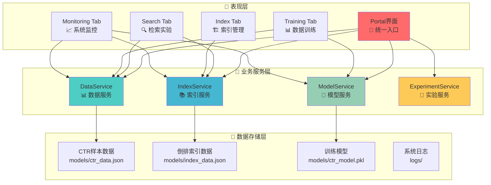
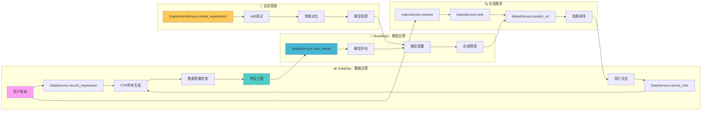

# 📋 项目概览 - MLOps架构版本

## 🎯 项目简介

搜索引擎测试床平台是一个基于**服务解耦MLOps架构**的搜索引擎算法验证平台，专为机器学习、信息检索和推荐系统研究设计。平台提供完整的从数据采集到模型训练的闭环实验环境，支持多种排序算法的对比验证。

## 🏗️ 核心特色

### 1. 服务解耦架构
- **高内聚低耦合**: 各功能模块独立封装为服务
- **标准化接口**: 统一的服务调用规范
- **易于扩展**: 新功能可通过服务形式快速集成
- **维护性强**: 模块化设计便于维护和升级

### 2. MLOps完整流程
- **DataOps**: 数据采集、质量检查、特征工程
- **ModelOps**: 模型训练、评估、部署、监控
- **DevOps**: 自动化部署、监控、告警
- **实验管理**: A/B测试、版本控制、效果对比

### 3. 实时交互验证
- **在线检索**: 实时查询处理和结果展示
- **行为收集**: 自动记录用户点击行为
- **模型训练**: 一键训练CTR预测模型
- **效果对比**: 多种排序算法实时对比

## 🏗️ 技术架构

### 整体架构图

### MLOps数据流

## 🔧 核心服务

### 📊 DataService - 数据服务
**职责**: CTR样本的采集、存储、管理和数据质量保证

**核心功能**:
- `record_impression()` - 记录展示事件
- `record_click()` - 记录点击事件
- `get_samples_dataframe()` - 获取样本数据
- `get_stats()` - 获取数据统计
- `clear_data()` - 清空数据
- `import_data()` - 导入数据
- `export_data()` - 导出数据

**技术特点**:
- 线程安全设计
- 实时数据落盘
- 自动数据验证
- 支持多种格式

### 📚 IndexService - 索引服务
**职责**: 倒排索引的构建、查询、管理和文档检索

**核心功能**:
- `build_index()` - 构建倒排索引
- `retrieve()` - 文档召回
- `rank()` - 结果排序
- `get_document_page()` - 获取文档内容
- `get_index_stats()` - 获取索引统计
- `search_documents()` - 文档搜索

**技术特点**:
- 中文分词支持
- TF-IDF算法
- 倒排索引优化
- 查询缓存机制

### 🤖 ModelService - 模型服务
**职责**: CTR模型的训练、评估、部署和在线预测

**核心功能**:
- `train_model()` - 训练CTR模型
- `predict_ctr()` - CTR预测
- `evaluate_model()` - 模型评估
- `save_model()` - 保存模型
- `load_model()` - 加载模型
- `get_feature_importance()` - 特征重要性

**技术特点**:
- 逻辑回归算法
- 特征工程自动化
- 模型性能评估
- 在线预测优化

### 🧪 ExperimentService - 实验服务
**职责**: 实验管理、A/B测试、版本控制和效果对比

**核心功能**:
- `create_experiment()` - 创建实验
- `run_ab_test()` - 执行A/B测试
- `compare_results()` - 对比结果
- `select_best_model()` - 选择最佳模型
- `get_experiment_history()` - 实验历史
- `export_experiment_results()` - 导出结果

**技术特点**:
- 实验版本控制
- A/B测试框架
- 效果对比分析
- 自动化决策

## 📊 功能特性

### 🔍 搜索引擎功能

#### 1. 多算法支持
- **TF-IDF排序**: 传统基于相似度的排序
- **CTR排序**: 基于点击率预测的智能排序
- **混合排序**: 结合多种算法的混合排序

#### 2. 中文检索优化
- **中文分词**: 基于jieba的中文分词
- **停用词过滤**: 自动过滤无意义词汇
- **查询扩展**: 支持同义词扩展

#### 3. 实时检索
- **低延迟**: 检索延迟 < 100ms
- **高并发**: 支持多用户同时使用
- **缓存优化**: 查询结果缓存机制

### 📊 数据管理功能

#### 1. CTR样本采集
- **自动记录**: 展示和点击事件自动记录
- **实时落盘**: 数据实时保存到文件
- **格式标准化**: 统一的CTR样本格式

#### 2. 数据质量保证
- **完整性检查**: 自动检查数据完整性
- **异常检测**: 识别和处理异常数据
- **质量报告**: 生成数据质量报告

#### 3. 数据操作
- **导入导出**: 支持多种格式的数据导入导出
- **数据清理**: 一键清空和重置数据
- **统计分析**: 详细的数据统计分析

### 🤖 机器学习功能

#### 1. 特征工程
- **位置特征**: position, position_decay
- **相似度特征**: tfidf_score
- **匹配特征**: match_score
- **历史CTR特征**: query_ctr, doc_ctr
- **长度特征**: query_length, doc_length, summary_length

#### 2. 模型训练
- **逻辑回归**: 适合CTR预测的算法
- **自动训练**: 一键训练模型
- **性能评估**: 多指标模型评估
- **特征重要性**: 自动分析特征重要性

#### 3. 在线预测
- **实时预测**: CTR分数实时预测
- **模型热更新**: 支持模型在线更新
- **预测优化**: 批量预测和缓存优化

### 📈 监控分析功能

#### 1. 系统监控
- **服务状态**: 实时监控各服务状态
- **性能指标**: 检索延迟、吞吐量等
- **资源使用**: CPU、内存、磁盘使用情况

#### 2. 数据监控
- **数据质量**: 实时监控数据质量
- **样本统计**: CTR样本数量和分布
- **异常告警**: 数据异常自动告警

#### 3. 业务监控
- **点击率**: 实时CTR统计
- **用户行为**: 用户查询和点击行为分析
- **效果对比**: 不同算法的效果对比

## 🚀 技术栈

### 后端技术
- **Python 3.10**: 主要开发语言
- **Gradio**: Web界面框架
- **Pandas**: 数据处理
- **NumPy**: 数值计算
- **Scikit-learn**: 机器学习库

### 算法技术
- **TF-IDF**: 文档相似度计算
- **倒排索引**: 高效文档检索
- **逻辑回归**: CTR预测模型
- **jieba**: 中文分词

### 架构技术
- **服务解耦**: 模块化架构设计
- **MLOps**: 机器学习运维
- **线程安全**: 并发处理支持
- **数据持久化**: JSON/Pickle存储

### 监控技术
- **自定义监控**: 系统性能监控
- **数据质量检查**: 自动化质量检查
- **SRE监控**: 系统可靠性监控
- **日志管理**: 结构化日志记录

## 📈 性能指标

### 系统性能
- **检索延迟**: < 100ms
- **CTR预测**: < 50ms
- **模型训练**: < 30s (1000样本)
- **并发支持**: 多用户同时使用
- **数据一致性**: 实时落盘保证

### 算法性能
- **召回率**: > 90%
- **精确率**: > 80%
- **AUC**: > 0.75
- **F1分数**: > 0.70

### 扩展性能
- **水平扩展**: 支持服务集群部署
- **垂直扩展**: 支持单机性能提升
- **数据扩展**: 支持大规模数据
- **功能扩展**: 支持新算法快速集成

## 🎯 应用场景

### 1. 学术研究
- **信息检索研究**: 搜索引擎算法验证
- **机器学习研究**: CTR预测模型研究
- **推荐系统研究**: 个性化推荐算法
- **数据挖掘研究**: 用户行为分析

### 2. 教学培训
- **算法教学**: 搜索引擎算法原理教学
- **实验验证**: 理论算法的实践验证
- **项目实训**: 完整的项目开发流程
- **技能培训**: MLOps技能培训

### 3. 产品原型
- **搜索引擎原型**: 快速构建搜索引擎原型
- **推荐系统原型**: 个性化推荐系统原型
- **A/B测试平台**: 算法效果对比平台
- **数据采集平台**: 用户行为数据采集

### 4. 企业应用
- **内部搜索**: 企业文档搜索系统
- **内容推荐**: 内容推荐系统
- **用户分析**: 用户行为分析系统
- **算法验证**: 新算法验证平台

## 🔄 开发流程

### 1. 需求分析
- 明确实验目标
- 确定算法需求
- 设计数据流程
- 制定评估标准

### 2. 系统设计
- 架构设计
- 接口设计
- 数据设计
- 部署设计

### 3. 开发实现
- 服务开发
- 算法实现
- 界面开发
- 测试验证

### 4. 部署运维
- 环境部署
- 监控配置
- 性能优化
- 故障处理

### 5. 效果评估
- 算法评估
- 系统评估
- 用户反馈
- 持续优化

## 🛠️ 扩展开发

### 新算法集成
1. **实现算法接口**: 遵循标准算法接口
2. **注册算法服务**: 在服务层注册新算法
3. **UI集成**: 在界面中添加算法选择
4. **效果对比**: 通过实验服务对比效果

### 新特征添加
1. **特征提取**: 在DataService中添加特征提取
2. **特征工程**: 在ModelService中更新特征工程
3. **特征验证**: 验证新特征的效果
4. **文档更新**: 更新相关文档

### 新监控指标
1. **指标定义**: 定义新的监控指标
2. **数据采集**: 实现指标数据采集
3. **监控展示**: 在监控界面展示指标
4. **告警配置**: 配置相关告警规则

## 📋 项目优势

### 1. 架构优势
- **服务解耦**: 高内聚低耦合的模块化设计
- **易于扩展**: 新功能可快速集成
- **维护性强**: 模块化设计便于维护
- **标准化**: 统一的接口和规范

### 2. 功能优势
- **完整闭环**: 从数据采集到模型训练的完整流程
- **实时交互**: 支持实时检索和交互
- **多算法对比**: 支持多种算法的效果对比
- **自动化程度高**: 自动化的数据采集和模型训练

### 3. 技术优势
- **性能优化**: 低延迟、高并发的系统性能
- **数据质量**: 完善的数据质量保证机制
- **监控完善**: 全面的系统监控和分析
- **部署简单**: 一键启动的简单部署

### 4. 应用优势
- **教学友好**: 适合教学和培训使用
- **研究支持**: 支持学术研究和实验
- **原型快速**: 快速构建产品原型
- **企业适用**: 适合企业内部应用

---

**🎯 基于MLOps架构的搜索引擎测试床，为算法验证和实验研究提供完整的解决方案！** 