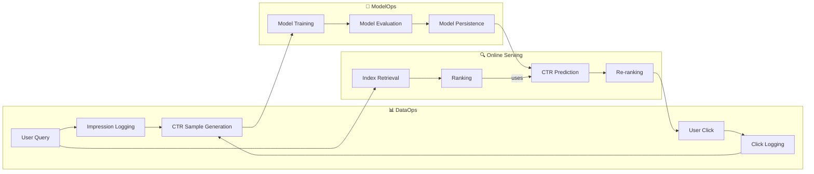

# 📋 Project Overview - MLOps Service Architecture

## 🎯 Introduction

The AI System Testbed is an advanced platform designed for experimenting with and validating algorithms for search, recommendation, and AI-driven retrieval. Built on a **service-oriented MLOps architecture**, it provides a complete, closed-loop environment from data collection to model training and online serving, now expanded with Retrieval-Augmented Generation (RAG), Knowledge Graph (KG), and Image Search capabilities.

## ✨ Core Features

### 1. Decoupled Service Architecture
- **High Cohesion, Low Coupling**: Core functions are encapsulated as independent services (`DataService`, `IndexService`, `ModelService`, `ImageService`).
- **Standardized Interfaces**: Services are accessed through a unified `ServiceManager`.
- **Extensible**: New functionalities can be integrated as new services or modules.

### 2. Full MLOps Lifecycle
- **DataOps**: CTR data collection, quality checks, and feature engineering.
- **ModelOps**: Model training, evaluation, persistence, and online prediction.
- **Unified UI**: A Gradio-based web interface for real-time interaction and monitoring.

### 3. Advanced AI Capabilities
- **Retrieval-Augmented Generation (RAG)**: Integrates with Ollama to provide intelligent, context-aware answers based on retrieved documents.
- **Knowledge Graph (KG)**: Uses LLMs for Named Entity Recognition (NER) to build a graph-based index, enabling semantic search.
- **Image Search**: Leverages the CLIP model for powerful text-to-image and image-to-image semantic search.

## 🏗️ Technical Architecture

### High-Level Architecture Diagram

```mermaid
graph TB
    subgraph "UI Layer (Gradio Tabs)"
        PORTAL[Portal UI]
        SEARCH_TAB[Search & Ranking]
        TRAINING_TAB[Model Training]
        INDEX_TAB[Index & KG Management]
        RAG_TAB[RAG Chat]
        IMAGE_TAB[Image Search]
    end

    subgraph "Application & Service Layer"
        SM[ServiceManager]
        DS[DataService]
        IS[IndexService]
        MS[ModelService]
        IMS[ImageService]
    end

    subgraph "Data Persistence Layer"
        CTR_DATA[CTR Data]
        INDEX_DATA[Inverted Index]
        KG_DATA[Knowledge Graph]
        MODEL_DATA[Trained Models]
        IMAGE_DATA[Image Files & Index]
    end

    subgraph "External Dependencies"
        OLLAMA[Ollama (LLM Inference)]
    end

    PORTAL --> SEARCH_TAB & TRAINING_TAB & INDEX_TAB & RAG_TAB & IMAGE_TAB
    
    SEARCH_TAB & TRAINING_TAB & IMAGE_TAB --> SM

    RAG_TAB --> IS & OLLAMA
    INDEX_TAB --> IS

    SM --> DS & IS & MS & IMS

    DS --> CTR_DATA
    IS --> INDEX_DATA & KG_DATA
    MS --> MODEL_DATA
    IMS --> IMAGE_DATA
```

### MLOps Data Flow for Search & Recommendation



## 🔧 Core Services

### 📊 DataService
**Responsibility**: Manages CTR sample collection, storage, and data quality.
- **Core Functions**: `record_impression()`, `record_click()`, `get_samples_dataframe()`, `get_stats()`.

### 📚 IndexService
**Responsibility**: Manages the inverted index, document retrieval, and Knowledge Graph operations.
- **Core Functions**: `build_index()`, `retrieve()`, `rank()`, `build_knowledge_graph()`, `query_entity_relations()`.

### 🤖 ModelService
**Responsibility**: Manages the training, evaluation, and online prediction of CTR models.
- **Core Functions**: `train_model()`, `predict_ctr()`, `save_model()`, `load_model()`.

### 🖼️ ImageService
**Responsibility**: Manages CLIP-based image indexing, storage, and multi-modal search.
- **Core Functions**: `add_image()`, `search_by_image()`, `search_by_text()`.

### 🤖 RAG & KG Module
**Responsibility**: Provides advanced, LLM-powered search and Q&A capabilities.
- **Components**: `RAGService`, `KGRetrievalService`, `NERService`.
- **Functionality**: Connects to Ollama for NER and generation, uses `IndexService` for retrieval.

## 🚀 Technology Stack

- **Backend**: Python 3.8+
- **UI Framework**: Gradio
- **Data Handling**: Pandas, NumPy
- **Machine Learning**: Scikit-learn, TensorFlow/Keras (for Wide & Deep model)
- **NLP/AI Models**:
    - **Search**: TF-IDF, Jieba (for Chinese word segmentation)
    - **Image Search**: OpenAI CLIP (via Hugging Face Transformers)
    - **RAG/KG**: Ollama-compatible models (e.g., Llama 3.1, Qwen 2.5)
- **Architecture**: Service-Oriented, MLOps principles
- **Data Persistence**: JSON, Pickle, NumPy files

---

**🎯 An MLOps-based testbed for comprehensive validation of classic and modern AI-driven search and retrieval algorithms.** 