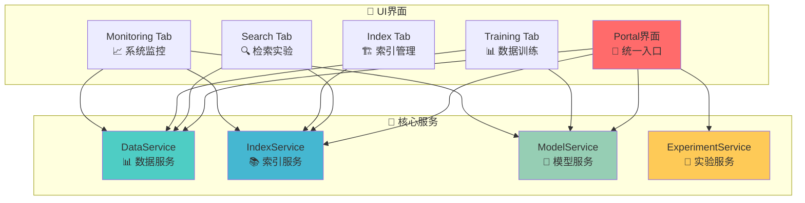
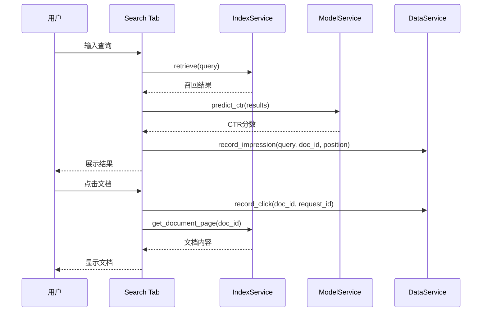
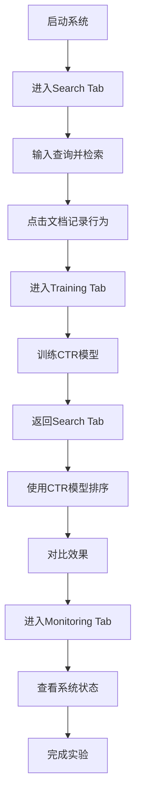

# 🚀 快速开始指南 - MLOps架构版本

## 🎯 系统概述

搜索引擎测试床平台采用**服务解耦的MLOps架构**，提供完整的搜索引擎算法验证环境。系统包含四个核心服务：数据服务、索引服务、模型服务和实验服务，支持从数据采集到模型训练的完整闭环。

## 🏗️ 架构预览



## 🚀 一键启动

### 方式一：使用启动脚本（推荐）

```bash
# 1. 进入项目目录
cd projects/search_engine

# 2. 一键启动（自动清理端口并启动）
./quick_start.sh
```

### 方式二：手动启动

```bash
# 1. 创建并激活conda环境
conda create -n searchenv python=3.10 -y
conda activate searchenv

# 2. 安装依赖
pip install -r requirements.txt

# 3. 启动系统
python start_system.py
```

### 方式三：指定Python路径启动

```bash
# 设置Python路径并启动
PYTHONPATH=src python start_system.py
```

## 🌐 访问界面

启动成功后，系统会自动分配端口（默认7860），访问地址：

```
http://localhost:7860
```

如果7860端口被占用，系统会自动尝试7861、7862等端口。

## 📊 核心功能使用

### 🔍 第一部分：在线召回排序

**位置**: Search Tab  
**功能**: 实时检索、排序、CTR预测

#### 使用步骤：

1. **输入查询**
   - 在"实验查询"框中输入测试查询（如"人工智能"、"机器学习"）
   - 选择排序算法：TF-IDF 或 CTR

2. **执行检索**
   - 点击"🔬 执行检索"按钮
   - 系统自动调用 IndexService 进行文档召回
   - 调用 ModelService 进行 CTR 预测
   - 通过 DataService 记录展示事件

3. **查看结果**
   - 检索结果以 DataFrame 形式展示
   - 包含文档ID、TF-IDF分数、文档长度、摘要
   - 点击任意行查看文档全文

4. **记录点击**
   - 点击文档行后，系统自动记录点击事件
   - 通过 DataService 更新 CTR 样本



### 📊 第二部分：数据回收训练

**位置**: Training Tab  
**功能**: CTR样本管理、模型训练、特征分析

#### 使用步骤：

1. **查看样本数据**
   - 进入 Training Tab 自动显示所有 CTR 样本
   - 包含完整的特征信息：查询、文档、位置、点击等

2. **训练CTR模型**
   - 点击"🚀 训练CTR模型"按钮
   - 系统调用 ModelService 进行特征工程和模型训练
   - 显示训练结果和特征重要性

3. **数据管理**
   - 清空数据：删除所有 CTR 样本
   - 导入数据：从文件导入样本
   - 导出数据：将样本导出为 JSON/CSV 格式

4. **统计分析**
   - 查看数据统计信息
   - 分析特征分布
   - 监控数据质量


### 🏗️ 第三部分：索引管理

**位置**: Index Tab  
**功能**: 索引构建、质量检查、统计分析

#### 使用步骤：

1. **查看索引状态**
   - 显示索引基本信息：文档数量、词汇表大小等
   - 查看索引构建时间和技术说明

2. **索引质量检查**
   - 验证索引完整性
   - 检查文档覆盖率
   - 分析索引性能

3. **索引重建**
   - 重新构建倒排索引
   - 更新 TF-IDF 分数
   - 优化索引结构

### 📈 第四部分：系统监控

**位置**: Monitoring Tab  
**功能**: 数据质量、性能监控、SRE告警

#### 使用步骤：

1. **数据质量检查**
   - 检查 CTR 样本完整性
   - 验证特征数据质量
   - 生成质量报告

2. **性能监控**
   - 监控检索延迟
   - 跟踪模型预测性能
   - 分析系统资源使用

3. **SRE监控**
   - 系统健康度检查
   - 异常情况告警
   - 服务状态监控

## 🔄 完整工作流程

### 标准实验流程



### 快速验证流程

1. **5分钟快速验证**
   - 启动系统 → 检索查询 → 点击文档 → 训练模型 → 对比效果

2. **完整实验流程**
   - 数据收集 → 特征工程 → 模型训练 → 效果评估 → 模型部署

3. **A/B测试流程**
   - 创建实验 → 运行测试 → 对比结果 → 选择最佳模型

## 🛠️ 常见操作

### 端口占用解决

```bash
# 自动清理端口并启动
./quick_start.sh

# 手动清理端口
lsof -ti:7860-7865 | xargs kill -9
```

### 数据重置

```bash
# 清空所有数据重新开始
# 在Training Tab中点击"清空数据"按钮
```

### 模型重新训练

```bash
# 在Training Tab中点击"训练CTR模型"
# 系统会自动使用最新的CTR样本重新训练
```

## 📋 配置说明

### 环境变量

- `GRADIO_SERVER_PORT`: Gradio服务端口（默认7860）
- `PYTHONPATH`: Python路径设置

### 数据文件

- `models/ctr_data.json`: CTR样本数据
- `models/index_data.json`: 倒排索引数据
- `models/ctr_model.pkl`: 训练好的CTR模型
- `logs/`: 系统日志目录

## 🚨 故障排除

### 启动失败

1. **端口占用**
   ```bash
   ./quick_start.sh  # 自动清理端口
   ```

2. **依赖问题**
   ```bash
   pip install -r requirements.txt
   ```

3. **Python路径**
   ```bash
   export PYTHONPATH=src
   python start_system.py
   ```

### 数据不显示

1. **确保有CTR样本**
   - 先进行检索操作生成样本
   - 点击"刷新样本数据"按钮

2. **检查服务状态**
   - 查看系统启动日志
   - 确认所有服务正常运行

### 模型训练失败

1. **样本数量不足**
   - 至少需要5条CTR样本
   - 进行更多检索和点击操作

2. **特征数据异常**
   - 检查数据质量
   - 重新收集样本数据

## 📈 性能指标

- **检索延迟**: < 100ms
- **CTR预测**: < 50ms
- **模型训练**: < 30s (1000样本)
- **并发支持**: 多用户同时使用
- **数据一致性**: 实时落盘保证

## 🎯 最佳实践

### 实验设计

1. **数据收集**
   - 使用多样化的查询词
   - 确保点击行为真实
   - 收集足够的样本数量

2. **模型训练**
   - 定期重新训练模型
   - 监控模型性能变化
   - 对比不同算法效果

3. **系统监控**
   - 定期检查数据质量
   - 监控系统性能指标
   - 及时处理异常情况

### 扩展开发

1. **添加新算法**
   - 在对应Service中实现
   - 在UI中添加选择
   - 通过ExperimentService对比

2. **添加新特征**
   - 在DataService中扩展
   - 更新特征工程逻辑
   - 验证特征重要性

3. **添加新监控**
   - 在Service中添加指标
   - 在Monitoring Tab中展示
   - 配置告警规则

---

**🎯 基于MLOps架构的搜索引擎测试床，支持快速验证和完整实验流程！** 