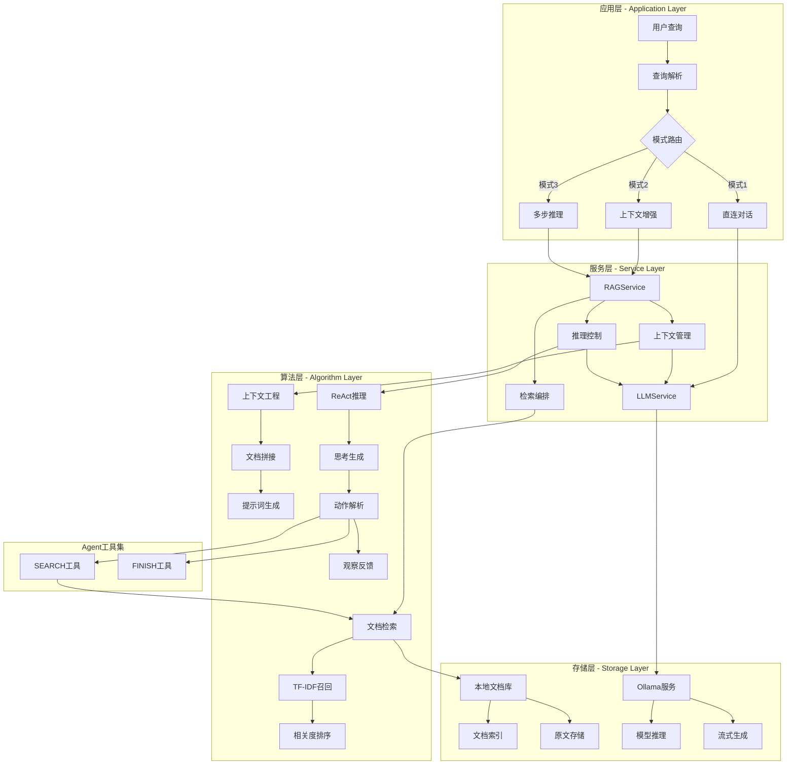

# 🤖 RAG检索增强生成系统技术指南 ([返回README](../README.md))

## 1. 系统概述

RAG检索增强生成系统通过从本地索引检索相关上下文来增强用户查询，并通过Ollama为LLM组装提示词。支持直接LLM对话、上下文增强回答和可选的多步推理（ReAct风格）。

## 2. 技术设计文档

### 2.1 背景与目标

#### 业务背景
传统的大语言模型虽然拥有丰富的通用知识，但在处理特定领域或最新信息时存在局限性。用户需要基于本地知识库进行准确、可信的问答服务，同时保持数据隐私和安全。

#### 设计目标
1. **功能目标**: 实现检索增强生成，支持本地知识库问答
2. **体验目标**: 多种交互模式，从简单对话到复杂推理
3. **可信目标**: 基于事实的回答，避免幻觉问题
4. **隐私目标**: 本地部署，数据不出门

#### 技术选型原则
- **开源优先**: 选择Ollama等开源LLM框架，避免供应商锁定
- **本地部署**: 所有数据处理在本地完成，保护隐私
- **模块解耦**: RAG各组件独立设计，支持灵活替换
- **渐进增强**: 从简单对话到复杂推理的能力阶梯

### 2.2 系统架构设计

#### 整体架构图
系统采用分层RAG架构，支持多种推理模式和本地化部署：



#### 架构设计要点
1. **模式解耦**: 三种运行模式独立设计，可单独优化
2. **服务分层**: RAG和LLM服务职责分离，便于维护
3. **本地优先**: 核心服务本地部署，外部依赖最小化
4. **工具化设计**: ReAct模式支持工具扩展

### 2.3 详细设计

#### 2.3.1 检索增强生成（RAG）设计

**问题定义**: 结合外部知识库，提升LLM回答的准确性和可信度

**技术路径**: 检索-增强-生成三阶段pipeline
- **检索阶段**: 基于查询从知识库中找到相关文档
- **增强阶段**: 将检索内容与查询组装成提示词
- **生成阶段**: LLM基于增强提示词生成回答

**核心组件: RAGService类**
```python
# 文件: src/search_engine/rag_tab/rag_service.py
class RAGService:
    """RAG服务引擎 - 三阶段处理pipeline"""
    
    def __init__(self, index_service, ollama_url: str = "http://localhost:11434"):
        # 依赖注入 - 复用现有检索能力
        self.index_service = index_service
        self.ollama_url = ollama_url
        self.default_model = "llama3.1:8b"
        
        # 提示词模板 - 结构化prompt设计
        self.context_template = self._load_prompt_templates()
    
    def rag_query(self, query: str, model: str = None, top_k: int = 5) -> RAGResponse:
        """RAG查询主流程"""
        # Stage 1: 检索相关文档
        relevant_docs = self.retrieve_documents(query, top_k)
        
        # Stage 2: 上下文增强
        enhanced_prompt = self.enhance_with_context(query, relevant_docs)
        
        # Stage 3: LLM生成
        response = self.generate_answer(enhanced_prompt, model)
        
        return RAGResponse(
            answer=response,
            retrieved_docs=relevant_docs,
            prompt_used=enhanced_prompt
        )
    
    def retrieve_documents(self, query: str, top_k: int = 5) -> List[Document]:
        """检索阶段 - 复用倒排索引"""
        # 调用现有IndexService，避免重复实现
        raw_results = self.index_service.search(query, top_k)
        
        # 结果结构化
        documents = []
        for doc_id, score, content in raw_results:
            documents.append(Document(
                id=doc_id,
                content=content,
                relevance_score=score
            ))
        
        return documents
    
    def enhance_with_context(self, query: str, documents: List[Document]) -> str:
        """增强阶段 - 上下文工程"""
        # 文档内容拼接
        context = "\n\n".join([
            f"文档{i+1}: {doc.content}" 
            for i, doc in enumerate(documents)
        ])
        
        # 应用提示词模板
        enhanced_prompt = self.context_template.format(
            context=context,
            query=query
        )
        
        return enhanced_prompt
```

**设计要点**:
1. **服务复用**: 基于现有IndexService，避免重复建设
2. **模板化**: 提示词模板化管理，支持动态调整
3. **可观测**: 每个阶段都保留中间结果，便于调试
4. **错误处理**: 各阶段独立错误处理，提升鲁棒性

#### 2.3.2 三种运行模式

**模式1: 直连LLM对话**
- **适用场景**: 通用知识问答、创意生成
- **技术实现**: 直接调用Ollama API，无检索环节
- **优势**: 响应速度快，支持开放域问答

**模式2: 上下文增强（RAG）**
- **适用场景**: 基于本地文档的专业问答
- **技术实现**: 检索 + 上下文组装 + 提示词工程
- **工作流程**:
  1. 使用IndexService检索TopK相关文档
  2. 将文档内容拼接为上下文字符串
  3. 使用模板生成结构化提示词
  4. 调用LLM生成基于上下文的回答

**模式3: 多步推理（ReAct）**
- **适用场景**: 复杂查询分解、多文档信息综合
- **技术实现**: 思考-行动-观察循环
- **Agent Actions**:
  - `SEARCH(query)`: 检索相关文档
  - `FINISH(answer)`: 输出最终答案

#### 2.3.3 提示词工程系统

**上下文模式提示词模板**:
```python
CONTEXT_PROMPT_TEMPLATE = """基于以下上下文信息，回答用户的问题。如果上下文中没有相关信息，请说明无法根据提供的信息回答。

上下文信息：
{context}

用户问题：{query}

请用中文回答："""
```

**ReAct模式提示词模板**:
```python
REACT_PROMPT_TEMPLATE = """你是一个智能助手，可以使用以下工具来回答问题：

工具：
- SEARCH(query): 搜索相关文档
- FINISH(answer): 给出最终答案

请使用以下格式：
Thought: 思考下一步应该做什么
Action: SEARCH(具体查询) 或 FINISH(最终答案)
Observation: 工具返回的结果

问题：{query}

开始推理："""
```

### 2.4 数据流设计

#### 2.4.1 RAG检索流程
1. **查询预处理**: 关键词提取、查询扩展
2. **相关文档检索**: 调用IndexService.search()
3. **上下文构建**: 文档内容拼接，长度截断
4. **提示词生成**: 模板填充，结构化prompt
5. **LLM生成**: Ollama API调用，流式返回

#### 2.4.2 ReAct推理流程
1. **初始化**: 设置推理状态，最大迭代次数
2. **思考阶段**: LLM生成思考内容
3. **行动阶段**: 解析Action类型和参数
4. **观察阶段**: 执行工具调用，获取结果
5. **循环判断**: 检查是否达到FINISH状态
6. **结果返回**: 输出推理轨迹和最终答案

### 2.5 Ollama集成设计

#### 2.5.1 连接管理
**健康检查机制**:
```python
def check_ollama_connection(self) -> Tuple[bool, str]:
    try:
        response = requests.get(f"{self.ollama_url}/api/tags", timeout=5)
        if response.status_code == 200:
            models = response.json().get("models", [])
            return True, f"✅ 可用模型: {[m['name'] for m in models]}"
    except requests.exceptions.RequestException as e:
        return False, f"❌ 连接失败: {str(e)}"
```

**模型管理**:
- 动态获取可用模型列表
- 支持模型切换和配置
- 实现请求超时和重试机制

#### 2.5.2 API调用优化
**流式生成**:
```python
def generate_stream(self, prompt: str, model: str):
    response = requests.post(
        f"{self.ollama_url}/api/generate",
        json={"model": model, "prompt": prompt, "stream": True},
        stream=True
    )
    for line in response.iter_lines():
        if line:
            yield json.loads(line)["response"]
```

### 2.6 性能与可靠性

#### 2.6.1 性能优化
- **检索优化**: 复用现有倒排索引，避免重复计算
- **上下文管理**: 智能截断，保留最相关内容
- **缓存策略**: 相同查询结果缓存，减少重复计算
- **并发控制**: 限制同时请求数，避免Ollama过载

#### 2.6.2 可靠性保障
**错误处理**:
- Ollama服务不可用时的降级策略
- 网络超时和重试机制
- 模型推理失败的fallback方案

**监控指标**:
- 查询响应时间分布
- Ollama服务可用性
- 检索召回率和准确率

### 2.7 扩展性设计

#### 2.7.1 模型扩展
- **多模型支持**: Llama、Mistral、CodeLlama等
- **模型路由**: 根据查询类型选择最适合的模型
- **模型微调**: 支持领域特化模型接入

#### 2.7.2 功能扩展
- **工具扩展**: ReAct框架支持新工具注册
- **上下文增强**: 支持图表、代码等多模态内容
- **对话记忆**: 实现多轮对话上下文管理

### 2.8 安全与合规

#### 2.8.1 数据安全
- **本地部署**: 所有数据处理在本地完成
- **隐私保护**: 不上传用户查询到外部服务
- **访问控制**: 文档权限管理和用户认证

#### 2.8.2 内容安全
- **输出过滤**: 敏感内容检测和过滤
- **提示词注入防护**: 防止恶意prompt攻击
- **生成内容监控**: 输出质量和安全性监控

## 3. 关键文件与目录结构

### 3.1 核心代码文件路径
```
src/search_engine/
├── rag_tab/                        # RAG功能模块
│   ├── __init__.py                # 模块初始化
│   ├── rag_service.py             # RAG服务核心实现★
│   └── rag_tab.py                 # UI界面和交互逻辑
├── index_tab/                      # 检索模块（RAG依赖）
│   ├── index_service.py           # 索引服务
│   └── offline_index.py           # TF-IDF检索实现
├── data_service.py                 # 数据服务★
├── portal.py                       # 主入口和界面编排
└── service_manager.py              # 服务管理器

data/                               # 数据存储目录
├── preloaded_documents.json       # 预加载知识库文档
└── openkg_triples.tsv             # 知识图谱数据

logs/                               # 日志目录
└── rag_query_logs.json            # RAG查询日志
```

### 3.2 关键入口函数
```python
# RAG服务主入口 - src/search_engine/rag_tab/rag_service.py
def rag_query(query: str, model: Optional[str] = None, max_docs: int = 3) -> str:
    """
    RAG查询完整流程：检索 → 增强 → 生成
    
    Args:
        query: 用户查询
        model: LLM模型名称  
        max_docs: 最大检索文档数
    
    Returns:
        str: 生成的回答
    """

def retrieve_documents(query: str, max_docs: int = 3) -> List[Dict[str, Any]]:
    """
    文档检索核心逻辑
    
    Args:
        query: 检索查询
        max_docs: 最大返回文档数
    
    Returns:
        List[Dict]: 检索到的文档列表，包含id、content、score
    """

def generate_answer(query: str, context: str, model: Optional[str] = None) -> str:
    """
    使用Ollama生成回答
    
    Args:
        query: 用户查询
        context: 检索到的上下文
        model: 使用的模型名称
        
    Returns:
        str: 生成的回答
    """

# RAG界面入口 - src/search_engine/rag_tab/rag_tab.py
def build_rag_tab(rag_service) -> None:
    """
    构建RAG界面
    
    Args:
        rag_service: RAGService实例
    """
```

### 3.3 提示词模板
```python
# 文件路径: src/search_engine/rag_tab/rag_service.py

# RAG模式提示词模板
CONTEXT_PROMPT_TEMPLATE = """基于以下上下文信息，回答用户的问题。如果上下文中没有相关信息，请说明无法根据提供的信息回答。

上下文信息：
{context}

用户问题：{query}

请用中文回答："""

# ReAct模式提示词模板  
REACT_PROMPT_TEMPLATE = """你是一个能够使用工具的AI助手。你可以通过以下步骤解决问题：

1. 思考(Thought): 分析问题需要什么信息
2. 行动(Action): 使用可用工具搜索信息
3. 观察(Observation): 查看工具返回的结果
4. 重复上述步骤直到有足够信息
5. 最终回答(Final Answer): 基于收集的信息给出答案

可用工具：
- SEARCH: 搜索相关文档，用法：SEARCH["搜索词"]

问题：{query}

让我们开始：

Thought: """
```

### 3.4 Ollama集成配置
```python
# Ollama服务配置
OLLAMA_CONFIG = {
    "url": "http://localhost:11434",       # Ollama服务地址
    "default_model": "llama3.2",          # 默认模型
    "timeout": 30,                        # 请求超时时间
    "generation_options": {               # 生成参数
        "temperature": 0.7,               # 随机性控制
        "top_p": 0.9,                     # 核心采样
        "top_k": 40,                      # Top-K采样
        "repeat_penalty": 1.1             # 重复惩罚
    }
}

# 支持的模型列表
SUPPORTED_MODELS = [
    "llama3.2",                           # 轻量级模型
    "llama3.1:8b",                        # 中等规模模型
    "qwen2.5",                            # 中文优化模型
    "deepseek-coder",                     # 代码专用模型
    "mistral"                             # 多语言模型
]
```

## 4. 核心功能与模式

UI通过复选框和控件提供三种模式：

### 模式1: 直连LLM对话（禁用上下文）
- 工作原理：将用户问题直接发送给LLM，无检索环节。
- 使用场景：通用知识问答或与本地文档无关的创意任务。

### 模式2: 上下文工程（启用检索）
- 工作原理：通过TF‑IDF检索TopK相关文档，组装上下文，并将其与用户问题一起添加到提示词中。LLM基于提供的上下文回答。
- 使用场景：基于本地索引文档的有根据回答。

### 模式3: 多步推理（ReAct风格）
- 工作原理：启用时，智能体使用两个动作进行迭代推理：`SEARCH`（查询索引）和`FINISH`（输出最终答案）。UI在跟踪框中显示智能体的步骤。
- 使用场景：需要分解或多文档综合的复杂查询。

## 5. 使用方法

### 前置条件
1. Ollama服务运行在`http://localhost:11434`（可在代码中配置）。
2. 在Ollama中拉取所需模型（如`ollama pull llama3.1`）。

### 操作步骤
1. 导航到"🤖 第三部分：RAG检索增强"标签页。
2. 点击"检查Ollama连接"验证连通性并刷新模型列表。
3. 输入您的问题。
4. 选择选项：
   - 保持"启用上下文工程"勾选以进行检索增强回答。
   - 如需要ReAct模式，启用"多步推理"。
   - 调整TopK并选择模型。
5. 点击"🚀 执行查询"。

## 6. 理解输出

- 生成回答：LLM的最终答案。
- 处理信息：耗时、使用的模型、检索文档数量。
- 提示词/推理轨迹：
  - 直连或上下文模式显示发送给LLM的确切提示词。
  - 多步模式显示完整的思维链轨迹（思考/动作/观察）。
- 检索文档：文档ID和TF‑IDF分数表格；单独框显示组装的上下文。

## 7. 技术实现

### 上下文流程（启用检索）
1. `IndexService`检索相关文档。
2. 将文档连接成上下文字符串。
3. 提示词模板嵌入上下文和原始查询。
4. 提示词发送到Ollama生成API。

### 提示词模板（上下文模式）
```
基于以下上下文信息，回答用户的问题。如果上下文中没有相关信息，请说明无法根据提供的信息回答。

上下文信息：
{context}

用户问题：{query}

请用中文回答：
```

### ReAct推理流程
1. 给智能体提供工具描述（`SEARCH`，`FINISH`）。
2. LLM产生思考和动作。
3. 执行`SEARCH("...")`时，系统查询索引并返回观察结果。
4. 循环继续直到`FINISH("最终答案")`。

这使得在产生答案之前能够进行逐步推理和证据收集。