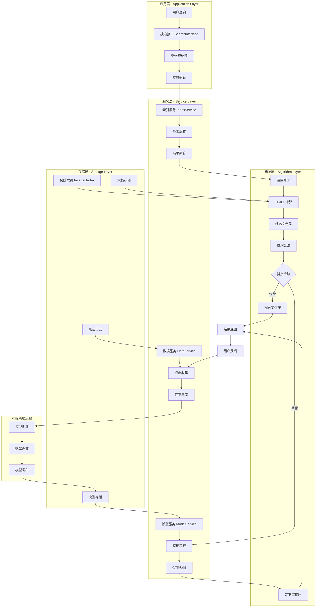
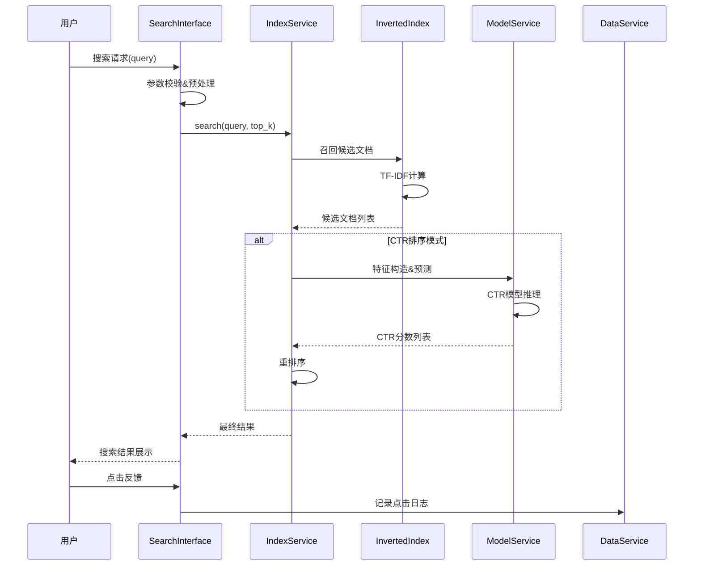
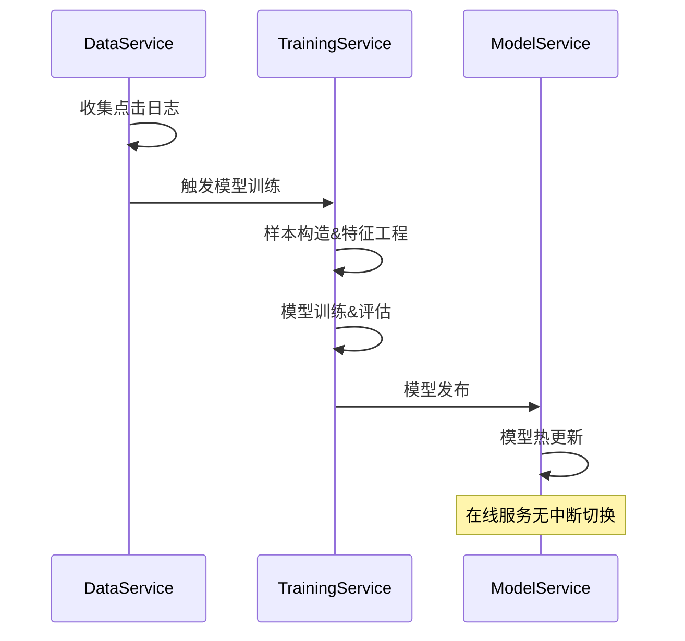

# 🔍 搜索推荐系统技术指南 ([返回README](../README.md))

## 1. 系统概述

本指南介绍搜索推荐系统的完整技术实现：基于TF-IDF的倒排索引文本检索，结合CTR模型的重排序功能。CTR模型训练在"📊 数据收集与训练"标签页中完成。

## 2. 技术设计文档

### 2.1 背景与目标

#### 业务背景
现代信息检索系统需要在海量文档中快速找到用户所需信息，同时提供个性化的结果排序。传统的关键词匹配已无法满足用户的复杂需求，需要结合机器学习技术提升检索效果。

#### 设计目标
1. **性能目标**: 支持快速检索响应，具备良好的并发处理能力
2. **效果目标**: 提升用户点击率(CTR)和满意度
3. **可维护性**: 模块化设计，支持算法快速迭代
4. **可扩展性**: 支持数据量和并发的线性扩展

#### 技术选型原则
- **成熟稳定**: 选择久经考验的开源技术栈
- **性能优先**: 内存计算优于磁盘IO
- **可解释性**: 排序算法具备业务可解释性
- **渐进升级**: 支持从传统检索到智能推荐的平滑升级

### 2.2 系统架构设计

#### 整体架构图
本系统采用分层架构设计，从下至上分为存储层、索引层、服务层和应用层：



#### 架构分层说明
1. **应用层**: 处理用户请求，参数校验，接口适配
2. **服务层**: 业务逻辑编排，各组件协调
3. **算法层**: 核心检索和排序算法实现
4. **存储层**: 数据持久化，索引存储

### 2.3 详细设计

#### 2.3.1 召回阶段设计

**问题定义**: 从海量文档库中快速筛选出与查询相关的候选文档集合

**算法选择**: TF-IDF + 倒排索引
- **理由**: 成熟稳定，可解释性强，支持中文分词
- **替代方案**: 向量检索(成本高)，ES全文检索(依赖重)

**核心组件: InvertedIndex类**
```python
# 文件路径: src/search_engine/index_tab/offline_index.py
class InvertedIndex:
    """倒排索引实现 - 内存优化版本"""
    
    def __init__(self):
        # 核心数据结构
        self.index = defaultdict(set)          # 词项 -> 文档ID集合
        self.doc_lengths = {}                  # 文档ID -> 文档长度  
        self.documents = {}                    # 文档ID -> 文档内容
        self.term_freq = defaultdict(dict)     # 词项 -> {文档ID: 词频}
        self.doc_freq = defaultdict(int)       # 词项 -> 文档频率
        
        # 中文停用词表
        self.stop_words = {
            '的', '了', '在', '是', '我', '有', '和', '就', '不', '人', 
            '都', '一', '一个', '上', '也', '很', '到', '说', '要', '去', 
            '你', '会', '着', '没有', '看', '好', '自己', '这'
        }
    
    def preprocess_text(self, text: str) -> List[str]:
        """文本预处理 - 中文分词核心实现"""
        # 使用jieba进行中文分词
        words = jieba.lcut(text.lower())
        
        # 过滤停用词和短词
        words = [word for word in words if len(word) > 1 and word not in self.stop_words]
        
        return words
    
    def add_document(self, doc_id: str, content: str):
        """添加文档到索引 - 倒排索引构建"""
        # 保存原始文档
        self.documents[doc_id] = content
        
        # 预处理文本
        words = self.preprocess_text(content)
        
        # 计算文档长度
        self.doc_lengths[doc_id] = len(words)
        
        # 统计词频
        word_freq = Counter(words)
        
        # 更新倒排索引
        for word, freq in word_freq.items():
            self.index[word].add(doc_id)
            self.term_freq[word][doc_id] = freq
        
        # 更新文档频率
        for word in word_freq:
            self.doc_freq[word] = len(self.index[word])
    
    def search(self, query: str, top_k: int) -> List[Tuple[str, float, str]]:
        """TF-IDF检索核心逻辑"""
        # 1. 查询预处理
        query_terms = self.preprocess_text(query)
        if not query_terms:
            return []
        
        # 2. 候选文档召回
        candidates = set()
        for term in query_terms:
            if term in self.index:
                candidates.update(self.index[term])
        
        # 3. TF-IDF相关度计算
        scores = {}
        total_docs = len(self.documents)
        
        for doc_id in candidates:
            score = 0.0
            doc_length = self.doc_lengths[doc_id]
            
            for term in query_terms:
                if term in self.term_freq and doc_id in self.term_freq[term]:
                    # TF计算
                    tf = self.term_freq[term][doc_id] / doc_length
                    
                    # IDF计算
                    df = self.doc_freq[term]
                    idf = math.log(total_docs / df) if df > 0 else 0
                    
                    # TF-IDF分数
                    score += tf * idf
            
            if score > 0:
                scores[doc_id] = score
        
        # 4. Top-K排序返回
        sorted_results = sorted(scores.items(), key=lambda x: x[1], reverse=True)[:top_k]
        
        # 添加文档摘要
        results = []
        for doc_id, score in sorted_results:
            summary = self.documents[doc_id][:200] + "..." if len(self.documents[doc_id]) > 200 else self.documents[doc_id]
            results.append((doc_id, score, summary))
        
        return results
```

**性能优化策略**:
1. **内存布局优化**: 使用set进行文档ID存储，减少内存碎片
2. **查询优化**: 短路求值，优先处理低频词
3. **缓存策略**: 热门查询结果缓存

**可扩展性考虑**:
- **水平扩展**: 支持按词项哈希分片
- **增量更新**: 支持文档的动态增删
- **压缩存储**: 支持索引压缩(可选)

#### 2.3.2 排序阶段设计

**问题定义**: 对召回的候选文档进行精准排序，提升用户点击率

**技术路径**: 传统排序 → 机器学习排序
- **阶段1**: TF-IDF相关度排序(已实现)
- **阶段2**: CTR模型重排序(当前实现)
- **阶段3**: 深度学习排序(未来规划)

**核心组件: CTRModel类**
```python
# 文件路径: src/search_engine/training_tab/ctr_model.py
class CTRModel:
    """CTR预测模型 - 二分类问题"""
    
    def __init__(self):
        self.model = None              # 逻辑回归模型
        self.vectorizer = None         # 文本向量化器
        self.scaler = None             # 特征标准化器
        self.is_trained = False        # 训练状态标志
    
    def extract_features(self, ctr_data: List[Dict[str, Any]]) -> Tuple[np.ndarray, np.ndarray]:
        """从CTR数据中提取7维特征向量"""
        if not ctr_data:
            return np.array([]), np.array([])
        
        # 转换为DataFrame便于处理
        df = pd.DataFrame(ctr_data)
        
        # 1. 位置特征（绝对位置）- 位置偏差是CTR的重要因子
        position_features = df['position'].values.reshape(-1, 1)
        
        # 2. 文档长度特征 - 长文档可能更权威
        doc_lengths = df['summary'].str.len().values.reshape(-1, 1)
        
        # 3. 查询长度特征 - 长查询通常更具体
        query_lengths = df['query'].str.len().values.reshape(-1, 1)
        
        # 4. 摘要长度特征
        summary_lengths = df['summary'].str.len().values.reshape(-1, 1)
        
        # 5. 查询词在摘要中的匹配度 - 核心相关性特征
        match_scores = []
        for _, row in df.iterrows():
            query_words = set(jieba.lcut(row['query']))
            summary_words = set(jieba.lcut(row['summary']))
            if len(query_words) > 0:
                match_ratio = len(query_words.intersection(summary_words)) / len(query_words)
            else:
                match_ratio = 0
            match_scores.append(match_ratio)
        match_scores = np.array(match_scores).reshape(-1, 1)
        
        # 6-7. 历史点击率特征（避免数据泄露）
        df_sorted = df.sort_values('timestamp').reset_index(drop=True)
        query_ctr_features = []
        doc_ctr_features = []
        
        for idx, row in df_sorted.iterrows():
            # 查询历史CTR - 只使用当前样本之前的数据
            query = row['query']
            query_history = df_sorted.loc[:idx-1]  # 不包括当前样本
            query_history_filtered = query_history[query_history['query'] == query]
            
            if len(query_history_filtered) > 0:
                query_ctr = query_history_filtered['clicked'].mean()
            else:
                query_ctr = 0.1  # 冷启动默认值
            query_ctr_features.append(query_ctr)
            
            # 文档历史CTR
            doc_id = row['doc_id']
            doc_history = df_sorted.loc[:idx-1]
            doc_history_filtered = doc_history[doc_history['doc_id'] == doc_id]
            
            if len(doc_history_filtered) > 0:
                doc_ctr = doc_history_filtered['clicked'].mean()
            else:
                doc_ctr = 0.1  # 冷启动默认值
            doc_ctr_features.append(doc_ctr)
        
        # 按原始顺序重新排列
        original_order = df.index
        query_ctr_features = [query_ctr_features[i] for i in original_order]
        doc_ctr_features = [doc_ctr_features[i] for i in original_order]
        
        query_ctr_features = np.array(query_ctr_features).reshape(-1, 1)
        doc_ctr_features = np.array(doc_ctr_features).reshape(-1, 1)
        
        # 组合所有特征为7维向量
        X = np.column_stack([
            position_features,      # 第1维：位置
            doc_lengths,           # 第2维：文档长度
            query_lengths,         # 第3维：查询长度  
            summary_lengths,       # 第4维：摘要长度
            match_scores,          # 第5维：匹配度
            query_ctr_features,    # 第6维：查询历史CTR
            doc_ctr_features       # 第7维：文档历史CTR
        ])
        
        # 提取标签
        y = df['clicked'].values
        
        return X, y
    
    def train(self, training_data: List[Dict]) -> Dict[str, float]:
        """模型训练完整流程"""
        # 1. 特征提取
        X, y = self.extract_features(training_data)
        if len(X) == 0:
            return {"error": "无训练数据"}
        
        # 2. 数据分割
        X_train, X_test, y_train, y_test = train_test_split(
            X, y, test_size=0.2, random_state=42, stratify=y
        )
        
        # 3. 特征标准化
        self.scaler = StandardScaler()
        X_train_scaled = self.scaler.fit_transform(X_train)
        X_test_scaled = self.scaler.transform(X_test)
        
        # 4. 模型训练
        self.model = LogisticRegression(
            random_state=42,
            class_weight='balanced',  # 处理类别不平衡
            max_iter=1000
        )
        self.model.fit(X_train_scaled, y_train)
        
        # 5. 模型评估
        y_pred = self.model.predict(X_test_scaled)
        y_pred_proba = self.model.predict_proba(X_test_scaled)[:, 1]
        
        from sklearn.metrics import accuracy_score, precision_score, recall_score, roc_auc_score
        
        metrics = {
            "accuracy": accuracy_score(y_test, y_pred),
            "precision": precision_score(y_test, y_pred),
            "recall": recall_score(y_test, y_pred),
            "auc": roc_auc_score(y_test, y_pred_proba),
            "train_samples": len(X_train),
            "test_samples": len(X_test)
        }
        
        self.is_trained = True
        return metrics
    
    def predict_ctr(self, query: str, doc_id: str, position: int, 
                   tfidf_score: float, summary: str) -> float:
        """预测单个样本的CTR概率"""
        if not self.is_trained:
            return 0.5  # 未训练时返回中性概率
        
        # 构造特征向量
        features = np.array([[
            position,                    # 位置特征
            len(summary),               # 文档长度
            len(query),                 # 查询长度
            len(summary),               # 摘要长度
            self._calculate_match_score(query, summary),  # 匹配度
            0.1,                        # 查询历史CTR（简化）
            0.1                         # 文档历史CTR（简化）
        ]])
        
        # 标准化并预测
        features_scaled = self.scaler.transform(features)
        ctr_prob = self.model.predict_proba(features_scaled)[0][1]
        
        return float(ctr_prob)
    
    def _calculate_match_score(self, query: str, summary: str) -> float:
        """计算查询和摘要的匹配度"""
        query_words = set(jieba.lcut(query))
        summary_words = set(jieba.lcut(summary))
        
        if len(query_words) == 0:
            return 0.0
        
        return len(query_words.intersection(summary_words)) / len(query_words)
```

**特征设计原则**:
1. **避免数据泄露**: 历史特征只使用时间窗口前的数据
2. **特征正交性**: 确保特征间相关性较低
3. **业务可解释**: 每个特征都有明确的业务含义

**模型选择考虑**:
- **LR优势**: 训练快速，可解释性强，适合冷启动
- **Wide&Deep**: 支持特征交互，效果更优(已实现)
- **深度模型**: DIN/DSSM等(未来扩展)

#### 2.3.3 服务编排设计

**问题定义**: 协调各个组件，提供统一的搜索服务接口

**核心组件: IndexService类**
```python
# 文件: src/search_engine/index_service.py
class IndexService:
    """搜索服务编排器"""
    
    def search(self, query: str, top_k: int = 10) -> List[Tuple[str, float, str]]:
        """统一搜索接口"""
        # 1. 召回阶段 - 获取候选文档
        candidates = self.inverted_index.search(query, top_k * 2)
        
        # 2. 排序阶段 - CTR重排序  
        if self.ctr_enabled:
            return self.rank_with_ctr(query, candidates, top_k)
        else:
            return candidates[:top_k]
    
    def rank_with_ctr(self, query: str, candidates: List, top_k: int):
        """CTR重排序逻辑"""
        # 特征构造 → 模型预测 → 重排序
        features = self._build_features(query, candidates)
        ctr_scores = self.model_service.predict_batch(features)
        return self._rerank_by_ctr(candidates, ctr_scores, top_k)
```

**关键设计决策**:
1. **接口统一**: 对外暴露简单的search()方法
2. **策略可配**: 支持TF-IDF/CTR两种排序策略切换
3. **性能兼顾**: 召回数量是排序数量的2倍，平衡效果与性能

### 2.4 核心流程设计

#### 2.4.1 在线检索流程


#### 2.4.2 离线训练流程  


**流程优化要点**:
1. **异步解耦**: 在线检索与离线训练完全分离
2. **热更新**: 支持模型无缝切换，保证服务可用性
3. **监控闭环**: 检索效果实时监控，触发模型迭代

### 2.5 技术挑战与解决方案

#### 2.5.1 性能挑战
| 挑战 | 解决方案 | 实现细节 |
|------|----------|----------|
| 检索延迟过高 | 内存索引 + 查询优化 | 使用set数据结构，短路求值 |
| 内存占用过大 | 索引压缩 + 分片策略 | 支持按词项哈希分片 |
| CTR训练数据稀疏 | 负采样 + 特征工程 | 负采样策略，历史特征 |
| 冷启动问题 | 降级策略 | 新文档使用TF-IDF排序 |

#### 2.5.2 可扩展性设计
**水平扩展方案**:
```python
# 索引分片策略
def get_shard_id(term: str, shard_num: int) -> int:
    return hash(term) % shard_num

# 分布式检索协调
class DistributedIndexService:
    def search(self, query: str) -> List:
        # 1. 查询分发到各分片
        shard_results = self.query_all_shards(query)
        # 2. 结果合并和重排序
        return self.merge_and_rank(shard_results)
```

**垂直扩展方案**:
- **内存管理**: LRU缓存 + 分层存储
- **计算优化**: 多线程并行 + SIMD向量化
- **模型压缩**: 量化 + 蒸馏

### 2.6 监控与运维体系

#### 2.6.1 指标体系
```python
# 核心监控指标
class SearchMetrics:
    # 业务指标  
    ctr: float           # 点击率
    mrr: float           # 平均倒数排名
    ndcg_at_10: float    # 归一化折损累积增益
    
    # 系统指标
    avg_latency: float   # 平均延迟
    p95_latency: float   # P95延迟
    qps: float           # 每秒查询数
    
    # 数据指标
    index_coverage: float    # 索引覆盖率
    click_data_quality: float # 点击数据质量
```

#### 2.6.2 容灾方案
| 故障类型 | 检测方式 | 处理策略 | 恢复方式 |
|----------|----------|----------|----------|
| 索引损坏 | 查询异常检测 | 自动重建 + 备份恢复 | 快速恢复 |
| 模型失效 | 预测结果异常 | 降级到TF-IDF | 实时降级 |
| 内存不足 | 系统监控 | LRU清理 + 限流 | 自动处理 |
| 服务过载 | QPS监控 | 熔断 + 降级 | 实时响应 |

### 2.7 实施计划与里程碑

#### 2.7.1 开发阶段
- **Phase 1**: 基础索引 + TF-IDF检索 ✅ (已完成)
- **Phase 2**: CTR模型训练 + 重排序 ✅ (已完成)  
- **Phase 3**: 性能优化 + 监控体系 🚧 (进行中)
- **Phase 4**: 分布式扩展 + 深度学习 📋 (规划中)

#### 2.7.2 团队分工
- **算法工程师**: CTR模型优化，新算法调研
- **后端工程师**: 服务性能优化，分布式架构
- **数据工程师**: 特征工程，数据质量监控
- **运维工程师**: 监控体系，容灾方案

#### 2.7.3 风险控制
- **技术风险**: 模型效果不达预期 → A/B测试验证
- **性能风险**: 系统负载过高 → 压测 + 限流
- **数据风险**: 训练数据质量差 → 数据清洗 + 校验

## 3. 快速开始

1) 系统启动后，进入"🔍 在线检索与排序"。
- 输入查询词（如：人工智能、机器学习、深度学习）。
- 选择排序模式：TF‑IDF 或 CTR（CTR需要先在"📊 数据收集与训练"标签页训练模型）。
- 点击"🔬 执行搜索"。

2) 查看结果并记录交互行为。
- 表格显示文档ID、TF‑IDF分数、额外信息（CTR分数或文档长度）和摘要。
- 点击行查看全文；点击行为将被记录用于CTR训练。

3) 训练CTR模型（可选）。
- 进入"📊 数据收集与训练"查看样本和统计信息。
- 点击"训练CTR模型"；然后返回搜索标签页切换到CTR排序进行对比。

注意：如果存在预加载文档，它们位于`data/preloaded_documents.json`并在启动时自动加载。UI不支持手动添加/删除文档。

## 4. 关键文件与目录结构

### 4.1 核心代码文件路径
```
src/search_engine/
├── search_tab/                     # 搜索功能模块
│   ├── search_engine.py           # 搜索引擎核心实现
│   ├── search_interface.py        # 搜索接口定义
│   └── search_tab.py              # UI界面和交互逻辑
├── index_tab/                      # 索引功能模块  
│   ├── offline_index.py           # 倒排索引核心实现★
│   ├── index_service.py           # 索引服务编排
│   └── index_tab.py               # 索引管理UI
├── training_tab/                   # 训练功能模块
│   ├── ctr_model.py               # CTR模型实现★
│   ├── ctr_config.py              # 模型配置
│   ├── ctr_wide_deep_model.py     # Wide&Deep架构
│   └── training_tab.py            # 训练界面
├── data_service.py                 # 数据服务★
├── model_service.py                # 模型服务★
└── service_manager.py              # 服务管理器
```

### 4.2 数据存储结构
```
models/                             # 模型存储目录
├── ctr_model.pkl                  # CTR模型文件
├── index_data.json                # 索引元数据
└── training_data/                 # 训练数据目录
    ├── click_samples.json         # 点击样本
    └── feature_cache/             # 特征缓存

data/                              # 原始数据目录
├── preloaded_documents.json      # 预加载文档
└── openkg_triples.tsv            # 知识图谱数据

logs/                              # 日志目录
└── data_quality_report.json      # 数据质量报告
```

### 4.3 关键入口函数
```python
# 主要搜索入口 - src/search_engine/search_tab/search_tab.py
def perform_search(index_service, data_service, query: str, 
                  sort_mode: str = "ctr", model_type: str = "logistic_regression"):
    """
    执行搜索的主入口函数
    
    Args:
        index_service: 索引服务实例
        data_service: 数据服务实例  
        query: 用户查询
        sort_mode: 排序模式 "tfidf" 或 "ctr"
        model_type: 模型类型 "logistic_regression" 或 "wide_and_deep"
    
    Returns:
        搜索结果列表
    """
    
# 索引构建入口 - src/search_engine/index_tab/index_service.py  
def build_index_from_documents(documents: List[Dict]) -> bool:
    """
    从文档列表构建倒排索引
    
    Args:
        documents: 文档列表，格式 [{"id": "doc1", "content": "内容"}]
    
    Returns:
        构建是否成功
    """

# CTR训练入口 - src/search_engine/training_tab/ctr_model.py
def train_ctr_model(click_data: List[Dict]) -> Dict[str, float]:
    """
    训练CTR模型的主入口
    
    Args:
        click_data: 点击数据，包含query, doc_id, clicked等字段
    
    Returns:
        训练指标字典
    """
```

### 4.4 配置文件
```python
# CTR模型配置 - src/search_engine/training_tab/ctr_config.py
class CTRFeatureConfig:
    """CTR特征配置"""
    POSITION_WEIGHT = 1.0          # 位置特征权重
    CONTENT_WEIGHT = 0.8           # 内容特征权重  
    HISTORY_WEIGHT = 1.2           # 历史特征权重
    
class CTRTrainingConfig:
    """CTR训练配置"""
    TRAIN_TEST_SPLIT = 0.2         # 测试集比例
    RANDOM_STATE = 42              # 随机种子
    MAX_ITER = 1000                # 最大迭代次数
    CLASS_WEIGHT = 'balanced'      # 类别权重平衡
```

## 5. 常见问题

- 无搜索结果：确保索引中有预加载文档；使用与数据集主题相关的查询词。
- CTR分数为空：在训练标签页收集样本并训练模型，然后切换到CTR排序。
- 端口冲突：使用`quick_start.sh`或更改端口并重启。

