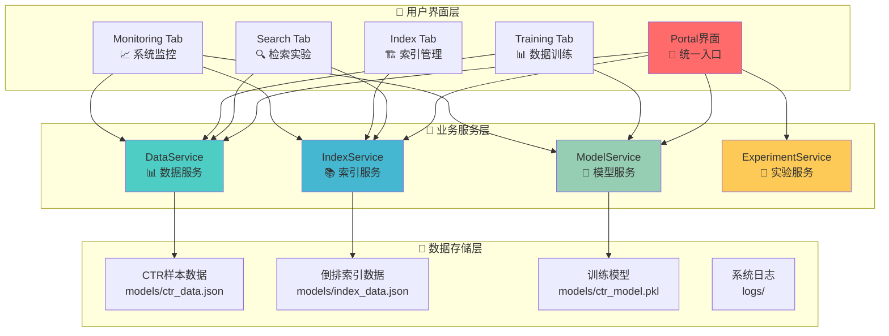
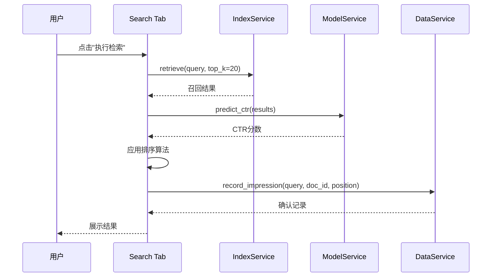
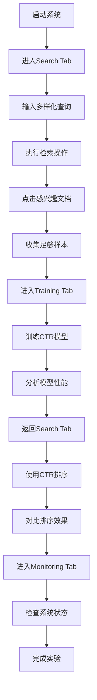

# 📖 使用指南 - MLOps架构版本

## 🎯 系统概述

搜索引擎测试床平台基于**服务解耦的MLOps架构**，提供完整的搜索引擎算法验证环境。本指南详细介绍系统的使用方法、最佳实践和高级功能。

## 🏗️ 架构理解

### 服务架构概览



## 🔍 第一部分：在线召回排序

### 功能说明

Search Tab 提供实时检索、排序和CTR预测功能，是系统的核心实验模块。

### 详细使用步骤

#### 1. 查询输入

**推荐测试查询**：
- 人工智能
- 机器学习
- 深度学习
- 神经网络
- 自然语言处理
- 计算机视觉
- 数据挖掘
- 推荐系统

**排序算法选择**：
- **TF-IDF**: 基于词频-逆文档频率的传统排序
- **CTR**: 基于点击率预测的智能排序

#### 2. 检索执行

点击"🔬 执行检索"后，系统自动执行以下流程：



#### 3. 结果解读

**检索结果包含**：
- **文档ID**: 唯一标识符
- **TF-IDF分数**: 相似度分数（0-1）
- **文档长度**: 摘要字符数
- **摘要**: 包含查询词的文档摘要

**CTR样本包含**：
- **查询**: 用户输入的查询词
- **文档ID**: 展示的文档
- **位置**: 在结果中的排名
- **点击**: 是否被点击（0/1）
- **匹配分数**: 查询词匹配度
- **历史CTR**: 查询和文档的历史点击率

#### 4. 文档点击

点击任意结果行，系统自动：
1. 记录点击事件到 DataService
2. 调用 IndexService 获取完整文档内容
3. 更新 CTR 样本的 clicked 字段
4. 刷新样本数据展示

### 高级功能

#### 排序算法对比

1. **TF-IDF排序**
   - 基于词频-逆文档频率
   - 不考虑用户行为
   - 适合冷启动场景

2. **CTR排序**
   - 基于预测的点击率
   - 考虑历史用户行为
   - 需要足够的训练数据

#### 实时统计

点击"📊 搜索统计"查看：
- 检索性能指标
- 系统运行状态
- 服务健康度

## 📊 第二部分：数据回收训练

### 功能说明

Training Tab 提供CTR样本管理、模型训练和特征分析功能，是MLOps流程的核心。

### 详细使用步骤

#### 1. 样本数据查看

**自动显示**：进入Tab后自动显示所有CTR样本

**样本字段说明**：
- **query**: 查询词
- **doc_id**: 文档ID
- **position**: 展示位置
- **score**: TF-IDF分数
- **summary**: 文档摘要
- **request_id**: 请求ID
- **timestamp**: 时间戳
- **clicked**: 是否点击
- **match_score**: 匹配分数
- **query_ctr**: 查询历史CTR
- **doc_ctr**: 文档历史CTR
- **doc_length**: 文档长度
- **query_length**: 查询长度
- **summary_length**: 摘要长度
- **position_decay**: 位置衰减

#### 2. 模型训练

**训练流程**：


**特征工程**：
1. **位置特征**: position, position_decay
2. **相似度特征**: tfidf_score
3. **匹配特征**: match_score
4. **历史CTR特征**: query_ctr, doc_ctr
5. **长度特征**: query_length, doc_length, summary_length

**训练要求**：
- 最少5条CTR样本
- 包含点击和非点击样本
- 特征数据完整

#### 3. 数据管理

**清空数据**：
- 删除所有CTR样本
- 重置模型状态
- 重新开始实验

**导入数据**：
- 支持JSON格式
- 自动验证数据格式
- 合并到现有样本

**导出数据**：
- JSON格式导出
- CSV格式导出
- 包含完整特征信息

#### 4. 统计分析

**数据统计**：
- 样本总数
- 点击率统计
- 特征分布分析
- 数据质量报告

**模型统计**：
- 训练样本数
- 测试样本数
- 模型性能指标
- 特征重要性排名

### 高级功能

#### 特征重要性分析

训练完成后显示特征重要性：

1. **position_decay** (0.3568): 位置衰减特征
2. **position** (0.2233): 绝对位置特征
3. **tfidf_score** (0.2107): 相似度分数
4. **match_score** (0.1835): 匹配分数
5. **doc_ctr** (0.1562): 文档历史CTR
6. **query_length** (0.1498): 查询长度
7. **doc_length** (0.1201): 文档长度
8. **summary_length** (0.1201): 摘要长度
9. **query_ctr** (0.0467): 查询历史CTR

#### 模型性能评估

**评估指标**：
- **AUC**: 曲线下面积
- **精确率**: 预测点击中的实际点击比例
- **召回率**: 实际点击中被预测到的比例
- **F1分数**: 精确率和召回率的调和平均

## 🏗️ 第三部分：索引管理

### 功能说明

Index Tab 提供倒排索引的构建、管理和质量检查功能。

### 详细使用步骤

#### 1. 索引状态查看

**索引信息**：
- 文档总数
- 词汇表大小
- 索引构建时间
- 技术实现说明

**索引技术**：
- 中文分词：jieba
- 倒排索引：TF-IDF
- 文档预处理：去停用词、标准化

#### 2. 索引质量检查

**检查项目**：
- 索引完整性
- 文档覆盖率
- 词汇表质量
- 查询性能

**质量指标**：
- 索引大小
- 查询延迟
- 召回率
- 精确率

#### 3. 索引重建

**重建流程**：
1. 清空现有索引
2. 重新加载文档
3. 构建倒排索引
4. 计算TF-IDF分数
5. 保存索引文件

**注意事项**：
- 重建过程会清空现有索引
- 需要重新加载文档数据
- 重建时间取决于文档数量

## 📈 第四部分：系统监控

### 功能说明

Monitoring Tab 提供系统监控、数据质量检查和性能分析功能。

### 详细使用步骤

#### 1. 数据质量检查

**检查项目**：
- CTR样本完整性
- 特征数据质量
- 数据一致性
- 异常值检测

**质量报告**：
- 数据完整性统计
- 特征分布分析
- 异常数据标记
- 修复建议

#### 2. 性能监控

**监控指标**：
- 检索延迟
- 模型预测时间
- 系统资源使用
- 并发处理能力

**性能分析**：
- 响应时间分布
- 吞吐量统计
- 瓶颈识别
- 优化建议

#### 3. SRE监控

**系统健康度**：
- 服务状态检查
- 依赖服务监控
- 错误率统计
- 可用性指标

**告警机制**：
- 异常情况检测
- 自动告警通知
- 故障恢复建议
- 系统日志分析

## 🔄 完整实验流程

### 标准实验流程



### 快速验证流程

**5分钟快速验证**：
1. 启动系统
2. 输入3-5个查询
3. 每个查询点击1-2个文档
4. 训练CTR模型
5. 对比排序效果

**完整实验流程**：
1. 数据收集阶段
2. 特征工程阶段
3. 模型训练阶段
4. 效果评估阶段
5. 模型部署阶段

### A/B测试流程

**实验设计**：
1. 创建实验配置
2. 设置对照组和实验组
3. 收集用户行为数据
4. 对比实验效果
5. 选择最佳方案

## 🛠️ 高级使用技巧

### 数据收集策略

#### 1. 查询多样性

**推荐策略**：
- 使用不同长度的查询
- 包含专业术语和通用词汇
- 模拟真实用户行为
- 避免重复查询

#### 2. 点击行为模拟

**真实点击**：
- 根据文档相关性点击
- 考虑位置偏差
- 模拟用户偏好
- 避免随机点击

#### 3. 样本数量控制

**最小样本**：5条CTR样本
**推荐样本**：50-100条CTR样本
**理想样本**：500+条CTR样本

### 模型优化策略

#### 1. 特征工程

**特征选择**：
- 分析特征重要性
- 移除低价值特征
- 添加新特征
- 特征组合

**特征预处理**：
- 标准化数值特征
- 处理缺失值
- 异常值检测
- 特征缩放

#### 2. 模型调优

**超参数优化**：
- 正则化参数
- 学习率调整
- 迭代次数
- 交叉验证

**模型选择**：
- 逻辑回归
- 随机森林
- 梯度提升
- 神经网络

### 系统优化策略

#### 1. 性能优化

**索引优化**：
- 索引预加载
- 查询缓存
- 索引压缩
- 分片策略

**模型优化**：
- 模型预加载
- 批量预测
- 模型量化
- 推理加速

#### 2. 监控优化

**监控指标**：
- 业务指标
- 技术指标
- 用户体验指标
- 系统健康指标

**告警策略**：
- 阈值设置
- 告警级别
- 通知方式
- 自动恢复

## 🚨 常见问题解决

### 启动问题

#### 1. 端口占用

**解决方案**：
```bash
# 自动清理端口
./quick_start.sh

# 手动清理端口
lsof -ti:7860-7865 | xargs kill -9
```

#### 2. 依赖问题

**解决方案**：
```bash
# 重新安装依赖
pip install -r requirements.txt

# 检查Python版本
python --version  # 需要Python 3.10+
```

#### 3. 路径问题

**解决方案**：
```bash
# 设置Python路径
export PYTHONPATH=src

# 或使用完整路径启动
PYTHONPATH=src python start_system.py
```

### 数据问题

#### 1. 样本不显示

**可能原因**：
- 没有进行检索操作
- DataService未正常启动
- 数据文件损坏

**解决方案**：
- 先进行检索生成样本
- 检查服务状态
- 重新启动系统

#### 2. 模型训练失败

**可能原因**：
- 样本数量不足
- 特征数据异常
- 模型文件损坏

**解决方案**：
- 收集更多样本
- 检查数据质量
- 重新训练模型

#### 3. 点击记录异常

**可能原因**：
- 点击事件未正确记录
- 数据保存失败
- 服务间通信问题

**解决方案**：
- 检查DataService状态
- 查看系统日志
- 重新启动服务

### 性能问题

#### 1. 检索延迟高

**优化策略**：
- 索引预加载
- 查询缓存
- 结果缓存
- 并发优化

#### 2. 模型预测慢

**优化策略**：
- 模型预加载
- 批量预测
- 特征缓存
- 模型压缩

#### 3. 内存使用高

**优化策略**：
- 数据分片
- 内存管理
- 垃圾回收
- 资源限制

## 📋 最佳实践

### 实验设计

#### 1. 数据收集

**最佳实践**：
- 使用真实场景的查询
- 模拟真实用户行为
- 收集足够的样本数量
- 保持数据质量

#### 2. 模型训练

**最佳实践**：
- 定期重新训练模型
- 监控模型性能变化
- 对比不同算法效果
- 验证模型稳定性

#### 3. 效果评估

**最佳实践**：
- 使用多个评估指标
- 进行A/B测试
- 分析用户反馈
- 持续优化改进

### 系统维护

#### 1. 数据管理

**最佳实践**：
- 定期备份数据
- 清理过期数据
- 监控数据质量
- 版本控制管理

#### 2. 性能监控

**最佳实践**：
- 设置性能基线
- 监控关键指标
- 及时处理异常
- 定期性能优化

#### 3. 安全维护

**最佳实践**：
- 定期安全更新
- 访问权限控制
- 数据加密保护
- 审计日志记录

---

**🎯 基于MLOps架构的搜索引擎测试床，支持完整的算法验证和实验管理流程！** 