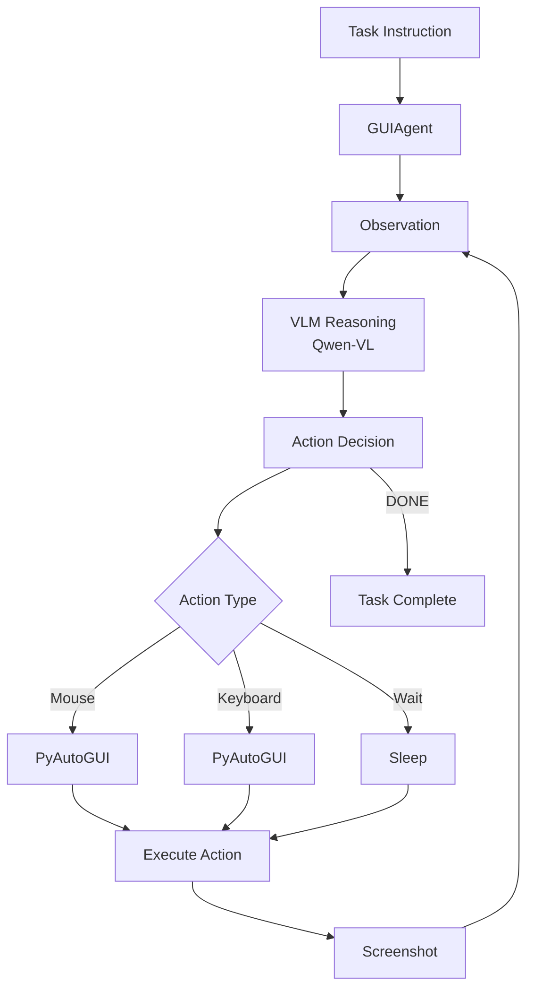

# GUI Agent Architecture

OSWorld-inspired architecture for vision-language model powered desktop automation.

---

## System Overview



---

## Core Components

### 1. GUIAgent
- Manages observation-action loop
- Coordinates VLM and execution engine
- Tracks task progress

### 2. VLM Reasoning
- **Model**: Qwen-VL-Chat (7B)
- **Input**: Screenshot + task description
- **Output**: Structured action

### 3. Execution Engine
- **PyAutoGUI**: Mouse/keyboard control
- **Platform**: Ubuntu desktop (VM or native)
- **Safety**: Sandboxed execution

---

## Observation-Action Loop

```python
while not task_complete:
    # 1. Observe
    screenshot = capture_screen()
    
    # 2. Reason
    action = vlm.decide_action(screenshot, task, history)
    
    # 3. Act
    execute_action(action)
    
    # 4. Check completion
    if action['type'] == 'DONE':
        break
```

---

## Action Space

| Action | Parameters | Example |
|:-------|:-----------|:--------|
| **CLICK** | x, y | `{"type": "CLICK", "x": 500, "y": 300}` |
| **TYPE** | text | `{"type": "TYPE", "text": "hello"}` |
| **SCROLL** | direction | `{"type": "SCROLL", "direction": "down"}` |
| **WAIT** | seconds | `{"type": "WAIT", "seconds": 2}` |
| **DONE** | - | `{"type": "DONE"}` |

---

## Deployment Options

### Local Mode
- Run on host machine
- Fast, no VM overhead
- ⚠️ Lower isolation

### VM Mode (OSWorld)
- Ubuntu 22.04 in QEMU
- Complete isolation
- Screenshot via VNC

---

## Resources

- [OSWorld Paper](https://arxiv.org/abs/2404.07972)
- [Qwen-VL Model](https://github.com/QwenLM/Qwen-VL)

