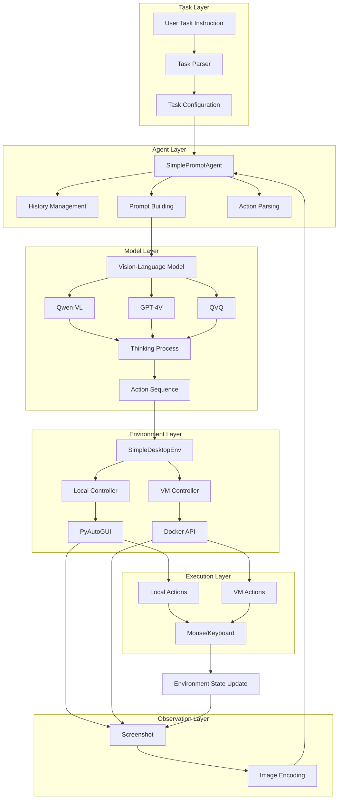

# GUI Automation Agent
{: .no_toc }

Intelligent desktop automation agent based on OSWorld architecture, supporting vision-language model-based reasoning and precise GUI interaction.
{: .fs-6 .fw-300 }

## Table of contents
{: .no_toc .text-delta }

1. TOC
{:toc}

---

## System Overview

### Purpose

The GUI Automation Agent enables intelligent desktop task automation by combining vision-language models (VLMs) with precise GUI control. It can understand screen content, reason about tasks, and execute mouse/keyboard operations to complete complex workflows.

### Key Features

- 👀 **Intelligent Observation**: Automatically capture and understand screen state
- 🧠 **Visual Reasoning**: VLM-based task understanding and decision making
- 🖱️ **Precise Execution**: Execute mouse and keyboard operations
- 🔄 **Continuous Loop**: Observe-Think-Act cycle until task completion
- 🛡️ **Safety Isolation**: VM mode support for host system protection

### Technical Highlights

| Feature | Description |
|:--------|:-----------|
| **Core Technology** | VLM + Environment Control |
| **Main Functionality** | Desktop task automation |
| **Input** | Task instructions + Screenshots |
| **Output** | Automated operation sequences |
| **Use Cases** | RPA, UI testing, task execution |
| **Deployment** | Local / VM isolation |

---

## Architecture

### System Architecture Diagram

### OSWorld Core Concepts

**Reference**: [OSWorld GitHub](https://github.com/xlang-ai/OSWorld)

GUI-Agent is built on OSWorld's core architecture:

1. **Environment Abstraction**: `SimpleDesktopEnv` corresponds to OSWorld's `DesktopEnv`
2. **Agent Design**: `SimplePromptAgent` corresponds to OSWorld's `PromptAgent`
3. **Observe-Act Loop**: Screenshot → Model inference → Action execution → Repeat
4. **Action Space**: Uses PyAutoGUI commands (consistent with OSWorld)

---

## Module Documentation

[Environment Setup]({{ site.baseurl }}/docs/gui-agent/environment-setup){: .btn .btn-primary .mr-2 }
Configure VM or local desktop environment

[VLM Integration]({{ site.baseurl }}/docs/gui-agent/vlm-integration){: .btn .btn-outline .mr-2 }
Vision-language models for screenshot understanding

[Task Execution]({{ site.baseurl }}/docs/gui-agent/task-execution){: .btn .btn-outline .mr-2 }
Automated task execution workflow

[Troubleshooting]({{ site.baseurl }}/docs/gui-agent/troubleshooting){: .btn .btn-outline .mr-2 }
Common issues and solutions

---

## Quick Start

### Prerequisites

1. **Environment Setup**: Choose VM mode (recommended) or Local mode
2. **VLM Configuration**: Set API keys for Qwen-VL or GPT-4V
3. **Permissions**: Grant accessibility permissions (macOS) or start Docker (VM mode)

### Basic Usage

1. Navigate to "🤖 GUI-Agent" tab
2. Choose environment (VM or Local)
3. Configure VLM model (Qwen-VL recommended)
4. Enter task instruction
5. Click "▶️ Execute Task"

### Example Tasks

**Simple Tasks**:
- "Open browser and visit google.com"
- "Take a screenshot and save it"
- "Open calculator and calculate 123 + 456"

**Complex Tasks**:
- "Search for 'Python tutorial' on Google and open the first result"
- "Create a new document, write 'Hello World', and save it"
- "Find all image files in Downloads folder"

---

## Supported Models

- **qwen3-vl-plus**: Recommended, excellent Chinese support
- **qwen3-vl-flash**: Faster response
- **gpt-4o**: High precision
- **qvq-max**: Complex reasoning

---

## Related Resources

- [OSWorld Project](https://github.com/xlang-ai/OSWorld)
- [Qwen-VL Documentation](https://help.aliyun.com/zh/model-studio/visual-reasoning)
- [PyAutoGUI Documentation](https://pyautogui.readthedocs.io/)
