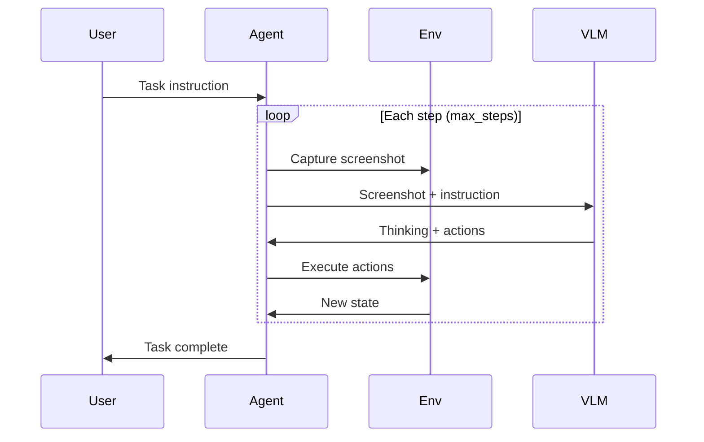

# Task Execution

Automated task execution workflow with observe-think-act loop.

## Execution Flow



---

## Task Examples

**Good Tasks**:
```
"Open browser and search Python"
"Create a new folder called test"
"Open terminal and type ls"
```

**Complex Tasks**:
```
"Open browser, visit google.com, search 'Python tutorial', 
and open the first result"
```

---

## Configuration

```python
TASK_CONFIG = {
    "max_steps": 15,           # Maximum steps
    "step_delay": 1.5,         # Delay between steps (seconds)
    "enable_thinking": True,   # Show VLM thinking process
    "use_trajectory": True     # Use history context
}
```

---

## Monitoring

- 📍 Step progress notifications
- 🧠 Model thinking process display
- 🤖 Action execution feedback
- ✅ Task completion status

---

## Interrupt Task

- Press ESC key (requires accessibility permission)
- Click new task (auto-interrupts current)
