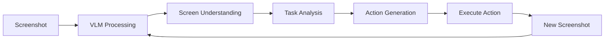

# VLM Integration
{: .no_toc }

Vision-language models for screenshot understanding and action generation in GUI automation.
{: .fs-6 .fw-300 }

## Table of contents
{: .no_toc .text-delta }

1. TOC
{:toc}

---

## Overview

### What is a VLM?

**Vision-Language Model (VLM)** is a type of AI model that can understand both visual (images) and textual information simultaneously. In GUI automation, VLMs analyze screenshots to understand the current screen state and generate appropriate actions.

**Key Capabilities**:
- **Visual Understanding**: Recognize UI elements, text, buttons, menus
- **Context Awareness**: Understand relationships between screen elements
- **Task Reasoning**: Determine what actions are needed to complete a task
- **Natural Language**: Process task instructions in natural language

### Why VLMs for GUI Automation?

**Traditional Approaches vs VLM**:

| Approach | How It Works | Limitations |
|:---------|:------------|:------------|
| **Coordinate-based** | Hardcoded pixel coordinates | ❌ Breaks when UI changes<br>❌ Not portable across screens |
| **Element Detection** | Template matching, OCR | ❌ Requires templates for each UI<br>❌ Fragile to UI updates |
| **VLM-based** | Understands screen semantically | ✅ Adapts to UI changes<br>✅ Works across different applications<br>✅ Understands context |

**VLM Advantages**:
- ✅ **Semantic Understanding**: Understands what UI elements mean, not just where they are
- ✅ **Adaptability**: Works with different UI layouts and applications
- ✅ **Natural Instructions**: Accepts task descriptions in natural language
- ✅ **Context Awareness**: Considers entire screen context, not just individual elements

### How VLM Integration Works

**Basic Workflow**:



**Process**:
1. **Capture Screenshot**: Take current screen state
2. **VLM Analysis**: Send screenshot + task instruction to VLM
3. **Understanding**: VLM identifies UI elements and their relationships
4. **Reasoning**: VLM determines next action based on task goal
5. **Action Generation**: VLM outputs action in executable format (e.g., `pyautogui.click(x, y)`)
6. **Execution**: System executes the action
7. **Repeat**: Capture new screenshot and continue until task complete

---

## Supported Models

### Model Comparison

| Model | Provider | Speed | Quality | Thinking | Use Case |
|:------|:---------|:------|:--------|:---------|:---------|
| **qwen3-vl-plus** | Alibaba Cloud | Medium | High | ✅ | Recommended, excellent Chinese |
| **qwen3-vl-flash** | Alibaba Cloud | Fast | Medium | ✅ | Quick prototyping |
| **gpt-4o** | OpenAI | Medium | Very High | ❌ | High precision tasks |
| **qvq-max** | Alibaba Cloud | Slow | Very High | ✅ | Complex reasoning |

### Model Selection Guide

**For Fast Prototyping**:
- Use `qwen3-vl-flash` for quick iteration
- Good for simple tasks and testing

**For Production Tasks**:
- Use `qwen3-vl-plus` for balanced performance
- Excellent Chinese language support
- Supports thinking mode for transparency

**For Complex Reasoning**:
- Use `qvq-max` for difficult multi-step tasks
- Best for tasks requiring deep understanding

**For Maximum Precision**:
- Use `gpt-4o` for critical tasks
- Strong general intelligence
- Good for English-language tasks

---

## Configuration

### Qwen-VL Setup

**1. Get API Key**:
- Sign up at [Alibaba Cloud DashScope](https://dashscope.console.aliyun.com/)
- Create API key in the console

**2. Set Environment Variable**:
```bash
export DASHSCOPE_API_KEY="your_key_here"
```

**3. Test API Connection**:
```bash
curl -X POST https://dashscope.aliyuncs.com/compatible-mode/v1/chat/completions \
  -H "Authorization: Bearer $DASHSCOPE_API_KEY" \
  -H "Content-Type: application/json" \
  -d '{
    "model": "qwen3-vl-plus",
    "messages": [
      {
        "role": "user",
        "content": [
          {"type": "text", "text": "What do you see in this image?"},
          {"type": "image_url", "image_url": {"url": "data:image/jpeg;base64,..."}}
        ]
      }
    ]
  }'
```

### OpenAI Setup

**1. Get API Key**:
- Sign up at [OpenAI Platform](https://platform.openai.com/)
- Create API key in settings

**2. Set Environment Variable**:
```bash
export OPENAI_API_KEY="your_key_here"
```

**3. Test API Connection**:
```bash
curl https://api.openai.com/v1/models \
  -H "Authorization: Bearer $OPENAI_API_KEY"
```

### Configuration in Code

```python
# VLM Configuration
VLM_CONFIG = {
    "qwen": {
        "api_key": os.getenv("DASHSCOPE_API_KEY"),
        "base_url": "https://dashscope.aliyuncs.com/compatible-mode/v1",
        "model": "qwen3-vl-plus",
        "enable_thinking": True
    },
    "openai": {
        "api_key": os.getenv("OPENAI_API_KEY"),
        "base_url": "https://api.openai.com/v1",
        "model": "gpt-4o"
    }
}
```

---

## VLM Prompt Design

### Prompt Structure

**Basic Prompt Template**:

```
You are a GUI automation agent. Your task is to analyze the screenshot and determine the next action to complete the user's goal.

Task: {user_instruction}

Current Screen:
[SCREENSHOT]

Available Actions:
- pyautogui.click(x, y) - Click at coordinates
- pyautogui.typewrite(text) - Type text
- pyautogui.press('key') - Press key
- pyautogui.scroll(amount) - Scroll
- WAIT - Wait for UI to update
- DONE - Task completed
- FAIL - Task failed

Analyze the screenshot and output the next action in the format:
Action: pyautogui.click(x, y)
Reasoning: [Explain why this action]
```

### Thinking Mode (Qwen-VL)

**With Thinking Enabled**:

```
Task: Open browser and search for "Python tutorial"

Thought: I need to:
1. First, check if browser is already open
2. If not, find and click browser icon
3. Then navigate to search engine
4. Enter search query

Action: pyautogui.click(100, 200)  # Browser icon location
Reasoning: Clicking browser icon to open browser
```

**Benefits of Thinking Mode**:
- ✅ **Transparency**: See model's reasoning process
- ✅ **Debugging**: Understand why model chose specific action
- ✅ **Trust**: Verify model's understanding is correct

---

## Implementation Details

### SimplePromptAgent Class

```python
class SimplePromptAgent:
    """VLM-based GUI automation agent"""
    
    def __init__(self, model="qwen3-vl-plus", api_key=None):
        self.model = model
        self.api_key = api_key or os.getenv("DASHSCOPE_API_KEY")
        self.client = self._init_client()
        self.history = []  # Trajectory history
    
    def predict(self, instruction: str, screenshot: np.ndarray) -> Tuple[str, List[str]]:
        """Predict next action based on screenshot and instruction"""
        
        # 1. Encode screenshot
        screenshot_b64 = self._encode_screenshot(screenshot)
        
        # 2. Build prompt with history
        prompt = self._build_prompt(instruction, screenshot_b64)
        
        # 3. Call VLM
        response = self._call_vlm(prompt)
        
        # 4. Parse action
        action = self._parse_action(response)
        
        # 5. Update history
        self.history.append({
            "screenshot": screenshot_b64,
            "instruction": instruction,
            "response": response,
            "action": action
        })
        
        return response, action
```

### Screenshot Encoding

```python
import base64
import cv2

def encode_screenshot(screenshot: np.ndarray) -> str:
    """Encode screenshot to base64 for API"""
    # Resize if too large (VLMs have size limits)
    if screenshot.shape[0] > 1024 or screenshot.shape[1] > 1024:
        scale = min(1024 / screenshot.shape[0], 1024 / screenshot.shape[1])
        new_size = (int(screenshot.shape[1] * scale), int(screenshot.shape[0] * scale))
        screenshot = cv2.resize(screenshot, new_size)
    
    # Encode to JPEG
    _, buffer = cv2.imencode('.jpg', screenshot, [cv2.IMWRITE_JPEG_QUALITY, 85])
    
    # Convert to base64
    b64_string = base64.b64encode(buffer).decode('utf-8')
    
    return f"data:image/jpeg;base64,{b64_string}"
```

### Action Parsing

```python
import re

def parse_action(response: str) -> List[str]:
    """Parse actions from VLM response"""
    actions = []
    
    # Extract pyautogui commands
    pyautogui_pattern = r'pyautogui\.\w+\([^)]+\)'
    matches = re.findall(pyautogui_pattern, response)
    actions.extend(matches)
    
    # Extract control signals
    if 'DONE' in response.upper():
        actions.append('DONE')
    elif 'FAIL' in response.upper():
        actions.append('FAIL')
    elif 'WAIT' in response.upper():
        actions.append('WAIT')
    
    return actions
```

---

## Best Practices

### Prompt Engineering

**1. Clear Task Instructions**:
```python
# Good
instruction = "Open browser, navigate to google.com, and search for 'Python tutorial'"

# Bad
instruction = "Search"  # Too vague
```

**2. Include Context**:
```python
# Include previous actions in prompt
context = f"""
Previous actions:
- Clicked browser icon
- Browser is now open
Current task: Navigate to google.com
"""
```

**3. Specify Output Format**:
```python
prompt = f"""
{instruction}

Output format:
Action: pyautogui.click(x, y)
Reasoning: [explanation]
"""
```

### Model Selection

**Task Complexity → Model Choice**:

| Task Type | Recommended Model | Reason |
|:----------|:------------------|:-------|
| Simple clicks | qwen3-vl-flash | Fast, sufficient |
| Multi-step tasks | qwen3-vl-plus | Better reasoning |
| Complex workflows | qvq-max | Deep understanding |
| Critical tasks | gpt-4o | Highest accuracy |

### Performance Optimization

**1. Screenshot Resolution**:
```python
# Reduce resolution for faster processing
screenshot = cv2.resize(screenshot, (800, 600))  # Instead of full screen
```

**2. Limit History**:
```python
# Keep only last 3 screenshots
if len(self.history) > 3:
    self.history = self.history[-3:]
```

**3. Cache Common Actions**:
```python
# Cache frequently used UI element locations
ui_cache = {
    "browser_icon": (100, 200),
    "search_box": (500, 300)
}
```

---

## Troubleshooting

### VLM Not Understanding Screen

**Problem**: VLM generates incorrect or irrelevant actions

**Solutions**:
1. **Improve Screenshot Quality**: Ensure screenshot is clear and complete
2. **Better Instructions**: Make task instruction more specific
3. **Add Context**: Include information about current application state
4. **Try Different Model**: Switch to more capable model (e.g., qvq-max)

### Slow Response Time

**Problem**: VLM calls take too long (> 10 seconds)

**Solutions**:
1. **Use Faster Model**: Switch to qwen3-vl-flash
2. **Reduce Screenshot Size**: Resize before sending
3. **Limit History**: Reduce trajectory history length
4. **Check API Status**: Verify API service is responsive

### API Errors

**Problem**: API calls fail or return errors

**Checklist**:
- [ ] API key is correct and valid
- [ ] API quota not exceeded
- [ ] Network connection stable
- [ ] Base URL is correct
- [ ] Request format matches API specification

---

## Related Resources

- [Task Execution]({{ site.baseurl }}/docs/gui-agent/task-execution) - How actions are executed
- [Environment Setup]({{ site.baseurl }}/docs/gui-agent/environment-setup) - System configuration
- [Qwen-VL Documentation](https://help.aliyun.com/zh/model-studio/visual-reasoning)
- [OpenAI Vision API](https://platform.openai.com/docs/guides/vision)
