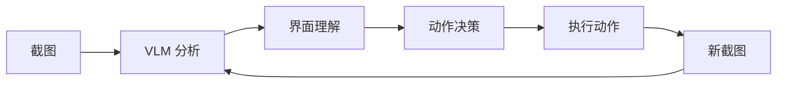

# VLM 集成
{: .no_toc }

面向 GUI 自动化代理的视觉语言模型（VLM）集成说明，涵盖模型选择、配置方式、提示词设计与常见问题处理。
{: .fs-6 .fw-300 }

## 目录
{: .no_toc .text-delta }

1. TOC
{:toc}

---

## 概述

### 什么是 VLM

视觉语言模型（Vision-Language Model, VLM）可同时理解截图中的视觉信息与文本指令。在 GUI 自动化场景中，VLM 负责“看懂当前界面并给出下一步动作建议”。

**核心能力**：
- **界面理解**：识别按钮、输入框、菜单与状态信息
- **上下文建模**：理解组件之间的关系与当前任务阶段
- **动作推理**：根据目标生成可执行动作
- **自然语言交互**：直接处理自然语言任务描述

### 为什么用于 GUI 自动化

| 方案 | 工作方式 | 局限性 |
|:-----|:--------|:------|
| 坐标硬编码 | 预先写死坐标点击 | UI 变更后易失效，迁移成本高 |
| 模板/OCR 匹配 | 靠模板识别元素 | 维护复杂，对样式变化敏感 |
| VLM 语义理解 | 结合图像与文本推理 | 对模型能力和提示词质量有要求 |

**VLM 方案优势**：
- 对布局变化有更好适应性
- 支持跨应用、跨页面任务
- 可以解释动作理由，便于审计与调试

---

## 基本流程


```mermaid
graph LR
    A[截图] --> B[VLM 分析]
    B --> C[界面理解]
    C --> D[动作决策]
    D --> E[执行动作]
    E --> F[新截图]
    F --> B
```

**执行步骤**：
1. 获取当前截图
2. 拼接任务说明与历史轨迹
3. 调用 VLM 获取动作建议
4. 解析成可执行指令（如 `pyautogui.click(x, y)`）
5. 执行并继续下一轮，直到 `DONE` / `FAIL`

---

## 支持模型

| 模型 | 提供方 | 速度 | 质量 | 思考模式 | 适用场景 |
|:-----|:------|:----|:----|:-------|:--------|
| `qwen3-vl-plus` | 阿里云 | 中 | 高 | 支持 | 默认推荐，中文场景表现稳定 |
| `qwen3-vl-flash` | 阿里云 | 快 | 中 | 支持 | 快速联调与低延迟任务 |
| `gpt-4o` | OpenAI | 中 | 很高 | 不支持 | 高精度复杂场景 |
| `qvq-max` | 阿里云 | 慢 | 很高 | 支持 | 多步骤复杂推理 |

---

## 配置说明

### DashScope（Qwen-VL）

1. 在 DashScope 控制台创建 API Key  
2. 设置环境变量：

```bash
export DASHSCOPE_API_KEY="your_key_here"
```

3. 在服务配置中选择模型，例如 `qwen3-vl-plus`

### OpenAI

1. 在 OpenAI 平台创建 API Key  
2. 设置环境变量：

```bash
export OPENAI_API_KEY="your_key_here"
```

3. 在服务配置中选择 `gpt-4o`

### 代码配置示例

```python
VLM_CONFIG = {
    "qwen": {
        "api_key": os.getenv("DASHSCOPE_API_KEY"),
        "base_url": "https://dashscope.aliyuncs.com/compatible-mode/v1",
        "model": "qwen3-vl-plus",
        "enable_thinking": True
    },
    "openai": {
        "api_key": os.getenv("OPENAI_API_KEY"),
        "base_url": "https://api.openai.com/v1",
        "model": "gpt-4o"
    }
}
```

---

## 提示词设计

### 推荐结构

```text
你是 GUI 自动化代理。请根据截图和任务目标给出下一步动作。

任务：{user_instruction}
当前界面：{screenshot_context}
历史动作：{action_history}

可用动作：
- pyautogui.click(x, y)
- pyautogui.typewrite(text)
- pyautogui.press("key")
- pyautogui.scroll(amount)
- WAIT / DONE / FAIL

请按如下格式输出：
Action: ...
Reasoning: ...
```

### 设计原则

- **目标清晰**：避免“帮我处理一下”这类模糊描述
- **上下文完整**：带上最近步骤与当前界面状态
- **输出约束**：限定格式，便于程序解析
- **可审计**：保留 reasoning，支持复盘

---

## 工程建议

### 截图处理

- 限制截图尺寸，降低请求开销
- 关键区域可裁剪以减少干扰
- 保留原图用于失败排查

### 状态管理

- 历史轨迹只保留近几步，避免上下文膨胀
- 每步记录“截图摘要 + 动作 + 结果”
- 对 `WAIT` 动作设置最大连续次数，防止死循环

### 容错策略

- 解析失败时优先重试并给出更强约束
- 关键动作前做前置验证（窗口是否聚焦、元素是否可见）
- 超过重试阈值后输出 `FAIL` 并附错误上下文

---

## 常见问题

### 1) 模型动作不相关

**排查顺序**：
1. 检查任务指令是否具体
2. 检查截图是否清晰且包含关键区域
3. 缩短历史上下文，避免噪声
4. 切换到更强模型验证

### 2) 响应延迟高

**建议**：
- 使用更快模型（如 `qwen3-vl-flash`）
- 降低截图分辨率
- 缩短历史轨迹长度
- 检查接口配额与网络稳定性

### 3) API 调用失败

**检查项**：
- API Key 是否有效
- Base URL 与模型名是否匹配
- 请求体格式是否符合接口要求
- 网络与代理配置是否可用

---

## 相关文档

- [任务执行]({{ site.baseurl }}/docs/gui-agent/task-execution)
- [环境配置]({{ site.baseurl }}/docs/gui-agent/environment-setup)
- [Qwen 视觉推理文档](https://help.aliyun.com/zh/model-studio/visual-reasoning)
- [OpenAI Vision API](https://platform.openai.com/docs/guides/vision)
