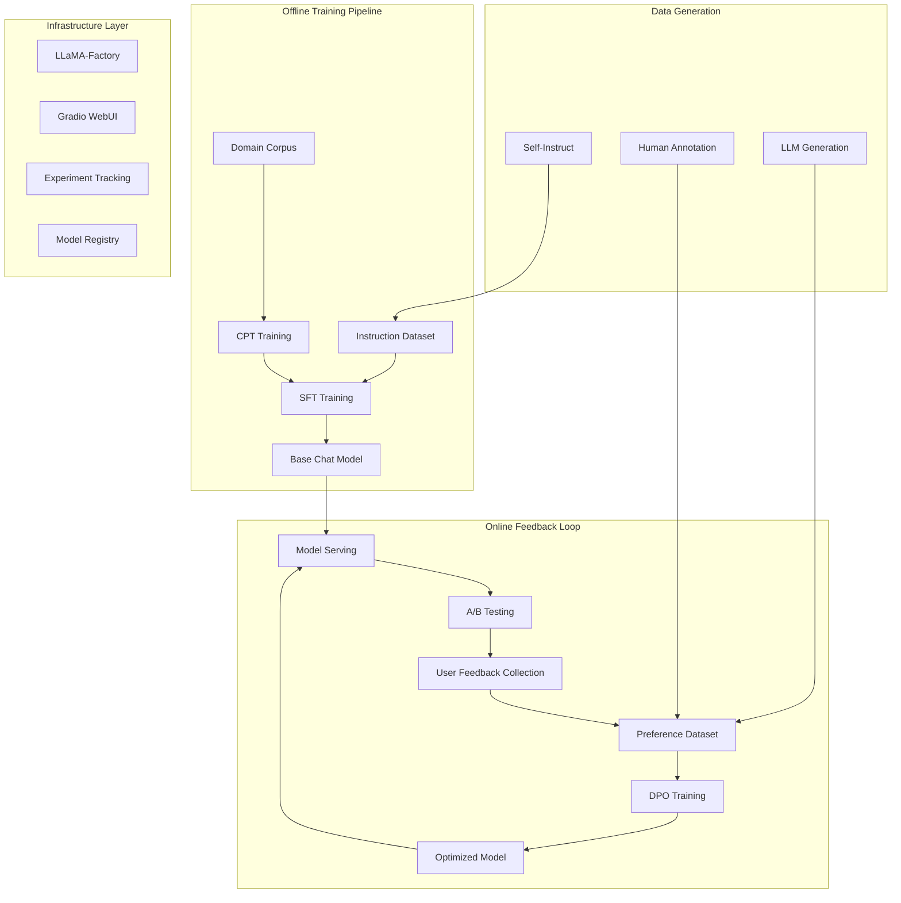
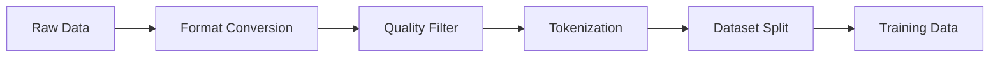

# LLMOps Architecture
{: .no_toc }

System architecture design for the complete LLM training and optimization platform.
{: .fs-6 .fw-300 }

## Table of contents
{: .no_toc .text-delta }

1. TOC
{:toc}

---

## System Architecture

### Overall Architecture Diagram

The LLMOps system follows a modular architecture with clear separation between offline training and online optimization:



### Component Architecture

#### 1. Training Engine

**Core Components**:
- **LLaMA-Factory Integration**: Mature training framework with multi-backend support
- **Configuration Management**: YAML-based declarative training configs
- **Resource Orchestration**: Distributed training coordinator
- **Checkpoint Management**: Model versioning and storage

**Key Features**:
- Support for CPT, SFT, DPO training stages
- LoRA/QLoRA efficient fine-tuning
- Multi-GPU distributed training
- Automatic mixed precision (AMP)

#### 2. Data Pipeline

**Components**:
- **Data Loaders**: Support for multiple data formats (JSONL, CSV, Parquet)
- **Preprocessing**: Tokenization, truncation, padding
- **Data Generation**: Self-Instruct for instruction generation
- **Quality Control**: Automatic filtering and validation

**Workflow**:



#### 3. Serving & Evaluation

**Components**:
- **Model Server**: Ollama/vLLM-based inference
- **A/B Testing**: Traffic splitting and experiment management
- **Metrics Collection**: User feedback, engagement metrics
- **Evaluation Suite**: Automated benchmarks

### Technology Stack

| Layer | Technology | Purpose |
|:------|:-----------|:--------|
| **Training** | LLaMA-Factory | Core training engine |
| **Optimization** | LoRA/QLoRA | Efficient fine-tuning |
| **Serving** | Ollama/vLLM | Model inference |
| **UI** | Gradio | Web interface |
| **Tracking** | TensorBoard | Experiment monitoring |
| **Storage** | HuggingFace Hub | Model registry |

---

## Design Principles

### 1. Modularity

Each component is independently replaceable:
- Training framework can be swapped (LLaMA-Factory → Axolotl)
- Serving backend is pluggable (Ollama → vLLM → TGI)
- Data generation can use different methods

### 2. Scalability

System designed for growth:
- Horizontal scaling for serving
- Distributed training support
- Incremental model updates (LoRA)

### 3. Automation

Minimize manual intervention:
- Automated data generation (Self-Instruct)
- Configuration-driven training
- Automatic checkpoint management
- Continuous deployment pipeline

### 4. Cost Efficiency

Optimize for resource usage:
- LoRA for efficient fine-tuning (10x less memory)
- Quantization for deployment (INT4/INT8)
- Incremental updates instead of full retraining

---

## Deployment Architecture

### Development Environment

```
├── Data Generation
│   └── Self-Instruct scripts
├── Training Node
│   ├── LLaMA-Factory
│   └── GPU resources
├── Evaluation Node
│   └── Benchmark suite
└── Web UI
    └── Gradio interface
```

### Production Environment

```
├── Data Pipeline
│   ├── User feedback collector
│   └── Preference dataset builder
├── Training Cluster
│   ├── Master node (orchestration)
│   └── Worker nodes (GPU training)
├── Serving Cluster
│   ├── Load balancer
│   ├── Model servers (A/B variants)
│   └── Monitoring
└── Storage
    ├── Model registry
    └── Training data
```

---

## Integration Points

### External Systems

1. **Data Sources**
   - User interaction logs
   - Human annotation platforms
   - External corpora

2. **Model Registry**
   - HuggingFace Hub
   - Local model storage
   - Version control

3. **Monitoring**
   - TensorBoard for training metrics
   - Prometheus for serving metrics
   - Custom dashboards

### API Interfaces

```python
# Training API
POST /train/cpt
POST /train/sft
POST /train/dpo

# Serving API
POST /predict
GET /models
POST /feedback

# Management API
GET /experiments
GET /metrics
POST /deploy
```

---

## Security & Privacy

### Data Protection

- **Local deployment** option for sensitive data
- **Data anonymization** before training
- **Access control** for model checkpoints

### Model Safety

- **Alignment training** through DPO
- **Content filtering** in outputs
- **Bias detection** in training data

---

## Performance Considerations

### Training Performance

| Optimization | Benefit |
|:-------------|:--------|
| **LoRA** | 10x memory reduction |
| **Gradient Checkpointing** | 50% memory saving |
| **Flash Attention** | 3x speedup |
| **Multi-GPU** | Linear scaling |

### Serving Performance

| Technique | Latency | Throughput |
|:----------|:--------|:-----------|
| **Quantization (INT4)** | 50ms | 100 req/s |
| **Batch Inference** | 30ms | 500 req/s |
| **vLLM (PagedAttention)** | 20ms | 1000 req/s |

---

## Future Enhancements

1. **Advanced Training**
   - Multi-task learning
   - Federated learning
   - RLHF integration

2. **Scalability**
   - Kubernetes deployment
   - Auto-scaling
   - Global distribution

3. **Intelligence**
   - Automatic hyperparameter tuning
   - Dynamic data selection
   - Online learning

