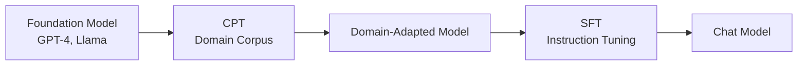

# Continued Pre-Training (CPT)
{: .no_toc }

Domain-specific continued pre-training to adapt base models to specialized domains.
{: .fs-6 .fw-300 }

## Table of contents
{: .no_toc .text-delta }

1. TOC
{:toc}

---

## Overview

### What is CPT?

Continued Pre-Training (CPT) continues training a foundation model on domain-specific corpora to enhance its domain knowledge before task-specific fine-tuning.

**When to Use CPT**:
- Adapting to specialized domains (medical, legal, finance)
- Incorporating new knowledge not in the original training data
- Improving performance on domain-specific tasks

**Relationship in Training Pipeline**:



---

## Technical Details

### Training Objective

CPT uses the standard causal language modeling objective:

$$
\mathcal{L}_{\text{CPT}} = -\sum_{t=1}^{T} \log P(x_t \mid x_{<t}; \theta)
$$

Where:
- \(x_t\) is the token at position \(t\)
- \(x_{<t}\) are all previous tokens
- \(\theta\) are the model parameters

### Data Requirements

**Corpus Size**:
- Small domain: 100M - 1B tokens
- Medium domain: 1B - 10B tokens
- Large domain: 10B+ tokens

**Data Quality**:
- High domain relevance
- Clean and well-formatted text
- Diverse sources within domain
- Deduplicated content

**Format**:
```jsonl
{"text": "Domain-specific document content..."}
{"text": "Another document in the domain..."}
```

---

## Configuration

### LLaMA-Factory YAML Config

```yaml
# CPT Configuration Example
model_name_or_path: Qwen/Qwen2.5-0.5B-Instruct
stage: pt  # pre-training stage
do_train: true
dataset: domain_corpus
template: default

# Training hyperparameters
cutoff_len: 2048
max_samples: 100000
per_device_train_batch_size: 4
gradient_accumulation_steps: 8
learning_rate: 2.0e-5
num_train_epochs: 3.0
lr_scheduler_type: cosine
warmup_ratio: 0.1

# Optimization
fp16: true
ddp_timeout: 180000000

# LoRA configuration
finetuning_type: lora
lora_target: all
lora_rank: 16
lora_alpha: 32
lora_dropout: 0.05

# Output
output_dir: checkpoints/cpt/domain-model
logging_steps: 10
save_steps: 1000
```

### Dataset Preparation

**Step 1: Data Collection**
```python
# Collect domain-specific documents
domain_docs = [
    {"text": "Medical journal article..."},
    {"text": "Clinical trial report..."},
    # ... more documents
]
```

**Step 2: Format Conversion**
```python
import json

# Convert to JSONL format
with open('data/llmops/cpt/domain_corpus.jsonl', 'w') as f:
    for doc in domain_docs:
        f.write(json.dumps(doc, ensure_ascii=False) + '\n')
```

**Step 3: Dataset Registration**
```json
{
  "domain_corpus": {
    "file_name": "cpt/domain_corpus.jsonl"
  }
}
```

---

## Training Process

### Launch Training

**Using Web UI**:
1. Navigate to LLaMA-Factory Web UI
2. Select "Pre-Training" stage
3. Choose base model (e.g., Qwen2.5-0.5B-Instruct)
4. Configure dataset and hyperparameters
5. Click "Start" to launch training

**Using Command Line**:
```bash
cd LLaMA-Factory

llamafactory-cli train \
    --config_file config/cpt_config.yaml
```

**Using Python API**:
```python
from llamafactory import Trainer

# Load configuration
config = yaml.safe_load(open('config/cpt_config.yaml'))

# Initialize trainer
trainer = Trainer(config)

# Start training
trainer.train()
```

### Monitor Training

**TensorBoard**:
```bash
tensorboard --logdir=checkpoints/cpt/domain-model/runs
```

**Key Metrics to Watch**:
- **Training Loss**: Should decrease steadily
- **Learning Rate**: Should follow the schedule (warmup → decay)
- **Gradient Norm**: Should be stable (not exploding/vanishing)
- **Token/Second**: Throughput metric

---

## Best Practices

### Hyperparameter Tuning

| Parameter | Small Model | Large Model |
|:----------|:------------|:------------|
| **Learning Rate** | 2e-5 | 1e-5 |
| **Batch Size** | 8-16 | 32-64 |
| **LoRA Rank** | 8-16 | 16-32 |
| **Context Length** | 1024-2048 | 2048-4096 |

### Data Optimization

1. **Token Balancing**
   - Ensure diverse topic coverage
   - Avoid over-representation of any single source

2. **Quality Filtering**
   ```python
   def filter_quality(doc):
       # Remove too short documents
       if len(doc['text'].split()) < 50:
           return False
       # Remove documents with high repetition
       if has_high_repetition(doc['text']):
           return False
       return True
   ```

3. **Deduplication**
   - Use MinHash or SimHash for near-duplicate detection
   - Remove exact duplicates

### Memory Optimization

**For Limited GPU Memory**:

```yaml
# Enable gradient checkpointing
gradient_checkpointing: true

# Use smaller batch size with more accumulation
per_device_train_batch_size: 2
gradient_accumulation_steps: 16

# Quantization
quantization_bit: 4  # QLoRA
```

---

## Evaluation

### Perplexity Evaluation

```python
from transformers import AutoModelForCausalLM, AutoTokenizer
import torch

# Load model
model = AutoModelForCausalLM.from_pretrained(
    "checkpoints/cpt/domain-model"
)
tokenizer = AutoTokenizer.from_pretrained(
    "checkpoints/cpt/domain-model"
)

# Calculate perplexity on held-out set
def calculate_perplexity(text):
    encodings = tokenizer(text, return_tensors="pt")
    max_length = model.config.n_positions
    stride = 512
    
    lls = []
    for i in range(0, encodings.input_ids.size(1), stride):
        begin_loc = max(i + stride - max_length, 0)
        end_loc = min(i + stride, encodings.input_ids.size(1))
        trg_len = end_loc - i
        
        input_ids = encodings.input_ids[:, begin_loc:end_loc]
        target_ids = input_ids.clone()
        target_ids[:, :-trg_len] = -100
        
        with torch.no_grad():
            outputs = model(input_ids, labels=target_ids)
            log_likelihood = outputs.loss * trg_len
        
        lls.append(log_likelihood)
    
    ppl = torch.exp(torch.stack(lls).sum() / end_loc)
    return ppl.item()

# Evaluate
test_texts = load_test_corpus()
perplexities = [calculate_perplexity(text) for text in test_texts]
avg_ppl = sum(perplexities) / len(perplexities)

print(f"Average Perplexity: {avg_ppl:.2f}")
```

### Downstream Task Evaluation

After CPT, evaluate on domain-specific benchmarks:
- Medical: PubMedQA, MedQA
- Legal: LegalBench
- Finance: FinQA

---

## Common Issues

### Training Instability

**Symptoms**:
- Loss spikes or diverges
- NaN gradients

**Solutions**:
- Lower learning rate
- Increase warmup steps
- Enable gradient clipping:
  ```yaml
  max_grad_norm: 1.0
  ```

### Overfitting

**Symptoms**:
- Training loss decreases but eval loss increases
- Model memorizes training data

**Solutions**:
- Reduce training epochs
- Add regularization (LoRA dropout)
- Increase dataset size

### Out of Memory

**Solutions**:
- Reduce batch size
- Enable gradient checkpointing
- Use QLoRA (4-bit quantization)
- Reduce context length

---

## Example: Domain Adaptation

### Medical Domain CPT

```yaml
# Medical CPT Configuration
model_name_or_path: Qwen/Qwen2.5-0.5B-Instruct
stage: pt
dataset: medical_corpus  # PubMed abstracts, clinical notes

# Optimized for medical domain
cutoff_len: 2048  # Medical texts can be long
learning_rate: 1.5e-5  # Lower LR for stability
num_train_epochs: 2.0  # Prevent overfitting
```

**Expected Results**:
- 20-30% reduction in perplexity on medical texts
- Improved performance on medical QA tasks
- Better understanding of medical terminology

---

## Resources

### Recommended Corpora

- **General**: The Pile, C4
- **Code**: The Stack, CodeParrot
- **Science**: arXiv, PubMed
- **Books**: BookCorpus, Gutenberg
- **Web**: Common Crawl (filtered)

### Further Reading

- [LLaMA-Factory Documentation](https://github.com/hiyouga/LLaMA-Factory)
- [LoRA: Low-Rank Adaptation](https://arxiv.org/abs/2106.09685)
- [QLoRA: Efficient Finetuning](https://arxiv.org/abs/2305.14314)
