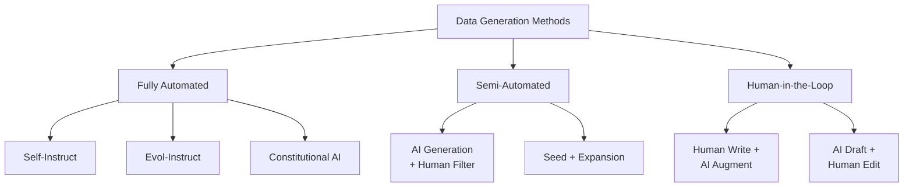

# Data Generation & Management
{: .no_toc }

Automated and semi-automated approaches to creating high-quality training data.
{: .fs-6 .fw-300 }

## Table of contents
{: .no_toc .text-delta }

1. TOC
{:toc}

---

## Overview

### Why Data Generation?

High-quality training data is the bottleneck for LLM training. Manual annotation is expensive and slow. Automated data generation using stronger models (like GPT-4) can dramatically accelerate dataset creation.

**Data Generation Methods**:



---

## Self-Instruct

### Concept

Use a strong LLM to generate instruction-following examples by providing seed examples and asking the model to create similar ones.

### Implementation

```python
import json
from openai import OpenAI

client = OpenAI()

def self_instruct_generate(seed_examples, num_generate=100):
    """Generate instruction-following examples using Self-Instruct"""
    
    generated = []
    
    for i in range(num_generate):
        # Sample 3-5 seed examples
        sample_seeds = random.sample(seed_examples, k=min(5, len(seed_examples)))
        
        # Create prompt
        prompt = f"""You are asked to come up with a set of diverse task instructions. These task instructions will be given to a GPT model and we will evaluate the GPT model for completing the instructions.

Here are the requirements:
1. Try not to repeat the verb for each instruction to maximize diversity.
2. The language used for the instruction should also be diverse. For example, combine questions with imperative instructions.
3. The instructions should be self-contained and clear.
4. The instructions should have an appropriate response that can be generated by GPT models.

List of {len(sample_seeds)} tasks:
{json.dumps(sample_seeds, indent=2)}

Generate 1 new task following the same format:"""
        
        response = client.chat.completions.create(
            model="gpt-4",
            messages=[{"role": "user", "content": prompt}],
            temperature=1.0,
            max_tokens=1500
        )
        
        try:
            new_task = json.loads(response.choices[0].message.content)
            
            # Validate quality
            if is_valid_task(new_task):
                generated.append(new_task)
        except:
            continue
    
    return generated

def is_valid_task(task):
    """Quality checks for generated tasks"""
    # Check required fields
    if not all(k in task for k in ['instruction', 'input', 'output']):
        return False
    
    # Check minimum length
    if len(task['instruction'].split()) < 3:
        return False
    if len(task['output'].split()) < 10:
        return False
    
    # Check for repetition
    if task['instruction'] in seen_instructions:
        return False
    
    seen_instructions.add(task['instruction'])
    return True

# Example usage
seed_tasks = [
    {
        "instruction": "Explain the concept of machine learning",
        "input": "",
        "output": "Machine learning is a subset of artificial intelligence..."
    },
    # More seed tasks...
]

new_tasks = self_instruct_generate(seed_tasks, num_generate=1000)

# Save
with open('data/llmops/sft/self_instruct_data.json', 'w') as f:
    json.dump(new_tasks, f, indent=2, ensure_ascii=False)
```

---

## Evol-Instruct

### Concept

Evolve simple instructions into more complex ones through iterative augmentation.

### Evolution Operations

1. **Add Constraints**: "Explain X" → "Explain X in 50 words"
2. **Deepen**: "List Y" → "List Y and explain the reasoning behind each"
3. **Concretize**: "Describe Z" → "Describe Z with a real-world example"
4. **Increase Reasoning**: "What is W?" → "What is W and how does it relate to V?"

### Implementation

```python
def evol_instruct(base_instruction, model="gpt-4"):
    """Evolve a simple instruction into a complex one"""
    
    evolution_prompts = [
        "Rewrite the following instruction to make it slightly more complex by adding a constraint or requirement:",
        "Rewrite the following instruction to require deeper reasoning or multi-step thinking:",
        "Rewrite the following instruction to be more specific with concrete examples or scenarios:",
        "Rewrite the following instruction to increase the breadth by asking for multiple perspectives:"
    ]
    
    # Randomly select evolution strategy
    evolution_prompt = random.choice(evolution_prompts)
    
    full_prompt = f"""{evolution_prompt}

Original instruction: {base_instruction}

Evolved instruction (respond with ONLY the new instruction):"""
    
    response = client.chat.completions.create(
        model=model,
        messages=[{"role": "user", "content": full_prompt}],
        temperature=0.7
    )
    
    evolved_instruction = response.choices[0].message.content.strip()
    return evolved_instruction

# Example
base = "Explain what a database is"
evolved = evol_instruct(base)
# Result: "Explain what a database is, compare three different types (relational, NoSQL, graph), 
# and provide a use case for each type with a real-world example"
```

---

## Preference Data Generation

### For DPO Training

**Method 1: Best-of-N Sampling**

```python
def generate_preference_pairs(prompts, model, n=4):
    """Generate preference pairs using Best-of-N sampling"""
    
    preference_data = []
    
    for prompt in prompts:
        # Generate N responses
        responses = []
        for _ in range(n):
            response = model.generate(prompt, temperature=0.8)
            responses.append(response)
        
        # Rank responses (using GPT-4 or human)
        ranked = rank_responses(prompt, responses)
        
        # Create preference pairs
        best = ranked[0]
        worst = ranked[-1]
        
        preference_data.append({
            "conversations": [{"from": "user", "value": prompt}],
            "chosen": best,
            "rejected": worst
        })
    
    return preference_data

def rank_responses(prompt, responses):
    """Rank responses using GPT-4 as judge"""
    
    ranking_prompt = f"""Given the user prompt and {len(responses)} responses, rank them from best to worst.

User Prompt: {prompt}

Responses:
{chr(10).join([f"{i+1}. {r}" for i, r in enumerate(responses)])}

Respond with ONLY the ranking as numbers (e.g., "3,1,4,2"):"""
    
    response = client.chat.completions.create(
        model="gpt-4",
        messages=[{"role": "user", "content": ranking_prompt}],
        temperature=0
    )
    
    ranking = [int(x)-1 for x in response.choices[0].message.content.strip().split(',')]
    return [responses[i] for i in ranking]
```

**Method 2: Constitutional AI**

```python
def generate_constitutional_preferences(harmful_prompts):
    """Generate safe preferences using Constitutional AI approach"""
    
    constitution = [
        "Choose the response that is most helpful, harmless, and honest.",
        "Choose the response that avoids stereotyping or discriminatory language.",
        "Choose the response that is most factually accurate.",
    ]
    
    preference_data = []
    
    for prompt in harmful_prompts:
        # Generate initial response
        initial_response = model.generate(prompt)
        
        # Critique and revise
        for principle in constitution:
            critique_prompt = f"""Principle: {principle}

User Query: {prompt}

Response: {initial_response}

Critique: Identify any violations of the principle in the response.
Revision: Provide an improved response that follows the principle."""
            
            revision = model.generate(critique_prompt)
            
            preference_data.append({
                "conversations": [{"from": "user", "value": prompt}],
                "chosen": revision,
                "rejected": initial_response
            })
            
            initial_response = revision  # Iterative improvement
    
    return preference_data
```

---

## Data Quality Control

### Automatic Filtering

```python
def filter_quality(examples):
    """Automatic quality filtering"""
    
    filtered = []
    
    for ex in examples:
        # Length checks
        if len(ex['instruction'].split()) < 3:
            continue
        if len(ex['output'].split()) < 10:
            continue
        
        # Complexity check (not too simple)
        if is_too_simple(ex['instruction']):
            continue
        
        # Safety check (no harmful content)
        if contains_harmful_content(ex['output']):
            continue
        
        # Diversity check (not duplicate)
        if is_duplicate(ex, filtered):
            continue
        
        filtered.append(ex)
    
    return filtered

def is_too_simple(instruction):
    """Check if instruction is too simple"""
    simple_patterns = [
        r'^what is \w+\?$',  # "What is X?"
        r'^define \w+$',      # "Define X"
        r'^list \d+ \w+$',    # "List 5 X"
    ]
    
    for pattern in simple_patterns:
        if re.match(pattern, instruction.lower()):
            return True
    return False
```

### Human-in-the-Loop

```python
def human_review_interface(generated_examples):
    """Gradio interface for human review"""
    
    def review_example(example, action):
        if action == "Accept":
            approved.append(example)
        elif action == "Edit":
            return example  # Return for editing
        # Skip if reject
        
        return next_example()
    
    with gr.Blocks() as demo:
        with gr.Row():
            instruction = gr.Textbox(label="Instruction", interactive=True)
            input_text = gr.Textbox(label="Input", interactive=True)
            output_text = gr.Textbox(label="Output", interactive=True)
        
        with gr.Row():
            accept_btn = gr.Button("Accept")
            edit_btn = gr.Button("Edit & Accept")
            reject_btn = gr.Button("Reject")
        
        # Button callbacks...
    
    demo.launch()
```

---

## Data Augmentation

### Paraphrasing

```python
def paraphrase_instruction(instruction):
    """Generate paraphrases of instructions"""
    
    prompt = f"""Paraphrase the following instruction in 3 different ways while preserving the meaning:

Original: {instruction}

Provide 3 paraphrases:
1.
2.
3."""
    
    response = client.chat.completions.create(
        model="gpt-4",
        messages=[{"role": "user", "content": prompt}],
        temperature=0.9
    )
    
    paraphrases = parse_paraphrases(response.choices[0].message.content)
    return paraphrases
```

### Multi-Lingual Augmentation

```python
def multilingual_augmentation(example, target_langs=['es', 'fr', 'de']):
    """Augment data by translation"""
    
    augmented = []
    
    for lang in target_langs:
        # Translate instruction and output
        translated_instruction = translate(example['instruction'], target_lang=lang)
        translated_output = translate(example['output'], target_lang=lang)
        
        augmented.append({
            "instruction": translated_instruction,
            "input": "",
            "output": translated_output,
            "language": lang
        })
    
    return augmented
```

---

## Data Management

### Dataset Versioning

```python
# Directory structure
data/llmops/
├── sft/
│   ├── v1.0_alpaca_base.json        # Base dataset
│   ├── v1.1_self_instruct.json      # +Self-Instruct
│   ├── v1.2_evol.json               # +Evol-Instruct
│   └── v1.3_human_curated.json      # +Human curation
└── dpo/
    ├── v1.0_preferences.jsonl       # Initial preferences
    ├── v1.1_online_feedback.jsonl   # +Online feedback
    └── v1.2_constitutional.jsonl    # +Constitutional AI
```

### Dataset Metadata

```json
{
  "dataset_name": "custom_instruct_v1.2",
  "version": "1.2.0",
  "created_date": "2024-01-15",
  "num_examples": 50000,
  "sources": [
    {"name": "alpaca", "count": 20000},
    {"name": "self_instruct", "count": 20000},
    {"name": "evol_instruct", "count": 10000}
  ],
  "quality_metrics": {
    "avg_instruction_length": 45,
    "avg_output_length": 320,
    "diversity_score": 0.85
  },
  "preprocessing": [
    "deduplication",
    "length_filtering",
    "quality_scoring"
  ]
}
```

---

## Best Practices

### Data Generation Checklist

- [ ] Start with high-quality seed examples (10-20)
- [ ] Use temperature > 0.7 for diversity
- [ ] Generate 5-10x more than needed, then filter
- [ ] Validate with automatic checks
- [ ] Sample human review (10-20% of data)
- [ ] Track data provenance and versions
- [ ] Monitor for data contamination

### Cost Optimization

| Method | Cost/Example | Quality | Speed |
|:-------|:-------------|:--------|:------|
| **Human Annotation** | $5-10 | Highest | Slowest |
| **GPT-4 Generation** | $0.10-0.50 | High | Fast |
| **GPT-3.5 Generation** | $0.01-0.05 | Medium | Very Fast |
| **Open Model + Human Filter** | $0.05-0.20 | Medium-High | Fast |

**Recommendation**: Use GPT-4 for seed generation, GPT-3.5 for bulk, human for final curation.

---

## Resources

### Papers

- [Self-Instruct](https://arxiv.org/abs/2212.10560)
- [WizardLM (Evol-Instruct)](https://arxiv.org/abs/2304.12244)
- [Constitutional AI](https://arxiv.org/abs/2212.08073)

### Tools

- [Alpaca Data Generation](https://github.com/tatsu-lab/stanford_alpaca#data-generation-process)
- [Evol-Instruct Code](https://github.com/nlpxucan/WizardLM)

### Datasets

- [Alpaca 52K](https://github.com/tatsu-lab/stanford_alpaca)
- [ShareGPT](https://huggingface.co/datasets/anon8231489123/ShareGPT_Vicuna_unfiltered)
- [OpenOrca](https://huggingface.co/datasets/Open-Orca/OpenOrca)
