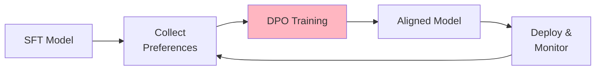
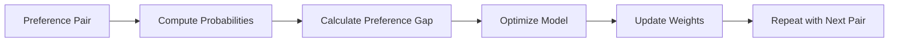
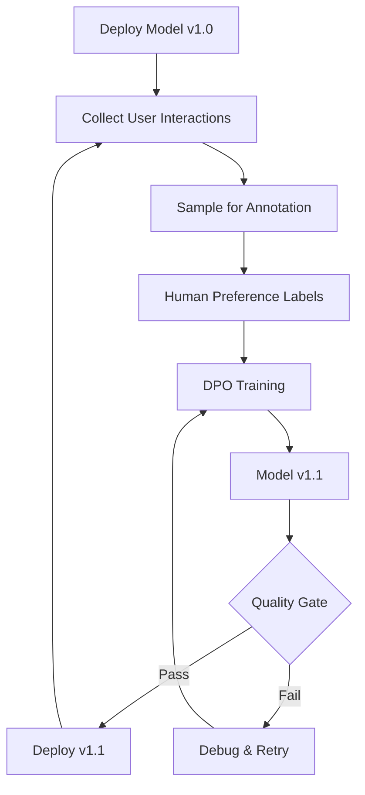

# Direct Preference Optimization (DPO)
{: .no_toc }

Alignment training that teaches models to generate preferred responses based on human feedback.
{: .fs-6 .fw-300 }

## Table of contents
{: .no_toc .text-delta }

1. TOC
{:toc}

---

## Overview

### What is DPO?

Direct Preference Optimization (DPO) is a simpler alternative to RLHF (Reinforcement Learning from Human Feedback) that directly optimizes the model to prefer chosen responses over rejected ones.

**Training Pipeline Position**:



**Key Advantages over RLHF**:
- No need for separate reward model
- More stable training
- Lower computational cost
- Easier to implement

---

## How DPO Works

### Core Concept

**DPO's Key Insight**:
Instead of training a separate reward model (like RLHF), DPO directly optimizes the language model to prefer chosen responses over rejected ones. It does this by:
1. **Comparing probabilities**: Increase probability of chosen response, decrease probability of rejected response
2. **Maintaining reference**: Keep model close to reference model (SFT) to prevent degradation
3. **Optimizing preference gap**: Maximize the gap between chosen and rejected response probabilities

**Training Process**:


### Mathematical Formulation

**DPO Loss Function**:

Given a preference pair $(x, y_w, y_l)$ where:
- $x$ is the input prompt
- $y_w$ is the preferred (chosen) response
- $y_l$ is the rejected response

The DPO objective is:

$$
\mathcal{L}_{\text{DPO}} = -\log \sigma \left( \beta \log \frac{\pi_\theta(y_w \mid x)}{\pi_{\text{ref}}(y_w \mid x)} - \beta \log \frac{\pi_\theta(y_l \mid x)}{\pi_{\text{ref}}(y_l \mid x)} \right)
$$

**Symbol Definitions**:
- $\pi_\theta$: The model being trained (current policy)
- $\pi_{\text{ref}}$: The reference model (usually the SFT model)
- $\beta$: The temperature parameter (typically 0.1-0.5), controls how much the model can deviate from reference
- $\sigma$: The sigmoid function, converts log-odds to probability

### Understanding the Formula

**What the Formula Does**:

1. **Log Ratio Terms**: 
   - $\log \frac{\pi_\theta(y_w \mid x)}{\pi_{\text{ref}}(y_w \mid x)}$ measures how much more likely the current model is to generate the chosen response compared to the reference model
   - $\log \frac{\pi_\theta(y_l \mid x)}{\pi_{\text{ref}}(y_l \mid x)}$ measures the same for the rejected response

2. **Preference Gap**:
   - The difference between these two log ratios represents the preference gap
   - We want this gap to be large (chosen much more likely than rejected)

3. **Sigmoid Function**:
   - Converts the gap into a probability (0 to 1)
   - Larger gap → higher probability → lower loss

4. **Negative Log**:
   - We minimize negative log probability, which maximizes the probability
   - This encourages the model to prefer chosen over rejected

**Intuitive Explanation**:
- If chosen response becomes more likely and rejected becomes less likely → Loss decreases ✅
- If both responses become equally likely → Loss increases ❌
- If model deviates too far from reference → KL penalty (via $\beta$) prevents degradation

---

## Technical Details

### Data Requirements

### Data Format

**What is a Preference Pair?**
A preference pair consists of:
- A conversation context (user prompt, possibly with previous turns)
- A **chosen** response (preferred by humans)
- A **rejected** response (less preferred by humans)

The model learns to increase the probability of chosen responses and decrease the probability of rejected responses.

**Preference Pair Format**:

```json
{
  "conversations": [
    {"from": "user", "value": "Explain quantum computing"}
  ],
  "chosen": "Quantum computing uses quantum mechanical phenomena like superposition...",
  "rejected": "Quantum computing is when computers use quantum."
}
```

**Multi-Turn Preference**:

```json
{
  "conversations": [
    {"from": "user", "value": "What is Python?"},
    {"from": "assistant", "value": "Python is a programming language."},
    {"from": "user", "value": "Show me an example"}
  ],
  "chosen": "Here's a simple Python example:\n\n```python\nprint('Hello, World!')\n```\n\nThis is the traditional first program...",
  "rejected": "Sure: print('hi')"
}
```

---

## Configuration

### LLaMA-Factory YAML Config

```yaml
# DPO Configuration
model_name_or_path: checkpoints/sft/chat-model
ref_model: checkpoints/sft/chat-model  # Reference model
stage: dpo
do_train: true
dataset: comparison_gpt4_en
template: qwen

# DPO-specific parameters
pref_beta: 0.1  # KL penalty coefficient
pref_loss: sigmoid  # or hinge, ipo

# Training hyperparameters
cutoff_len: 2048
per_device_train_batch_size: 1
gradient_accumulation_steps: 32
learning_rate: 5.0e-7  # Much lower than SFT!
num_train_epochs: 1.0  # Usually just 1 epoch
lr_scheduler_type: cosine
warmup_ratio: 0.1

# Optimization
fp16: true
gradient_checkpointing: true

# LoRA configuration
finetuning_type: lora
lora_target: all
lora_rank: 16
lora_alpha: 32

# Evaluation
val_size: 0.1
eval_strategy: steps
eval_steps: 100

# Output
output_dir: checkpoints/dpo/aligned-model
logging_steps: 5
save_steps: 500
```

---

## Data Collection

### Human Feedback Collection

**UI for Preference Labeling**:

```python
import gradio as gr

def create_preference_ui(model_a, model_b):
    """Create UI for collecting preference data"""
    
    def get_responses(prompt):
        response_a = model_a.generate(prompt)
        response_b = model_b.generate(prompt)
        return response_a, response_b
    
    def save_preference(prompt, response_a, response_b, preference):
        """Save user preference"""
        if preference == "A":
            chosen, rejected = response_a, response_b
        else:
            chosen, rejected = response_b, response_a
        
        preference_data = {
            "conversations": [{"from": "user", "value": prompt}],
            "chosen": chosen,
            "rejected": rejected
        }
        
        with open('data/llmops/dpo/preferences.jsonl', 'a') as f:
            f.write(json.dumps(preference_data) + '\n')
    
    # Create Gradio interface
    with gr.Blocks() as demo:
        prompt_input = gr.Textbox(label="Enter prompt")
        get_btn = gr.Button("Generate Responses")
        
        with gr.Row():
            response_a = gr.Textbox(label="Response A")
            response_b = gr.Textbox(label="Response B")
        
        with gr.Row():
            prefer_a = gr.Button("Prefer A")
            prefer_b = gr.Button("Prefer B")
        
        get_btn.click(
            get_responses, 
            inputs=[prompt_input],
            outputs=[response_a, response_b]
        )
        
        prefer_a.click(
            lambda p, a, b: save_preference(p, a, b, "A"),
            inputs=[prompt_input, response_a, response_b]
        )
    
    return demo

# Launch UI
demo = create_preference_ui(model_a, model_b)
demo.launch()
```

### AI-Assisted Preference Generation

**Using GPT-4 as Judge**:

```python
from openai import OpenAI

client = OpenAI()

def generate_preference_with_gpt4(prompt, response_a, response_b):
    """Use GPT-4 to judge which response is better"""
    
    judge_prompt = f"""Compare the following two responses to the user prompt and determine which is better.

User Prompt: {prompt}

Response A:
{response_a}

Response B:
{response_b}

Evaluate based on:
1. Helpfulness
2. Accuracy
3. Clarity
4. Safety

Respond with ONLY "A" or "B" to indicate which response is better."""
    
    response = client.chat.completions.create(
        model="gpt-4",
        messages=[{"role": "user", "content": judge_prompt}],
        temperature=0.0
    )
    
    choice = response.choices[0].message.content.strip()
    
    if choice == "A":
        return {"chosen": response_a, "rejected": response_b}
    else:
        return {"chosen": response_b, "rejected": response_a}
```

---

## Training Process

### Launch DPO Training

```bash
llamafactory-cli train \
    --config_file config/dpo_config.yaml
```

### Monitor Training

**Key Metrics**:
- **Rewards/Chosen**: Should increase (model prefers chosen responses)
- **Rewards/Rejected**: Should decrease (model disfavors rejected responses
- **Rewards/Margins**: Gap between chosen and rejected (should increase)
- **DPO Loss**: Should decrease to 0.3-0.6

**TensorBoard**:
```bash
tensorboard --logdir=checkpoints/dpo/aligned-model/runs
```

---

## Best Practices

### Hyperparameter Guidelines

| Parameter | Conservative | Recommended |
|:----------|:-------------|:------------|
| **Learning Rate** | 1e-7 | 5e-7 |
| **Beta (KL Penalty)** | 0.05 | 0.1 |
| **Epochs** | 1 | 1-2 |
| **Batch Size** | 16 | 32 |

{: .warning }
> **Critical**: Use much lower learning rate than SFT! High LR causes instability.

### Data Quality

**Good Preference Pairs**:
- Clear quality difference between chosen and rejected
- Both responses are on-topic
- Differences are meaningful (not just length)
- Diverse types of improvements (accuracy, helpfulness, safety)

**Bad Preference Pairs**:
- Both responses are equally good/bad
- Rejected response is completely off-topic
- Difference is only formatting
- Biased or inconsistent preferences

---

## Evaluation

### Win Rate Evaluation

```python
def evaluate_win_rate(test_prompts, model_before, model_after):
    """Evaluate improvement after DPO"""
    
    wins = 0
    total = len(test_prompts)
    
    for prompt in test_prompts:
        response_before = model_before.generate(prompt)
        response_after = model_after.generate(prompt)
        
        # Human or GPT-4 judge
        winner = judge(prompt, response_before, response_after)
        
        if winner == "after":
            wins += 1
    
    win_rate = wins / total
    return win_rate

# Expect 60-80% win rate for successful DPO
```

### Benchmark Evaluation

Standard benchmarks:
- **MT-Bench**: Multi-turn conversation quality
- **AlpacaEval**: Instruction following
- **TruthfulQA**: Factual accuracy
- **SafetyBench**: Harmful content avoidance

---

## Common Issues

### Training Instability

**Symptoms**: Loss spikes, NaN values

**Solutions**:
```yaml
# Lower learning rate
learning_rate: 1.0e-7

# Increase KL penalty
pref_beta: 0.2

# Enable gradient clipping
max_grad_norm: 0.5
```

### Model Degradation

**Symptoms**: Model becomes less helpful, repetitive

**Solutions**:
- Reduce number of epochs (try 0.5 epochs)
- Use higher beta (more regularization)
- Check preference data quality

### Reward Hacking

**Symptoms**: Model learns to game the preference signal

**Solutions**:
- Diverse preference data
- Regular evaluation on held-out set
- Mix preferences from multiple sources

---

## Online DPO Loop

### Continuous Improvement Workflow



**Weekly Iteration Cycle**:
1. **Monday**: Collect previous week's data
2. **Tuesday**: Sample and annotate preferences
3. **Wednesday**: Run DPO training
4. **Thursday**: Evaluate new model
5. **Friday**: Deploy if passing quality checks

---

## Advanced Techniques

### Multi-Objective DPO

Optimize for multiple objectives simultaneously:

```python
# Data format with multiple preference dimensions
{
  "conversations": [...],
  "chosen": "...",
  "rejected": "...",
  "dimensions": {
    "helpfulness": {"chosen": 5, "rejected": 3},
    "safety": {"chosen": 5, "rejected": 4},
    "accuracy": {"chosen": 4, "rejected": 2}
  }
}
```

### Iterative DPO

Apply DPO multiple times with different preference data:

```yaml
# Round 1: General helpfulness
dataset: preferences_helpfulness

# Round 2: Safety
dataset: preferences_safety

# Round 3: Domain-specific
dataset: preferences_domain
```

---

## Resources

### Papers

- [Direct Preference Optimization (DPO)](https://arxiv.org/abs/2305.18290)
- [InstructGPT (RLHF)](https://arxiv.org/abs/2203.02155)
- [Constitutional AI](https://arxiv.org/abs/2212.08073)

### Tools

- [TRL (Transformer Reinforcement Learning)](https://github.com/huggingface/trl)
- [LLaMA-Factory DPO](https://github.com/hiyouga/LLaMA-Factory)

### Datasets

- [HH-RLHF](https://huggingface.co/datasets/Anthropic/hh-rlhf)
- [Ultrafeedback](https://huggingface.co/datasets/openbmb/UltraFeedback)
- [PKU-SafeRLHF](https://huggingface.co/datasets/PKU-Alignment/PKU-SafeRLHF)
