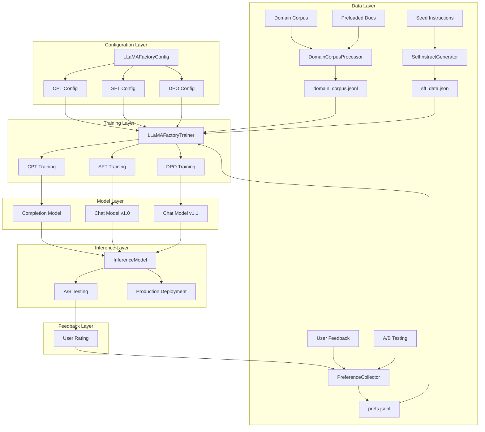
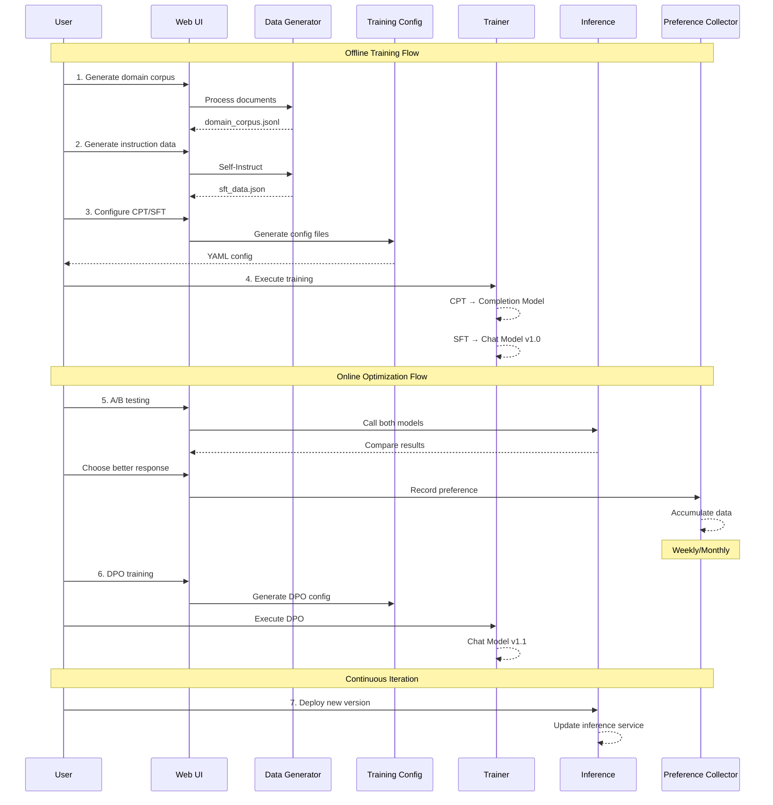
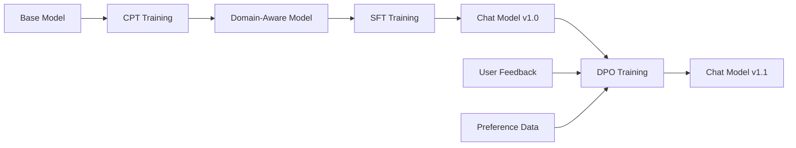
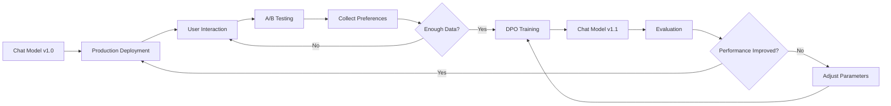

# LLMOps Training Pipeline
{: .no_toc }

A complete large language model training and optimization platform supporting continuous improvement through CPT → SFT → DPO workflow.
{: .fs-6 .fw-300 }

## Table of contents
{: .no_toc .text-delta }

1. TOC
{:toc}

---

## System Overview

### Key Features

- 🔄 **Complete Training Workflow**: CPT → SFT → DPO three-stage training
- 📊 **Data Generation Pipeline**: Self-Instruct generation, preference data collection
- 🔁 **Online Feedback Loop**: A/B testing → Preference collection → DPO training → Deployment
- 📈 **Experiment Management**: Configuration management, training monitoring, result comparison
- 🎯 **Offline/Online Modes**: Support for major version development and continuous optimization

### Offline Training vs Online Optimization

| Feature | Offline Training | Online Optimization |
|:--------|:----------------|:-------------------|
| **Purpose** | Major version development (v1.0 → v2.0) | Continuous iteration (v1.0 → v1.1) |
| **Stages** | CPT + SFT | DPO |
| **Frequency** | Quarterly/Semi-annually | Weekly/Monthly |
| **Cost** | High (full params or large-scale LoRA) | Low (LoRA only) |
| **Data** | Large-scale corpus + instruction sets | Real user feedback |
| **Output** | Completion + Chat models | Incremental chat model versions |

### System Highlights

- ✅ **LLaMA-Factory Integration**: Built on mature training framework
- ✅ **Web UI**: Gradio-based friendly interface
- ✅ **Modular Design**: Separation of data, training, and inference
- ✅ **Automated Workflow**: Configuration generation, data conversion, result logging
- ✅ **Demo Mode**: Experience full workflow without GPU

---

## Architecture

### System Architecture



### Data Flow



### Directory Structure

```
src/search_engine/training_tab/
├── llmops_tab.py                    # Main UI entry
├── llmops_engine.py                 # Engine coordinator
├── llmops_manager.py                # Component manager
├── llmops_runner.py                 # Training runner
├── llmops_control.py                # Control logic
├── llmops_models.py                 # Model configuration
├── llama_factory_config.py          # LLaMA-Factory config generation
├── llamafactory_trainer.py          # Training service
├── self_instruct_generator.py       # Self-Instruct data generation
├── domain_corpus_processor.py       # Domain corpus processing
├── preference_collector.py          # Preference data collection
└── inference_model.py               # Inference service

data/llmops/
├── dataset_info.json                # Dataset registry
├── cpt/                            # CPT data
│   └── domain_corpus_*.jsonl
├── sft/                            # SFT data
│   └── sft_data_*.json
└── dpo/                            # DPO data
    └── prefs.jsonl

checkpoints/
├── cpt/                            # CPT model outputs
├── sft/                            # SFT model outputs
└── dpo/                            # DPO model outputs

configs/llmops/
├── cpt_config_*.yaml               # CPT configuration files
├── sft_config_*.yaml               # SFT configuration files
└── dpo_config_*.yaml               # DPO configuration files
```

---

## Training Workflow Overview

### Three-Stage Training Pipeline

The LLMOps system implements a complete training pipeline: **CPT → SFT → DPO**, each stage serving a specific purpose in model development:

1. **CPT (Continued Pre-Training)**: Domain knowledge injection
2. **SFT (Supervised Fine-Tuning)**: Instruction-following capability
3. **DPO (Direct Preference Optimization)**: Human preference alignment

### Training Stage Relationships



**Key Points**:
- **CPT** adapts base model to specific domain (optional, for domain-specific use cases)
- **SFT** converts model to conversational format (required for chat models)
- **DPO** optimizes model based on human preferences (continuous improvement)

### When to Use Each Stage

| Stage | When to Use | Input | Output | Frequency |
|:------|:------------|:------|:-------|:----------|
| **CPT** | Domain adaptation needed | Domain corpus | Completion model | Once per domain |
| **SFT** | Building chat model | Instruction data | Chat model | Major versions |
| **DPO** | Continuous improvement | Preference pairs | Optimized chat model | Weekly/Monthly |

---

## Training Stages

### CPT - Continued Pre-Training

#### Overview

**What is CPT?**
Continued Pre-Training (CPT) is the first stage where we inject domain-specific knowledge into a base language model. Unlike fine-tuning which adapts to tasks, CPT adapts the model to a specific domain or corpus.

**Why Use CPT?**
- Base models have general knowledge but lack domain-specific expertise
- CPT helps models understand domain terminology, concepts, and patterns
- Provides foundation for subsequent SFT training

**Training Objective**:
- Inject domain knowledge into base model
- Enhance language understanding in specific domains
- Lay domain foundation for subsequent SFT

**Use Cases**:
- Professional domains (medical, legal, finance)
- Specific language or dialect adaptation
- Code generation and specialized tasks

**Output Model**:
- **Completion Model**: Can be directly used for text completion, code generation, etc.

#### Data Requirements

**Data Format**:

```json
{
    "text": "This is a domain-specific text passage. Can be complete paragraphs, documents, or code snippets."
}
```

**Data Characteristics**:
- Large-scale: Typically 10M-100M tokens
- High quality: Strong domain relevance
- Unlabeled: No Q&A pairs needed

#### Configuration Example

```python
@staticmethod
def create_cpt_config(
    model_name: str = "Qwen/Qwen2-1.5B",
    dataset: str = "domain_corpus",
    output_dir: str = "checkpoints/cpt/domain-cpt",
    num_train_epochs: int = 1,
    learning_rate: float = 1e-5,
    per_device_train_batch_size: int = 2,
    gradient_accumulation_steps: int = 8,
    max_seq_length: int = 2048,
    lora_r: int = 16,
    lora_alpha: int = 32
) -> Dict[str, Any]:
    """CPT configuration generation"""
    return {
        "stage": "pt",  # pretrain
        "model_name_or_path": model_name,
        "dataset": dataset,
        "finetuning_type": "lora",
        "lora_rank": lora_r,
        "lora_alpha": lora_alpha,
        "num_train_epochs": num_train_epochs,
        "learning_rate": learning_rate,
        ...
    }
```

#### Training Process

```bash
# 1. Generate configuration
llamafactory-cli export configs/llmops/cpt_config_20231115.yaml

# 2. Execute training
llamafactory-cli train configs/llmops/cpt_config_20231115.yaml

# 3. Training outputs
checkpoints/cpt/domain-cpt/
├── adapter_config.json      # LoRA configuration
├── adapter_model.safetensors # LoRA weights
├── trainer_log.jsonl        # Training logs
└── training_args.bin        # Training arguments
```

### SFT - Supervised Fine-Tuning

#### Overview

**What is SFT?**
Supervised Fine-Tuning (SFT) converts a pre-trained or CPT-trained model into a conversational model that can follow instructions and engage in dialogue.

**Why Use SFT?**
- Base models are completion models, not conversational
- SFT teaches models to understand and respond to user instructions
- Enables models to participate in multi-turn conversations

**Training Objective**:
- Convert base model to conversational model
- Learn instruction-following capabilities
- Adapt to specific task formats

**Use Cases**:
- General conversational assistants
- Task-oriented dialogue systems
- Multi-turn conversation scenarios

**Output Model**:
- **Chat Model**: Ready for production conversational service

#### Data Requirements

**Data Format**:

```json
{
    "messages": [
        {
            "role": "system",
            "content": "You are a helpful assistant."
        },
        {
            "role": "user",
            "content": "What is machine learning?"
        },
        {
            "role": "assistant",
            "content": "Machine learning is a subfield of artificial intelligence..."
        }
    ]
}
```

**Data Characteristics**:
- Medium scale: 10K-100K samples
- High quality: Human-annotated or GPT-generated
- Diversity: Cover multiple task types

#### Configuration Example

```python
@staticmethod
def create_sft_config(
    model_name: str = "Qwen/Qwen2-1.5B",
    dataset: str = "sft_data",
    output_dir: str = "checkpoints/sft/sft-lora",
    num_train_epochs: int = 3,
    learning_rate: float = 5e-5,
    template: str = "qwen"
) -> Dict[str, Any]:
    """SFT configuration generation"""
    return {
        "stage": "sft",
        "model_name_or_path": model_name,
        "dataset": dataset,
        "template": template,  # Model conversation template
        "finetuning_type": "lora",
        ...
    }
```

### DPO - Direct Preference Optimization

#### Overview

**What is DPO?**
Direct Preference Optimization (DPO) is a training method that optimizes model outputs based on human preferences, without requiring a separate reward model.

**Why Use DPO?**
- SFT models may generate responses that are technically correct but not preferred by users
- DPO directly optimizes for what humans actually want
- Enables continuous model improvement through user feedback

**Training Objective**:
- Optimize model output based on human preferences
- Improve generation quality and user satisfaction
- Enable online feedback loop iteration

**Use Cases**:
- Continuous optimization after model deployment
- Correct model biases
- Adapt to user preferences

**Output Model**:
- **Chat Model v1.1, v1.2...**: Incremental optimized versions

#### Data Requirements

**Data Format**:

```json
{
    "conversations": [
        {
            "role": "user",
            "content": "Which is better, Python or Java?"
        }
    ],
    "chosen": {
        "role": "assistant",
        "content": "Python and Java each have advantages, depending on specific scenarios..."
    },
    "rejected": {
        "role": "assistant",
        "content": "Python is better."
    }
}
```

**Data Characteristics**:
- Small scale: 100-1000 samples can be effective
- Authenticity: From real user feedback
- Comparative: Must have chosen/rejected pairs

#### Configuration Example

```python
@staticmethod
def create_dpo_config(
    model_name: str = "Qwen/Qwen2-1.5B",
    adapter_path: str = "checkpoints/sft/sft-lora",
    dataset: str = "prefs",
    output_dir: str = "checkpoints/dpo/dpo-lora",
    num_train_epochs: int = 1,
    learning_rate: float = 5e-6,
    pref_beta: float = 0.1
) -> Dict[str, Any]:
    """DPO configuration generation"""
    return {
        "stage": "dpo",
        "model_name_or_path": model_name,
        "adapter_name_or_path": adapter_path,  # Load SFT weights
        "dataset": dataset,
        "pref_beta": pref_beta,  # KL divergence weight
        "pref_loss": "sigmoid",  # Loss function
        ...
    }
```

### Training Stage Comparison

| Stage | Data Volume | Training Time | Cost | Frequency | Output |
|:------|:-----------|:-------------|:-----|:----------|:-------|
| **CPT** | 10M-100M tokens | 2-8 hours | High | Quarterly | Completion Model |
| **SFT** | 10K-100K samples | 1-4 hours | Medium | Quarterly | Chat Model v1.0 |
| **DPO** | 100-1K samples | 0.5-2 hours | Low | Weekly/Monthly | Chat Model v1.x |

---

## Online Feedback Loop

### Feedback Loop Diagram



### A/B Testing Interface

The system provides a user-friendly A/B testing interface:
- Input test questions
- Generate responses from two models (e.g., v1.0 vs v1.1)
- Users vote for the better response
- Preferences are automatically recorded for DPO training

### Iteration Strategy

**Data Collection Plan**:
- Minimum: 100 samples/week
- Target: 300 samples/week
- Optimal: 500 samples/week

**Monthly Iteration Plan**:
- Week 1-2: Collect preference data
- Week 3: DPO training
- Week 4: Deployment and validation

---

## Quick Start

### 1. Launch System

```bash
cd /Users/tyler/courseware-1/projects/Testbed
python start_system.py
```

Access the Web UI and navigate to **Training & Experiments** → **LLMOps Loop** tab.

### 2. Offline Training Workflow

**Step 1: Data Generation**

1. **Domain Corpus**:
   - Click "Load Preloaded Documents"
   - Click "Process Corpus"
   - Click "Save Corpus"

2. **Instruction Data**:
   - Set generation count (50-100)
   - Click "Generate Instruction Data"
   - Click "Save Instruction Data"

**Step 2: Configure Training**

1. **CPT Configuration**:
   - Navigate to "Training Configuration" → "CPT"
   - Set base model: `Qwen/Qwen2-1.5B`
   - Click "Generate CPT Config"

2. **SFT Configuration**:
   - Navigate to "Training Configuration" → "SFT"
   - Set model path: `checkpoints/cpt/domain-cpt`
   - Click "Generate SFT Config"

**Step 3: Execute Training**

```bash
# CPT training
llamafactory-cli train configs/llmops/cpt_config_*.yaml

# SFT training
llamafactory-cli train configs/llmops/sft_config_*.yaml
```

### 3. Online Optimization Workflow (Recommended)

**Step 1: Collect Preferences**

1. Navigate to "A/B Testing & Feedback Loop"
2. Input question, generate comparison responses
3. Choose the better response
4. System automatically records preference

**Goal**: Collect 100-200 real preferences per week

**Step 2: DPO Training**

1. Navigate to "Training Configuration" → "DPO"
2. Set model path (current version)
3. Click "Generate DPO Config"
4. Execute training:

```bash
llamafactory-cli train configs/llmops/dpo_config_*.yaml
```

**Step 3: Deploy New Version**

1. After training completes, obtain new LoRA weights
2. Update inference service configuration
3. Continue collecting feedback

---

## Best Practices

### Data Best Practices

#### CPT Data
- ✅ High quality: Ensure strong domain relevance
- ✅ Large scale: At least 10M tokens
- ✅ Cleaned: Remove noise and duplicates
- ✅ Chunked: Reasonable chunk_size (512-2048)

#### SFT Data
- ✅ Diversity: Cover multiple task types
- ✅ High quality: Human-annotated or GPT-generated
- ✅ Standard format: Strictly follow ShareGPT format
- ✅ Moderate scale: 10K-100K samples

#### DPO Data
- ✅ Authenticity: From real user feedback
- ✅ Comparative: Clear good/bad contrast
- ✅ Continuous collection: 100-200 samples/week
- ✅ Quality control: Regularly review preference data

### Training Best Practices

#### Hyperparameter Tuning

```python
# CPT parameter recommendations
CPT_PARAMS = {
    "learning_rate": 1e-5,  # Lower learning rate
    "num_epochs": 1,        # 1-3 epochs
    "lora_rank": 16,        # Larger rank
    "batch_size": 2-4,      # Adjust based on GPU memory
}

# SFT parameter recommendations
SFT_PARAMS = {
    "learning_rate": 5e-5,  # Medium learning rate
    "num_epochs": 3,        # 3-5 epochs
    "lora_rank": 8,         # Medium rank
    "batch_size": 4-8,      # Adjust based on GPU memory
}

# DPO parameter recommendations
DPO_PARAMS = {
    "learning_rate": 5e-6,  # Very low learning rate
    "num_epochs": 1,        # 1 epoch
    "lora_rank": 8,         # Match SFT
    "pref_beta": 0.1,       # KL divergence weight
}
```

#### Training Monitoring

Monitor key metrics:
- **Loss**: Training loss (should continuously decrease)
- **Learning Rate**: Learning rate changes
- **Gradient Norm**: Gradient norm (avoid gradient explosion)
- **Samples per Second**: Training speed

### Deployment Best Practices

#### Gradual Rollout

```python
GRADUAL_ROLLOUT = {
    "stage_1": {"traffic": 0.05, "duration": "1 day"},   # 5% traffic
    "stage_2": {"traffic": 0.20, "duration": "2 days"},  # 20% traffic
    "stage_3": {"traffic": 0.50, "duration": "3 days"},  # 50% traffic
    "stage_4": {"traffic": 1.00, "duration": "stable"}   # 100% traffic
}
```

#### Automatic Rollback Conditions

```python
ROLLBACK_CONDITIONS = {
    "error_rate": 0.05,      # Error rate exceeds 5%
    "latency_p99": 2000,     # P99 latency exceeds 2s
    "user_feedback": -0.2    # User feedback drops 20%
}
```

---

## Troubleshooting

### Training Issues

#### OOM (Out of Memory)

**Problem**: `RuntimeError: CUDA out of memory`

**Solutions**:
```yaml
# Reduce batch size
per_device_train_batch_size: 1

# Increase gradient accumulation
gradient_accumulation_steps: 16

# Reduce sequence length
cutoff_len: 512

# Use gradient checkpointing
gradient_checkpointing: true

# Use 8-bit quantization
quantization_bit: 8
```

#### Training Not Converging

**Problem**: Loss not decreasing or oscillating

**Solutions**:
```yaml
# Lower learning rate
learning_rate: 1.0e-6

# Increase warmup
warmup_steps: 500

# Use gradient clipping
max_grad_norm: 1.0

# Check data quality
# - Ensure correct data format
# - Remove anomalous samples
```

### Data Issues

#### Data Format Error

**Problem**: `KeyError: 'conversations'`

**Solution**:
```python
# Validate data format
def validate_sft_data(data_file):
    with open(data_file, 'r') as f:
        data = json.load(f)
    
    for i, item in enumerate(data):
        # Check required fields
        assert "conversations" in item, f"Item {i} missing conversations"
        
        # Check conversation format
        for conv in item["conversations"]:
            assert "from" in conv, f"Item {i} conversation missing from"
            assert "value" in conv, f"Item {i} conversation missing value"
            assert conv["from"] in ["human", "gpt"], f"Invalid from field value"
```

#### Dataset Not Registered

**Problem**: `Dataset 'xxx' not found in dataset_info.json`

**Solution**:
```json
{
    "your_dataset_name": {
        "file_name": "path/to/your_data.jsonl",
        "columns": {
            "prompt": "text"
        },
        "formatting": "sharegpt",
        "ranking": true
    }
}
```

---

## Technical Reference

### Key Technologies

| Component | Technology | Description |
|:----------|:----------|:-----------|
| **Training Framework** | LLaMA-Factory | Unified training framework for LLMs |
| **Parameter-Efficient Fine-Tuning** | LoRA | Low-rank adaptation for efficient training |
| **Base Models** | Qwen2-1.5B | Alibaba's Qwen2 series models |
| **Preference Alignment** | DPO | RLHF-free preference optimization |
| **Data Generation** | Self-Instruct | Automated instruction data generation |

### Configuration Templates

Complete configuration templates are available in `configs/llmops/`:
- `cpt_config_template.yaml` - CPT training template
- `sft_config_template.yaml` - SFT training template
- `dpo_config_template.yaml` - DPO training template

### API Reference

```python
# Training API
from llamafactory_trainer import get_trainer
trainer = get_trainer()
trainer.start_training(config)

# Data Generation API
from self_instruct_generator import SelfInstructGenerator
generator = SelfInstructGenerator()
data = generator.generate_instructions(num_instructions=100)

# Preference Collection API
from preference_collector import PreferenceCollector
collector = PreferenceCollector()
collector.collect_preference(question, response_a, response_b, choice)

# Inference API
from inference_model import InferenceModel
model = InferenceModel()
model.load_model("chat-v1", "Qwen/Qwen2-1.5B", "checkpoints/sft/sft-lora")
response = model.generate("chat-v1", "Hello", max_length=512)
```

---

## Related Resources

- [LLaMA-Factory Documentation](https://github.com/hiyouga/LLaMA-Factory)
- [Qwen2 Models](https://huggingface.co/Qwen)
- [LoRA Paper](https://arxiv.org/abs/2106.09685)
- [DPO Paper](https://arxiv.org/abs/2305.18290)
- [Self-Instruct Paper](https://arxiv.org/abs/2212.10560)

---

## Glossary

| Term | Full Name | Description |
|:-----|:---------|:-----------|
| **CPT** | Continued Pre-Training | Continued pre-training on domain data |
| **SFT** | Supervised Fine-Tuning | Instruction-following training |
| **DPO** | Direct Preference Optimization | RLHF-free preference alignment |
| **LoRA** | Low-Rank Adaptation | Parameter-efficient fine-tuning method |
| **RLHF** | Reinforcement Learning from Human Feedback | Traditional preference learning approach |
