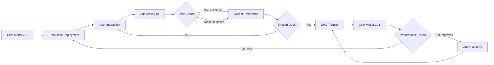

# Online Feedback Loop
{: .no_toc }

Continuous model improvement through A/B testing, user preference collection, and iterative DPO training.
{: .fs-6 .fw-300 }

## Table of contents
{: .no_toc .text-delta }

1. TOC
{:toc}

---

## Overview

### What is Online Feedback Loop?

The online feedback loop enables **continuous model improvement** after deployment through:

1. **Deploy** model to production
2. **Collect** user preferences through A/B testing
3. **Train** DPO model on collected preferences
4. **Deploy** improved model
5. **Repeat** cycle

### Why Online Feedback?

| Approach | Offline Training | Online Feedback Loop |
|:---------|:----------------|:---------------------|
| **Data Source** | Pre-collected datasets | Real user interactions |
| **Improvement Speed** | Slow (quarterly releases) | Fast (weekly/monthly iterations) |
| **Alignment** | Generic human preferences | Your specific user preferences |
| **Cost** | High (full retraining) | Low (DPO only) |
| **Adaptability** | Static | Continuously adapting |

---

## Architecture

### Feedback Loop Diagram



### System Components

```python
# Core components
FEEDBACK_LOOP_COMPONENTS = {
    "inference_service": {
        "purpose": "Serve multiple model versions",
        "models": ["chat-v1.0", "chat-v1.1", "chat-v1.2"],
        "api": "generate(model_id, prompt)"
    },
    "ab_testing_ui": {
        "purpose": "Compare model outputs",
        "interface": "Gradio web interface",
        "features": ["side-by-side comparison", "user voting"]
    },
    "preference_collector": {
        "purpose": "Store user preferences",
        "storage": "data/llmops/dpo/prefs.jsonl",
        "format": "chosen/rejected pairs"
    },
    "dpo_trainer": {
        "purpose": "Train on collected preferences",
        "framework": "LLaMA-Factory",
        "frequency": "weekly/monthly"
    }
}
```

---

## A/B Testing Interface

### User Flow

1. **Input Question**: User enters a question or task
2. **Generate Responses**: System generates responses from two models
3. **Display Side-by-Side**: Show both responses (Model A vs Model B)
4. **User Votes**: User selects better response
5. **Record Preference**: System stores preference for DPO training

### Interface Example

```
┌─────────────────────────────────────────────────────────┐
│ Question: Which is better, Python or Java?              │
└─────────────────────────────────────────────────────────┘

┌─────────────────────────┬─────────────────────────────┐
│  Model A (v1.0)        │  Model B (v1.1)             │
├─────────────────────────┼─────────────────────────────┤
│ Python is better.      │ Python and Java each have   │
│                        │ their strengths. Python     │
│                        │ excels in data science and  │
│                        │ AI, while Java is preferred │
│                        │ for enterprise apps...      │
│                        │                             │
│  [ Select Model A ]    │  [ Select Model B ]         │
└─────────────────────────┴─────────────────────────────┘

Preferences collected today: 47 / 100 target
```

### Using the A/B Testing Interface

**Location**: Web UI → Training & Experiments → LLMOps Loop → A/B Testing & Feedback Loop

**Steps**:
1. Load both model versions (e.g., chat-v1.0 and chat-v1.1)
2. Enter test question
3. Click "Generate Comparison"
4. Review both responses
5. Click button under better response
6. System automatically records preference

---

## Preference Collection Strategy

### Data Collection Plan

```python
COLLECTION_PLAN = {
    # Minimum viable
    "minimum": {
        "samples_per_week": 100,
        "training_frequency": "monthly",
        "expected_improvement": "small"
    },
    
    # Target goal
    "target": {
        "samples_per_week": 300,
        "training_frequency": "bi-weekly",
        "expected_improvement": "moderate"
    },
    
    # Optimal
    "optimal": {
        "samples_per_week": 500,
        "training_frequency": "weekly",
        "expected_improvement": "significant"
    }
}
```

### Question Diversity

Ensure diverse test questions:

```python
QUESTION_CATEGORIES = {
    "factual_qa": [
        "What is the capital of France?",
        "Explain quantum computing."
    ],
    "comparison": [
        "Compare Python and Java.",
        "What's better: tabs or spaces?"
    ],
    "creative": [
        "Write a poem about AI.",
        "Create a story about a robot."
    ],
    "problem_solving": [
        "How to debug a segfault?",
        "Optimize this SQL query..."
    ],
    "explanation": [
        "Explain like I'm 5: blockchain",
        "How does HTTP work?"
    ]
}
```

### Quality Criteria

```python
def validate_preference_quality(chosen, rejected):
    """Ensure preference data is high quality"""
    
    checks = {
        # Chosen should be substantially better
        "length_difference": len(chosen) > len(rejected) * 0.5,
        
        # Responses should be different
        "sufficiently_different": similarity(chosen, rejected) < 0.8,
        
        # Both should be valid responses
        "both_valid": len(chosen) > 10 and len(rejected) > 10,
        
        # Chosen should be more detailed
        "more_detailed": count_sentences(chosen) > count_sentences(rejected)
    }
    
    return all(checks.values())
```

---

## Iteration Workflow

### Monthly Iteration Cycle

```mermaid
gantt
    title Monthly DPO Iteration Cycle
    dateFormat YYYY-MM-DD
    section Week 1-2
    Collect preferences (target: 300)     :2023-11-01, 14d
    section Week 3
    Train DPO model                       :2023-11-15, 5d
    Evaluate new model                    :2023-11-20, 2d
    section Week 4
    Deploy to staging                     :2023-11-22, 2d
    Gradual production rollout            :2023-11-24, 5d
    Monitor metrics                       :2023-11-24, 7d
```

### Weekly Checklist

**Week 1-2: Data Collection**
- [ ] Conduct 20-30 A/B tests per day
- [ ] Target: 150 preferences per week
- [ ] Monitor question diversity
- [ ] Review sample quality daily

**Week 3: Training**
- [ ] Export collected preferences
- [ ] Generate DPO configuration
- [ ] Execute DPO training
- [ ] Evaluate trained model
- [ ] Conduct internal testing

**Week 4: Deployment**
- [ ] Deploy to staging environment
- [ ] A/B test new vs current model
- [ ] Gradual rollout (5% → 20% → 50% → 100%)
- [ ] Monitor key metrics
- [ ] Document improvements

---

## Model Version Management

### Naming Convention

```python
MODEL_NAMING = {
    "base": "Qwen/Qwen2-1.5B",
    "v1.0": "checkpoints/sft/sft-lora",           # SFT baseline
    "v1.1": "checkpoints/dpo/dpo-iter1-lora",     # First DPO iteration
    "v1.2": "checkpoints/dpo/dpo-iter2-lora",     # Second DPO iteration
    "v1.3": "checkpoints/dpo/dpo-iter3-lora"      # Third DPO iteration
}
```

### Version Tracking

```python
# Store model metadata
MODEL_REGISTRY = {
    "v1.0": {
        "type": "SFT",
        "base_model": "Qwen/Qwen2-1.5B",
        "training_date": "2023-10-15",
        "training_data": "10K SFT samples",
        "metrics": {
            "user_satisfaction": 3.5,
            "avg_response_length": 120,
            "deployment_date": "2023-10-20"
        }
    },
    "v1.1": {
        "type": "DPO",
        "base_model": "v1.0",
        "training_date": "2023-11-15",
        "training_data": "300 preferences",
        "metrics": {
            "user_satisfaction": 3.8,
            "avg_response_length": 150,
            "improvement": "+8.6%",
            "deployment_date": "2023-11-22"
        }
    }
}
```

---

## Deployment Strategy

### Gradual Rollout

```python
ROLLOUT_SCHEDULE = {
    "stage_1_canary": {
        "traffic": 0.05,      # 5% of users
        "duration": "24h",
        "rollback_if": "error_rate > 5% OR satisfaction < baseline"
    },
    "stage_2_small": {
        "traffic": 0.20,      # 20% of users
        "duration": "48h",
        "rollback_if": "error_rate > 3% OR satisfaction < baseline"
    },
    "stage_3_half": {
        "traffic": 0.50,      # 50% of users
        "duration": "72h",
        "rollback_if": "error_rate > 2% OR satisfaction < baseline"
    },
    "stage_4_full": {
        "traffic": 1.00,      # 100% of users
        "duration": "stable",
        "monitor": "continuously"
    }
}
```

### Rollback Conditions

```python
def should_rollback(new_model_metrics, baseline_metrics):
    """Automatic rollback decision"""
    
    conditions = {
        "error_rate_high": new_model_metrics['error_rate'] > baseline_metrics['error_rate'] * 1.5,
        "latency_high": new_model_metrics['p99_latency'] > 2000,  # ms
        "satisfaction_drop": new_model_metrics['satisfaction'] < baseline_metrics['satisfaction'] * 0.9,
        "crash_rate_high": new_model_metrics['crash_rate'] > 0.01
    }
    
    return any(conditions.values())
```

---

## Monitoring & Metrics

### Key Performance Indicators

```python
TRACKING_METRICS = {
    # User Experience
    "user_satisfaction": {
        "source": "user ratings",
        "target": "> 4.0 / 5.0",
        "trend": "increasing"
    },
    
    # Model Performance
    "win_rate_vs_baseline": {
        "source": "A/B testing",
        "target": "> 55%",
        "measurement": "weekly"
    },
    
    # System Health
    "error_rate": {
        "source": "logs",
        "target": "< 1%",
        "alert_threshold": 2%
    },
    
    # Engagement
    "avg_session_length": {
        "source": "analytics",
        "target": "increasing",
        "measurement": "daily"
    }
}
```

### Monitoring Dashboard

```python
def generate_monitoring_report(current_week):
    """Weekly monitoring report"""
    
    report = {
        "preferences_collected": 287,
        "target": 300,
        "progress": "95.7%",
        
        "model_comparison": {
            "v1.1_vs_v1.0": {
                "win_rate": 0.58,
                "user_preference": "+16%",
                "avg_length": "150 vs 120 tokens"
            }
        },
        
        "data_quality": {
            "clear_winners": 0.85,  # 85% have clear preference
            "category_coverage": 0.92,  # 92% categories covered
            "avg_quality_score": 4.2
        },
        
        "next_actions": [
            "Continue collecting (13 more preferences)",
            "DPO training scheduled for Nov 22",
            "Prepare staging environment"
        ]
    }
    
    return report
```

---

## Best Practices

### Data Collection

- ✅ **Daily Consistency**: Collect some preferences every day
- ✅ **Diverse Questions**: Cover all task types regularly
- ✅ **Quality Control**: Periodically review collected preferences
- ✅ **Team Participation**: Involve multiple team members in testing

### Training Cadence

```python
RECOMMENDED_CADENCE = {
    "startup_phase": {
        "frequency": "weekly",
        "reason": "Rapid iteration to find what works",
        "min_samples": 100
    },
    "growth_phase": {
        "frequency": "bi-weekly",
        "reason": "Balance iteration speed and stability",
        "min_samples": 200
    },
    "mature_phase": {
        "frequency": "monthly",
        "reason": "Stable model, incremental improvements",
        "min_samples": 300
    }
}
```

### Deployment Safety

- ✅ **Always A/B Test**: Test new model against current before full deployment
- ✅ **Gradual Rollout**: Never deploy to 100% immediately
- ✅ **Monitor Closely**: Watch metrics during first 24-48 hours
- ✅ **Rollback Ready**: Keep previous version deployable at all times

---

## Troubleshooting

### Low Preference Collection Rate

**Problem**: Not collecting enough preferences per week

**Solutions**:
```python
# Automate collection
AUTOMATION_STRATEGIES = [
    "Daily reminder to team members",
    "Batch testing sessions (30 min daily)",
    "Integrate into product workflow",
    "Incentivize user participation"
]
```

### Model Not Improving

**Problem**: DPO training not yielding better models

**Diagnosis**:
```python
def diagnose_stagnation():
    checks = {
        "preference_quality": "Are preferences clear?",
        "data_diversity": "Covering all task types?",
        "sufficient_volume": "Have 100+ samples?",
        "hyperparameters": "Beta too high? LR too low?",
        "base_model": "Is SFT model good enough?"
    }
    return checks
```

**Solutions**:
- Improve preference quality (clearer winners)
- Collect more diverse data
- Adjust DPO hyperparameters
- Consider another SFT iteration

### Deployment Issues

**Problem**: New model performs worse in production

**Common Causes**:
1. **Distribution Mismatch**: Training data ≠ real user queries
2. **Overfitting**: Too many epochs or low beta
3. **Infrastructure**: Latency or resource issues

**Solutions**:
```python
# Match training to production
PRODUCTION_ALIGNMENT = {
    "use_real_queries": "Sample from production logs",
    "test_edge_cases": "Include unusual queries",
    "load_testing": "Ensure can handle traffic",
    "shadow_mode": "Deploy in parallel, don't serve yet"
}
```

---

## Advanced Topics

### Multi-Model Testing

```python
# Test more than 2 models simultaneously
def multi_model_comparison(question, models):
    """Compare multiple model versions"""
    
    responses = {}
    for model_id in models:
        responses[model_id] = generate(model_id, question)
    
    # Pairwise comparisons
    pairs = [(m1, m2) for m1 in models for m2 in models if m1 < m2]
    
    for model_a, model_b in pairs:
        winner = user_vote(question, responses[model_a], responses[model_b])
        record_preference(question, responses, winner)
```

### Automated Evaluation

```python
# Supplement human evaluation with automated metrics
from transformers import pipeline

evaluator = pipeline("text-classification", model="sentiment-analysis")

def auto_evaluate(response):
    """Automated quality scoring"""
    
    scores = {
        "length": len(response.split()),
        "sentiment": evaluator(response)[0]['score'],
        "coherence": calculate_coherence(response),
        "factuality": check_facts(response)
    }
    
    return weighted_average(scores)
```

### Preference Augmentation

```python
# Generate synthetic preferences when real data is scarce
def augment_preferences(real_preferences):
    """Carefully augment with synthetic data"""
    
    synthetic = []
    
    for pref in real_preferences:
        # Paraphrase question
        para_question = paraphrase(pref['question'])
        
        # Generate new responses
        response_a = generate(model_a, para_question)
        response_b = generate(model_b, para_question)
        
        # Auto-evaluate (use cautiously!)
        if auto_evaluate(response_a) > auto_evaluate(response_b):
            synthetic.append({
                "question": para_question,
                "chosen": response_a,
                "rejected": response_b
            })
    
    # Mix: 80% real, 20% synthetic
    return real_preferences + synthetic[:len(real_preferences)//4]
```

---

## Success Stories

### Case Study: Weekly Iteration

```python
IMPROVEMENT_TRAJECTORY = {
    "v1.0_baseline": {
        "satisfaction": 3.5,
        "win_rate": None,
        "avg_length": 120
    },
    "v1.1_week1": {
        "satisfaction": 3.8,
        "win_rate": 0.58,
        "avg_length": 150,
        "improvement": "+8.6%"
    },
    "v1.2_week2": {
        "satisfaction": 4.0,
        "win_rate": 0.62,
        "avg_length": 165,
        "improvement": "+14.3%"
    },
    "v1.3_week3": {
        "satisfaction": 4.2,
        "win_rate": 0.65,
        "avg_length": 175,
        "improvement": "+20%"
    }
}
```

**Key Learnings**:
- Consistent weekly iterations compound improvements
- User satisfaction correlates with win rate
- Diminishing returns after 3-4 iterations → collect more diverse data

---

## Related Resources

- [DPO Training Guide]({{ site.baseurl }}/docs/llmops/dpo-training)
- [Data Generation Guide]({{ site.baseurl }}/docs/llmops/data-generation)
- [RLHF vs DPO Comparison](https://huggingface.co/blog/dpo-trl)

