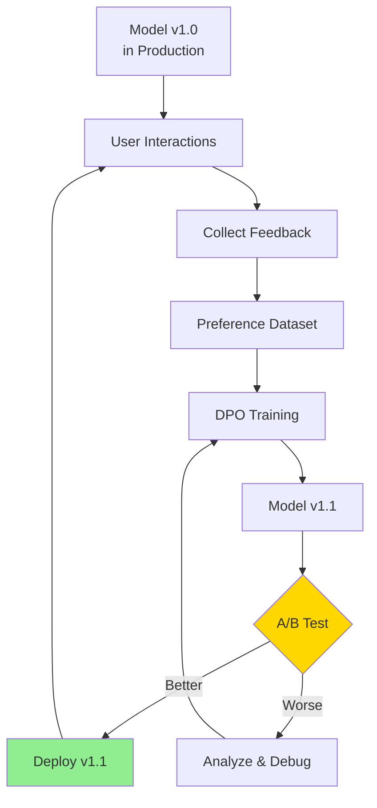
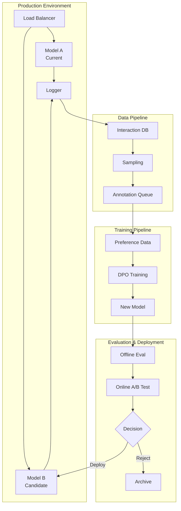

# Online Feedback Loop
{: .no_toc }

Continuous model improvement through production feedback and iterative DPO training.
{: .fs-6 .fw-300 }

## Table of contents
{: .no_toc .text-delta }

1. TOC
{:toc}

---

## Overview

### What is the Online Loop?

The online feedback loop enables continuous model improvement by collecting real user feedback from production, converting it into preference data, and using DPO training to create incrementally better model versions.

**Complete Cycle**:



---

## System Architecture

### Components



---

## Implementation

### 1. Interaction Logging

**Log Format**:

```python
interaction_log = {
    "interaction_id": "uuid-string",
    "timestamp": "2024-01-15T10:30:00Z",
    "model_version": "v1.0",
    "user_id": "user-123",
    "conversation": [
        {"role": "user", "content": "Explain quantum computing"},
        {"role": "assistant", "content": "Quantum computing uses..."}
    ],
    "metadata": {
        "latency_ms": 250,
        "tokens_generated": 150
    }
}
```

**Logging Implementation**:

```python
import json
import sqlite3
from datetime import datetime

class InteractionLogger:
    def __init__(self, db_path="data/llmops/interactions.db"):
        self.conn = sqlite3.connect(db_path)
        self.create_tables()
    
    def create_tables(self):
        self.conn.execute("""
            CREATE TABLE IF NOT EXISTS interactions (
                id TEXT PRIMARY KEY,
                timestamp DATETIME,
                model_version TEXT,
                user_id TEXT,
                conversation TEXT,
                feedback_score INTEGER,
                metadata TEXT
            )
        """)
    
    def log_interaction(self, interaction):
        self.conn.execute("""
            INSERT INTO interactions VALUES (?, ?, ?, ?, ?, ?, ?)
        """, (
            interaction['interaction_id'],
            interaction['timestamp'],
            interaction['model_version'],
            interaction['user_id'],
            json.dumps(interaction['conversation']),
            interaction.get('feedback_score'),
            json.dumps(interaction.get('metadata', {}))
        ))
        self.conn.commit()
    
    def get_interactions(self, start_date, end_date, model_version=None):
        query = """
            SELECT * FROM interactions 
            WHERE timestamp BETWEEN ? AND ?
        """
        params = [start_date, end_date]
        
        if model_version:
            query += " AND model_version = ?"
            params.append(model_version)
        
        return self.conn.execute(query, params).fetchall()
```

### 2. Feedback Collection

**Implicit Feedback**:

```python
def collect_implicit_feedback(interactions):
    """Infer quality from user behavior"""
    
    scored_interactions = []
    
    for interaction in interactions:
        score = 0
        
        # Positive signals
        if interaction.get('user_continued'):  # User kept chatting
            score += 2
        if interaction.get('session_duration') > 300:  # > 5 minutes
            score += 1
        if interaction.get('copied_response'):  # User copied output
            score += 2
        
        # Negative signals
        if interaction.get('regenerated'):  # User hit regenerate
            score -= 2
        if interaction.get('session_duration') < 30:  # < 30 seconds
            score -= 1
        if interaction.get('reported'):  # User reported
            score -= 5
        
        interaction['implicit_score'] = score
        scored_interactions.append(interaction)
    
    return scored_interactions
```

**Explicit Feedback UI**:

```python
import gradio as gr

def create_feedback_ui():
    """UI for collecting explicit user feedback"""
    
    def save_feedback(conversation_id, rating, comment):
        feedback = {
            "conversation_id": conversation_id,
            "rating": rating,  # 1-5 stars
            "comment": comment,
            "timestamp": datetime.now().isoformat()
        }
        
        save_to_db(feedback)
        return "Thank you for your feedback!"
    
    with gr.Blocks() as demo:
        gr.Markdown("## Rate this conversation")
        
        rating = gr.Slider(1, 5, step=1, label="Rating")
        comment = gr.Textbox(label="Comments (optional)", lines=3)
        submit_btn = gr.Button("Submit Feedback")
        
        output = gr.Textbox(label="Status")
        
        submit_btn.click(
            save_feedback,
            inputs=[rating, comment],
            outputs=[output]
        )
    
    return demo
```

### 3. Data Sampling & Annotation

**Intelligent Sampling**:

```python
def sample_for_annotation(interactions, target_count=1000):
    """Sample diverse, high-value interactions for annotation"""
    
    # Priority factors
    def priority_score(interaction):
        score = 0
        
        # Diverse topics
        if is_new_topic(interaction):
            score += 3
        
        # User engagement
        if interaction['implicit_score'] > 0:
            score += 2
        
        # Model uncertainty (if available)
        if interaction.get('uncertainty', 0) > 0.5:
            score += 2
        
        # Edge cases
        if is_edge_case(interaction):
            score += 3
        
        return score
    
    # Score and sort
    scored = [(priority_score(i), i) for i in interactions]
    scored.sort(reverse=True, key=lambda x: x[0])
    
    # Sample top + random for diversity
    top_n = int(target_count * 0.7)
    random_n = target_count - top_n
    
    sampled = [i for _, i in scored[:top_n]]
    sampled += random.sample([i for _, i in scored[top_n:]], random_n)
    
    return sampled
```

**Annotation Interface**:

```python
def create_annotation_ui(sampled_interactions):
    """UI for annotators to create preference pairs"""
    
    def generate_alternative(prompt, original_response):
        """Generate alternative response for comparison"""
        # Could use different model or different sampling params
        alternative = stronger_model.generate(prompt, temperature=0.7)
        return alternative
    
    def save_preference(interaction_id, prompt, response_a, response_b, choice):
        if choice == "A":
            chosen, rejected = response_a, response_b
        else:
            chosen, rejected = response_b, response_a
        
        preference = {
            "conversations": [{"from": "user", "value": prompt}],
            "chosen": chosen,
            "rejected": rejected,
            "source": "human_annotation",
            "interaction_id": interaction_id
        }
        
        with open('data/llmops/dpo/online_preferences.jsonl', 'a') as f:
            f.write(json.dumps(preference) + '\n')
    
    with gr.Blocks() as demo:
        state = gr.State({"current_idx": 0})
        
        with gr.Row():
            prompt_display = gr.Textbox(label="User Prompt", interactive=False)
        
        with gr.Row():
            with gr.Column():
                response_a = gr.Textbox(label="Response A", lines=10)
                choose_a = gr.Button("Choose A")
            
            with gr.Column():
                response_b = gr.Textbox(label="Response B", lines=10)
                choose_b = gr.Button("Choose B")
        
        equal_btn = gr.Button("Both Equal / Both Bad")
        skip_btn = gr.Button("Skip")
        
        progress = gr.Textbox(label="Progress")
        
        # Button callbacks...
    
    return demo
```

### 4. DPO Training

**Automated Training Pipeline**:

```python
import subprocess
import yaml

def trigger_dpo_training(preference_file, base_model):
    """Automatically trigger DPO training with new preferences"""
    
    # Create config
    config = {
        "model_name_or_path": base_model,
        "stage": "dpo",
        "dataset": "online_preferences",
        "output_dir": f"checkpoints/dpo/{datetime.now().strftime('%Y%m%d_%H%M')}",
        "learning_rate": 5e-7,
        "num_train_epochs": 1,
        # ... other params
    }
    
    config_path = "config/auto_dpo.yaml"
    with open(config_path, 'w') as f:
        yaml.dump(config, f)
    
    # Launch training
    subprocess.run([
        "llamafactory-cli", "train",
        "--config_file", config_path
    ])
    
    return config['output_dir']
```

### 5. A/B Testing

**Traffic Splitting**:

```python
class ABTestRouter:
    def __init__(self, model_a, model_b, split_ratio=0.5):
        self.model_a = model_a  # Current version
        self.model_b = model_b  # New candidate
        self.split_ratio = split_ratio
    
    def route_request(self, user_id, prompt):
        """Route user to model A or B"""
        
        # Consistent hashing for user stickiness
        user_hash = hash(user_id)
        
        if (user_hash % 100) < (self.split_ratio * 100):
            model = self.model_a
            version = "A"
        else:
            model = self.model_b
            version = "B"
        
        response = model.generate(prompt)
        
        # Log for analysis
        log_ab_test(user_id, version, prompt, response)
        
        return response, version
```

**Metrics Collection**:

```python
def analyze_ab_test(start_date, end_date):
    """Analyze A/B test results"""
    
    results_a = get_interactions(start_date, end_date, model_version="A")
    results_b = get_interactions(start_date, end_date, model_version="B")
    
    metrics = {
        "model_a": calculate_metrics(results_a),
        "model_b": calculate_metrics(results_b)
    }
    
    # Statistical significance
    metrics['significance'] = ttest_ind(
        [r['feedback_score'] for r in results_a],
        [r['feedback_score'] for r in results_b]
    )
    
    return metrics

def calculate_metrics(interactions):
    """Calculate performance metrics"""
    return {
        "avg_rating": mean([i['feedback_score'] for i in interactions]),
        "engagement_rate": sum(i['user_continued'] for i in interactions) / len(interactions),
        "avg_session_duration": mean([i['session_duration'] for i in interactions]),
        "regeneration_rate": sum(i['regenerated'] for i in interactions) / len(interactions)
    }
```

---

## Best Practices

### Iteration Cycle

**Recommended Timeline**:
- **Week 1**: Collect feedback (target: 10K interactions, 1K annotated)
- **Week 2**: DPO training (1 epoch, takes 4-8 hours)
- **Week 3**: Offline eval + A/B test (50/50 split)
- **Week 4**: Analyze results, deploy if better

### Quality Gates

Before deploying new model:

```python
def quality_gate_check(new_model, baseline_model):
    """Check if new model passes quality gates"""
    
    checks = {
        "offline_eval": offline_eval(new_model) > offline_eval(baseline_model),
        "safety_check": safety_score(new_model) > 0.95,
        "ab_test": ab_test_winner(new_model, baseline_model),
        "regression_test": no_regressions(new_model, baseline_model)
    }
    
    passed = all(checks.values())
    
    return passed, checks
```

### Monitoring

**Key Metrics to Track**:
- Model version in production
- Daily active users per version
- Average feedback score (by version)
- Regeneration rate
- Reported issues
- Latency p50/p95/p99

---

## Example: Weekly Iteration

### Monday: Data Collection

```bash
# Export last week's interactions
python scripts/export_interactions.py \
    --start-date 2024-01-08 \
    --end-date 2024-01-14 \
    --output data/week_01_interactions.jsonl

# Output: 15,234 interactions collected
```

### Tuesday: Annotation

```bash
# Sample for annotation
python scripts/sample_for_annotation.py \
    --input data/week_01_interactions.jsonl \
    --output data/week_01_sampled.jsonl \
    --count 1000

# Launch annotation UI
python scripts/annotation_ui.py \
    --input data/week_01_sampled.jsonl \
    --output data/llmops/dpo/week_01_preferences.jsonl

# Annotators work throughout the day
# Output: 856 preference pairs created
```

### Wednesday: DPO Training

```bash
# Train DPO
llamafactory-cli train \
    --config_file config/online_dpo.yaml

# Training takes ~6 hours on 4x A100
# Output: checkpoints/dpo/v1.1
```

### Thursday: Evaluation

```bash
# Offline evaluation
python scripts/evaluate.py \
    --model checkpoints/dpo/v1.1 \
    --benchmarks mtbench,alpacaeval

# Results:
# MT-Bench: 7.8 → 8.1 (+0.3) ✓
# AlpacaEval: 82% → 85% (+3%) ✓

# Start A/B test
python scripts/start_ab_test.py \
    --model-a checkpoints/v1.0 \
    --model-b checkpoints/dpo/v1.1 \
    --split 50/50 \
    --duration 48h
```

### Friday: Analysis & Deploy

```bash
# Analyze A/B test
python scripts/analyze_ab_test.py \
    --test-id week_01

# Results:
# Model B win rate: 58% (p < 0.01) ✓
# User engagement: +12% ✓
# Safety score: 0.97 (no change) ✓

# Deploy
python scripts/deploy.py \
    --model checkpoints/dpo/v1.1 \
    --version v1.1 \
    --traffic 100

# v1.1 now serving 100% of traffic
```

---

## Troubleshooting

### Model Not Improving

**Possible Causes**:
- Low-quality preference data
- Not enough data (need 500+ pairs)
- Learning rate too high/low
- Training too many epochs (overfitting)

**Solutions**:
- Review annotation quality
- Collect more diverse preferences
- Tune hyperparameters
- Use early stopping

### A/B Test Inconclusive

**Possible Causes**:
- Too small sample size
- Metrics not sensitive enough
- Real improvement is small

**Solutions**:
- Run longer (more users)
- Track more granular metrics
- Consider deploying if no regressions

---

## Resources

### Papers

- [Learning from Human Feedback](https://arxiv.org/abs/2203.02155)
- [Constitutional AI](https://arxiv.org/abs/2212.08073)
- [RLHF at Scale](https://arxiv.org/abs/2204.05862)

### Tools

- [Label Studio](https://labelstud.io/) - Annotation platform
- [Weights & Biases](https://wandb.ai/) - Experiment tracking
- [MLflow](https://mlflow.org/) - Model registry

### Case Studies

- [ChatGPT's Iterative Deployment](https://openai.com/blog/chatgpt)
- [Claude's Constitutional AI](https://www.anthropic.com/index/constitutional-ai-harmlessness-from-ai-feedback)

