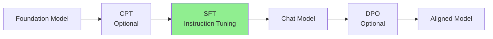

# Supervised Fine-Tuning (SFT)
{: .no_toc }

Instruction tuning to transform language models into helpful AI assistants.
{: .fs-6 .fw-300 }

## Table of contents
{: .no_toc .text-delta }

1. TOC
{:toc}

---

## Overview

### What is SFT?

Supervised Fine-Tuning (SFT) teaches a language model to follow instructions by training on demonstration data where human experts provide desired outputs for given inputs.

**Training Pipeline Position**:



**Key Transformations**:
- Completion Model → Instruction-Following Model
- Raw text generation → Conversational ability
- Knowledge recall → Task execution

---

## Technical Details

### Training Objective

SFT optimizes the model to predict assistant responses given user instructions:

$$
\mathcal{L}_{\text{SFT}} = -\sum_{i=1}^{N} \log P(y_i \mid x_i; \theta)
$$

Where:
- \(x_i\) is the instruction/input
- \(y_i\) is the desired output
- \(N\) is the number of examples

### Data Format

**Standard SFT Format** (Alpaca-style):

```json
{
  "instruction": "Write a Python function to calculate factorial",
  "input": "",
  "output": "def factorial(n):\n    if n == 0 or n == 1:\n        return 1\n    return n * factorial(n-1)"
}
```

**Conversational Format** (ChatML):

```json
{
  "conversations": [
    {"from": "user", "value": "What is machine learning?"},
    {"from": "assistant", "value": "Machine learning is a branch of AI..."}
  ]
}
```

**Multi-Turn Dialogue**:

```json
{
  "conversations": [
    {"from": "user", "value": "Hello!"},
    {"from": "assistant", "value": "Hi! How can I help you today?"},
    {"from": "user", "value": "Tell me about Python"},
    {"from": "assistant", "value": "Python is a high-level programming language..."}
  ]
}
```

---

## Configuration

### LLaMA-Factory YAML Config

```yaml
# SFT Configuration Example
model_name_or_path: checkpoints/cpt/domain-model  # or base model
stage: sft  # supervised fine-tuning
do_train: true
dataset: alpaca_en,self_cognition
template: qwen  # chat template

# Data processing
cutoff_len: 2048
max_samples: 50000
overwrite_cache: true

# Training hyperparameters
per_device_train_batch_size: 2
gradient_accumulation_steps: 16
learning_rate: 5.0e-5
num_train_epochs: 3.0
lr_scheduler_type: cosine
warmup_ratio: 0.1

# Optimization
fp16: true
gradient_checkpointing: true

# LoRA configuration
finetuning_type: lora
lora_target: all
lora_rank: 32
lora_alpha: 64
lora_dropout: 0.1

# Evaluation
val_size: 0.1
eval_strategy: steps
eval_steps: 500

# Output
output_dir: checkpoints/sft/chat-model
logging_steps: 10
save_steps: 1000
save_total_limit: 3
```

---

## Data Preparation

### Self-Instruct Data Generation

**Automated Instruction Generation**:

```python
import json
from openai import OpenAI

client = OpenAI()

def generate_instruction_data(seed_examples, num_samples=100):
    """Generate instruction-following examples using GPT-4"""
    
    generated_data = []
    
    for i in range(num_samples):
        # Create prompt with seed examples
        prompt = f"""Generate a diverse instruction-following example.

Seed examples:
{json.dumps(seed_examples[:3], indent=2)}

Create a NEW example with:
1. A clear instruction
2. Optional input context
3. A helpful, detailed output

Format as JSON with keys: instruction, input, output"""
        
        response = client.chat.completions.create(
            model="gpt-4",
            messages=[{"role": "user", "content": prompt}],
            temperature=1.0
        )
        
        try:
            example = json.loads(response.choices[0].message.content)
            generated_data.append(example)
        except:
            continue
    
    return generated_data

# Generate data
seed_data = [
    {
        "instruction": "Explain quantum computing",
        "input": "",
        "output": "Quantum computing uses quantum mechanics..."
    },
    # More seed examples...
]

sft_data = generate_instruction_data(seed_data, num_samples=1000)

# Save to file
with open('data/llmops/sft/generated_instructions.json', 'w') as f:
    json.dump(sft_data, f, indent=2, ensure_ascii=False)
```

### Dataset Registration

```json
{
  "custom_instructions": {
    "file_name": "sft/generated_instructions.json",
    "formatting": "alpaca",
    "columns": {
      "prompt": "instruction",
      "query": "input",
      "response": "output"
    }
  }
}
```

---

## Training Process

### Launch Training

**Web UI**:
1. Select "Supervised Fine-Tuning" stage
2. Load model (base or CPT checkpoint)
3. Choose instruction datasets
4. Configure hyperparameters
5. Start training

**Command Line**:
```bash
llamafactory-cli train \
    --config_file config/sft_config.yaml
```

**Multi-GPU Training**:
```bash
CUDA_VISIBLE_DEVICES=0,1,2,3 \
NPROC_PER_NODE=4 \
llamafactory-cli train \
    --config_file config/sft_config.yaml \
    --deepspeed config/ds_zero2.json
```

### Monitor Training

**Key Metrics**:
- **Training Loss**: Should decrease to 0.5-1.5
- **Eval Loss**: Should track training loss closely
- **Learning Rate**: Warmup → plateau → decay
- **Grad Norm**: Stable around 0.5-2.0

**TensorBoard Visualization**:
```bash
tensorboard --logdir=checkpoints/sft/chat-model/runs
```

---

## Best Practices

### Data Quality

**High-Quality Instructions**:
- Clear and specific
- Diverse in topics and complexity
- Appropriate response length
- Natural conversational flow

**Example Quality Criteria**:
```python
def assess_quality(example):
    scores = {}
    
    # Instruction clarity (1-5)
    scores['clarity'] = rate_clarity(example['instruction'])
    
    # Response helpfulness (1-5)
    scores['helpfulness'] = rate_helpfulness(example['output'])
    
    # Formatting correctness (1-5)
    scores['formatting'] = check_format(example)
    
    # Overall quality
    return sum(scores.values()) / len(scores)

# Filter high-quality examples
quality_threshold = 4.0
filtered_data = [
    ex for ex in sft_data 
    if assess_quality(ex) >= quality_threshold
]
```

### Data Diversity

**Balance Across Categories**:
- Creative writing: 20%
- Question answering: 25%
- Code generation: 15%
- Analysis & reasoning: 20%
- Conversational: 20%

**Difficulty Distribution**:
- Simple tasks: 30%
- Medium complexity: 50%
- Complex multi-step: 20%

### Hyperparameter Tuning

| Parameter | Conservative | Balanced | Aggressive |
|:----------|:-------------|:---------|:-----------|
| **Learning Rate** | 1e-5 | 5e-5 | 1e-4 |
| **LoRA Rank** | 8 | 32 | 64 |
| **Epochs** | 1-2 | 3-5 | 5-10 |
| **Batch Size** | 8 | 32 | 64 |

**Recommendation**: Start with Balanced, then tune based on eval metrics.

---

## Evaluation

### Automated Evaluation

**Loss-Based Metrics**:
```python
# Evaluate on held-out test set
eval_results = trainer.evaluate()

print(f"Eval Loss: {eval_results['eval_loss']:.4f}")
print(f"Eval Perplexity: {math.exp(eval_results['eval_loss']):.2f}")
```

**Benchmark Evaluation**:
- **MMLU**: Multi-task language understanding
- **HumanEval**: Code generation
- **MT-Bench**: Multi-turn conversation
- **AlpacaEval**: Instruction following

### Human Evaluation

**Evaluation Dimensions**:
1. **Helpfulness**: Does it answer the question?
2. **Accuracy**: Is the information correct?
3. **Clarity**: Is the response well-structured?
4. **Safety**: Is it harmful or biased?

**Evaluation Template**:
```python
evaluation_template = {
    "instruction": "...",
    "model_output": "...",
    "ratings": {
        "helpfulness": 0,  # 1-5
        "accuracy": 0,
        "clarity": 0,
        "safety": 0
    },
    "preferred_response": "..."  # Optional
}
```

---

## Common Issues

### Overfitting

**Symptoms**:
- Perfect training loss but poor generation quality
- Model repeats training examples verbatim
- Poor generalization to new instructions

**Solutions**:
```yaml
# Increase regularization
lora_dropout: 0.15

# Early stopping
save_strategy: steps
eval_steps: 500
load_best_model_at_end: true

# More diverse data
max_samples: null  # Use full dataset
```

### Catastrophic Forgetting

**Problem**: Model loses general capabilities after SFT

**Solutions**:
1. **Mix in General Data**:
   ```yaml
   dataset: alpaca_en,sharegpt,general_qa
   ```

2. **Lower Learning Rate**:
   ```yaml
   learning_rate: 2.0e-5  # Instead of 5e-5
   ```

3. **Shorter Training**:
   ```yaml
   num_train_epochs: 1.0  # Instead of 3.0
   ```

### Poor Instruction Following

**Symptoms**:
- Model doesn't follow instruction format
- Ignores specific requirements
- Generates off-topic responses

**Solutions**:
1. **Better Chat Template**:
   ```yaml
   template: qwen  # or llama3, chatml
   ```

2. **Add System Prompts**:
   ```json
   {
     "conversations": [
       {"from": "system", "value": "You are a helpful assistant."},
       {"from": "user", "value": "..."},
       {"from": "assistant", "value": "..."}
     ]
   }
   ```

3. **More Instruction-Following Examples**:
   - Include strict format-following examples
   - Add multi-step instruction examples

---

## Advanced Techniques

### Multi-Task Learning

Train on multiple task types simultaneously:

```yaml
dataset: >
  alpaca_en,  # General instructions
  code_alpaca,  # Code tasks
  math_reasoning,  # Math problems
  qa_pairs  # Question answering
```

### Curriculum Learning

Start with simple examples, gradually increase difficulty:

```python
# Sort data by complexity
sorted_data = sorted(sft_data, key=lambda x: estimate_complexity(x))

# Create curriculum splits
easy_split = sorted_data[:len(sorted_data)//3]
medium_split = sorted_data[len(sorted_data)//3:2*len(sorted_data)//3]
hard_split = sorted_data[2*len(sorted_data)//3:]

# Train in stages
for split_name, split_data in [("easy", easy_split), 
                                ("medium", medium_split), 
                                ("hard", hard_split)]:
    print(f"Training on {split_name} examples...")
    train_sft(split_data)
```

### Data Augmentation

```python
def augment_instruction(example):
    """Create variations of the instruction"""
    variations = []
    
    # Rephrase instruction
    variations.append({
        "instruction": rephrase(example['instruction']),
        "input": example['input'],
        "output": example['output']
    })
    
    # Add constraints
    variations.append({
        "instruction": f"{example['instruction']} (Be concise)",
        "input": example['input'],
        "output": shorten(example['output'])
    })
    
    return variations
```

---

## Production Checklist

Before deploying SFT model:

- [ ] Eval loss within 10% of training loss
- [ ] Tested on diverse instructions
- [ ] No harmful/biased outputs in samples
- [ ] Passes benchmark thresholds
- [ ] Human evaluation score > 4.0/5.0
- [ ] Inference speed acceptable
- [ ] Model size suitable for deployment

---

## Resources

### Public Instruction Datasets

- **Alpaca**: 52K general instructions
- **ShareGPT**: Real ChatGPT conversations
- **OpenOrca**: 1M GPT-4 examples
- **UltraChat**: 1.4M diverse dialogues
- **Code Alpaca**: Code generation instructions

### Tools & Frameworks

- [LLaMA-Factory](https://github.com/hiyouga/LLaMA-Factory)
- [Axolotl](https://github.com/OpenAccess-AI-Collective/axolotl)
- [Stanford Alpaca](https://github.com/tatsu-lab/stanford_alpaca)

### Further Reading

- [InstructGPT Paper](https://arxiv.org/abs/2203.02155)
- [Self-Instruct Paper](https://arxiv.org/abs/2212.10560)
- [Alpaca: A Strong Open-Source Instruction-Following Model](https://crfm.stanford.edu/2023/03/13/alpaca.html)
