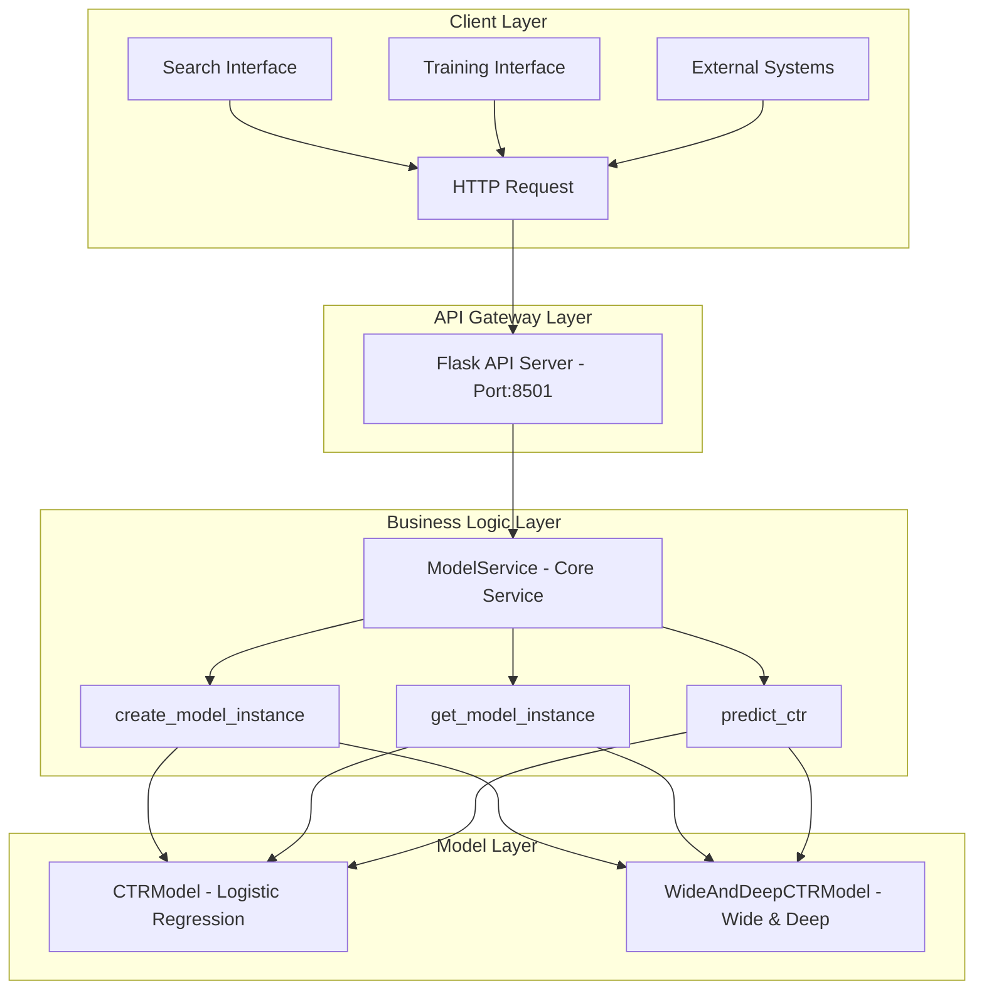

# Model Serving
{: .no_toc }

Independent model serving system providing RESTful API endpoints for CTR prediction models, supporting multiple model types and scalable deployment.
{: .fs-6 .fw-300 }

## Table of contents
{: .no_toc .text-delta }

1. TOC
{:toc}

---

## System Overview

### Purpose

The Model Serving system provides a complete CTR prediction capability with an independent process architecture, separating model inference from the main application for better scalability and reliability.

### Key Features

- 🔄 **Multiple Models**: Logistic Regression and Wide & Deep neural networks
- 🌐 **RESTful API**: Standard HTTP interfaces for model prediction
- 🚀 **Independent Process**: Isolated model serving process for high availability
- 📊 **Batch Prediction**: Efficient batch processing capabilities
- 🔍 **Health Monitoring**: Complete monitoring and health check mechanisms
- 🔥 **Hot Reloading**: Dynamic model loading without service restart

### Architecture Advantages

- **High Availability**: Model service crashes don't affect main system
- **Independent Scaling**: Scale model service resources independently
- **Process Isolation**: Memory and CPU resource isolation
- **Independent Monitoring**: Monitor model service performance separately
- **Easy Deployment**: Support for containerized deployment

---

## Architecture

### System Layers

The model serving adopts a **4-layer architecture** from outside to inside:

1. **Client Layer**: Various clients access service via HTTP requests
2. **API Gateway Layer**: Flask server handles HTTP requests and responses
3. **Business Logic Layer**: ModelService core business logic
4. **Model Layer**: Specific machine learning model implementations

### Architecture Diagram



### Layer Description

**Client Layer**:
- Search interface, training interface, external systems
- Communicate with model service via HTTP protocol

**API Gateway Layer**:
- Flask web server listening on port 8501
- Handle HTTP request routing, parameter validation, response formatting
- Provide RESTful API interfaces

**Business Logic Layer**:
- `ModelService` class: Core business logic orchestration
- `create_model_instance()`: Create model instance of specified type
- `get_model_instance()`: Get model instance with dynamic loading
- `predict_ctr()`: Execute CTR prediction, coordinate different models

**Model Layer**:
- `CTRModel`: Logistic Regression implementation (sklearn)
- `WideAndDeepCTRModel`: Wide & Deep implementation (TensorFlow)
- Feature extraction: Each model has its own feature engineering logic
- Model training: Support online training and model updates

---

## Core Components

### ModelService Class

```python
# File: src/search_engine/model_service.py
class ModelService:
    """Model service: handles model training, configuration, and model files"""
    
    def __init__(self, model_file: str = None):
        if model_file is None:
            model_file = os.path.join(os.getcwd(), "models", "ctr_model.pkl")
        self.model_file = model_file
        self.ctr_model = CTRModel()  # Default LR model
        self.current_model_type = "logistic_regression"
        self.model_instances = {}  # Store different model instances
        self._load_model()
        
        # Flask API service related
        self.flask_app = None
        self.api_running = False
```

### API Route Design

```python
def _setup_api_routes(self):
    """Setup API routes"""
    
    @self.flask_app.route('/health', methods=['GET'])
    def health():
        """Health check"""
        return jsonify({
            "status": "healthy",
            "model_type": self.current_model_type,
            "model_trained": self.ctr_model.is_trained
        })
    
    @self.flask_app.route('/v1/models', methods=['GET'])
    def list_models():
        """List all models"""
        # Returns list of available models
    
    @self.flask_app.route('/v1/models/<model_name>/predict', methods=['POST'])
    def predict(model_name):
        """Model prediction"""
        # Handles prediction requests
```

---

## API Specification

### Health Check Endpoint

**Endpoint**: `GET /health`

**Request Example**:
```bash
curl -X GET http://localhost:8501/health
```

**Response Example**:
```json
{
    "status": "healthy",
    "model_type": "logistic_regression",
    "model_trained": true
}
```

**Response Fields**:
- `status`: Service status, `healthy` indicates normal
- `model_type`: Currently used model type
- `model_trained`: Whether model is trained

### Model List Endpoint

**Endpoint**: `GET /v1/models`

**Request Example**:
```bash
curl -X GET http://localhost:8501/v1/models
```

**Response Example**:
```json
{
    "model": [
        {
            "name": "logistic_regression",
            "status": "loaded",
            "type": "pickle"
        },
        {
            "name": "wide_and_deep",
            "status": "loaded", 
            "type": "tensorflow"
        }
    ]
}
```

### Single Prediction Endpoint

**Endpoint**: `POST /v1/models/{model_name}:predict`

**Request Example**:
```bash
curl -X POST http://localhost:8501/v1/models/logistic_regression:predict \
  -H "Content-Type: application/json" \
  -d '{
    "inputs": {
      "query": "artificial intelligence",
      "doc_id": "test_doc_001",
      "position": 1,
      "score": 0.8,
      "summary": "AI technology introduction"
    }
  }'
```

**Request Parameters**:
- `query`: User query
- `doc_id`: Document ID
- `position`: Document position
- `score`: Base score
- `summary`: Document summary

**Response Example**:
```json
{
    "outputs": {
        "ctr_score": 0.123456
    }
}
```

### Batch Prediction Endpoint

**Endpoint**: `POST /v1/models/{model_name}/batch_predict`

**Request Example**:
```bash
curl -X POST http://localhost:8501/v1/models/logistic_regression/batch_predict \
  -H "Content-Type: application/json" \
  -d '{
    "inputs": [
      {
        "query": "machine learning",
        "doc_id": "doc1",
        "position": 1,
        "score": 0.9,
        "summary": "ML introduction"
      },
      {
        "query": "deep learning", 
        "doc_id": "doc2",
        "position": 2,
        "score": 0.7,
        "summary": "DL introduction"
      }
    ]
  }'
```

**Response Example**:
```json
{
    "outputs": [
        {
            "ctr_score": 0.234567
        },
        {
            "ctr_score": 0.345678
        }
    ]
}
```

---

## Model Management

### Supported Model Types

#### Logistic Regression Model
- **File Format**: `.pkl` (pickle)
- **Storage Path**: `models/ctr_model.pkl`
- **Feature Dimension**: 7-dimensional feature vector
- **Use Case**: Fast prediction, low resource consumption

#### Wide & Deep Model
- **File Format**: TensorFlow SavedModel + H5 format
- **Storage Path**: `models/wide_deep_ctr_model.h5` (main) + `models/wide_deep_ctr_model_tf_serving/` (TF Serving)
- **Feature Dimension**: Multi-dimensional features (Wide features + Deep features)
- **Use Case**: High-precision prediction, supports feature interactions

### Model Loading Mechanism

```python
def get_model_instance(self, model_type: str):
    """Get model instance of specified type"""
    # Recreate instance each time to ensure latest model is loaded
    # This solves the model synchronization issue after training
    self.model_instances[model_type] = self.create_model_instance(model_type)
    return self.model_instances[model_type]

def create_model_instance(self, model_type: str):
    """Create model instance of specified type"""
    try:
        if model_type == 'logistic_regression':
            from .training_tab.ctr_model import CTRModel
            model_instance = CTRModel()
            model_file = os.path.join(os.getcwd(), "models", "ctr_model.pkl")
        elif model_type == 'wide_and_deep':
            from .training_tab.ctr_wide_deep_model import WideAndDeepCTRModel
            model_instance = WideAndDeepCTRModel()
            model_file = os.path.join(os.getcwd(), "models", "wide_deep_ctr_model")
        else:
            raise ValueError(f"Unsupported model type: {model_type}")
        
        model_instance.load_model(model_file)
        self.model_instances[model_type] = model_instance
        return model_instance
        
    except Exception as e:
        print(f"Failed to create model instance: {e}")
        # Fallback to default LR model
        from .training_tab.ctr_model import CTRModel
        return CTRModel()
```

---

## Deployment & Startup

### Automatic Startup Integration

Model service is integrated into system startup process, automatically checking and starting independent process in step 7 of `start_system.py`:

```python
def check_and_start_model_service():
    """Check and start model service (independent process)"""
    # 1. Check if service is running
    model_service_url = "http://localhost:8501/health"
    try:
        req = request.Request(model_service_url, method="GET")
        with request.urlopen(req, timeout=2) as resp:
            if 200 <= resp.status < 300:
                print("✅ Detected running model service, reusing")
                return True
    except Exception:
        pass
    
    # 2. Start independent process
    model_service_script = os.path.join(os.path.dirname(__file__), 'start_model_serving.py')
    process = subprocess.Popen(
        [sys.executable, model_service_script],
        stdout=subprocess.PIPE,
        stderr=subprocess.PIPE,
        cwd=os.path.dirname(__file__)
    )
    
    # 3. Wait for service startup and verify
    time.sleep(3)
    try:
        req = request.Request(model_service_url, method="GET")
        with request.urlopen(req, timeout=5) as resp:
            if 200 <= resp.status < 300:
                print("✅ Model service independent process started successfully")
                return True
    except Exception as e:
        print(f"❌ Model service health check failed after startup: {e}")
        return False
```

### Manual Startup

#### Using Startup Script

```bash
# Start model service independent process
python start_model_serving.py

# Background startup
python start_model_serving.py &

# Using process manager
python tools/model_service_manager.py start
python tools/model_service_manager.py stop
python tools/model_service_manager.py restart
python tools/model_service_manager.py status
python tools/model_service_manager.py health
```

#### Direct API Call

```python
import sys
sys.path.append('src')
from search_engine.model_service import ModelService

# Create and start service
model_service = ModelService()
model_service.start_api_server(port=8501)
```

---

## Performance Optimization

### Concurrent Processing

#### Multi-threading Support

```python
def start_api_server(self, host="0.0.0.0", port=8501, debug=False):
    """Start Flask API server (independent process mode)"""
    try:
        if self.api_running:
            print("⚠️ API server already running")
            return True
        
        self.flask_app = Flask(__name__)
        self._setup_api_routes()
        
        self.api_running = True
        print(f"🚀 Model Serving API started at {host}:{port}")
        
        # Run Flask server directly (independent process mode)
        self.flask_app.run(
            host=host, 
            port=port, 
            debug=debug, 
            threaded=True,  # Enable multi-threading
            use_reloader=False
        )
        
    except Exception as e:
        print(f"❌ Failed to start API server: {e}")
        return False
```

#### Batch Prediction Optimization

```python
@self.flask_app.route('/v1/models/<model_name>/batch_predict', methods=['POST'])
def batch_predict(model_name):
    """Batch prediction"""
    try:
        data = request.get_json()
        inputs_list = data.get('inputs', [])
        
        # Execute batch prediction
        results = []
        for inputs in inputs_list:
            ctr_score = self.predict_ctr(inputs, model_name)
            results.append({"ctr_score": ctr_score})
        
        return jsonify({"outputs": results})
        
    except Exception as e:
        return jsonify({"error": str(e)}), 500
```

### Memory Management

#### Model Caching

```python
class ModelService:
    def __init__(self, model_file: str = None):
        self.model_instances = {}  # Store different model instances
```

#### Memory Monitoring

```python
def get_memory_usage(self) -> Dict[str, float]:
    """Get memory usage"""
    import psutil
    process = psutil.Process()
    memory_info = process.memory_info()
    
    return {
        "rss": memory_info.rss / 1024 / 1024,  # MB
        "vms": memory_info.vms / 1024 / 1024,  # MB
        "percent": process.memory_percent()
    }
```

---

## Monitoring & Operations

### Health Check

#### Service Health Check

```python
def health_check(self) -> Dict[str, Any]:
    """Service health check"""
    return {
        "status": "healthy" if self.api_running else "unhealthy",
        "model_type": self.current_model_type,
        "model_trained": self.ctr_model.is_trained,
        "uptime": time.time() - self.start_time,
        "memory_usage": self.get_memory_usage()
    }
```

#### Model Health Check

```python
def model_health_check(self, model_type: str) -> bool:
    """Model health check"""
    try:
        model_instance = self.get_model_instance(model_type)
        if not model_instance.is_trained:
            return False
        
        # Test prediction
        test_inputs = {
            'query': 'test',
            'doc_id': 'test',
            'position': 1,
            'score': 0.5,
            'summary': 'test summary'
        }
        result = self.predict_ctr(test_inputs, model_type)
        return isinstance(result, (int, float)) and 0 <= result <= 1
    except Exception:
        return False
```

### Error Handling

#### Exception Handling

```python
@app.errorhandler(404)
def not_found(error):
    return jsonify({"error": "Endpoint not found"}), 404

@app.errorhandler(500)
def internal_error(error):
    return jsonify({"error": "Internal server error"}), 500

@app.errorhandler(ValueError)
def value_error(error):
    return jsonify({"error": str(error)}), 400
```

#### Degradation Strategy

```python
def predict_ctr(self, features: Dict[str, Any], model_type: Optional[str] = None) -> float:
    """Predict CTR with fallback"""
    try:
        if model_type:
            model_instance = self.get_model_instance(model_type)
        else:
            model_instance = self.get_model_instance(self.current_model_type)
        
        if not model_instance.is_trained:
            return 0.1  # Default CTR
        
        return model_instance.predict_ctr(query, doc_id, position, score, summary)
        
    except Exception as e:
        print(f"❌ Prediction failed: {e}")
        return 0.1  # Default CTR value
```

---

## Troubleshooting

### Common Issues

#### Port Already in Use

**Problem**: `Address already in use`

**Solutions**:
```bash
# Find process using port
lsof -i :8501

# Kill process
kill -9 <PID>

# Or use different port
model_service.start_api_server(port=8502)
```

#### Model Loading Failure

**Problem**: `Model loading failed`

**Solutions**:
```python
# Check if model file exists
import os
model_path = "models/ctr_model.pkl"
if not os.path.exists(model_path):
    print(f"Model file does not exist: {model_path}")

# Check model file permissions
if not os.access(model_path, os.R_OK):
    print(f"No read permission for model file: {model_path}")
```

#### Abnormal Prediction Results

**Problem**: `Prediction result not in [0,1] range`

**Solutions**:
```python
def validate_prediction_result(result: float) -> bool:
    """Validate prediction result"""
    if not isinstance(result, (int, float)):
        return False
    if not (0 <= result <= 1):
        return False
    return True
```

### Debugging Tools

#### Debug Mode

```python
# Enable debug mode
model_service.start_api_server(port=8501, debug=True)
```

#### Logging Level

```python
import logging

# Set verbose logging
logging.getLogger().setLevel(logging.DEBUG)
```

---

## Best Practices

### Development Recommendations

1. **Error Handling**: Always include appropriate exception handling
2. **Input Validation**: Validate all input parameters
3. **Logging**: Record key operations and errors
4. **Performance Monitoring**: Monitor response time and resource usage
5. **Version Management**: Use semantic versioning

### Deployment Recommendations

1. **Environment Isolation**: Use virtual environments
2. **Configuration Management**: Use configuration files for parameters
3. **Health Checks**: Implement complete health check mechanisms
4. **Monitoring & Alerts**: Set up performance monitoring and alerting
5. **Backup & Recovery**: Regularly backup model files

### Security Recommendations

1. **Input Validation**: Strictly validate all inputs
2. **Access Control**: Implement appropriate access control
3. **Data Encryption**: Encrypt sensitive data transmission
4. **Log Security**: Avoid recording sensitive information in logs
5. **Regular Updates**: Regularly update dependency packages

---

## Configuration Reference

```python
# Model service configuration
MODEL_SERVICE_CONFIG = {
    "host": "0.0.0.0",
    "port": 8501,
    "debug": False,
    "threaded": True
}

# Model file paths
CTR_MODEL_PATH = "models/ctr_model.pkl"
WIDE_DEEP_MODEL_PATH = "models/wide_deep_ctr_model"
WIDE_DEEP_H5_PATH = "models/wide_deep_ctr_model.h5"
WIDE_DEEP_TF_SERVING_PATH = "models/wide_deep_ctr_model_tf_serving/"

# Feature configuration
FEATURE_DIMENSIONS = {
    'logistic_regression': 5,
    'wide_and_deep': 'variable'
}
```

---

## Summary

### Core Features
- ✅ **Multiple Models**: Logistic Regression, Wide & Deep
- ✅ **RESTful API**: Standardized HTTP interfaces
- ✅ **Auto Startup**: Integrated into system startup process
- ✅ **Health Monitoring**: Complete monitoring mechanisms
- ✅ **Batch Prediction**: Efficient batch processing
- ✅ **Error Handling**: Comprehensive exception handling

### Technical Advantages
- 🚀 **High Performance**: Multi-threaded concurrent processing
- 🔧 **Easy Extension**: Modular design, easy to add new models
- 📊 **Monitorable**: Complete logging and monitoring system
- 🛡️ **Highly Reliable**: Degradation strategies and error recovery
- 🔄 **Hot Reload**: Support dynamic model loading

### Use Cases
- CTR prediction for search and recommendation systems
- Effect estimation for advertising
- Click rate prediction for content recommendation
- Machine learning service for personalized ranking
