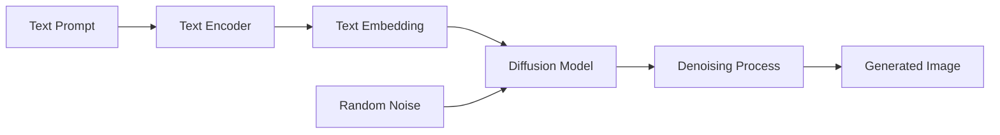

# Image Generation
{: .no_toc }

Text-to-image generation using pre-trained diffusion models for creative and experimental applications.
{: .fs-6 .fw-300 }

## Table of contents
{: .no_toc .text-delta }

1. TOC
{:toc}

---

## Overview

### What is Image Generation?

Image generation allows users to create images from text descriptions using AI models. This system supports **text-to-image** generation, where a natural language prompt is converted into a visual image.

**Key Concept**:
- **Prompt**: A text description of what you want to generate (e.g., "a cat playing with a ball")
- **Model**: A pre-trained neural network that understands the relationship between text and images
- **Generation**: The process of creating a new image based on the text prompt

### Why Image Generation?

**Use Cases**:
1. **Creative Design**: Generate concept art, illustrations, or visual ideas
2. **Prototyping**: Quickly visualize ideas without manual drawing
3. **Content Creation**: Generate images for presentations, blogs, or social media
4. **Experimentation**: Explore AI capabilities and model behavior

**Technical Benefits**:
- **No Manual Drawing Required**: Generate images from text descriptions
- **Rapid Iteration**: Quickly try different prompts and parameters
- **Creative Exploration**: Discover unexpected visual combinations
- **Accessibility**: Enable image creation without artistic skills

### How It Works

**Core Technology**: **Diffusion Models** (e.g., Stable Diffusion)

Diffusion models learn to generate images by gradually removing noise from random noise, guided by text prompts.

**Basic Workflow**:



**Process**:
1. **Text Encoding**: Convert the text prompt into a numerical embedding
2. **Noise Initialization**: Start with random noise
3. **Iterative Denoising**: Gradually remove noise, guided by the text embedding
4. **Image Generation**: After multiple steps, a coherent image emerges

---

## Features

### Core Capabilities

- **Text-to-Image**: Input a text description, generate a corresponding image
- **Pre-trained Models**: Uses state-of-the-art models like Stable Diffusion
- **Parameter Control**: Adjust generation parameters (steps, guidance scale, etc.)
- **GPU Acceleration**: Supports local inference with GPU acceleration

### Supported Models

The system now supports multiple Stable Diffusion models:

| Model | Key | Size | Speed | Quality | Best For |
|-------|-----|------|-------|---------|----------|
| **SDXL-Turbo** | `sdxl-turbo` | ~7GB | ⚡ Very Fast (1-4 steps) | Good | Real-time preview, rapid iteration |
| **SD v1.5** | `stable-diffusion-v1-5` | ~4GB | 🐢 Moderate (20-50 steps) | High | General-purpose, balanced |
| **SD v2.1** | `stable-diffusion-2-1` | ~5GB | 🐢 Moderate (20-50 steps) | Very High | Better details, improved quality |
| **SDXL Base** | `stable-diffusion-xl-base` | ~7GB | 🐌 Slow (30-50 steps) | Excellent | High-resolution, professional |

---

## Usage Guide

### Architecture Update

**NEW**: Image generation now runs as an **independent service** to avoid dependency conflicts.

**Benefits**:
- No conflicts with LLMOps (LlamaFactory) dependencies
- Testbed environment remains stable
- Service can be started/stopped independently
- Uses latest Stable Diffusion XL

### Basic Usage

1. **Start System** using quick_start.sh:
   ```bash
   ./quick_start.sh
   ```
   - The script will automatically start the image generation service in the background
   - Service runs on `http://localhost:5001`
   - Logs are saved to `logs/image_service.log`

2. Navigate to the **"🖼️ 多模态系统"** → **"🎨 图像生成"** tab in the Web UI

3. **Load Model**:
   - Click **"📥 加载 SDXL 模型"** button
   - The service will load Stable Diffusion XL model
   - First-time setup: Model download (~7GB, please wait patiently)
   - **Note**: If downloading models, ensure proxy is configured before starting:
     ```bash
     export https_proxy=http://127.0.0.1:7890
     export http_proxy=http://127.0.0.1:7890
     export all_proxy=socks5://127.0.0.1:7890
     ```

4. **Configure Generation Parameters**:
   - **正向提示词 (Prompt)**: Describe what you want to see
     - Example: `a cute cat playing with a ball, high quality, detailed`
   - **负向提示词 (Negative Prompt)**: Describe what you DON'T want
     - Example: `blurry, low quality, watermark`
   - **推理步数 (Steps)**: 20-100 (more steps = higher quality but slower)
     - Recommended: 50 steps for SDXL
   - **引导强度 (CFG Scale)**: 1-20 (how closely to follow the prompt)
     - Recommended: 7.5 for SDXL
   - **尺寸 (Width/Height)**: 512-1024 pixels (default: 1024x1024 for SDXL)
   - **随机种子 (Seed)**: -1 for random, or specific number for reproducibility
   - **生成数量**: 1-4 images per generation

5. **Generate**: Click **"🎨 生成图像"** button

6. **View Results**: 
   - Generated images appear in the gallery
   - Generation info (metadata) shows below
   - Images are automatically saved to `models/generated_images_service/`

7. **Optional - View History**:
   - Expand **"📜 生成历史"** to see past generations
   - Click **"🔄 刷新历史"** to update the list

### Manual Setup (Optional, for Best Performance)

For optimal performance, you can create a dedicated conda environment:

```bash
# 1. Create independent environment
conda create -n testbed-image python=3.10 -y

# 2. Activate environment
conda activate testbed-image

# 3. Install dependencies
cd /path/to/Testbed
pip install -r image_generation_service_requirements.txt

# 4. (Optional) Start service manually
python image_generation_service.py
```

**Note**: If the dedicated environment exists, the system will automatically use it. Otherwise, it will use the current environment.

### Example Prompts

**Simple Objects**:
- "a red apple on a white table"
- "a blue bird flying in the sky"

**Complex Scenes**:
- "a futuristic cityscape at night with neon lights and flying cars"
- "a peaceful garden with cherry blossoms and a traditional Japanese bridge"

**Artistic Styles**:
- "a watercolor painting of a sunset over the ocean"
- "a digital art piece of a cyberpunk street scene"

---

## Technical Implementation

### Architecture

**Components**:
- **Text Encoder**: Converts text prompts into embeddings (e.g., CLIP text encoder)
- **Diffusion Model**: The core generative model (e.g., Stable Diffusion UNet)
- **VAE Decoder**: Converts latent representations to pixel images

### Libraries

- **Hugging Face `diffusers`**: Provides pre-trained diffusion models and inference pipelines
- **PyTorch**: Deep learning framework for model execution
- **Transformers**: Text encoding and model loading

### Code Example

The system uses the `DiffusionService` class for image generation:

```python
from src.search_engine.diffusion_service import DiffusionService

# Initialize service
diffusion_service = DiffusionService(output_dir="models/generated_images")

# Load model
success, message = diffusion_service.load_model("sdxl-turbo")
print(message)

# Generate image
result = diffusion_service.generate_image(
    prompt="a cute cat playing with a ball, high quality, detailed",
    negative_prompt="blurry, low quality, watermark",
    num_inference_steps=4,
    guidance_scale=0.0,  # SDXL-Turbo doesn't need guidance
    width=512,
    height=512,
    seed=-1,  # Random seed
    num_images=1
)

if result['success']:
    # Images are in result['images']
    # Paths are in result['paths']
    print(f"Generated {len(result['images'])} images")
    print(f"Saved to: {result['paths']}")
else:
    print(f"Error: {result['message']}")
```

**Service Features**:
- Automatic model loading and caching
- Memory optimization (attention slicing, VAE slicing)
- Metadata embedding in PNG files
- Generation history tracking
- Support for multiple models

### Performance Considerations

- **GPU Memory**: Diffusion models require significant GPU memory (4GB+ for Stable Diffusion)
- **Inference Time**: Generation typically takes 5-30 seconds depending on steps and hardware
- **Model Size**: Pre-trained models are large (several GB), require initial download

---

## Best Practices

### Prompt Engineering

**Effective Prompts**:
- **Be Specific**: "a red sports car" is better than "a car"
- **Include Details**: Add style, mood, composition details
- **Use Descriptive Language**: "serene", "dramatic", "vibrant" can influence results

**Common Patterns**:
- **Subject + Style**: "a cat, digital art style"
- **Subject + Mood**: "a forest, mysterious atmosphere"
- **Subject + Composition**: "a mountain, wide angle view"

### Parameter Tuning

- **Steps**: 
  - Lower (20-30): Faster, may have artifacts
  - Higher (50-100): Slower, better quality
  - Recommended: 50 steps for balance

- **Guidance Scale**:
  - Lower (1-5): More creative, less prompt adherence
  - Higher (7-15): More prompt adherence, may be less creative
  - Recommended: 7.5 for most cases

---

## Troubleshooting

### Generation Failures

**Problem**: Model fails to generate or produces errors.

**Solutions**:
- **Check GPU Memory**: Ensure sufficient VRAM (4GB+)
- **Reduce Image Resolution**: Lower resolution requires less memory
- **Reduce Steps**: Fewer steps use less memory and time
- **Use CPU Mode**: Fallback to CPU if GPU unavailable (much slower)

### Poor Quality Results

**Problem**: Generated images are blurry, distorted, or don't match the prompt.

**Solutions**:
- **Increase Steps**: More denoising steps improve quality
- **Improve Prompt**: Make prompt more specific and descriptive
- **Adjust Guidance Scale**: Try higher values for better prompt adherence
- **Try Different Seeds**: Random seed can significantly affect results

### Slow Generation

**Problem**: Image generation takes too long.

**Solutions**:
- **Use GPU**: GPU acceleration is essential for reasonable speed
- **Reduce Steps**: Fewer steps = faster generation
- **Lower Resolution**: Smaller images generate faster
- **Optimize Model**: Use optimized model variants (e.g., `diffusers` optimized versions)

---

## Related Resources

- [Stable Diffusion Paper](https://arxiv.org/abs/2112.10752)
- [Hugging Face Diffusers Documentation](https://huggingface.co/docs/diffusers)
- [Prompt Engineering Guide](https://www.promptingguide.ai/techniques/imagegeneration)
