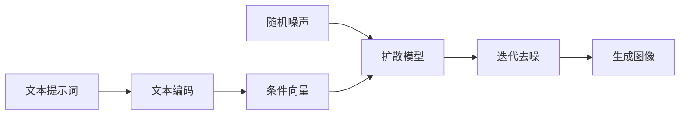

# 图像生成
{: .no_toc }

基于扩散模型的文生图能力说明，覆盖模型选择、参数配置、服务运行与故障排查。
{: .fs-6 .fw-300 }

## 目录
{: .no_toc .text-delta }

1. TOC
{:toc}

---

## 功能概览

### 能力说明

图像生成模块支持通过自然语言提示词生成图像，适用于概念验证、创意草图和实验场景。

### 核心概念

- **提示词（Prompt）**：描述希望生成的图像内容
- **负向提示词（Negative Prompt）**：约束不希望出现的内容
- **推理步数（Steps）**：去噪迭代次数，影响质量与耗时
- **引导强度（CFG Scale）**：模型对提示词的遵循程度

---

## 工作原理


```mermaid
graph LR
    A[文本提示词] --> B[文本编码]
    B --> C[条件向量]
    D[随机噪声] --> E[扩散模型]
    C --> E
    E --> F[迭代去噪]
    F --> G[生成图像]
```

简化流程：
1. 文本编码为条件向量
2. 以随机噪声为起点
3. 多轮去噪得到最终图像

---

## 支持模型

| 模型 | 键名 | 体积 | 速度 | 质量 | 建议场景 |
|:-----|:-----|:----|:----|:----|:--------|
| SDXL-Turbo | `sdxl-turbo` | ~7GB | 很快 | 良好 | 预览与快速迭代 |
| SD v1.5 | `stable-diffusion-v1-5` | ~4GB | 中等 | 高 | 通用场景 |
| SD v2.1 | `stable-diffusion-2-1` | ~5GB | 中等 | 很高 | 细节要求高 |
| SDXL Base | `stable-diffusion-xl-base` | ~7GB | 较慢 | 优秀 | 高质量输出 |

---

## 使用说明

### 快速启动

1. 使用项目启动脚本：

```bash
./quick_start.sh
```

2. 打开页面：`🖼️ 多模态系统` → `🎨 图像生成`
3. 加载目标模型（首次可能触发下载）
4. 配置参数并点击生成
5. 结果保存在 `models/generated_images_service/`

### 推荐参数

- **Steps**：20-100（默认建议 50）
- **CFG Scale**：1-20（默认建议 7.5）
- **分辨率**：512-1024（SDXL 建议 1024x1024）
- **Seed**：`-1` 表示随机，可指定固定值复现结果

### 提示词示例

- `一只可爱的橘猫在窗边晒太阳，高细节，柔和光线`
- `夜晚的未来城市，霓虹灯，赛博朋克风格`
- `水彩风格的山间湖泊，清晨薄雾`

---

## 服务架构与实现

图像生成采用独立服务运行，减少与其他模块依赖冲突并提升稳定性。

```python
from src.search_engine.diffusion_service import DiffusionService

diffusion_service = DiffusionService(output_dir="models/generated_images")
success, message = diffusion_service.load_model("sdxl-turbo")
print(message)

result = diffusion_service.generate_image(
    prompt="一只可爱的橘猫在窗边晒太阳",
    negative_prompt="模糊, 低清晰度, 水印",
    num_inference_steps=4,
    guidance_scale=0.0,
    width=512,
    height=512,
    seed=-1,
    num_images=1
)
```

---

## 性能与稳定性建议

- 优先使用 GPU（建议显存 4GB 及以上）
- 模型首次下载体积大，建议提前准备网络与缓存
- 大图和高步数会显著增加推理时间
- 生产使用建议增加请求队列与并发控制

---

## 常见问题

### 1) 生成失败

- 检查显存是否足够
- 降低分辨率或步数
- 确认模型已完整加载
- 必要时切换到 CPU 模式验证链路

### 2) 结果质量不理想

- 提高提示词具体度
- 调整负向提示词
- 提高步数并尝试不同随机种子
- 更换更高质量模型

### 3) 生成速度慢

- 使用更快模型（如 `sdxl-turbo`）
- 降低分辨率与步数
- 避免一次生成过多图片

---

## 相关文档

- [多模态系统总览]({{ site.baseurl }}/docs/multimodal/)
- [图像检索]({{ site.baseurl }}/docs/multimodal/image-search)
- [Diffusers 文档](https://huggingface.co/docs/diffusers)
