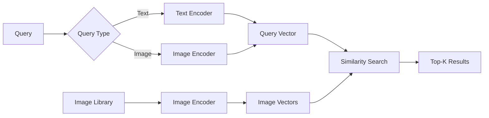
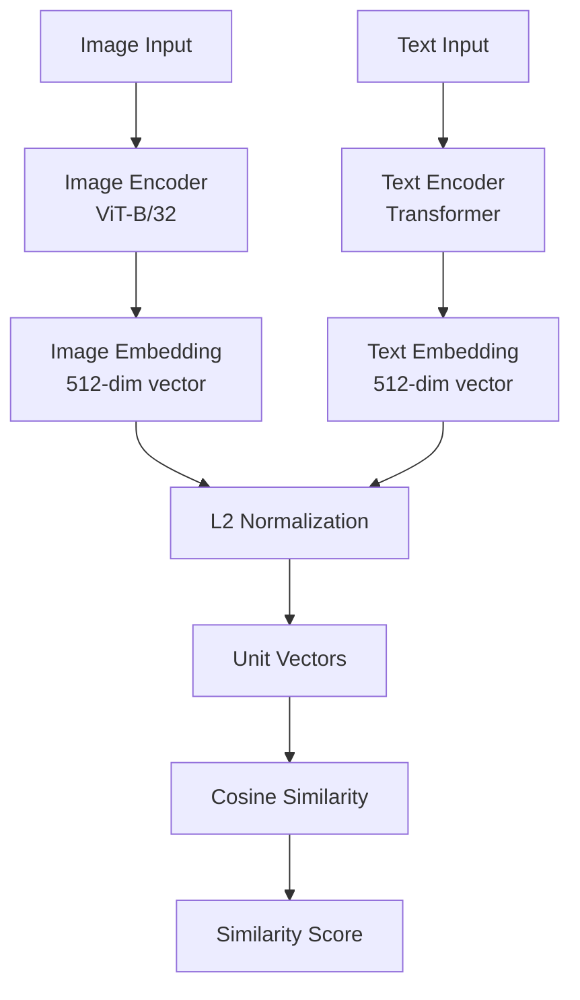

# Image Search
{: .no_toc }

CLIP-based image search supporting text-to-image and image-to-image retrieval.
{: .fs-6 .fw-300 }

## Table of contents
{: .no_toc .text-delta }

1. TOC
{:toc}

---

## Overview

### What is Image Search?

Image search enables users to find images using either:
- **Text queries**: "Find images of cats" → Returns cat images
- **Image queries**: Upload an image → Returns visually similar images

Unlike traditional keyword-based search, image search uses **semantic understanding** to match images based on their visual content and meaning, not just filenames or tags.

### Why Image Search?

**Traditional Limitations**:
- ❌ Requires manual tagging of all images
- ❌ Tags may not capture visual content accurately
- ❌ Can't find images by visual similarity
- ❌ Limited to exact keyword matches

**Image Search Benefits**:
- ✅ **Semantic Matching**: Understands image content, not just tags
- ✅ **Visual Similarity**: Finds images that look similar
- ✅ **Natural Language**: Search using natural language descriptions
- ✅ **No Manual Tagging**: Automatically understands image content

### How It Works

**Core Technology**: **CLIP (Contrastive Language-Image Pre-training)**

CLIP is a neural network trained on millions of image-text pairs to understand the relationship between visual and textual information.

**Basic Workflow**:



**Process**:
1. **Encode Query**: Convert text or image query into a vector
2. **Encode Images**: Convert all images in library into vectors
3. **Similarity Search**: Find images with vectors most similar to query
4. **Return Results**: Display top-K most similar images

---

## CLIP Model

### What is CLIP?

**CLIP (Contrastive Language-Image Pre-training)** is a vision-language model developed by OpenAI that learns to associate images with text descriptions.

**Key Features**:
- **Dual Encoders**: Separate encoders for images and text
- **Shared Embedding Space**: Images and text mapped to same vector space
- **Contrastive Learning**: Trained to maximize similarity of matching pairs
- **Zero-Shot**: Works without fine-tuning on specific tasks

### CLIP Architecture



**Model Details**:
- **Image Encoder**: Vision Transformer (ViT-B/32)
- **Text Encoder**: Transformer-based text encoder
- **Embedding Dimension**: 512
- **Similarity Metric**: Cosine similarity on normalized vectors

**Training Objective**:

CLIP is trained using **contrastive learning** to align image and text representations. Given a batch of $N$ image-text pairs, CLIP learns to maximize the similarity of matching pairs while minimizing similarity of non-matching pairs.

**Contrastive Loss Function**:

For a batch of $N$ image-text pairs $\{(I_i, T_i)\}_{i=1}^{N}$, the symmetric contrastive loss is:

$$
\mathcal{L}_{\text{CLIP}} = -\frac{1}{2N} \sum_{i=1}^{N} \left[ \log \frac{\exp(\text{sim}(I_i, T_i) / \tau)}{\sum_{j=1}^{N} \exp(\text{sim}(I_i, T_j) / \tau)} + \log \frac{\exp(\text{sim}(T_i, I_i) / \tau)}{\sum_{j=1}^{N} \exp(\text{sim}(T_i, I_j) / \tau)} \right]
$$

Where:
- $I_i$: Image embedding for image $i$
- $T_i$: Text embedding for text $i$
- $\text{sim}(I, T)$: Cosine similarity between image and text embeddings
- $\tau$: Temperature parameter (typically 0.07), controls the sharpness of the distribution
- $N$: Batch size

**Understanding the Formula**:

1. **Image-to-Text Matching**: The first term encourages each image to be most similar to its paired text among all texts in the batch
2. **Text-to-Image Matching**: The second term encourages each text to be most similar to its paired image among all images in the batch
3. **Temperature Scaling**: The $\tau$ parameter sharpens the probability distribution, making the model more confident in correct matches
4. **Contrastive Learning**: By comparing against all other pairs in the batch, the model learns to distinguish matching from non-matching pairs

**Intuitive Explanation**:
- The model learns that "cat" should be closer to images of cats than to images of dogs
- Through contrastive learning, it develops a shared understanding of visual and textual concepts
- The shared embedding space enables zero-shot transfer to new tasks

### Why CLIP Works

**Semantic Understanding**:
- CLIP understands that "cat" and "feline" refer to similar visual concepts
- Can match images even when query uses different words than image tags

**Visual Similarity**:
- CLIP captures visual features (colors, shapes, composition)
- Can find images that look similar even with different content

**Zero-Shot Capability**:
- Works without training on your specific image dataset
- Generalizes to new image types and queries

---

## Features

### 1. Text-to-Image Search

**What It Does**:
Search for images using natural language descriptions.

**Example Queries**:
- "A red car on a highway"
- "Sunset over mountains"
- "Person playing guitar"
- "Abstract geometric patterns"

**How It Works**:
1. User enters text query
2. CLIP text encoder converts query to vector
3. System compares query vector with all image vectors
4. Returns images with highest similarity scores

### 2. Image-to-Image Search

**What It Does**:
Find visually similar images by uploading a query image.

**Use Cases**:
- Find similar product images
- Locate duplicate or near-duplicate images
- Discover images with similar style or composition
- Find variations of the same image

**How It Works**:
1. User uploads query image
2. CLIP image encoder converts image to vector
3. System compares query vector with all image vectors
4. Returns images with highest visual similarity

### 3. Image Indexing

**What It Does**:
Automatically process and index uploaded images for fast retrieval.

**Process**:
1. User uploads image
2. System encodes image using CLIP
3. Stores embedding vector and metadata
4. Image is now searchable

---

## Usage Guide

### Uploading Images

**Steps**:
1. Navigate to "🖼️ Image Search" tab
2. Click "Upload Image" button
3. Select image file (JPG, PNG supported)
4. Image is automatically indexed
5. Image appears in gallery

**Supported Formats**:
- JPEG (.jpg, .jpeg)
- PNG (.png)
- Maximum size: 10MB (recommended)

### Text-to-Image Search

**Steps**:
1. Select "Text Search" mode
2. Enter text query in search box
3. Click "Search" button
4. View results sorted by similarity score

**Query Tips**:
- Be specific: "red sports car" better than "car"
- Use descriptive terms: "sunset", "mountain", "ocean"
- Combine concepts: "person reading book in library"

### Image-to-Image Search

**Steps**:
1. Select "Image Search" mode
2. Upload or select query image
3. Click "Search" button
4. View visually similar images

**Best Results**:
- Use clear, high-quality query images
- Query image should represent what you're looking for
- Similar images will have high similarity scores (> 0.7)

---

## Technical Implementation

### Image Encoding

```python
import torch
from transformers import CLIPProcessor, CLIPModel

class ImageEncoder:
    """CLIP-based image encoder"""
    
    def __init__(self):
        self.model = CLIPModel.from_pretrained("openai/clip-vit-base-patch32")
        self.processor = CLIPProcessor.from_pretrained("openai/clip-vit-base-patch32")
        self.device = "cuda" if torch.cuda.is_available() else "cpu"
        self.model.to(self.device)
        self.model.eval()
    
    def encode_image(self, image_path: str) -> np.ndarray:
        """Encode image to vector"""
        from PIL import Image
        
        # Load and preprocess image
        image = Image.open(image_path).convert("RGB")
        inputs = self.processor(images=image, return_tensors="pt")
        inputs = {k: v.to(self.device) for k, v in inputs.items()}
        
        # Encode
        with torch.no_grad():
            image_features = self.model.get_image_features(**inputs)
        
        # Normalize to unit vector
        image_features = image_features / image_features.norm(dim=-1, keepdim=True)
        
        return image_features.cpu().numpy().flatten()
```

### Text Encoding

```python
def encode_text(self, text: str) -> np.ndarray:
    """Encode text query to vector"""
    inputs = self.processor(text=text, return_tensors="pt", padding=True)
    inputs = {k: v.to(self.device) for k, v in inputs.items()}
    
    with torch.no_grad():
        text_features = self.model.get_text_features(**inputs)
    
    # Normalize to unit vector
    text_features = text_features / text_features.norm(dim=-1, keepdim=True)
    
    return text_features.cpu().numpy().flatten()
```

### Similarity Search

```python
import numpy as np
from sklearn.metrics.pairwise import cosine_similarity

class ImageSearch:
    """Image search engine"""
    
    def __init__(self):
        self.image_vectors = []  # List of image embeddings
        self.image_metadata = []  # List of image info
    
    def add_image(self, image_path: str, image_id: str):
        """Add image to index"""
        vector = self.encoder.encode_image(image_path)
        self.image_vectors.append(vector)
        self.image_metadata.append({
            "id": image_id,
            "path": image_path
        })
    
    def search_by_text(self, query: str, top_k: int = 10) -> List[Dict]:
        """Search images by text query"""
        query_vector = self.encoder.encode_text(query)
        
        # Compute similarities
        similarities = cosine_similarity(
            query_vector.reshape(1, -1),
            np.array(self.image_vectors)
        )[0]
        
        # Get top-K
        top_indices = np.argsort(similarities)[::-1][:top_k]
        
        results = []
        for idx in top_indices:
            results.append({
                "image_id": self.image_metadata[idx]["id"],
                "image_path": self.image_metadata[idx]["path"],
                "similarity": float(similarities[idx])
            })
        
        return results
    
    def search_by_image(self, query_image_path: str, top_k: int = 10) -> List[Dict]:
        """Search images by image query"""
        query_vector = self.encoder.encode_image(query_image_path)
        
        # Same similarity computation as text search
        similarities = cosine_similarity(
            query_vector.reshape(1, -1),
            np.array(self.image_vectors)
        )[0]
        
        top_indices = np.argsort(similarities)[::-1][:top_k]
        
        results = []
        for idx in top_indices:
            results.append({
                "image_id": self.image_metadata[idx]["id"],
                "image_path": self.image_metadata[idx]["path"],
                "similarity": float(similarities[idx])
            })
        
        return results
```

---

## Performance & Optimization

### Indexing Performance

**Vector Storage**:
- Store embeddings as NumPy arrays (`.npy` format)
- Use memory-mapped files for large datasets
- Typical size: 512 floats = 2KB per image

**Indexing Speed**:
- CPU: ~0.5 seconds per image
- GPU: ~0.1 seconds per image
- Batch processing recommended for large datasets

### Search Performance

**Similarity Computation**:
- Cosine similarity: O(n) where n = number of images
- For 10K images: ~10ms on CPU, ~1ms on GPU
- For 100K images: ~100ms on CPU, ~10ms on GPU

**Optimization Strategies**:
1. **Approximate Nearest Neighbor (ANN)**: Use FAISS for faster search
2. **Batch Processing**: Process multiple queries together
3. **Caching**: Cache frequently used query vectors
4. **GPU Acceleration**: Use GPU for encoding and similarity

### FAISS Integration (Optional)

```python
import faiss

# Build FAISS index for faster search
dimension = 512
index = faiss.IndexFlatIP(dimension)  # Inner product (cosine similarity)

# Add vectors (already normalized)
vectors = np.array(self.image_vectors).astype('float32')
index.add(vectors)

# Search
query_vector = query_vector.astype('float32').reshape(1, -1)
distances, indices = index.search(query_vector, top_k)
```

---

## Best Practices

### Query Formulation

**Text Queries**:
- ✅ **Be Specific**: "red sports car" > "car"
- ✅ **Use Visual Terms**: "sunset", "mountain", "ocean"
- ✅ **Combine Concepts**: "person reading book in library"
- ❌ **Avoid Abstract**: "beautiful" is less effective than "sunset over ocean"

**Image Queries**:
- ✅ Use clear, representative images
- ✅ Ensure query image quality is good
- ✅ Query image should show what you want to find

### Image Quality

**For Best Results**:
- Use high-resolution images (minimum 224x224)
- Ensure images are clear and well-lit
- Avoid heavily compressed or low-quality images

### Index Management

**Regular Updates**:
- Re-index when adding many new images
- Remove outdated images from index
- Monitor index size and performance

---

## Troubleshooting

### Low Search Quality

**Problem**: Search results not relevant

**Solutions**:
1. **Improve Query**: Use more specific, visual terms
2. **Check Image Quality**: Ensure indexed images are clear
3. **Verify Encoding**: Check that images are properly encoded
4. **Similarity Threshold**: Filter results by minimum similarity (e.g., > 0.5)

### Slow Search Speed

**Problem**: Search takes too long

**Solutions**:
1. **Use FAISS**: Implement approximate nearest neighbor search
2. **GPU Acceleration**: Use GPU for encoding and similarity
3. **Reduce Index Size**: Remove unused images
4. **Batch Processing**: Process multiple queries together

### Memory Issues

**Problem**: Out of memory with large image library

**Solutions**:
1. **Memory-Mapped Files**: Use `np.memmap` for large arrays
2. **Chunked Processing**: Process images in batches
3. **FAISS Index**: FAISS is more memory-efficient than NumPy arrays
4. **Reduce Precision**: Use float16 instead of float32

---

## Related Resources

- [Image Generation]({{ site.baseurl }}/docs/multimodal/image-generation) - Generate images from text
- [CLIP Paper](https://arxiv.org/abs/2103.00020) - Original CLIP research paper
- [Hugging Face CLIP](https://huggingface.co/docs/transformers/model_doc/clip) - CLIP model documentation
- [FAISS Documentation](https://github.com/facebookresearch/faiss) - Fast similarity search library
