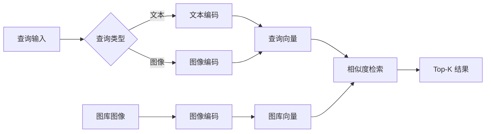

# 图像检索
{: .no_toc }

基于 CLIP 的图像检索模块，支持文搜图与图搜图两种核心能力。
{: .fs-6 .fw-300 }

## 目录
{: .no_toc .text-delta }

1. TOC
{:toc}

---

## 功能概览

### 什么是图像检索

图像检索允许用户通过以下两种方式查找图片：
- **文搜图**：输入文本描述，返回语义相关图像
- **图搜图**：上传查询图像，返回视觉相似图像

与关键词检索不同，语义检索基于内容理解而非文件名匹配。

### 典型收益

- 降低人工标注依赖
- 支持跨模态语义匹配
- 发现视觉相似样本
- 提升素材检索效率

---

## 工作原理


```mermaid
graph LR
    A[查询输入] --> B{查询类型}
    B -->|文本| C[文本编码]
    B -->|图像| D[图像编码]
    C --> E[查询向量]
    D --> E
    H[图库图像] --> I[图像编码]
    I --> J[图库向量]
    E --> F[相似度检索]
    J --> F
    F --> G[Top-K 结果]
```

**流程说明**：
1. 将查询文本或图像编码为向量
2. 与图库向量计算相似度
3. 返回相似度最高的 TopK 结果

---

## CLIP 模型说明

CLIP（Contrastive Language-Image Pre-training）将图像与文本映射到同一向量空间，可直接做跨模态相似度计算。

**关键点**：
- 双编码器结构：图像编码器 + 文本编码器
- 共享向量空间：支持跨模态检索
- L2 归一化：向量归一化后点积近似余弦相似度
- 零样本能力：无需针对每个任务单独训练

---

## 使用指南

### 图像上传与索引

1. 进入 `🖼️ 多模态系统` 页面  
2. 选择上传图像并完成索引  
3. 图像入库后可用于检索

### 文搜图

1. 切换到文本检索模式  
2. 输入描述（尽量具体）  
3. 点击搜索并查看结果

**示例描述**：
- `红色跑车在城市街道`
- `夕阳下的山脉风景`
- `书桌上放着笔记本电脑`

### 图搜图

1. 切换到图像检索模式  
2. 上传查询图像  
3. 执行搜索并查看相似结果

---

## 参考实现

```python
class ImageSearch:
    """基于向量相似度的图像检索"""

    def search_by_text(self, query: str, top_k: int = 10):
        query_vector = self.encoder.encode_text(query)
        similarities = cosine_similarity(
            query_vector.reshape(1, -1),
            np.array(self.image_vectors)
        )[0]
        top_indices = np.argsort(similarities)[::-1][:top_k]
        return [self.image_metadata[i] for i in top_indices]
```

---

## 性能建议

- 小规模数据可用 NumPy 直接检索
- 中大规模建议接入 ANN（如 FAISS）
- 优先使用 GPU 加速编码
- 高并发场景增加缓存与批处理

---

## 最佳实践

### 查询文本

- 描述尽量具体（对象、动作、场景）
- 包含颜色、形状、构图等视觉信息
- 避免过于抽象的形容词

### 查询图像

- 使用清晰、主体明确的图片
- 避免严重压缩或模糊
- 尽量包含核心视觉特征

---

## 常见问题

1. **结果相关性低**：优化查询描述并检查索引质量  
2. **检索速度慢**：引入 FAISS 或减少候选集  
3. **内存占用高**：采用分批加载或内存映射  
4. **编码失败**：确认模型加载和图像格式

---

## 相关文档

- [多模态系统总览]({{ site.baseurl }}/docs/multimodal/)
- [图像生成]({{ site.baseurl }}/docs/multimodal/image-generation)
- [CLIP 模型文档](https://huggingface.co/docs/transformers/model_doc/clip)
