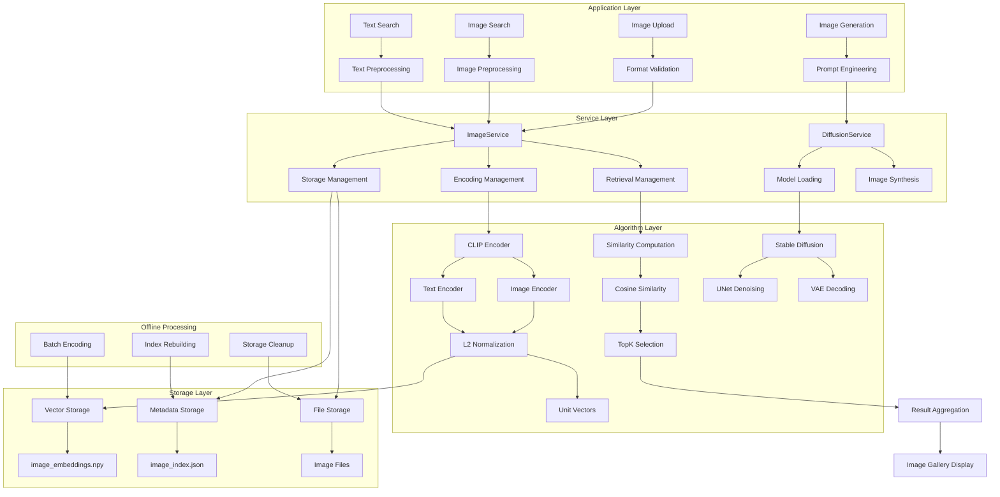

# Multimodal AI
{: .no_toc }

Advanced multimodal AI capabilities combining vision and language models for cross-modal understanding, featuring CLIP-based image search and diffusion model image generation.
{: .fs-6 .fw-300 }

## Table of contents
{: .no_toc .text-delta }

1. TOC
{:toc}

---

## System Overview

### Background & Goals

**Business Context**:
With the explosive growth of multimedia content, traditional file name and tag-based image retrieval can no longer meet user needs. Users want to quickly find semantically relevant images through "image-to-image" or "text-to-image" search.

**Design Goals**:
1. **Functionality**: Support image-to-image and text-to-image cross-modal retrieval
2. **Performance**: Fast retrieval response supporting large-scale image libraries
3. **User Experience**: Intuitive image gallery display with real-time preview
4. **Technical**: High-precision semantic matching with scalable vector storage

**Technical Principles**:
- **Semantic Understanding**: Choose pre-trained multimodal models like CLIP
- **Retrieval Efficiency**: Vectorized storage + efficient similarity computation
- **Storage Optimization**: Balance storage space and retrieval precision
- **Deployment Friendly**: Support adaptive CPU/GPU deployment

### Key Features

- 📤 **Image Upload & Indexing**: Store images and generate semantic embedding vectors
- 🔍 **Image-to-Image Search**: Find visually similar images using query image
- 💬 **Text-to-Image Search**: Search matching images using natural language descriptions
- 📋 **Image Management**: View, delete, and manage image library
- 🎨 **Image Generation**: Generate images from text descriptions using diffusion models

---

## Architecture

### System Architecture Diagram



### Architecture Highlights

1. **Layered Decoupling**: Application, service, algorithm, and storage layers are independent
2. **Unified Encoding**: Images and text mapped to the same vector space
3. **L2 Normalization**: Convert vectors to unit vectors, optimize similarity computation
4. **Efficient Storage**: NumPy vector storage + JSON metadata index
5. **Online/Offline Separation**: Retrieval service decoupled from batch processing

### Directory Structure

```
src/search_engine/
├── image_service.py                # Image service core implementation ⭐
├── image_tab/                      # Image search module
│   ├── __init__.py                # Module initialization
│   └── image_tab.py               # UI and interaction logic
├── portal.py                       # Main entry and UI orchestration
└── service_manager.py              # Service manager

test_images/                        # Test image directory
├── *.jpg                          # Test image files
├── image_embeddings.npy           # Test vector data
└── image_index.json               # Test index file

models/images/                      # Production image storage
├── image_index.json               # Image metadata index ⭐
├── image_embeddings.npy           # Image vector matrix ⭐  
└── *.{jpg,png,jpeg}               # Stored image files
```

---

## Core Technologies

### CLIP Model

**Model Specifications**:
- **Model**: OpenAI CLIP ViT-B/32
- **Embedding Dimension**: 512-dimensional vectors
- **Vision Encoder**: Vision Transformer (ViT-B/32)
- **Text Encoder**: Transformer
- **Image Size**: 224×224 (auto-resized)
- **Vocabulary Size**: 49,408

**Technical Details**:
- **Input Preprocessing**: Image resize to 224×224, text tokenization
- **Feature Dimension**: 512-dimensional vectors balancing storage and precision
- **L2 Normalization**: Convert vectors to unit vectors for optimized similarity computation
- **Device Adaptation**: Automatic GPU detection with CPU fallback

### L2 Normalization

L2 normalization is a key technique in vector retrieval:

1. **Mathematical Principle**: Transform vector v into unit vector v̂ = v / ||v||
2. **Similarity Optimization**: After normalization, cosine similarity simplifies to dot product
   - Original formula: cos(θ) = A·B / (||A|| × ||B||)
   - After normalization: cos(θ) = ·B̂ (because ||Â|| = ||B̂|| = 1)
3. **Computational Efficiency**: Avoid computing vector norms each time, significantly improving retrieval speed
4. **Numerical Stability**: Eliminate influence of vector length differences on similarity computation

---

## Features

### 1. Image Upload & Indexing

**Location**: `🖼️ Image Search System` → `📤 Image Upload` tab

**Features**:
- Support common image formats (JPG, PNG, GIF, BMP, etc.)
- Automatically generate unique ID for each image based on MD5 hash
- Allow adding descriptions and comma-separated tags
- Real-time preview of uploaded images

**Usage**:
1. Click **"Choose Image File"** to upload image
2. Enter description in **"Image Description"** box (optional)
3. Enter tags in **"Image Tags"** box, comma-separated (optional)
4. Click **"📤 Upload Image"** to complete upload

### 2. Image-to-Image Search

**Location**: `🖼️ Image Search System` → `🔍 Image Search` tab

**Features**:
- Upload query image to find visually similar images
- Adjust number of returned results (1-20)
- Display similarity scores and image metadata
- Provide gallery view for quick visual inspection

**Usage**:
1. Click **"Choose Query Image"** to upload image to search for
2. Adjust **"Number of Results"** slider
3. Click **"🔍 Image Search"**
4. View results in table and image gallery below

### 3. Text-to-Image Search

**Location**: `🖼️ Image Search System` → `💬 Text Search` tab

**Features**:
- Enter text description to find semantically matching images
- Support Chinese and English queries
- Leverage CLIP's cross-modal understanding capabilities
- Display relevance score for each result

**Usage**:
1. Enter descriptive query in **"Search Text"** box
2. Adjust **"Number of Results"** slider
3. Click **"💬 Text Search"**
4. View results in table and image gallery

**Query Examples**:
- `an orange cat sleeping on a bed`
- `a red car on the street`
- `beautiful sunset landscape`
- `a person running`

### 4. Image Management

**Location**: `🖼️ Image Search System` → `📋 Image Management` tab

**Features**:
- View statistics of entire image library
- Browse list of all indexed images
- Delete individual images
- Clear entire image library

**Operations**:
- **📊 Refresh Statistics**: View total images, storage size, format distribution, etc.
- **🔄 Refresh List**: Update list of all images
- **🗑️ Delete Selected Image**: Delete currently selected image from list
- **🗑️ Clear All Images**: Permanently delete entire image library (use with caution)

### 5. Image Generation

**Location**: `🖼️ Image Search System` → `🎨 Image Generation` tab

**Features**:
- Generate images from text descriptions using Stable Diffusion
- Adjustable generation parameters (steps, guidance scale, size)
- Save generated images to local storage
- Support negative prompts for better control

See [Image Generation Guide]({{ site.baseurl }}/docs/multimodal/image-generation) for detailed usage.

---

## Implementation Details

### Core Components

```python
# File: src/search_engine/image_service.py
class ImageService:
    """Image indexing service - CLIP-based image retrieval"""
    
    def __init__(self, storage_dir: str = "models/images"):
        """Initialize image service"""
        self.storage_dir = Path(storage_dir)
        
        # Initialize CLIP model
        self.device = "cuda" if torch.cuda.is_available() else "cpu"
        self.model = CLIPModel.from_pretrained("openai/clip-vit-base-patch32")
        self.processor = CLIPProcessor.from_pretrained("openai/clip-vit-base-patch32")
        
        # Image index and embeddings
        self.image_index: Dict[str, Dict] = {}
        self.image_embeddings: Optional[np.ndarray] = None
        self.image_ids: List[str] = []
    
    def _encode_image(self, image_path: str) -> np.ndarray:
        """Image encoding - CLIP vision encoder"""
        image = Image.open(image_path).convert('RGB')
        inputs = self.processor(images=image, return_tensors="pt").to(self.device)
        
        with torch.no_grad():
            image_features = self.model.get_image_features(**inputs)
            # L2 normalization
            image_features = image_features / image_features.norm(dim=-1, keepdim=True)
        
        return image_features.cpu().numpy().flatten()
    
    def _encode_text(self, text: str) -> np.ndarray:
        """Text encoding - CLIP text encoder"""
        inputs = self.processor(text=text, return_tensors="pt").to(self.device)
        
        with torch.no_grad():
            text_features = self.model.get_text_features(**inputs)
            # L2 normalization
            text_features = text_features / text_features.norm(dim=-1, keepdim=True)
        
        return text_features.cpu().numpy().flatten()
    
    def search_by_image(self, query_image_path: str, top_k: int = 10) -> List[Dict]:
        """Image-to-image search"""
        query_embedding = self._encode_image(query_image_path)
        similarities = np.dot(self.image_embeddings, query_embedding)
        top_indices = np.argsort(similarities)[::-1][:top_k]
        
        results = []
        for idx in top_indices:
            image_id = self.image_ids[idx]
            image_info = self.image_index[image_id].copy()
            image_info['similarity'] = float(similarities[idx])
            results.append(image_info)
        
        return results
    
    def search_by_text(self, query_text: str, top_k: int = 10) -> List[Dict]:
        """Text-to-image search"""
        query_embedding = self._encode_text(query_text)
        similarities = np.dot(self.image_embeddings, query_embedding)
        top_indices = np.argsort(similarities)[::-1][:top_k]
        
        results = []
        for idx in top_indices:
            image_id = self.image_ids[idx]
            image_info = self.image_index[image_id].copy()
            image_info['similarity'] = float(similarities[idx])
            results.append(image_info)
        
        return results
```

### Storage Structure

```python
# Three-layer storage architecture
class ImageStorage:
    """Three-layer storage architecture"""
    
    # Layer 1: Vector storage - high-performance numerical computation
    image_embeddings: np.ndarray     # (N, 512) vector matrix
    
    # Layer 2: Metadata index - fast lookup
    image_index: Dict[str, Dict] = {
        "image_id": {
            "id": str,              # Image ID (MD5 hash)
            "original_name": str,   # Original filename
            "stored_path": str,     # Storage path
            "description": str,     # User description
            "tags": List[str],      # Tag list
            "width": int,           # Image width
            "height": int,          # Image height
            "file_size": int,       # File size
            "format": str,          # Image format
            "created_at": str,      # Creation time
            "embedding_index": int  # Vector index position
        }
    }
    
    # Layer 3: File storage - original image preservation
    # models/images/[md5_hash].[ext]
```

### Similarity Retrieval

**Algorithm**: Vector retrieval based on cosine similarity
- **Mathematical Principle**: similarity(A, B) = A·B / (||A|| × ||B||)
- **L2 Normalization Optimization**: After converting vectors to unit vectors, cosine similarity equals dot product A·B
- **Computational Advantage**: Avoid computing vector norms each time, improving efficiency
- **Complexity**: O(N×D), where N is number of images, D is vector dimension

---

## Performance & Specifications

### Performance Metrics

- **Encoding Speed**: ~1-3 seconds per image in CPU environment
- **Search Speed**: Millisecond-level response time
- **Storage Efficiency**: ~2KB embedding data per image
- **Similarity Precision**: Based on cosine similarity, score range 0 to 1

### Storage Structure

```
models/images/
├── image_index.json      # Image metadata index
├── image_embeddings.npy  # Image embedding vector matrix
└── [image_id].[ext]      # Stored image files
```

---

## Best Practices

### Image Quality

1. **Use High-Quality Images**: Clear, high-resolution images yield better search results
2. **Accurate Descriptions**: Add precise descriptions and tags for improved management
3. **Consistent Tagging**: Use consistent tag system for better organization
4. **Regular Backups**: Regularly backup `models/images/` directory

### Search Tips

**Text-to-Image Search**:
- Use specific, descriptive words
- Include visual features like colors, shapes, and actions
- Support Chinese and English (base CLIP model may perform better in English)

**Image-to-Image Search**:
- Query image should clearly contain main visual elements you're looking for
- Composition and angle of query image affect results

### Important Notes

- System will download CLIP model on first startup (~1GB)
- Performance significantly better in GPU environment
- Uploaded images are copied to system storage directory, monitor disk space
- Delete operations are irreversible

---

## Troubleshooting

### Common Issues

1. **Model Loading Failure**: Check network connection. First-time use requires model download
2. **Image Upload Failure**: Verify image format and file size
3. **No Search Results**: Ensure images are indexed in library. Try different queries
4. **Slow Performance**: Consider using GPU or reducing number of results returned

System includes error handling, any issues will be reported in respective status boxes. View console output for detailed error information.

---

## Optimization Paths

### Current Implementation

**Advantages**:
- ✅ Simple and understandable code structure for learning
- ✅ Quick to get started with few dependencies
- ✅ Complete core functionality
- ✅ Low cost without additional databases or cloud services

**Limitations**:
- ⚠️ Performance: Linear search with O(N) time complexity
- ⚠️ Memory: Full vectors loaded into memory
- ⚠️ Scalability: Single-machine deployment, difficult to scale horizontally
- ⚠️ Concurrency: Synchronous processing, cannot support high concurrency

### Production-Grade Optimization

For large-scale data and high-performance retrieval, consider integrating professional vector databases:

| Database | Use Case | Advantages | Deployment |
|:---------|:---------|:-----------|:-----------|
| **Milvus** | Large-scale AI apps | High performance, open source, cloud-native | Local/Cloud |
| **Faiss** | Research & prototyping | Facebook open source, rich algorithms | Local integration |
| **Pinecone** | Quick deployment | Fully managed, easy to use | Cloud service |
| **Qdrant** | Modern deployment | Rust implementation, high performance | Containerized |
| **Weaviate** | Semantic search | GraphQL API, modular | Local/Cloud |

---

## Module Documentation

### Detailed Guides

<div class="code-example" markdown="1">

[Image Generation Guide]({{ site.baseurl }}/docs/multimodal/image-generation){: .btn .btn-primary }
Learn about text-to-image generation using Stable Diffusion models

</div>

---

## Related Resources

- [CLIP Paper (Radford et al., 2021)](https://arxiv.org/abs/2103.00020)
- [Stable Diffusion Paper](https://arxiv.org/abs/2112.10752)
- [OpenAI CLIP Model](https://github.com/openai/CLIP)
- [Hugging Face Transformers](https://huggingface.co/docs/transformers)

