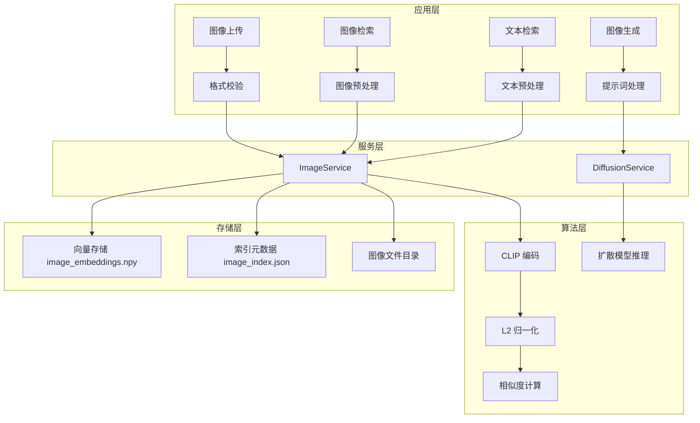

# 多模态系统
{: .no_toc }

本模块提供“图搜图、文搜图、文生图”能力，面向企业级场景强调可复现、可维护与可扩展。
{: .fs-6 .fw-300 }

## 目录
{: .no_toc .text-delta }

1. TOC
{:toc}

---

## 系统概览

### 背景与目标

在多媒体数据规模持续增长的情况下，传统依赖文件名或标签的检索方式难以满足语义检索需求。系统通过统一向量空间实现跨模态理解，支持图像语义搜索与图像生成。

**设计目标**：
1. 支持图搜图与文搜图检索
2. 保证较低延迟与可接受精度
3. 提供可观测、可维护的工程结构
4. 支持 CPU/GPU 自适应部署

### 核心能力

- **图像上传与索引**：自动编码并写入向量库
- **图搜图**：基于视觉特征召回相似图像
- **文搜图**：基于文本描述进行跨模态检索
- **图像管理**：索引统计、删除与重建
- **文生图**：基于扩散模型生成图像

---

## 架构说明


```mermaid
graph TB
    subgraph "应用层"
        A[图像上传] --> A1[格式校验]
        B[图像检索] --> B1[图像预处理]
        C[文本检索] --> C1[文本预处理]
        D[图像生成] --> D1[提示词处理]
    end

    subgraph "服务层"
        A1 --> E[ImageService]
        B1 --> E
        C1 --> E
        D1 --> F[DiffusionService]
    end

    subgraph "算法层"
        E --> G[CLIP 编码]
        G --> H[L2 归一化]
        H --> I[相似度计算]
        F --> J[扩散模型推理]
    end

    subgraph "存储层"
        E --> K[向量存储 image_embeddings.npy]
        E --> L[索引元数据 image_index.json]
        E --> M[图像文件目录]
    end
```

**架构要点**：
- 分层解耦：应用、服务、算法、存储职责清晰
- 统一向量空间：图像与文本可直接计算相似度
- 在线离线分离：在线检索与离线重建互不阻塞

---

## 目录结构

```text
src/search_engine/
├── image_service.py
├── image_tab/
│   └── image_tab.py
├── diffusion_service.py
└── portal.py

models/images/
├── image_index.json
├── image_embeddings.npy
└── *.{jpg,png,jpeg}
```

---

## 关键技术

### CLIP 检索

- 图像与文本分别编码为 512 维向量
- 向量做 L2 归一化后，点积等价于余弦相似度
- 可直接用于跨模态检索排序

### 扩散模型生成

- 基于文本提示词进行迭代去噪
- 支持多模型切换与参数调优
- 生成结果可落盘并保留元数据

---

## 功能入口

### 1. 图像上传

路径：`🖼️ 多模态系统` → `📤 图像上传`

- 支持常见格式上传
- 自动生成图像 ID 并编码入库
- 可填写描述与标签

### 2. 图搜图

路径：`🖼️ 多模态系统` → `🔍 图像检索`

- 上传查询图像
- 按相似度返回 TopK 结果
- 支持图库可视化浏览

### 3. 文搜图

路径：`🖼️ 多模态系统` → `💬 文本检索`

- 输入描述文本进行语义检索
- 返回图像与相似度分数
- 适合主题探索与素材筛选

### 4. 图像管理

路径：`🖼️ 多模态系统` → `📋 图像管理`

- 查看统计信息
- 刷新索引列表
- 删除单图或清空图库

### 5. 图像生成

路径：`🖼️ 多模态系统` → `🎨 图像生成`

- 输入提示词生成图像
- 支持步数、引导强度、尺寸等参数
- 详情见 [图像生成]({{ site.baseurl }}/docs/multimodal/image-generation)

---

## 性能与工程建议

### 性能指标（参考）

- 编码耗时：CPU 单图约 1-3 秒
- 检索耗时：毫秒级（取决于图库规模）
- 存储开销：单图向量约 2KB

### 运行建议

- 优先使用 GPU 提升编码和生成性能
- 定期备份 `models/images/`
- 对大规模图库建议引入专业向量数据库（如 Milvus/Faiss/Qdrant）

---

## 常见问题

1. **模型加载失败**：检查网络与模型下载状态  
2. **上传失败**：检查文件格式与大小限制  
3. **检索结果差**：优化查询描述或检查索引是否完整  
4. **响应慢**：使用 GPU 或减少返回数量

---

## 相关文档

- [图像检索]({{ site.baseurl }}/docs/multimodal/image-search)
- [图像生成]({{ site.baseurl }}/docs/multimodal/image-generation)
- [CLIP 论文](https://arxiv.org/abs/2103.00020)
