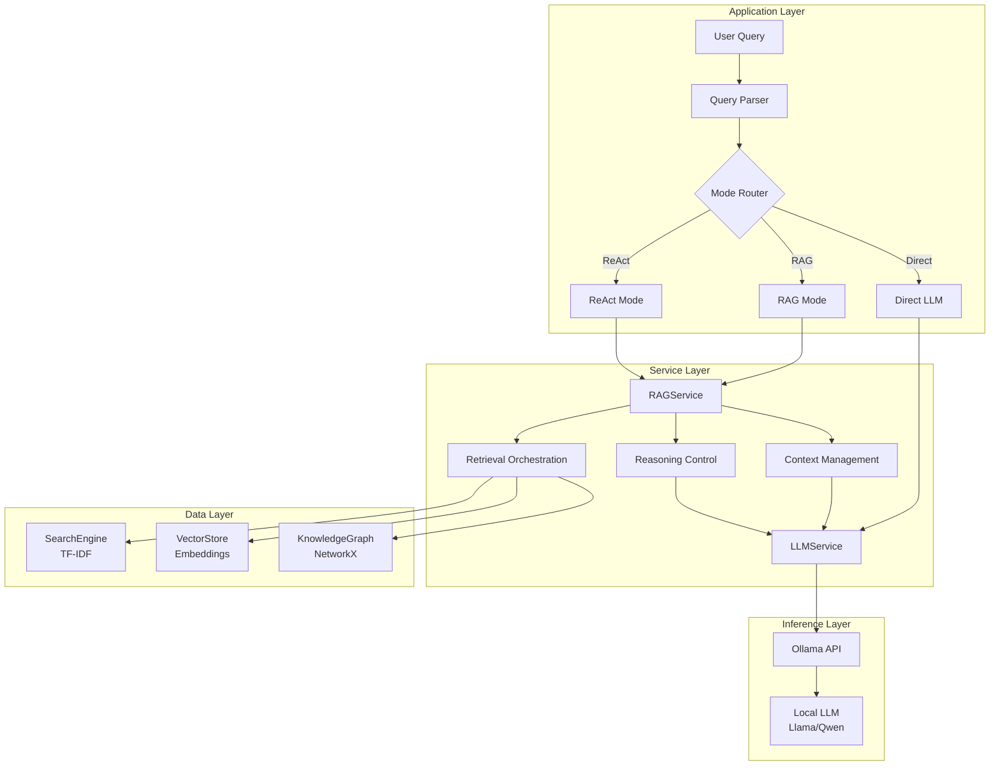

# RAG System Architecture
{: .no_toc }

Layered architecture design for retrieval-augmented generation.
{: .fs-6 .fw-300 }

## Table of contents
{: .no_toc .text-delta }

1. TOC
{:toc}

---

## System Overview

###Overall Architecture



---

## Core Components

### 1. RAG Service

**Responsibilities**:
- Orchestrate retrieval from multiple sources
- Manage context window and relevance filtering
- Handle multi-step reasoning loops

**Key Methods**:
```python
class RAGService:
    def retrieve_context(self, query: str, top_k: int = 5)
    def rerank_results(self, query: str, results: List)
    def answer_with_context(self, query: str, mode: str)
```

### 2. Hybrid Retrieval

**Three-Layer Retrieval**:
- **Keyword**: TF-IDF inverted index (fast, exact match)
- **Semantic**: Sentence-BERT embeddings (meaning-based)
- **Structured**: Knowledge graph traversal (entity relationships)

**Result Fusion**:
```python
final_score = α × keyword_score + β × semantic_score + γ × graph_score
```

### 3. Context Management

**Context Window Optimization**:
- Max tokens: 4096 (typical for Llama models)
- Reserve for output: 1024 tokens
- Available for context: ~3000 tokens

**Context Construction**:
```
System: You are a helpful assistant. Use the following context to answer.

Context:
[Top-3 retrieved passages]

User: {query}
