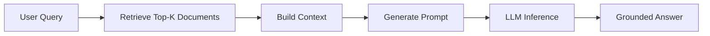

# Context-Enhanced RAG
{: .no_toc }

Retrieval-Augmented Generation for fact-based answers grounded in local documents.
{: .fs-6 .fw-300 }

## Table of contents
{: .no_toc .text-delta }

1. TOC
{:toc}

---

## Overview

### What is Context-Enhanced Mode?

Context-Enhanced mode (RAG - Retrieval-Augmented Generation) combines **document retrieval** with **LLM generation** to provide fact-based answers grounded in your local knowledge base.

### Workflow



### When to Use

✅ **Questions about local documents**  
✅ **Fact-based answers required**  
✅ **Source attribution needed**  
✅ **Domain-specific knowledge**

❌ General knowledge (use Direct Chat)  
❌ Creative tasks (use Direct Chat)  
❌ Multi-document comparison (use Multi-step Reasoning)

---

## How It Works

### Core Concept

RAG works by:
1. **Retrieving** relevant documents from your knowledge base
2. **Enhancing** the LLM prompt with retrieved context
3. **Generating** answers grounded in the provided context

This approach ensures answers are based on actual documents rather than the LLM's potentially outdated or incorrect pre-trained knowledge.

### Three-Stage Pipeline

**Stage 1: Document Retrieval**
```python
def retrieve_documents(query: str, top_k: int = 5):
    """Retrieve relevant documents using TF-IDF"""
    results = index_service.search(query, top_k)
    return results
```

**Stage 2: Context Enhancement**
```python
def enhance_with_context(query: str, documents: List[Document]):
    """Build enhanced prompt with context"""
    context = "\n\n".join([
        f"Document {i+1}: {doc.content}" 
        for i, doc in enumerate(documents)
    ])
    
    prompt = f"""Based on the following context, answer the question.

Context:
{context}

Question: {query}

Answer:"""
    
    return prompt
```

**Stage 3: LLM Generation**
```python
def generate_answer(prompt: str, model: str):
    """Generate answer using Ollama"""
    response = ollama_client.generate(
        model=model,
        prompt=prompt
    )
    return response
```

---

## Usage Guide

### Basic Usage

1. Navigate to "🤖 RAG Retrieval Enhancement" tab
2. **Enable** "Enable Context Engineering" ✅
3. **Disable** "Enable Multi-step Reasoning"
4. Set Top-K (default: 5)
5. Enter your question about local documents
6. Click "🚀 Execute Query"

### Understanding Results

**Output Components**:
1. **Generated Answer**: LLM's response based on retrieved context
2. **Retrieved Documents**: Table showing doc IDs and relevance scores
3. **Context Used**: The actual context sent to LLM
4. **Prompt**: Complete prompt template with context

### Example

**Query**: "What is TF-IDF?"

**Retrieved Documents**:
- Doc #42: "TF-IDF stands for Term Frequency-Inverse Document Frequency..."
- Doc #87: "TF-IDF is a statistical measure used to evaluate..."

**Generated Answer**:
```
Based on the provided documents, TF-IDF (Term Frequency-Inverse Document 
Frequency) is a statistical measure used in information retrieval to 
evaluate how important a word is to a document in a collection. It combines 
two metrics: term frequency (how often a word appears in a document) and 
inverse document frequency (how rare the word is across all documents).
```

---

## Best Practices

### Top-K Selection

```python
TOP_K_GUIDELINES = {
    "simple_questions": 3,       # "What is X?"
    "standard_queries": 5,       # Most queries (default)
    "complex_questions": 10,     # Requires multiple sources
    "exploratory": 15            # Broad research
}
```

### Context Length Management

```python
# Avoid context overflow
MAX_CONTEXT_LENGTH = {
    "llama3.2": 4096,      # tokens
    "llama3.1:8b": 8192,
    "qwen2.5": 8192
}

# Truncate if necessary
def truncate_context(context, max_tokens=2000):
    """Keep context within model limits"""
    # Rough estimation: 1 token ≈ 4 characters
    max_chars = max_tokens * 4
    if len(context) > max_chars:
        return context[:max_chars] + "\n...(truncated)"
    return context
```

### Prompt Template Design

```python
PROMPT_TEMPLATES = {
    "basic": """Based on the following context, answer the question.

Context:
{context}

Question: {query}

Answer:""",

    "with_constraints": """Based on the following context, answer the question.
If the context doesn't contain the answer, say "I cannot answer based on 
the provided context."

Context:
{context}

Question: {query}

Answer in Chinese:""",

    "with_citation": """Based on the following context, answer the question 
and cite the document numbers you used.

Context:
{context}

Question: {query}

Answer (cite sources):"""
}
```

---

## Advantages

✅ **Factual Accuracy**: Grounded in actual documents  
✅ **Source Attribution**: Can trace answer to specific docs  
✅ **Reduced Hallucination**: LLM constrained by context  
✅ **Domain Expertise**: Works with specialized knowledge  
✅ **Privacy**: All data stays local

---

## Limitations

⚠️ **Retrieval Quality**: Depends on TF-IDF effectiveness  
⚠️ **Context Window**: Limited to model's max tokens  
⚠️ **Single-hop**: Cannot synthesize across multiple searches  
⚠️ **Latency**: Slower than direct chat (~10s vs ~5s)

---

## Troubleshooting

### Poor Retrieval Quality

**Problem**: Retrieved documents not relevant

**Solutions**:
```python
# 1. Increase Top-K
top_k = 10  # Retrieve more documents

# 2. Rephrase query
query = "TF-IDF algorithm"  # Instead of "how does search work"

# 3. Check index quality
# Verify documents are properly indexed
```

### Answer Not in Context

**Problem**: LLM says "I cannot answer"

**Solutions**:
- Verify documents contain relevant information
- Try different query phrasing
- Increase Top-K value
- Check if documents are properly indexed

### Context Too Long

**Problem**: Exceeds model token limit

**Solutions**:
```python
# Reduce Top-K
top_k = 3  # Instead of 10

# Truncate documents
def truncate_docs(docs, max_per_doc=500):
    return [doc[:max_per_doc] for doc in docs]

# Use model with larger context
model = "llama3.1:8b"  # 8K context instead of 4K
```

---

## Performance Optimization

### Latency Breakdown

```python
LATENCY_COMPONENTS = {
    "retrieval": 2.0,      # TF-IDF search
    "context_building": 0.5,  # String concatenation
    "llm_inference": 7.0,  # Main bottleneck
    "total": 9.5           # seconds
}
```

### Optimization Strategies

**1. Cache Retrieved Documents**:
```python
from functools import lru_cache

@lru_cache(maxsize=100)
def retrieve_documents_cached(query, top_k):
    """Cache retrieval results for identical queries"""
    return index_service.search(query, top_k)
```

**2. Parallel Processing**:
```python
import concurrent.futures

def parallel_rag(queries):
    """Process multiple queries in parallel"""
    with concurrent.futures.ThreadPoolExecutor() as executor:
        results = executor.map(rag_query, queries)
    return list(results)
```

**3. Optimize Retrieval**:
- Build optimized inverted index
- Use approximate nearest neighbors for large datasets
- Pre-compute document embeddings

---

## Advanced Topics

### Hybrid Retrieval

```python
def hybrid_retrieval(query, top_k=5):
    """Combine TF-IDF with semantic search"""
    
    # TF-IDF results
    tfidf_results = index_service.search(query, top_k)
    
    # Semantic results (if available)
    semantic_results = semantic_search(query, top_k)
    
    # Merge and rerank
    combined = merge_results(tfidf_results, semantic_results)
    return combined[:top_k]
```

### Contextual Compression

```python
def compress_context(context, query):
    """Extract only relevant sentences from context"""
    
    sentences = split_into_sentences(context)
    
    # Score sentences by relevance to query
    scored = [
        (sentence, relevance_score(sentence, query))
        for sentence in sentences
    ]
    
    # Keep top 50% most relevant
    sorted_sentences = sorted(scored, key=lambda x: x[1], reverse=True)
    compressed = [s[0] for s in sorted_sentences[:len(sentences)//2]]
    
    return " ".join(compressed)
```

---

## Next Steps

- For complex multi-step tasks → [Multi-step Reasoning]({{ site.baseurl }}/docs/rag/multi-step-reasoning)
- For setup instructions → [Ollama Integration]({{ site.baseurl }}/docs/rag/ollama-integration)
- For simple Q&A → [Direct LLM Chat]({{ site.baseurl }}/docs/rag/direct-chat)

---

## Related Resources

- [RAG Paper (Lewis et al., 2020)](https://arxiv.org/abs/2005.11401)
- [Retrieval-Augmented Generation Guide](https://www.pinecone.io/learn/retrieval-augmented-generation/)
- [Context Engineering Best Practices](https://www.promptingguide.ai/techniques/rag)

