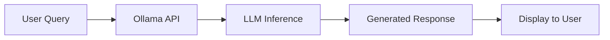

# Direct LLM Chat
{: .no_toc }

Fast general-purpose Q&A mode with direct LLM inference, no retrieval overhead.
{: .fs-6 .fw-300 }

## Table of contents
{: .no_toc .text-delta }

1. TOC
{:toc}

---

## Overview

### What is Direct Chat Mode?

Direct Chat mode provides **immediate LLM interaction** without document retrieval or context enhancement. The user's question is sent directly to the language model, which generates responses based on its pre-trained knowledge.

### When to Use

| Use Case | Suitable | Not Suitable |
|:---------|:---------|:-------------|
| **General knowledge** | ✅ "What is AI?" | ❌ "What's in our Q3 report?" |
| **Creative tasks** | ✅ "Write a poem" | ❌ "Summarize this document" |
| **Explanations** | ✅ "How does HTTP work?" | ❌ "What did our CEO say?" |
| **Open-ended** | ✅ "Discuss philosophy" | ❌ "Facts from our KB" |

---

## How It Works

### Architecture



### Implementation

```python
def direct_chat(query: str, model: str = "llama3.1:8b"):
    """Direct LLM chat without retrieval"""
    
    # Build simple prompt
    prompt = f"User: {query}\n\nAssistant:"
    
    # Call Ollama API
    response = requests.post(
        f"{ollama_url}/api/generate",
        json={
            "model": model,
            "prompt": prompt,
            "stream": False
        }
    )
    
    return response.json()["response"]
```

---

## Usage Guide

### Basic Usage

1. Navigate to "🤖 RAG Retrieval Enhancement" tab
2. **Disable** "Enable Context Engineering"
3. **Disable** "Enable Multi-step Reasoning"
4. Enter your question
5. Click "🚀 Execute Query"

### Example Queries

**Good for Direct Chat**:
```
"Explain machine learning in simple terms"
"Write a Python function to reverse a string"
"What are the benefits of exercise?"
"Compare democracy and autocracy"
```

**Not Good for Direct Chat**:
```
"What's in document #42?"  → Use Context Enhanced
"Find info about project X"  → Use Context Enhanced
"Compare quotes from doc A and B"  → Use Multi-step Reasoning
```

---

## Model Selection

### Available Models

```python
RECOMMENDED_MODELS = {
    # Fast and lightweight
    "llama3.2": {
        "size": "3B parameters",
        "speed": "Very fast",
        "use_case": "Quick Q&A"
    },
    
    # Balanced performance
    "llama3.1:8b": {
        "size": "8B parameters",
        "speed": "Fast",
        "use_case": "General purpose"
    },
    
    # Chinese-optimized
    "qwen2.5": {
        "size": "7B parameters",
        "speed": "Fast",
        "use_case": "Chinese Q&A"
    },
    
    # Code-specialized
    "deepseek-coder": {
        "size": "6.7B parameters",
        "speed": "Fast",
        "use_case": "Programming help"
    }
}
```

### Model Comparison

| Model | Speed | Quality | Chinese | Code |
|:------|:------|:--------|:--------|:-----|
| **llama3.2** | ⚡⚡⚡ | ⭐⭐⭐ | ⭐⭐ | ⭐⭐⭐ |
| **llama3.1:8b** | ⚡⚡ | ⭐⭐⭐⭐ | ⭐⭐ | ⭐⭐⭐⭐ |
| **qwen2.5** | ⚡⚡ | ⭐⭐⭐⭐ | ⭐⭐⭐⭐⭐ | ⭐⭐⭐ |
| **deepseek-coder** | ⚡⚡ | ⭐⭐⭐ | ⭐⭐ | ⭐⭐⭐⭐⭐ |

---

## Generation Parameters

### Key Parameters

```python
GENERATION_CONFIG = {
    # Creativity control
    "temperature": 0.7,     # 0.0 = deterministic, 1.0 = creative
    
    # Sampling strategy
    "top_p": 0.9,           # Nucleus sampling
    "top_k": 40,            # Top-K sampling
    
    # Quality control
    "repeat_penalty": 1.1,  # Penalize repetition
    "max_tokens": 512,      # Response length limit
    
    # Stopping
    "stop": ["User:", "\n\n\n"]  # Stop sequences
}
```

### Parameter Effects

**Temperature**:
```python
# Low temperature (0.1-0.3): Focused, consistent
temperature = 0.2
# Output: "Machine learning is a subset of artificial intelligence..."

# Medium temperature (0.5-0.7): Balanced
temperature = 0.7
# Output: "Machine learning empowers computers to learn patterns..."

# High temperature (0.8-1.0): Creative, varied
temperature = 1.0
# Output: "Imagine teaching a computer to think like us! That's ML..."
```

**Top-P (Nucleus Sampling)**:
```python
# Conservative (0.7-0.8): More predictable
top_p = 0.7

# Balanced (0.9): Recommended
top_p = 0.9

# Diverse (0.95-1.0): More variety
top_p = 0.95
```

---

## Performance

### Latency Breakdown

```python
TYPICAL_LATENCY = {
    "api_call": 0.2,       # HTTP request overhead
    "model_loading": 0.0,  # Already loaded in Ollama
    "inference": 4.5,      # Main compute time
    "streaming": 0.3,      # Response streaming
    "total": 5.0           # seconds
}
```

### Optimization Tips

**1. Use Smaller Models**:
```python
# Fast but lower quality
model = "llama3.2"  # 3B params, ~3s response

# Balanced
model = "llama3.1:8b"  # 8B params, ~5s response
```

**2. Limit Max Tokens**:
```python
# Shorter responses = faster
max_tokens = 256  # Brief answers

max_tokens = 512  # Standard

max_tokens = 1024  # Detailed
```

**3. Enable GPU Acceleration**:
```bash
# Ollama automatically uses GPU if available
# Check GPU usage:
nvidia-smi  # Linux/Windows
```

---

## Advantages & Limitations

### Advantages

✅ **Speed**: No retrieval overhead, immediate response  
✅ **Simplicity**: Straightforward implementation  
✅ **Versatility**: Works for open-ended questions  
✅ **No Dependencies**: Don't need document index

### Limitations

❌ **No Source Attribution**: Can't cite sources  
❌ **Hallucination Risk**: May generate incorrect "facts"  
❌ **Knowledge Cutoff**: Limited to training data  
❌ **No Domain Specificity**: Generic knowledge only

---

## Best Practices

### Prompt Engineering

**Good Prompts**:
```python
# Clear and specific
"Explain quantum computing in 3 sentences"

# With constraints
"Write a Python function to sort a list, include comments"

# Structured format
"Compare pros and cons of Python vs Java in a table"
```

**Bad Prompts**:
```python
# Too vague
"Tell me about stuff"

# Ambiguous
"How does it work?"  # What is "it"?

# Impossible without context
"What did he say in the meeting?"  # LLM wasn't there!
```

### Error Handling

```python
def direct_chat_with_retry(query, model, max_retries=3):
    """Robust direct chat with retry logic"""
    
    for attempt in range(max_retries):
        try:
            response = call_ollama(query, model)
            
            # Validate response
            if len(response) < 10:
                raise ValueError("Response too short")
            
            return response
            
        except requests.exceptions.Timeout:
            if attempt < max_retries - 1:
                time.sleep(2 ** attempt)  # Exponential backoff
                continue
            else:
                return "Error: Request timed out. Please try again."
        
        except Exception as e:
            return f"Error: {str(e)}"
```

---

## Examples

### Example 1: General Knowledge

**Query**: "What is the capital of France?"

**Response**:
```
The capital of France is Paris. It is located in the north-central 
part of the country and is known for its art, fashion, gastronomy, 
and culture.
```

**Analysis**: ✅ Simple factual question, perfect for direct chat

### Example 2: Creative Task

**Query**: "Write a haiku about AI"

**Response**:
```
Silicon minds think
Learning from endless data
Future takes its shape
```

**Analysis**: ✅ Creative task, LLM performs well

### Example 3: Explanation

**Query**: "Explain recursion using an analogy"

**Response**:
```
Recursion is like looking at a mirror reflecting another mirror. 
Each reflection shows a smaller version of the same image, continuing 
until it becomes too small to see. Similarly, a recursive function 
calls itself with smaller inputs until reaching a base case that stops 
the chain.
```

**Analysis**: ✅ Conceptual explanation, good use of direct chat

### Example 4: Where Direct Chat Fails

**Query**: "What does our company's Q3 report say about revenue?"

**Response**:
```
I don't have access to your company's specific Q3 report. However, 
typical Q3 reports include...
```

**Analysis**: ❌ Needs local documents, should use Context Enhanced mode instead

---

## Comparison with Other Modes

| Feature | Direct Chat | Context Enhanced | Multi-step |
|:--------|:-----------|:----------------|:-----------|
| **Latency** | 5s ⚡⚡⚡ | 10s ⚡⚡ | 30s ⚡ |
| **Accuracy** | Medium | High | Very High |
| **Hallucination** | Medium Risk | Low Risk | Very Low |
| **Source Citing** | No | Yes | Yes |
| **Use Case** | General Q&A | Domain Q&A | Complex tasks |

---

## Integration Examples

### Python Integration

```python
from rag_service import RAGService

# Initialize service
rag_service = RAGService(
    index_service=None,  # Not needed for direct chat
    ollama_url="http://localhost:11434"
)

# Direct chat
response = rag_service.direct_chat(
    query="Explain machine learning",
    model="llama3.1:8b",
    temperature=0.7
)

print(response)
```

### API Integration

```bash
# Direct call to Ollama API
curl http://localhost:11434/api/generate \
  -d '{
    "model": "llama3.1:8b",
    "prompt": "What is AI?",
    "stream": false
  }'
```

---

## Troubleshooting

### Issue: Slow Response

**Symptoms**: Takes > 10 seconds for simple questions

**Solutions**:
```python
# 1. Use smaller model
model = "llama3.2"  # Instead of llama3.1:8b

# 2. Reduce max tokens
max_tokens = 256

# 3. Check Ollama is using GPU
# Run: ollama list
# Should show GPU memory usage
```

### Issue: Irrelevant Responses

**Symptoms**: LLM gives off-topic or nonsensical answers

**Solutions**:
```python
# 1. Lower temperature
temperature = 0.3  # More focused

# 2. Add constraints to prompt
prompt = f"Answer in 2-3 sentences: {query}"

# 3. Try different model
model = "qwen2.5"  # Better for certain tasks
```

### Issue: Hallucination

**Symptoms**: LLM confidently states incorrect facts

**Solutions**:
```python
# Recognize limitation
if requires_factual_accuracy(query):
    print("Recommendation: Use Context Enhanced mode for factual queries")
    use_rag_mode = True
else:
    use_direct_chat = True
```

---

## Next Steps

- For fact-based Q&A with local documents → [Context-Enhanced RAG]({{ site.baseurl }}/docs/rag/context-enhanced)
- For complex multi-step reasoning → [Multi-step Reasoning]({{ site.baseurl }}/docs/rag/multi-step-reasoning)
- For setup and configuration → [Ollama Integration]({{ site.baseurl }}/docs/rag/ollama-integration)

---

## Related Resources

- [Ollama API Documentation](https://github.com/ollama/ollama/blob/main/docs/api.md)
- [Model Library](https://ollama.com/library)
- [Prompt Engineering Guide](https://www.promptingguide.ai/)

