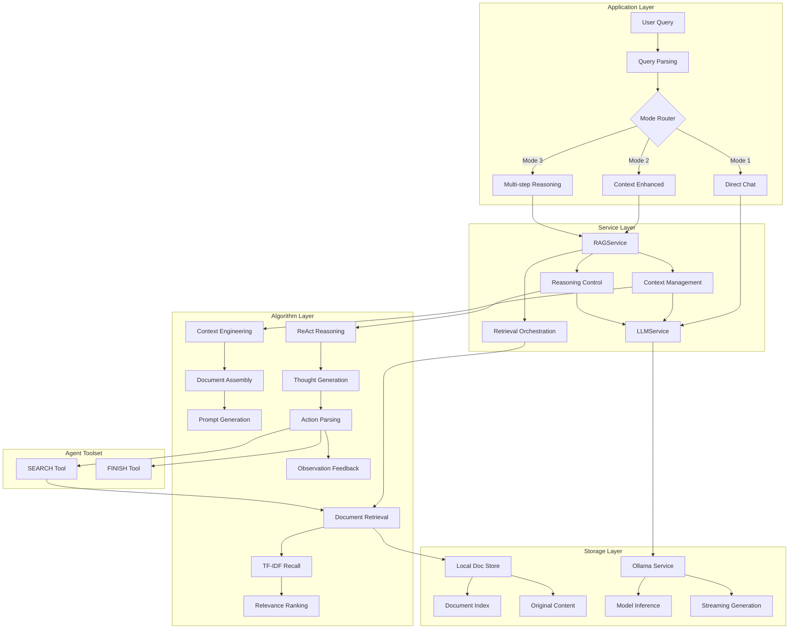

# Context Engineering
{: .no_toc }

Context engineering system based on Model Context Protocol (MCP) architecture, combining symbolic expert systems with connectionist LLMs. Supports dynamic context orchestration, intelligent template selection, and tool invocation through a complete Think-Act-Observe cycle.
{: .fs-6 .fw-300 }

## Table of contents
{: .no_toc .text-delta }

1. TOC
{:toc}

---

## System Overview

### Core Philosophy

**Context Engineering** treats the LLM's context window as a programmable logical space, combining symbolic expert systems with connectionist LLMs through the Model Context Protocol (MCP). This enables dynamic context orchestration, intelligent template selection, and tool invocation through a complete Think-Act-Observe (TAO) cycle.

### Background & Goals

**Business Context**:
While large language models possess rich general knowledge, they have limitations when handling domain-specific or latest information. Context engineering provides a systematic approach to dynamically assemble and manage context, enabling accurate, trustworthy Q&A services based on local knowledge bases while maintaining data privacy and security.

**Design Goals**:
1. **Functionality**: Implement MCP-based context engineering with RAG capabilities
2. **Experience**: Multiple interaction modes from simple dialogue to complex reasoning
3. **Trustworthiness**: Fact-based answers avoiding hallucination issues
4. **Privacy**: Local deployment with data never leaving premises
5. **Modularity**: Symbolic expert system layer managing context, LLM layer focused on reasoning

**Technical Principles**:
- **MCP Protocol**: Standardized Model Context Protocol for component interaction
- **Symbolic + Connectionist**: Expert system manages context, LLM handles reasoning
- **Open Source First**: Choose open-source frameworks like Ollama to avoid vendor lock-in
- **Local Deployment**: All data processing completed locally for privacy protection
- **Progressive Enhancement**: Capability ladder from simple dialogue to complex reasoning

### Key Features

- 🧠 **MCP Architecture**: Model Context Protocol for standardized component interaction
- 🔄 **Four-Stage Cycle**: Template selection → Context assembly → LLM inference → Context update
- 🎯 **Dynamic Context Orchestration**: Intelligent template selection and placeholder resolution
- 📚 **RAG Capabilities**: Local knowledge base retrieval with context enhancement
- 🔧 **Tool Integration**: MCP Tools for external capabilities (SEARCH, FINISH, etc.)
- 💾 **Context Memory**: MCP Resources for conversation history management
- 🔌 **Ollama Integration**: Support for multiple open-source LLMs (Llama, Qwen, Mistral)

---

## Architecture

### System Architecture Diagram



### Architecture Highlights

1. **Mode Decoupling**: Three operation modes independently designed for separate optimization
2. **Service Layering**: Separation of RAG and LLM service responsibilities for maintainability
3. **Local First**: Core services deployed locally with minimal external dependencies
4. **Tool-based Design**: ReAct framework supports tool registration and extension

### Directory Structure

```
src/search_engine/
├── rag_tab/                        # RAG functionality module
│   ├── __init__.py                # Module initialization
│   ├── rag_service.py             # RAG service core implementation ⭐
│   └── rag_tab.py                 # UI and interaction logic
├── index_tab/                      # Retrieval module (RAG dependency)
│   ├── index_service.py           # Index service
│   └── offline_index.py           # TF-IDF retrieval implementation
├── data_service.py                 # Data service ⭐
├── portal.py                       # Main entry and UI orchestration
└── service_manager.py              # Service manager

data/                               # Data storage directory
├── preloaded_documents.json       # Preloaded knowledge base documents
└── openkg_triples.tsv             # Knowledge graph data

logs/                               # Log directory
└── rag_query_logs.json            # RAG query logs
```

---

## Three Operation Modes

### Mode 1: Direct LLM Chat

**Use Cases**: General knowledge Q&A, creative generation

**Technical Implementation**: Direct Ollama API call without retrieval

**Advantages**: 
- Fast response time
- Support for open-domain Q&A
- No dependency on local knowledge base

**Workflow**:
1. User query directly sent to LLM
2. LLM generates response based on pre-trained knowledge
3. Return answer to user

### Mode 2: Context-Enhanced (RAG)

**Use Cases**: Professional Q&A based on local documents

**Technical Implementation**: Retrieval + Context assembly + Prompt engineering

**Workflow**:
1. Use IndexService to retrieve Top-K relevant documents
2. Concatenate document content into context string
3. Generate structured prompt using template
4. Call LLM to generate context-based answer

**Context Prompt Template**:

```
Based on the following context information, answer the user's question. If there is no relevant information in the context, please state that you cannot answer based on the provided information.

Context Information:
{context}

User Question: {query}

Please answer in Chinese:
```

**Advantages**:
- Fact-based answers grounded in documents
- Reduced hallucination
- Traceable sources

### Mode 3: Multi-step Reasoning (ReAct)

**Use Cases**: Complex query decomposition, multi-document information synthesis

**Technical Implementation**: Think-Act-Observe loop

**Agent Actions**:
- `SEARCH(query)`: Retrieve relevant documents
- `FINISH(answer)`: Output final answer

**ReAct Prompt Template**:

```
You are an AI assistant capable of using tools. You can solve problems through the following steps:

1. Thought: Analyze what information the problem needs
2. Action: Use available tools to search for information
3. Observation: View the results returned by the tools
4. Repeat above steps until you have enough information
5. Final Answer: Provide an answer based on collected information

Available Tools:
- SEARCH: Search relevant documents, usage: SEARCH["search term"]

Question: {query}

Let's begin:

Thought:
```

**Reasoning Flow**:
1. Initialize reasoning state, set maximum iterations
2. **Thought Phase**: LLM generates thinking content
3. **Action Phase**: Parse Action type and parameters
4. **Observation Phase**: Execute tool call, get results
5. **Loop Check**: Check if FINISH state is reached
6. **Result Return**: Output reasoning trace and final answer

---

## Core Components

### RAGService Class

```python
# File: src/search_engine/rag_tab/rag_service.py
class RAGService:
    """RAG Service Engine - Three-stage processing pipeline"""
    
    def __init__(self, index_service, ollama_url: str = "http://localhost:11434"):
        # Dependency injection - reuse existing retrieval capabilities
        self.index_service = index_service
        self.ollama_url = ollama_url
        self.default_model = "llama3.1:8b"
        
        # Prompt templates - structured prompt design
        self.context_template = self._load_prompt_templates()
    
    def rag_query(self, query: str, model: str = None, top_k: int = 5) -> RAGResponse:
        """RAG query main workflow"""
        # Stage 1: Retrieve relevant documents
        relevant_docs = self.retrieve_documents(query, top_k)
        
        # Stage 2: Context enhancement
        enhanced_prompt = self.enhance_with_context(query, relevant_docs)
        
        # Stage 3: LLM generation
        response = self.generate_answer(enhanced_prompt, model)
        
        return RAGResponse(
            answer=response,
            retrieved_docs=relevant_docs,
            prompt_used=enhanced_prompt
        )
```

**Design Highlights**:
1. **Service Reuse**: Built on existing IndexService to avoid duplication
2. **Template Management**: Prompt templates managed centrally for dynamic adjustment
3. **Observability**: Intermediate results preserved at each stage for debugging
4. **Error Handling**: Independent error handling at each stage for robustness

### Document Retrieval

```python
def retrieve_documents(self, query: str, top_k: int = 5) -> List[Document]:
    """Retrieval stage - reuse inverted index"""
    # Call existing IndexService to avoid reimplementation
    raw_results = self.index_service.search(query, top_k)
    
    # Structure results
    documents = []
    for doc_id, score, content in raw_results:
        documents.append(Document(
            id=doc_id,
            content=content,
            relevance_score=score
        ))
    
    return documents
```

### Context Enhancement

```python
def enhance_with_context(self, query: str, documents: List[Document]) -> str:
    """Enhancement stage - context engineering"""
    # Concatenate document content
    context = "\n\n".join([
        f"Document {i+1}: {doc.content}" 
        for i, doc in enumerate(documents)
    ])
    
    # Apply prompt template
    enhanced_prompt = self.context_template.format(
        context=context,
        query=query
    )
    
    return enhanced_prompt
```

---

## Ollama Integration

### Connection Management

**Health Check**:

```python
def check_ollama_connection(self) -> Tuple[bool, str]:
    try:
        response = requests.get(f"{self.ollama_url}/api/tags", timeout=5)
        if response.status_code == 200:
            models = response.json().get("models", [])
            return True, f"✅ Available models: {[m['name'] for m in models]}"
    except requests.exceptions.RequestException as e:
        return False, f"❌ Connection failed: {str(e)}"
```

**Model Management**:
- Dynamically fetch available model list
- Support model switching and configuration
- Implement request timeout and retry mechanisms

### API Call Optimization

**Streaming Generation**:

```python
def generate_stream(self, prompt: str, model: str):
    response = requests.post(
        f"{self.ollama_url}/api/generate",
        json={"model": model, "prompt": prompt, "stream": True},
        stream=True
    )
    for line in response.iter_lines():
        if line:
            yield json.loads(line)["response"]
```

### Ollama Configuration

```python
OLLAMA_CONFIG = {
    "url": "http://localhost:11434",       # Ollama service address
    "default_model": "llama3.2",          # Default model
    "timeout": 30,                        # Request timeout
    "generation_options": {               # Generation parameters
        "temperature": 0.7,               # Randomness control
        "top_p": 0.9,                     # Nucleus sampling
        "top_k": 40,                      # Top-K sampling
        "repeat_penalty": 1.1             # Repetition penalty
    }
}

# Supported model list
SUPPORTED_MODELS = [
    "llama3.2",                           # Lightweight model
    "llama3.1:8b",                        # Medium-scale model
    "qwen2.5",                            # Chinese-optimized model
    "deepseek-coder",                     # Code-specific model
    "mistral"                             # Multilingual model
]
```

---

## Usage Guide

### Prerequisites

1. Ollama service running at `http://localhost:11434` (configurable in code)
2. Pull required models in Ollama (e.g., `ollama pull llama3.1`)

### Operation Steps

1. Navigate to "🤖 Part 3: RAG Retrieval Enhancement" tab
2. Click "Check Ollama Connection" to verify connectivity and refresh model list
3. Input your question
4. Select options:
   - Keep "Enable Context Engineering" checked for retrieval-enhanced answers
   - Enable "Multi-step Reasoning" if needed for ReAct mode
   - Adjust Top-K and select model
5. Click "🚀 Execute Query"

### Understanding Output

- **Generated Answer**: Final answer from LLM
- **Processing Info**: Time elapsed, model used, number of documents retrieved
- **Prompt/Reasoning Trace**:
  - Direct or context mode displays exact prompt sent to LLM
  - Multi-step mode shows complete chain-of-thought trace (Thought/Action/Observation)
- **Retrieved Documents**: Table with document IDs and TF-IDF scores; separate box shows assembled context

---

## Technical Implementation Details

### RAG Processing Pipeline

1. **Query Preprocessing**: Keyword extraction, query expansion
2. **Relevant Document Retrieval**: Call IndexService.search()
3. **Context Construction**: Document content concatenation, length truncation
4. **Prompt Generation**: Template filling, structured prompt
5. **LLM Generation**: Ollama API call, streaming return

### ReAct Reasoning Flow

1. **Initialization**: Set reasoning state, maximum iterations
2. **Thought Phase**: LLM generates thinking content
3. **Action Phase**: Parse Action type and parameters
4. **Observation Phase**: Execute tool call, get results
5. **Loop Check**: Check if FINISH state is reached
6. **Result Return**: Output reasoning trace and final answer

---

## Performance & Reliability

### Performance Optimization

- **Retrieval Optimization**: Reuse existing inverted index to avoid redundant computation
- **Context Management**: Intelligent truncation, retain most relevant content
- **Caching Strategy**: Cache identical query results, reduce redundant computation
- **Concurrency Control**: Limit simultaneous requests to avoid Ollama overload

### Reliability Guarantees

**Error Handling**:
- Degradation strategy when Ollama service unavailable
- Network timeout and retry mechanisms
- Fallback solutions for model inference failures

**Monitoring Metrics**:
- Query response time distribution
- Ollama service availability
- Retrieval recall and accuracy

---

## Extensibility Design

### Model Extension

- **Multi-model Support**: Llama, Mistral, CodeLlama, etc.
- **Model Routing**: Select most suitable model based on query type
- **Model Fine-tuning**: Support for domain-specialized model integration

### Feature Extension

- **Tool Extension**: ReAct framework supports new tool registration
- **Context Enhancement**: Support multimodal content like charts, code
- **Conversation Memory**: Implement multi-turn dialogue context management

---

## Security & Compliance

### Data Security

- **Local Deployment**: All data processing completed locally
- **Privacy Protection**: No user queries uploaded to external services
- **Access Control**: Document permission management and user authentication

### Content Safety

- **Output Filtering**: Sensitive content detection and filtering
- **Prompt Injection Protection**: Prevent malicious prompt attacks
- **Generated Content Monitoring**: Output quality and safety monitoring

---

## Best Practices

### Context Engineering

1. **Document Selection**: Retrieve only most relevant documents (Top-K=3-5)
2. **Content Truncation**: Limit context length to avoid exceeding model limits
3. **Template Design**: Clear instructions in prompt templates
4. **Source Citation**: Include document IDs for answer traceability

### Model Selection

- **General Q&A**: Use `llama3.2` or `qwen2.5`
- **Code-related**: Use `deepseek-coder` or `codellama`
- **Multilingual**: Use `mistral` or `qwen2.5`
- **Long Context**: Use models with larger context windows

### Prompt Optimization

- **Clear Instructions**: Explicitly state what LLM should do
- **Context Boundaries**: Clearly mark context and query sections
- **Output Format**: Specify desired answer format
- **Constraint Statements**: Add constraints like "answer in Chinese", "cite sources"

---

## Troubleshooting

### Ollama Connection Issues

**Problem**: Cannot connect to Ollama service

**Solutions**:
```bash
# 1. Check if Ollama is running
curl http://localhost:11434/api/tags

# 2. Start Ollama service
ollama serve

# 3. Check firewall settings
# 4. Verify Ollama URL in configuration
```

### Model Not Available

**Problem**: Selected model not found

**Solutions**:
```bash
# Pull model
ollama pull llama3.1:8b

# List available models
ollama list

# Check model name format (case-sensitive)
```

### Poor Answer Quality

**Problem**: Answers not satisfactory

**Solutions**:
1. Increase Top-K to retrieve more documents
2. Try different models
3. Adjust generation parameters (temperature, top_p)
4. Improve prompt template
5. Check if retrieved documents are relevant

### Slow Response Time

**Problem**: Query takes too long

**Solutions**:
1. Reduce Top-K value
2. Use smaller models
3. Enable streaming for progressive display
4. Optimize document index
5. Consider GPU acceleration

---

## Related Resources

- [Ollama Documentation](https://github.com/ollama/ollama)
- [RAG Paper (Lewis et al., 2020)](https://arxiv.org/abs/2005.11401)
- [ReAct Paper (Yao et al., 2022)](https://arxiv.org/abs/2210.03629)
- [Prompt Engineering Guide](https://www.promptingguide.ai/)
