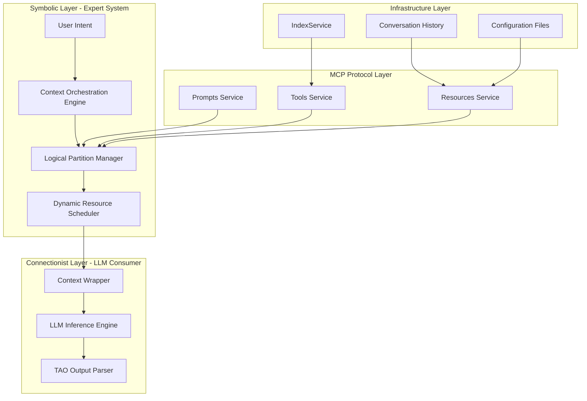
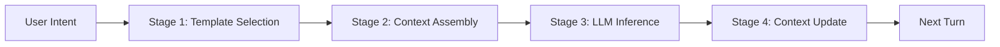
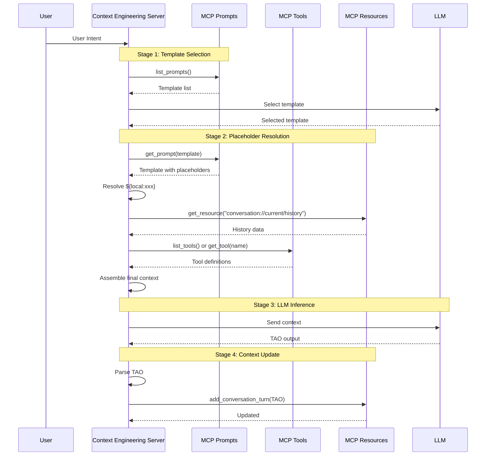

# MCP Architecture
{: .no_toc }

Model Context Protocol (MCP) based architecture combining symbolic expert systems with connectionist LLMs.
{: .fs-6 .fw-300 }

## Table of contents
{: .no_toc .text-delta }

1. TOC
{:toc}

---

## Overview

The Context Engineering system is built on the **Model Context Protocol (MCP)** architecture, which enables the perfect combination of symbolic expert systems and connectionist LLMs. Through dynamic context orchestration, intelligent template selection, and tool invocation, it constructs a complete Think-Act-Observe (TAO) cycle.

### Core Philosophy

**Context Engineering** treats the LLM's context window as a programmable logical space. The MCP protocol enables the combination of symbolic and connectionist approaches:

- **Symbolic Layer**: Expert system manages context orchestration, template selection, and resource scheduling
- **Connectionist Layer**: LLM focuses on reasoning and generation
- **MCP Protocol Layer**: Standardized interface for Prompts, Tools, and Resources
- **Infrastructure Layer**: IndexService, conversation history, configuration files

---

## Architecture Diagram



---

## Four-Stage Agent Cycle

The system implements a complete four-stage agent cycle:



### Stage 1: Template Selection

**Goal**: Intelligently select the most appropriate prompt template based on user intent.

**Process**:
1. Fetch all available templates via `list_prompts()`
2. LLM analyzes user intent and template descriptions
3. Select the most suitable template (e.g., `simple_chat`, `context_engineering`, `rag_answer`)

**Available Templates**:
- `simple_chat`: General conversation template
- `rag_answer`: Context-enhanced Q&A based on retrieval
- `react_reasoning`: ReAct multi-step reasoning
- `context_engineering`: Full context engineering mode with TAO cycle

### Stage 2: Context Assembly

**Goal**: Assemble complete context by replacing placeholders in the selected template.

**Placeholder Types**:

1. **Local Placeholders** `${local:xxx}`:
   - `${local:current_time}` → Current timestamp
   - `${local:user_intent}` → User input
   - `${local:model_name}` → Model name

2. **Resource Placeholders** `${mcp:resource:xxx}`:
   - `${mcp:resource:conversation://current/history}` → Conversation history via `get_resource()`

3. **Tool Placeholders** `${mcp:tool:xxx}`:
   - `${mcp:tool:dynamic_tool_selection}` → LLM selects relevant tools from available list
   - `${mcp:tool:retrieve}` → Direct tool definition retrieval

**Process**:
1. Get template content with placeholders
2. Identify and resolve each placeholder type
3. Assemble final context string

### Stage 3: LLM Inference

**Goal**: Send assembled context to LLM and receive TAO-formatted output.

**TAO Output Format**:
```
**Reasoning**: <Detailed analysis of the problem>
**Action**: <Tool call or final answer>
**Observation**: <Results from tool execution or observations>
```

### Stage 4: Context Update

**Goal**: Update conversation history and prepare for next turn.

**Process**:
1. Parse TAO output from LLM
2. Create structured TAO record
3. Update conversation history via MCP Resources
4. Prepare for next iteration if needed

---

## Logical Partition Dynamic Expansion

### Design Principles

Context engineering decomposes complex context into independent logical partitions, each dynamically fetched and assembled through the MCP protocol.

**Standard Partitions** (extensible):
- **Persona Partition**: Defines AI role and capability boundaries
- **Few-shot Examples Partition**: Controls execution paradigm (ReAct, Self-Ask, etc.)
- **History Partition**: Provides conversation continuity
- **Tools Partition**: Provides external capabilities
- **Task Partition**: Clarifies current objective

**Key Features**:
- **Extensible**: Can define arbitrary `section_*` parameters as new logical partitions
- **Separation of Concerns**: MCP Server defines partitions, CE Server implements expansion logic
- **Hot-swappable**: Add new partitions without modifying framework

### Partition Expansion Flow



---

## MCP Components

### MCP Client Manager

Manages connections and calls to MCP servers.

```python
class MCPClientManager:
    """MCP Client Manager - FastMCP implementation"""
    
    async def list_prompts(self) -> List[Dict[str, Any]]:
        """List all available prompts"""
        client = self.get_client("unified_server")
        prompts_dict = await client.get_prompts()
        return [{"name": name, "description": prompt.description} 
                for name, prompt in prompts_dict.items()]
    
    def get_prompt(self, server_name: str, prompt_name: str, 
                   arguments: Dict[str, Any] = None) -> str:
        """Get MCP prompt template"""
        client = self.get_client(server_name)
        return client.get_prompt(prompt_name, arguments)
    
    async def list_tools(self) -> List[Dict[str, Any]]:
        """List all available tools"""
        client = self.get_client("unified_server")
        tools_dict = await client.list_tools()
        return [{"name": name, "description": tool.description}
                for name, tool in tools_dict.items()]
    
    async def call_tool(self, tool_name: str, arguments: Dict[str, Any]) -> Any:
        """Call MCP tool"""
        client = self.get_client("unified_server")
        return await client.call_tool(tool_name, arguments)
```

### Dynamic MCP Server

Provides standardized Prompts, Tools, and Resources.

```python
class DynamicMCPServer:
    """Dynamic MCP Server - Fully decoupled"""
    
    def __init__(self):
        self.mcp = FastMCP("dynamic-mcp-server")
        self.index_service = get_index_service()
        self.conversation_history = []
        self._register_prompts()
        self._register_tools()
        self._register_resources()
    
    def _register_prompts(self):
        """Register prompts via MCP protocol"""
        
        @self.mcp.prompt("context_engineering")
        def context_engineering_prompt(user_input: str = "") -> str:
            """Context engineering prompt with TAO mode"""
            return f"""[Persona] You are a professional context engineering expert

[Current State] Time: {{local:current_time}}
User Intent: {{local:user_intent}}
Model: {{local:model_name}}

[History] {{mcp:resource:conversation://current/history}}

[Available Tools] {{mcp:tool:dynamic_tool_selection}}

[User Question] {user_input}

[Context Engineering Mode] Answer in TAO format:
Reasoning: <Analyze the problem>
Action: <Tool call or final answer>
Observation: <Results or observations>
"""
    
    def _register_tools(self):
        """Register tools following FastMCP best practices"""
        
        @self.mcp.tool(
            name="retrieve",
            description="Intelligent document retrieval with TAO support",
            tags={"search", "retrieval", "document"}
        )
        def retrieve(
            reasoning: str = "",
            action: str = "search",
            query: str = "",
            top_k: int = 5
        ) -> Dict[str, Any]:
            """Smart document retrieval tool"""
            if action.lower() == "skip":
                return {"status": "skipped", "observation": "Retrieval skipped"}
            
            results = self.index_service.search(query, top_k)
            return {
                "status": "success",
                "observation": {"documents": results, "total": len(results)},
                "query": query
            }
    
    def _register_resources(self):
        """Register resources following FastMCP best practices"""
        
        @self.mcp.resource(
            uri="conversation://current/history",
            name="Current Conversation History",
            description="Real-time conversation history for context continuity"
        )
        def get_conversation_history() -> str:
            """Get conversation history resource"""
            return json.dumps(self.conversation_history, indent=2)
```

---

## Placeholder System

### Placeholder Format

All placeholders follow the format: `${prefix:key}` (similar to bash variables).

### Placeholder Types

1. **Local Placeholders** `${local:xxx}`:
   - Generated by CE Server locally
   - Examples: `${local:current_time}`, `${local:user_intent}`, `${local:model_name}`

2. **Resource Placeholders** `${mcp:resource:xxx}`:
   - Fetched via MCP Resource service
   - Example: `${mcp:resource:conversation://current/history}`

3. **Tool Placeholders** `${mcp:tool:xxx}`:
   - Fetched via MCP Tools service
   - `${mcp:tool:dynamic_tool_selection}`: LLM selects relevant tools
   - `${mcp:tool:retrieve}`: Direct tool definition

### Extensibility

- **Custom Placeholders**: Define new placeholders like `${local:code_context}`, `${mcp:resource:system://status}`
- **Resolver Implementation**: Add parsing logic in `PlaceholderResolver`
- **Template Declaration**: Declare placeholders in prompt templates

---

## Usage Example

### Complete Flow Example

**User Input**: "Search for documents about MCP architecture and analyze its core advantages"

**Stage 1: Template Selection**
- LLM selects `context_engineering` template (complex task requiring tools)

**Stage 2: Context Assembly**
- Resolve `${local:current_time}` → "2025-11-18 10:30:00"
- Resolve `${local:user_intent}` → User's query
- Resolve `${mcp:resource:conversation://current/history}` → `[]` (first turn)
- Resolve `${mcp:tool:dynamic_tool_selection}` → Tool list with descriptions

**Stage 3: LLM Inference**
- LLM generates TAO output:
  ```
  Reasoning: Need to search for MCP documents first
  Action: retrieve(query="MCP architecture", top_k=5)
  Observation: Found 3 relevant documents...
  ```

**Stage 4: Context Update**
- Parse TAO output
- Update conversation history via `add_conversation_turn()`
- Prepare for next iteration if needed

---

## Technical Highlights

### Architecture Advantages

1. **Modular Decoupling**: MCP protocol enables standardized component interaction
2. **Extensibility**: Add new tools/resources/templates without modifying core logic
3. **Observability**: Each stage has clear inputs/outputs for debugging
4. **Ecosystem Compatibility**: Supports all MCP-compatible LLM clients

### Logical Partition Advantages

1. **Dynamism**: Each partition can be independently updated and extended
2. **Composability**: Different partitions can be flexibly combined
3. **Observability**: Each partition's state can be independently monitored
4. **Maintainability**: Partitioned design facilitates independent maintenance and testing

---

## Related Resources

- [Model Context Protocol Specification](https://modelcontextprotocol.io/)
- [FastMCP Documentation](https://github.com/jlowin/fastmcp)
- [ReAct Paper (Yao et al., 2022)](https://arxiv.org/abs/2210.03629)

