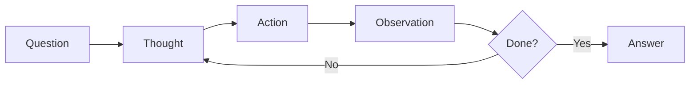

# Multi-step Reasoning (ReAct)
{: .no_toc }

Complex reasoning agent using ReAct framework for multi-step information synthesis.
{: .fs-6 .fw-300 }

## Table of contents
{: .no_toc .text-delta }

1. TOC
{:toc}

---

## Overview

### What is Multi-step Reasoning?

Multi-step reasoning mode uses the **ReAct (Reasoning + Acting)** framework to break down complex questions into multiple steps, iteratively searching and synthesizing information.

**Key Concept**:
Unlike simple Q&A that answers in one step, multi-step reasoning:
- **Decomposes** complex questions into sub-problems
- **Iteratively** searches for information
- **Synthesizes** information from multiple sources
- **Reasons** about the relationships between pieces of information

### Why Use Multi-step Reasoning?

**When Simple RAG Fails**:
- ❌ Question requires information from multiple documents
- ❌ Need to compare or synthesize different sources
- ❌ Question has implicit sub-questions
- ❌ Requires iterative refinement of understanding

**Benefits of Multi-step Reasoning**:
- ✅ **Comprehensive Answers**: Can gather information from multiple sources
- ✅ **Complex Queries**: Handles questions that can't be answered in one step
- ✅ **Transparency**: Shows reasoning process (Thought-Action-Observation)
- ✅ **Adaptive**: Can refine search strategy based on intermediate results

### When to Use

✅ **Complex information synthesis**  
✅ **Multi-document comparison**  
✅ **Step-by-step reasoning required**  
✅ **Exploratory research**

---

## ReAct Framework

### Think-Act-Observe Loop



### Available Actions

- **SEARCH(query)**: Retrieve relevant documents
- **FINISH(answer)**: Output final answer and stop

---

## Example Execution

**Question**: "Compare Python and Java for web development"

**Reasoning Trace**:
```
Thought 1: I need to find information about Python for web development
Action 1: SEARCH["Python web development"]
Observation 1: Found 3 documents about Django, Flask...

Thought 2: Now I need Java web development info
Action 2: SEARCH["Java web development"]
Observation 2: Found 3 documents about Spring, Jakarta EE...

Thought 3: I have enough information to compare
Action 3: FINISH["Python excels in rapid development with frameworks 
like Django and Flask, offering simplicity and extensive libraries. 
Java provides enterprise-grade solutions with Spring and Jakarta EE, 
offering strong typing and better performance at scale..."]
```

---

## Usage Guide

1. Navigate to "🤖 RAG Retrieval Enhancement" tab
2. **Enable** "Enable Context Engineering" ✅
3. **Enable** "Enable Multi-step Reasoning" ✅
4. Enter complex question
5. Click "🚀 Execute Query"

---

## Configuration

```python
REACT_CONFIG = {
    "max_iterations": 5,        # Max reasoning steps
    "top_k_per_search": 3,      # Documents per SEARCH
    "max_context_length": 2000, # Total context limit
    "temperature": 0.0          # Deterministic reasoning
}
```

---

## Best Practices

- ✅ Use for complex, multi-part questions
- ✅ Monitor reasoning trace for debugging
- ✅ Limit max iterations to prevent loops
- ❌ Don't use for simple factual questions

---

## Related Resources

- [ReAct Paper (Yao et al., 2022)](https://arxiv.org/abs/2210.03629)
- [Chain-of-Thought Prompting](https://arxiv.org/abs/2201.11903)
