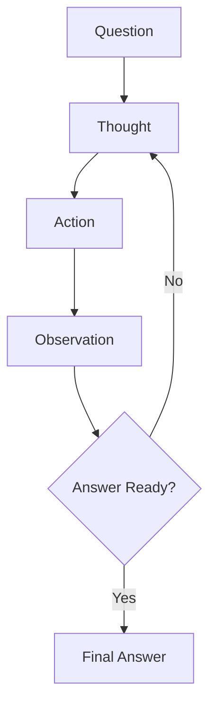

# ReAct Reasoning
{: .no_toc }

Multi-step reasoning combining retrieval actions with chain-of-thought.
{: .fs-6 .fw-300 }

## Table of contents
{: .no_toc .text-delta }

1. TOC
{:toc}

---

## Overview

### What is ReAct?

**Re**asoning + **Act**ing: An LLM framework that interleaves reasoning traces with actions (like retrieval) to solve complex questions.

**Reasoning-Action Loop**:



---

## ReAct Architecture

### Core Loop

```python
def react_loop(question, max_steps=5):
    """ReAct reasoning loop"""
    context = []
    
    for step in range(1, max_steps + 1):
        # Generate thought and action
        prompt = build_react_prompt(question, context)
        response = llm.generate(prompt)
        
        # Parse thought and action
        thought, action = parse_response(response)
        
        # Execute action
        if action.startswith("Search"):
            query = extract_query(action)
            observation = search(query)
        elif action.startswith("Lookup"):
            term = extract_term(action)
            observation = lookup(term, context)
        elif action.startswith("Finish"):
            return extract_answer(action)
        
        # Update context
        context.append({
            "step": step,
            "thought": thought,
            "action": action,
            "observation": observation
        })
    
    return "Unable to answer after maximum steps"
```

---

## Prompt Template

### ReAct Prompt

```python
REACT_PROMPT = """Answer the following question by reasoning and taking actions step-by-step.

You can use these actions:
- Search[query]: Search for information about query
- Lookup[term]: Find specific term in last search result
- Finish[answer]: Provide final answer

Use this format:
Thought: (your reasoning)
Action: (action to take)
Observation: (result of action)
... (repeat Thought/Action/Observation as needed)
Thought: I now know the final answer
Action: Finish[answer]

Question: {question}

Thought:"""
```

### Few-Shot Examples

```python
REACT_EXAMPLES = """
Example 1:
Question: Who is the spouse of the director of film Nostalgia (1983 Film)?

Thought: I need to find the director of Nostalgia (1983 film), then find their spouse.
Action: Search[Nostalgia 1983 film director]
Observation: Nostalgia is a 1983 Soviet film directed by Andrei Tarkovsky.

Thought: The director is Andrei Tarkovsky. Now I need to find his spouse.
Action: Search[Andrei Tarkovsky spouse]
Observation: Andrei Tarkovsky was married to Larisa Tarkovskaya.

Thought: I now know the final answer.
Action: Finish[Larisa Tarkovskaya]

---

Example 2:
Question: What is the elevation of the highest peak in the mountain range that Mount Fuji is part of?

Thought: First, I need to find what mountain range Mount Fuji belongs to.
Action: Search[Mount Fuji mountain range]
Observation: Mount Fuji is not actually part of a mountain range; it's a stratovolcano.

Thought: Mount Fuji isn't in a mountain range, so the question is based on a false premise.
Action: Finish[Mount Fuji is not part of a mountain range; it's a standalone stratovolcano]
"""
```

---

## Action Types

### 1. Search Action

```python
def execute_search(query):
    """Retrieve relevant documents"""
    results = hybrid_search(query, top_k=3)
    
    # Format observation
    observation = "\n".join([
        f"- {doc['title']}: {doc['snippet']}"
        for doc in results
    ])
    
    return observation
```

### 2. Lookup Action

```python
def execute_lookup(term, last_search_results):
    """Find specific term in previous search results"""
    for doc in last_search_results:
        if term.lower() in doc['content'].lower():
            # Extract sentence containing term
            sentences = doc['content'].split('.')
            relevant = [s for s in sentences if term.lower() in s.lower()]
            return relevant[0] if relevant else "Term not found"
    
    return "Term not found in search results"
```

### 3. Calculate Action

```python
def execute_calculate(expression):
    """Perform mathematical calculation"""
    try:
        result = eval(expression, {"__builtins__": {}}, safe_math_functions)
        return f"Result: {result}"
    except:
        return "Calculation error"
```

---

## Response Parsing

### Extract Thought and Action

```python
import re

def parse_react_response(response):
    """Parse LLM response into thought, action, observation"""
    # Extract thought
    thought_match = re.search(r'Thought: (.*?)(?:\n|$)', response)
    thought = thought_match.group(1) if thought_match else ""
    
    # Extract action
    action_match = re.search(r'Action: (.*?)(?:\n|$)', response)
    action = action_match.group(1) if action_match else ""
    
    return thought, action

def extract_action_input(action):
    """Extract query/term from action"""
    # Pattern: Action[input]
    match = re.search(r'\[(.*?)\]', action)
    return match.group(1) if match else ""
```

---

## Advanced Techniques

### Self-Reflection

```python
def react_with_reflection(question, max_steps=5):
    """ReAct with self-correction"""
    context = []
    
    for step in range(1, max_steps + 1):
        # Generate response
        response = llm.generate(build_prompt(question, context))
        thought, action = parse_response(response)
        
        # Execute action
        observation = execute_action(action)
        
        # Self-reflection
        if step > 1:
            reflection_prompt = f"""Review your previous steps. Are you on the right track?

Previous steps:
{format_context(context)}

Reflection:"""
            reflection = llm.generate(reflection_prompt)
            
            if "wrong" in reflection.lower() or "reconsider" in reflection.lower():
                # Backtrack and try different approach
                context = context[:-1]  # Remove last step
        
        context.append({"thought": thought, "action": action, "observation": observation})
        
        if action.startswith("Finish"):
            return extract_answer(action)
    
    return "Max steps reached"
```

### Multi-Agent ReAct

```python
class MultiAgentReAct:
    def __init__(self):
        self.searcher = SearchAgent()
        self.calculator = CalculatorAgent()
        self.verifier = VerificationAgent()
    
    def solve(self, question):
        """Solve question using multiple specialized agents"""
        plan = self.planner.create_plan(question)
        
        results = []
        for task in plan:
            if task.type == "search":
                result = self.searcher.execute(task)
            elif task.type == "calculate":
                result = self.calculator.execute(task)
            
            # Verify result
            verified = self.verifier.check(result, task)
            results.append(verified)
        
        return self.synthesize_answer(results)
```

---

## Evaluation

### Success Rate Metrics

```python
def evaluate_react(test_cases):
    """Evaluate ReAct on test set"""
    correct = 0
    total = len(test_cases)
    
    for case in test_cases:
        answer = react_loop(case['question'])
        if is_correct(answer, case['ground_truth']):
            correct += 1
    
    return {
        "accuracy": correct / total,
        "avg_steps": mean([len(trace) for trace in traces])
    }
```

### Trajectory Analysis

```python
def analyze_trajectory(context):
    """Analyze reasoning trajectory quality"""
    metrics = {
        "num_steps": len(context),
        "unique_searches": len(set(c['action'] for c in context if 'Search' in c['action'])),
        "backtracking": sum(1 for i, c in enumerate(context[1:]) 
                           if similar(c['thought'], context[i]['thought'])),
        "answer_consistency": check_consistency([c['observation'] for c in context])
    }
    return metrics
```

---

## Comparison: Direct vs RAG vs ReAct

| Aspect | Direct LLM | Simple RAG | ReAct |
|:-------|:-----------|:-----------|:------|
| **Reasoning** | Single-step | Single-step | Multi-step |
| **Retrieval** | None | One-time | Iterative |
| **Complex Questions** | ❌ Poor | ⚠️ Limited | ✅ Good |
| **Latency** | Fast | Medium | Slow |
| **Transparency** | Low | Medium | High |

**Use Cases**:
- **Direct**: Simple factual questions
- **RAG**: Document-based Q&A
- **ReAct**: Multi-hop reasoning, complex analysis

---

## Best Practices

### When to Use ReAct

✅ **Good for**:
- Multi-hop questions ("Who is the spouse of X's director?")
- Questions requiring verification
- Problems needing calculation + retrieval
- Exploratory analysis

❌ **Avoid for**:
- Simple factual lookups
- Latency-critical applications
- Straightforward document retrieval

### Optimization Tips

1. **Limit Steps**: Set `max_steps=5` to prevent infinite loops
2. **Cache Searches**: Avoid redundant retrievals
3. **Early Stopping**: Return answer once confident
4. **Prompt Tuning**: Use clear, structured templates
5. **Fallback**: Provide simple RAG answer if ReAct fails

---

## Resources

### Papers

- [ReAct: Synergizing Reasoning and Acting](https://arxiv.org/abs/2210.03629)
- [Chain-of-Thought Prompting](https://arxiv.org/abs/2201.11903)
- [Self-Consistency Improves Reasoning](https://arxiv.org/abs/2203.11171)

### Implementations

- [LangChain ReAct Agent](https://python.langchain.com/docs/modules/agents/agent_types/react)
- [AutoGPT](https://github.com/Significant-Gravitas/Auto-GPT)
- [BabyAGI](https://github.com/yoheinakajima/babyagi)

