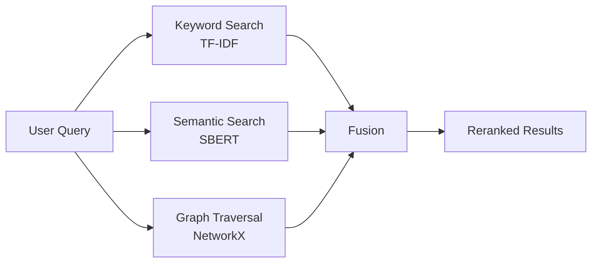

# Retrieval Strategies
{: .no_toc }

Multi-source hybrid retrieval for comprehensive context gathering.
{: .fs-6 .fw-300 }

## Table of contents
{: .no_toc .text-delta }

1. TOC
{:toc}

---

## Hybrid Retrieval

### Three-Layer Approach



---

## 1. Keyword Search

**TF-IDF Inverted Index**:
- Fast exact matching
- Good for specific terms/entities
- Handles multi-word queries

**Implementation**:
```python
from sklearn.feature_extraction.text import TfidfVectorizer

vectorizer = TfidfVectorizer(
    max_features=5000,
    stop_words='english',
    ngram_range=(1, 2)
)

# Build index
tfidf_matrix = vectorizer.fit_transform(documents)

# Query
query_vec = vectorizer.transform([query])
scores = cosine_similarity(query_vec, tfidf_matrix)
```

---

## 2. Semantic Search

**Sentence-BERT Embeddings**:
- Captures semantic meaning
- Cross-lingual capability
- Handles paraphrasing

**Model**: `all-MiniLM-L6-v2` (384 dimensions)

```python
from sentence_transformers import SentenceTransformer

model = SentenceTransformer('all-MiniLM-L6-v2')

# Encode documents
doc_embeddings = model.encode(documents)

# Query
query_embedding = model.encode(query)
scores = cosine_similarity([query_embedding], doc_embeddings)
```

---

## 3. Knowledge Graph

**Entity-Relation-Entity Triples**:
```
(Machine Learning, is_a, AI Field)
(Neural Networks, used_in, Deep Learning)
(Python, used_for, Data Science)
```

**Graph Traversal**:
```python
import networkx as nx

# Query expansion via graph
def expand_query(entity, depth=2):
    neighbors = nx.single_source_shortest_path_length(
        kg_graph, entity, cutoff=depth
    )
    return list(neighbors.keys())

# Example: "machine learning" → ["AI", "deep learning", "neural networks"]
```

---

## Result Fusion

### Reciprocal Rank Fusion

```python
def reciprocal_rank_fusion(rankings, k=60):
    """Fuse multiple rankings into one"""
    scores = {}
    
    for ranking in rankings:
        for rank, doc_id in enumerate(ranking, 1):
            if doc_id not in scores:
                scores[doc_id] = 0
            scores[doc_id] += 1 / (k + rank)
    
    return sorted(scores.items(), key=lambda x: x[1], reverse=True)
```

### Weighted Linear Combination

```python
def weighted_fusion(keyword_scores, semantic_scores, graph_scores,
                   α=0.3, β=0.5, γ=0.2):
    """Weighted combination of scores"""
    final_scores = {}
    
    all_docs = set(keyword_scores.keys()) | set(semantic_scores.keys()) | set(graph_scores.keys())
    
    for doc_id in all_docs:
        final_scores[doc_id] = (
            α * keyword_scores.get(doc_id, 0) +
            β * semantic_scores.get(doc_id, 0) +
            γ * graph_scores.get(doc_id, 0)
        )
    
    return sorted(final_scores.items(), key=lambda x: x[1], reverse=True)
```

---

## Reranking

### Cross-Encoder Reranking

```python
from sentence_transformers import CrossEncoder

reranker = CrossEncoder('cross-encoder/ms-marco-MiniLM-L-6-v2')

def rerank(query, candidates, top_k=5):
    """Rerank candidates using cross-encoder"""
    pairs = [[query, doc] for doc in candidates]
    scores = reranker.predict(pairs)
    
    ranked = sorted(zip(candidates, scores), key=lambda x: x[1], reverse=True)
    return [doc for doc, score in ranked[:top_k]]
```

---

## Query Enhancement

### Query Expansion

```python
def expand_query(query):
    """Expand query with synonyms and related terms"""
    # Use WordNet, knowledge graph, or LLM
    expansions = [
        query,  # Original
        get_synonyms(query),
        get_related_entities(query)
    ]
    return ' '.join(expansions)
```

### Hypothetical Document Embeddings (HyDE)

```python
def hyde_retrieval(query, llm):
    """Generate hypothetical answer, then retrieve similar docs"""
    # Step 1: LLM generates hypothetical answer
    hypothetical_doc = llm.generate(
        f"Answer the question: {query}"
    )
    
    # Step 2: Retrieve docs similar to hypothetical answer
    results = semantic_search(hypothetical_doc)
    
    return results
```

---

## Performance Optimization

### Caching

```python
from functools import lru_cache

@lru_cache(maxsize=1000)
def retrieve_cached(query):
    """Cache frequent queries"""
    return retrieve(query)
```

### Index Sharding

```python
# Split large index into shards for parallel search
shards = split_index(documents, num_shards=4)

def parallel_search(query, shards):
    with ThreadPoolExecutor() as executor:
        futures = [executor.submit(search_shard, query, shard) for shard in shards]
        results = [f.result() for f in futures]
    return merge_results(results)
```

---

## Evaluation Metrics

**Retrieval Quality**:
- **Recall@K**: Percentage of relevant docs in top-K
- **MRR (Mean Reciprocal Rank)**: Position of first relevant doc
- **NDCG**: Normalized discounted cumulative gain

```python
def recall_at_k(retrieved, relevant, k):
    """Calculate Recall@K"""
    return len(set(retrieved[:k]) & set(relevant)) / len(relevant)

def mrr(retrieved, relevant):
    """Calculate MRR"""
    for i, doc in enumerate(retrieved, 1):
        if doc in relevant:
            return 1 / i
    return 0
```

