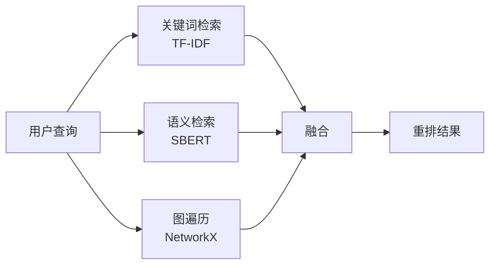

# 检索策略
{: .no_toc }

面向完整上下文收集的多源混合检索方案。
{: .fs-6 .fw-300 }

## 目录
{: .no_toc .text-delta }

1. TOC
{:toc}

---

## 混合检索

### 三层检索路径


```mermaid
graph LR
    A[用户查询] --> B[关键词检索<br/>TF-IDF]
    A --> C[语义检索<br/>SBERT]
    A --> D[图遍历<br/>NetworkX]
    
    B --> E[融合]
    C --> E
    D --> E
    
    E --> F[重排结果]
```

---

## 1. 关键词检索

**TF-IDF 倒排索引**：
- 精确匹配速度快
- 适合特定术语和实体
- 支持多词查询

**实现示例**：
```python
from sklearn.feature_extraction.text import TfidfVectorizer

vectorizer = TfidfVectorizer(
    max_features=5000,
    stop_words='english',
    ngram_range=(1, 2)
)

# 构建索引
tfidf_matrix = vectorizer.fit_transform(documents)

# 查询
query_vec = vectorizer.transform([query])
scores = cosine_similarity(query_vec, tfidf_matrix)
```

---

## 2. 语义检索

**Sentence-BERT 向量表示**：
- 捕捉语义信息
- 支持跨语言能力
- 适合处理改写表达

**模型**：`all-MiniLM-L6-v2`（384 维）

```python
from sentence_transformers import SentenceTransformer

model = SentenceTransformer('all-MiniLM-L6-v2')

# 文档向量化
doc_embeddings = model.encode(documents)

# 查询向量化
query_embedding = model.encode(query)
scores = cosine_similarity([query_embedding], doc_embeddings)
```

---

## 3. 知识图谱

**实体-关系-实体三元组**：
```
(Machine Learning, is_a, AI Field)
(Neural Networks, used_in, Deep Learning)
(Python, used_for, Data Science)
```

**图遍历**：
```python
import networkx as nx

# 基于图结构进行查询扩展
def expand_query(entity, depth=2):
    neighbors = nx.single_source_shortest_path_length(
        kg_graph, entity, cutoff=depth
    )
    return list(neighbors.keys())

# 示例："machine learning" → ["AI", "deep learning", "neural networks"]
```

---

## 结果融合

### 倒数排序融合（RRF）

```python
def reciprocal_rank_fusion(rankings, k=60):
    """将多路排序结果融合为单一路径"""
    scores = {}
    
    for ranking in rankings:
        for rank, doc_id in enumerate(ranking, 1):
            if doc_id not in scores:
                scores[doc_id] = 0
            scores[doc_id] += 1 / (k + rank)
    
    return sorted(scores.items(), key=lambda x: x[1], reverse=True)
```

### 加权线性组合

```python
def weighted_fusion(keyword_scores, semantic_scores, graph_scores,
                   α=0.3, β=0.5, γ=0.2):
    """按权重融合不同检索分数"""
    final_scores = {}
    
    all_docs = set(keyword_scores.keys()) | set(semantic_scores.keys()) | set(graph_scores.keys())
    
    for doc_id in all_docs:
        final_scores[doc_id] = (
            α * keyword_scores.get(doc_id, 0) +
            β * semantic_scores.get(doc_id, 0) +
            γ * graph_scores.get(doc_id, 0)
        )
    
    return sorted(final_scores.items(), key=lambda x: x[1], reverse=True)
```

---

## 重排序

### Cross-Encoder 重排

```python
from sentence_transformers import CrossEncoder

reranker = CrossEncoder('cross-encoder/ms-marco-MiniLM-L-6-v2')

def rerank(query, candidates, top_k=5):
    """使用 cross-encoder 对候选结果重排"""
    pairs = [[query, doc] for doc in candidates]
    scores = reranker.predict(pairs)
    
    ranked = sorted(zip(candidates, scores), key=lambda x: x[1], reverse=True)
    return [doc for doc, score in ranked[:top_k]]
```

---

## 查询增强

### 查询扩展

```python
def expand_query(query):
    """使用同义词和关联词扩展查询"""
    # 可使用 WordNet、知识图谱或 LLM
    expansions = [
        query,  # 原始查询
        get_synonyms(query),
        get_related_entities(query)
    ]
    return ' '.join(expansions)
```

### 假设文档嵌入（HyDE）

```python
def hyde_retrieval(query, llm):
    """先生成假设答案，再检索相似文档"""
    # 步骤 1：由 LLM 生成假设答案
    hypothetical_doc = llm.generate(
        f"Answer the question: {query}"
    )
    
    # 步骤 2：检索与假设答案相近的文档
    results = semantic_search(hypothetical_doc)
    
    return results
```

---

## 性能优化

### 缓存

```python
from functools import lru_cache

@lru_cache(maxsize=1000)
def retrieve_cached(query):
    """缓存高频查询"""
    return retrieve(query)
```

### 索引分片

```python
# 将大索引拆分为分片以支持并行检索
shards = split_index(documents, num_shards=4)

def parallel_search(query, shards):
    with ThreadPoolExecutor() as executor:
        futures = [executor.submit(search_shard, query, shard) for shard in shards]
        results = [f.result() for f in futures]
    return merge_results(results)
```

---

## 评估指标

**检索质量**：
- **Recall@K**：Top-K 中相关文档的覆盖比例
- **MRR（Mean Reciprocal Rank）**：首个相关文档的平均倒数排名
- **NDCG**：归一化折损累积增益

```python
def recall_at_k(retrieved, relevant, k):
    """计算 Recall@K"""
    return len(set(retrieved[:k]) & set(relevant)) / len(relevant)

def mrr(retrieved, relevant):
    """计算 MRR"""
    for i, doc in enumerate(retrieved, 1):
        if doc in relevant:
            return 1 / i
    return 0
```

