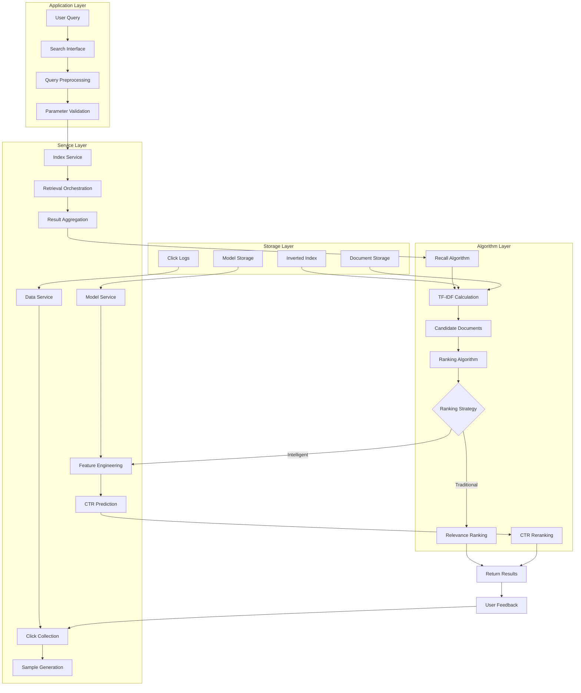
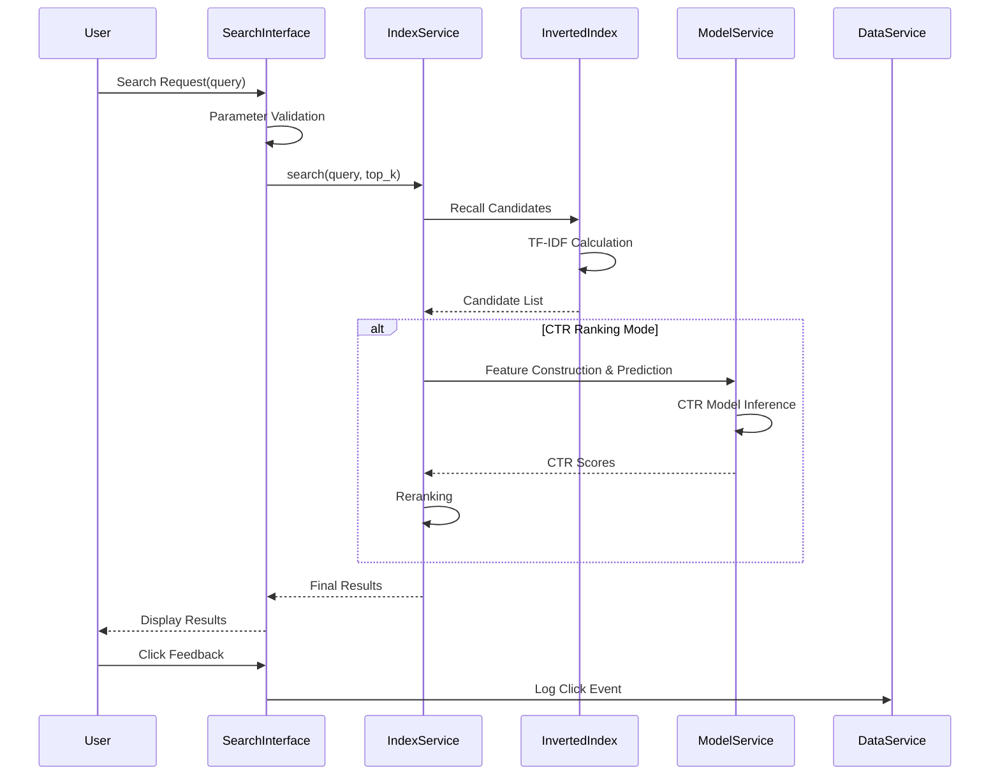
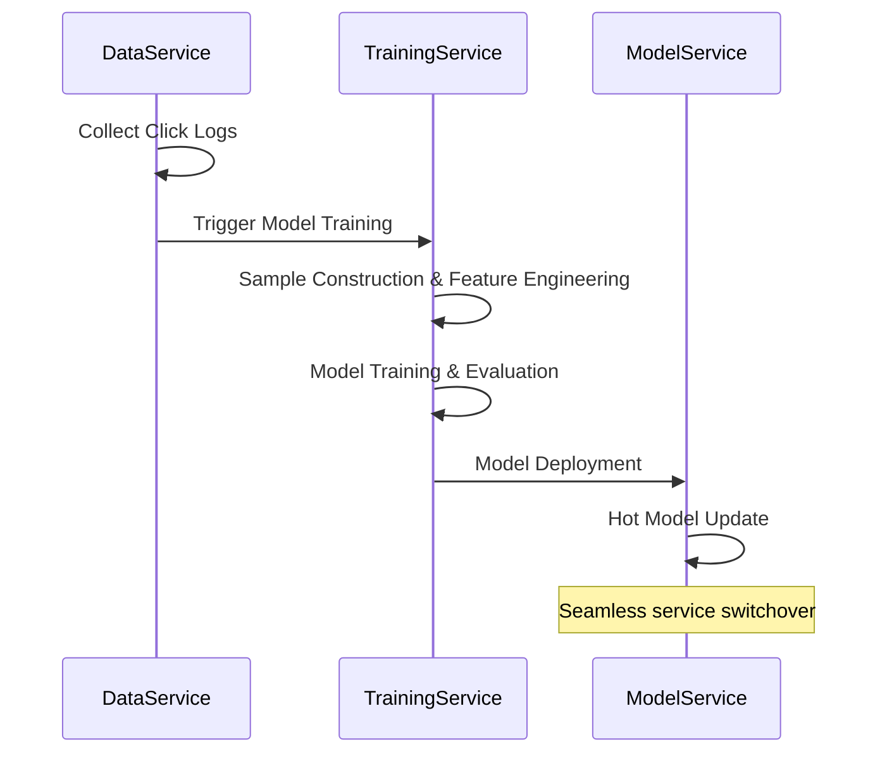

# System Architecture
{: .no_toc }

Detailed architecture design of the search and recommendation system.
{: .fs-6 .fw-300 }

## Table of contents
{: .no_toc .text-delta }

1. TOC
{:toc}

---

## Design Principles

### Goals

1. **Performance**: Fast retrieval response with good concurrency handling
2. **Effectiveness**: Improve user click-through rate (CTR) and satisfaction
3. **Maintainability**: Modular design supporting rapid algorithm iteration
4. **Scalability**: Linear scaling for data volume and concurrency

### Technology Selection

- **Maturity**: Choose battle-tested open-source technologies
- **Performance First**: In-memory computation over disk I/O
- **Interpretability**: Business-interpretable ranking algorithms
- **Progressive Upgrade**: Support smooth transition from traditional to intelligent recommendation

---

## Layered Architecture



### Layer Descriptions

- **Application Layer**: Request handling, parameter validation, interface adaptation
- **Service Layer**: Business logic orchestration, component coordination
- **Algorithm Layer**: Core retrieval and ranking algorithm implementation
- **Storage Layer**: Data persistence, index storage

---

## Component Design

### Inverted Index Component

**TF-IDF Scoring Formula**:

The system uses TF-IDF (Term Frequency-Inverse Document Frequency) to score document relevance:

$$
\text{TF-IDF}(t, d) = \text{TF}(t, d) \times \text{IDF}(t)
$$

Where:
- $\text{TF}(t, d) = \frac{\text{count of term } t \text{ in document } d}{\text{total terms in document } d}$: Term frequency (normalized by document length)
- $\text{IDF}(t) = \log \frac{N}{df(t)}$: Inverse document frequency
  - $N$: Total number of documents
  - $df(t)$: Number of documents containing term $t$

**Query-Document Score**:

For a query $q$ with terms $\{t_1, t_2, ..., t_n\}$, the relevance score for document $d$ is:

$$
\text{Score}(q, d) = \sum_{t \in q} \text{TF-IDF}(t, d)
$$

**Intuitive Explanation**:
- **TF (Term Frequency)**: Terms that appear more frequently in a document are more relevant
- **IDF (Inverse Document Frequency)**: Rare terms across the corpus are more discriminative
- **Combined**: TF-IDF balances local relevance (TF) with global discriminativeness (IDF)
- **Query Matching**: Documents containing more query terms with higher TF-IDF scores rank higher

**Core Data Structures**:

```python
class InvertedIndex:
    self.index = defaultdict(set)          # term -> document ID set
    self.doc_lengths = {}                  # document ID -> length
    self.documents = {}                    # document ID -> content
    self.term_freq = defaultdict(dict)     # term -> {doc_id: frequency}
    self.doc_freq = defaultdict(int)       # term -> document frequency
```

**Performance Optimizations**:

- Memory layout optimization using sets
- Query optimization with short-circuit evaluation
- Hot query result caching
- Horizontal sharding support

### CTR Model Component

**Feature Engineering** (7-dimensional vector):

1. **Position Feature**: Absolute position in results
2. **Document Length**: Total document length
3. **Query Length**: Query string length
4. **Summary Length**: Summary text length
5. **Match Score**: Query-summary word overlap
6. **Query Historical CTR**: Past CTR for this query
7. **Document Historical CTR**: Past CTR for this document

**Model Architecture Options**:

- **Logistic Regression**: Fast training, interpretable (baseline)
- **Wide & Deep**: Feature interaction support (production)
- **Deep Models**: DIN/DSSM etc. (future extension)

---

## Process Flows

### Online Retrieval Flow



### Offline Training Flow



---

## Scalability Design

### Horizontal Scaling

```python
# Index sharding strategy
def get_shard_id(term: str, shard_num: int) -> int:
    return hash(term) % shard_num

# Distributed retrieval coordination
class DistributedIndexService:
    def search(self, query: str) -> List:
        # 1. Query dispatch to all shards
        shard_results = self.query_all_shards(query)
        # 2. Merge and rerank results
        return self.merge_and_rank(shard_results)
```

### Vertical Scaling

- **Memory Management**: LRU cache + tiered storage
- **Compute Optimization**: Multithreading + SIMD vectorization
- **Model Compression**: Quantization + distillation

---

## Monitoring & Operations

### Metrics System

```python
class SearchMetrics:
    # Business Metrics
    ctr: float           # Click-through rate
    mrr: float           # Mean reciprocal rank
    ndcg_at_10: float    # Normalized discounted cumulative gain
    
    # System Metrics
    avg_latency: float   # Average latency
    p95_latency: float   # 95th percentile latency
    qps: float           # Queries per second
    
    # Data Metrics
    index_coverage: float        # Index coverage rate
    click_data_quality: float    # Click data quality score
```

### Disaster Recovery

| Failure Type | Detection | Handling Strategy | Recovery |
|:------------|:----------|:-----------------|:---------|
| Index Corruption | Query anomaly detection | Auto rebuild + backup restore | Quick recovery |
| Model Failure | Prediction anomaly | Downgrade to TF-IDF | Real-time fallback |
| Out of Memory | System monitoring | LRU cleanup + rate limiting | Auto handling |
| Service Overload | QPS monitoring | Circuit breaker + downgrade | Real-time response |

---

## Implementation Roadmap

### Development Phases

- **Phase 1**: Basic index + TF-IDF retrieval ✅ (Completed)
- **Phase 2**: CTR model training + reranking ✅ (Completed)
- **Phase 3**: Performance optimization + monitoring 🚧 (In Progress)
- **Phase 4**: Distributed scaling + deep learning 📋 (Planned)

### Risk Control

- **Technical Risk**: Model effectiveness below target → A/B testing validation
- **Performance Risk**: System load too high → Load testing + rate limiting
- **Data Risk**: Poor training data quality → Data cleaning + validation

---

## Further Reading

- [Implementation Details]({{ site.baseurl }}/docs/search-recommendation/implementation) - Code examples and algorithms
- [CTR Prediction Models]({{ site.baseurl }}/docs/search-recommendation/ctr-prediction) - Model architectures
- [Model Evaluation]({{ site.baseurl }}/docs/search-recommendation/model-evaluation) - Evaluation methodologies

