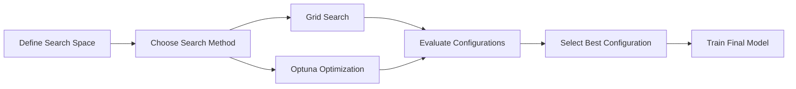

# AutoML Optimization
{: .no_toc }

Automated machine learning for hyperparameter search and optimization to improve model performance without manual tuning.
{: .fs-6 .fw-300 }

## Table of contents
{: .no_toc .text-delta }

1. TOC
{:toc}

---

## Overview

### What is AutoML?

**AutoML (Automated Machine Learning)** automates the process of finding optimal hyperparameters and model configurations. Instead of manually trying different parameter combinations, AutoML systematically searches the hyperparameter space to find the best configuration.

**Key Concept**:
- **Hyperparameters**: Model settings that control learning (e.g., learning rate, regularization strength)
- **Search Space**: Range of possible hyperparameter values
- **Optimization**: Finding hyperparameters that maximize model performance

### Why AutoML?

**Manual Tuning Challenges**:
- ❌ Time-consuming: Trying many combinations manually is slow
- ❌ Suboptimal: Easy to miss better configurations
- ❌ Requires Expertise: Need deep understanding of hyperparameters
- ❌ Limited Exploration: Can't explore large search spaces

**AutoML Benefits**:
- ✅ **Efficiency**: Automatically explores large search spaces
- ✅ **Better Results**: Often finds configurations humans miss
- ✅ **Time Savings**: Frees up time for other tasks
- ✅ **Reproducibility**: Systematic search is more reproducible

### How It Works

**AutoML Workflow**:



**Process**:
1. **Define Search Space**: Specify ranges for each hyperparameter
2. **Search Strategy**: Choose grid search or Bayesian optimization
3. **Iterative Evaluation**: Try configurations, evaluate performance
4. **Best Selection**: Identify configuration with best performance
5. **Final Training**: Train model with optimal hyperparameters

---

## Supported Methods

### 1. Grid Search

**Overview**:
Grid Search exhaustively evaluates all combinations of hyperparameters within specified ranges. It's systematic but can be slow for large search spaces.

**How It Works**:
- **Exhaustive Search**: Tests every combination in the grid
- **Cross-Validation**: Uses K-fold cross-validation to evaluate each combination
- **Best Selection**: Returns the configuration with highest average performance

**When to Use**:
- ✅ Small hyperparameter space (< 100 combinations)
- ✅ Need exhaustive search guarantee
- ✅ Simple, interpretable results

**Limitations**:
- ❌ Slow for large search spaces
- ❌ Doesn't learn from previous evaluations

**Example Search Space**:
```python
param_grid = {
    'learning_rate': [0.001, 0.01, 0.1],
    'regularization': [0.1, 1.0, 10.0],
    'batch_size': [32, 64, 128]
}
# Total combinations: 3 × 3 × 3 = 27
```

### 2. Optuna Optimization

**Overview**:
Optuna uses **Bayesian optimization** to intelligently search the hyperparameter space. It learns from previous evaluations to focus on promising regions.

**How It Works**:
- **Bayesian Optimization**: Uses probabilistic models to predict promising configurations
- **Adaptive Sampling**: Focuses search on regions likely to yield good results
- **Efficient Search**: Often finds good solutions with fewer evaluations than grid search

**When to Use**:
- ✅ Large hyperparameter space (> 100 combinations)
- ✅ Need efficient search
- ✅ Can afford some uncertainty (probabilistic)

**Advantages**:
- ✅ Much faster than grid search for large spaces
- ✅ Learns from previous evaluations
- ✅ Can handle continuous and discrete parameters

**Example Search Space**:
```python
import optuna

def objective(trial):
    learning_rate = trial.suggest_loguniform('learning_rate', 1e-5, 1e-1)
    regularization = trial.suggest_loguniform('regularization', 0.01, 100.0)
    batch_size = trial.suggest_categorical('batch_size', [32, 64, 128, 256])
    # Optuna intelligently samples from these ranges
```

---

## Optimization Objectives

### Primary Objective

**Maximize Cross-Validation Performance**:
- Primary metric: **AUC (Area Under ROC Curve)** for CTR prediction
- Secondary metrics: Accuracy, F1-Score, Precision, Recall
- Goal: Find hyperparameters that maximize average cross-validation AUC

### Additional Considerations

- **Minimize Overfitting**: Prefer configurations with low variance across folds
- **Balance Complexity**: Balance model complexity with performance
- **Training Time**: Consider training time for practical deployment

---

## Usage Guide

### Basic Usage

1. Navigate to the "📊 Data Collection & Training" tab
2. Switch to the "🤖 AutoML" sub-tab
3. **Select Optimization Method**:
   - **Grid Search**: Exhaustive search (slower, guaranteed)
   - **Optuna Optimization**: Bayesian optimization (faster, intelligent)
4. **Configure Parameters**:
   - **Number of Folds**: K for cross-validation (3-10)
   - **Search Space**: Define hyperparameter ranges (if applicable)
   - **Number of Trials**: For Optuna, specify how many configurations to try
5. **Run Optimization**: Click "🤖 Execute AutoML Optimization" button
6. **View Results**:
   - Best hyperparameters found
   - Performance improvement over default
   - Optimization history and convergence

### Interpreting Results

**Good Results**:
- ✅ Significant performance improvement over default
- ✅ Consistent performance across folds
- ✅ Reasonable hyperparameter values (not extreme)

**Warning Signs**:
- ⚠️ No improvement → Search space may be wrong, or default is already good
- ⚠️ Extreme values → May indicate overfitting or search space issues
- ⚠️ High variance → Model may be unstable with these hyperparameters

---

## Technical Implementation

### Grid Search Implementation

```python
from sklearn.model_selection import GridSearchCV

# Define parameter grid
param_grid = {
    'learning_rate': [0.001, 0.01, 0.1],
    'regularization': [0.1, 1.0, 10.0]
}

# Create grid search
grid_search = GridSearchCV(
    estimator=model,
    param_grid=param_grid,
    cv=5,  # 5-fold cross-validation
    scoring='roc_auc',
    n_jobs=-1  # Parallel execution
)

# Fit and find best parameters
grid_search.fit(X_train, y_train)

# Best configuration
best_params = grid_search.best_params_
best_score = grid_search.best_score_
```

### Optuna Implementation

```python
import optuna
from sklearn.model_selection import cross_val_score

def objective(trial):
    # Suggest hyperparameters
    learning_rate = trial.suggest_loguniform('learning_rate', 1e-5, 1e-1)
    regularization = trial.suggest_loguniform('regularization', 0.01, 100.0)
    
    # Create model with suggested parameters
    model = create_model(learning_rate=learning_rate, regularization=regularization)
    
    # Evaluate using cross-validation
    scores = cross_val_score(model, X_train, y_train, cv=5, scoring='roc_auc')
    
    # Return mean score (Optuna maximizes this)
    return scores.mean()

# Create study and optimize
study = optuna.create_study(direction='maximize')
study.optimize(objective, n_trials=100)

# Best parameters
best_params = study.best_params
best_score = study.best_value
```

### Supported Models

- **Logistic Regression**: Optimize learning rate, regularization strength
- **Wide & Deep Neural Networks**: Optimize learning rate, batch size, layer sizes, dropout

---

## Best Practices

### Search Space Design

- **Start Broad**: Begin with wide ranges, narrow down based on results
- **Use Log Scale**: For learning rates and regularization, use log-uniform distributions
- **Consider Interactions**: Some hyperparameters interact (e.g., learning rate and batch size)

### Optimization Strategy

- **Grid Search First**: Use grid search for small spaces (< 50 combinations) to get baseline
- **Optuna for Large Spaces**: Use Optuna when search space is large
- **Iterative Refinement**: Start with coarse search, then refine around good regions

### Performance vs. Time

- **Quick Exploration**: Use fewer trials/folds for initial exploration
- **Thorough Search**: Use more trials/folds for final optimization
- **Early Stoopping**: Consider stopping if no improvement after many trials

---

## Troubleshooting

### No Performance Improvement

**Problem**: AutoML doesn't find better hyperparameters than defaults.

**Possible Causes**:
- Default hyperparameters are already good
- Search space doesn't include optimal region
- Insufficient data or data quality issues

**Solutions**:
- Expand search space
- Check data quality
- Try different optimization methods
- Review default hyperparameters

### Optimization Takes Too Long

**Problem**: AutoML runs for hours without finishing.

**Possible Causes**:
- Too many combinations (grid search)
- Too many trials (Optuna)
- Slow model training

**Solutions**:
- Reduce search space size
- Use Optuna instead of grid search
- Reduce number of folds
- Use faster model variants

### Overfitting to Validation Set

**Problem**: Best hyperparameters perform well on validation but poorly on test set.

**Possible Causes**:
- Too many trials (overfitting to validation)
- Search space too large relative to data size
- Data leakage

**Solutions**:
- Use nested cross-validation
- Limit number of trials
- Hold out separate test set
- Check for data leakage

---

## Related Resources

- [Grid Search Documentation](https://scikit-learn.org/stable/modules/generated/sklearn.model_selection.GridSearchCV.html)
- [Optuna Documentation](https://optuna.org/)
- [Hyperparameter Tuning Guide](https://scikit-learn.org/stable/modules/grid_search.html)
- [Bayesian Optimization Explained](https://distill.pub/2020/bayesian-optimization/)
