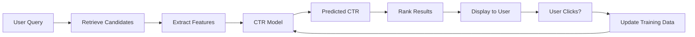
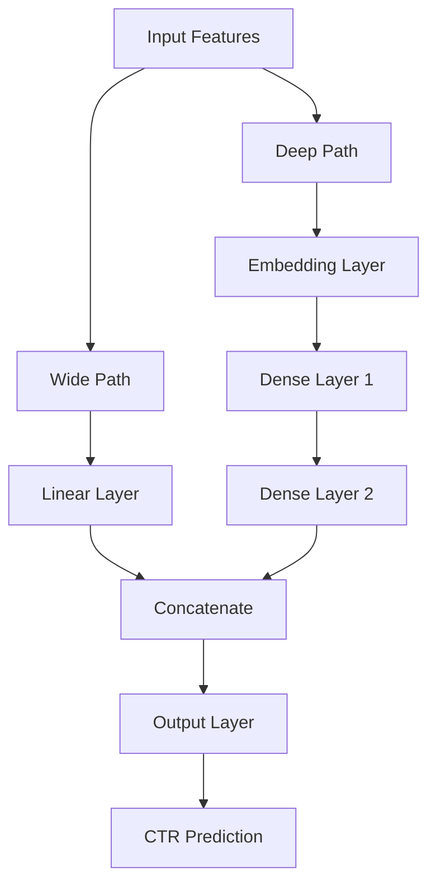
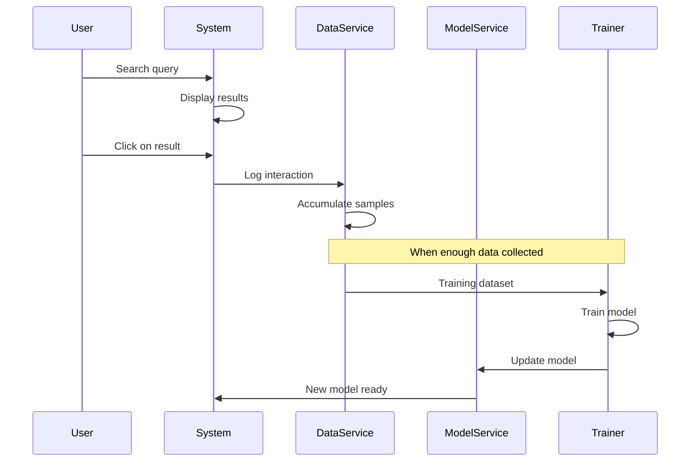

# CTR Prediction Models
{: .no_toc }

Machine learning models for predicting click-through rates to improve search ranking and recommendation quality.
{: .fs-6 .fw-300 }

## Table of contents
{: .no_toc .text-delta }

1. TOC
{:toc}

---

## Overview

### What is CTR Prediction?

**Click-Through Rate (CTR)** prediction is the task of estimating the probability that a user will click on a search result or recommendation item. It's a fundamental component of modern search and recommendation systems.

**Key Concept**:
- CTR = Number of clicks / Number of impressions
- Higher CTR indicates better relevance and user satisfaction
- CTR prediction enables intelligent ranking beyond simple keyword matching

### Why CTR Prediction Matters

**Business Value**:
1. **User Experience**: Show most relevant results first, improving user satisfaction
2. **Engagement**: Higher CTR means users find what they're looking for
3. **Revenue**: In advertising systems, CTR directly impacts revenue
4. **Personalization**: Adapt ranking to individual user preferences

**Technical Benefits**:
- **Beyond TF-IDF**: TF-IDF only considers text similarity, CTR considers user behavior
- **Learning from Feedback**: System improves as users interact with results
- **Handling Cold Start**: Predict CTR for new items without historical data
- **Multi-Factor Ranking**: Combine content relevance, user preferences, and context

### How CTR Prediction Works

**Basic Workflow**:



**Key Steps**:
1. **Feature Extraction**: Extract features from query, document, and user context
2. **Model Prediction**: Use trained model to predict CTR for each candidate
3. **Ranking**: Sort results by predicted CTR (and other factors)
4. **Feedback Loop**: Collect user clicks to improve model over time

---

## Supported Models

The system supports two model types, each with different characteristics:

### Model Comparison

| Model | Complexity | Interpretability | Performance | Use Case |
|:------|:-----------|:-----------------|:------------|:---------|
| **Logistic Regression** | Low | High | Good baseline | Quick prototyping, interpretable results |
| **Wide & Deep** | High | Medium | Better accuracy | Production systems, complex patterns |

### 1. Logistic Regression

#### Overview

**What is Logistic Regression?**
A linear model that uses the logistic function to map features to a probability between 0 and 1. It's simple, interpretable, and provides a strong baseline for CTR prediction.

**Why Use Logistic Regression?**
- ✅ **Fast Training**: Efficient optimization
- ✅ **Interpretable**: Feature coefficients show importance
- ✅ **Stable**: Less prone to overfitting
- ✅ **Baseline**: Good starting point before trying complex models

**Limitations**:
- ❌ **Linear Assumptions**: Cannot capture complex feature interactions
- ❌ **Manual Feature Engineering**: Requires careful feature design

#### Model Architecture

**Mathematical Formulation**:

**Prediction Function**:

Logistic Regression models the probability of a click using the sigmoid function:

$$
P(\text{click} = 1 \mid \mathbf{x}) = \sigma(\mathbf{w}^T \mathbf{x} + b) = \frac{1}{1 + e^{-(\mathbf{w}^T \mathbf{x} + b)}}
$$

Where:
- $\mathbf{x} \in \mathbb{R}^d$: Feature vector (7-dimensional in our system)
- $\mathbf{w} \in \mathbb{R}^d$: Learned weight vector (one weight per feature)
- $b \in \mathbb{R}$: Bias term (intercept)
- $\sigma(z) = \frac{1}{1 + e^{-z}}$: Sigmoid function, maps real numbers to [0, 1]
- $\mathbf{w}^T \mathbf{x} + b$: Linear combination of features (logit)

**Training Objective**:

The model is trained to minimize the **binary cross-entropy loss**:

$$
\mathcal{L} = -\frac{1}{n} \sum_{i=1}^{n} \left[ y_i \log(\hat{y}_i) + (1-y_i) \log(1-\hat{y}_i) \right]
$$

Where:
- $n$: Number of training samples
- $y_i \in \{0, 1\}$: True label (1 = clicked, 0 = not clicked)
- $\hat{y}_i = P(\text{click} = 1 \mid \mathbf{x}_i)$: Predicted probability for sample $i$

**Understanding the Formula**:

1. **Sigmoid Function**: Transforms the linear combination into a probability between 0 and 1
2. **Logit**: The term $\mathbf{w}^T \mathbf{x} + b$ represents the log-odds of a click
3. **Loss Function**: Penalizes confident wrong predictions more than uncertain ones
4. **Optimization**: Gradient descent finds weights that minimize the loss on training data

**Intuitive Explanation**:
- If $\mathbf{w}^T \mathbf{x} + b$ is large and positive → High click probability (close to 1)
- If $\mathbf{w}^T \mathbf{x} + b$ is large and negative → Low click probability (close to 0)
- If $\mathbf{w}^T \mathbf{x} + b = 0$ → Neutral probability (0.5)
- Feature weights indicate how much each feature contributes to the click probability

#### Feature Engineering

**7-Dimensional Feature Vector**:

```python
features = {
    "position": 1,              # Rank position (1, 2, 3, ...)
    "query_length": 5,           # Number of words in query
    "doc_length": 1000,          # Document length in characters
    "tfidf_score": 0.85,        # TF-IDF relevance score
    "match_ratio": 0.6,         # Query-document match ratio
    "historical_ctr": 0.12,     # Historical CTR for this doc
    "user_click_history": 0.3   # User's past click rate
}
```

#### Implementation

```python
from sklearn.linear_model import LogisticRegression

class CTRModel:
    """Logistic Regression CTR Model"""
    
    def __init__(self):
        self.model = LogisticRegression(
            max_iter=1000,
            solver='lbfgs',
            C=1.0  # Regularization strength
        )
    
    def train(self, X, y):
        """Train on feature matrix X and labels y"""
        self.model.fit(X, y)
        return self
    
    def predict(self, X):
        """Predict CTR probabilities"""
        return self.model.predict_proba(X)[:, 1]  # Return probability of class 1
```

### 2. Wide & Deep Neural Network

#### Overview

**What is Wide & Deep?**
A neural network architecture that combines:
- **Wide Component**: Linear model for memorizing feature interactions
- **Deep Component**: Multi-layer neural network for learning complex patterns

**Why Use Wide & Deep?**
- ✅ **Best of Both Worlds**: Memorization (wide) + Generalization (deep)
- ✅ **Automatic Feature Learning**: Deep layers learn complex interactions
- ✅ **Handles Sparse Features**: Wide component handles categorical features
- ✅ **Better Accuracy**: Typically outperforms linear models

**Architecture**:



#### Model Architecture

**Wide Component**:
- Linear model: $y_{\text{wide}} = \mathbf{w}_{\text{wide}}^T \mathbf{x} + b_{\text{wide}}$
- Captures explicit feature interactions
- Good for sparse, categorical features

**Deep Component**:
- Multi-layer feedforward network
- Learns implicit feature interactions
- Good for dense, continuous features

**Combined Output**:

$$
P(\text{click} = 1 \mid \mathbf{x}) = \sigma(y_{\text{wide}} + y_{\text{deep}})
$$

#### Implementation

```python
import tensorflow as tf
from tensorflow import keras

class WideAndDeepCTRModel:
    """Wide & Deep CTR Model"""
    
    def __init__(self, input_dim, hidden_units=[128, 64]):
        # Wide component (linear)
        wide_input = keras.Input(shape=(input_dim,), name='wide_input')
        wide_output = keras.layers.Dense(1, activation='linear')(wide_input)
        
        # Deep component
        deep_input = keras.Input(shape=(input_dim,), name='deep_input')
        deep = deep_input
        for units in hidden_units:
            deep = keras.layers.Dense(units, activation='relu')(deep)
            deep = keras.layers.Dropout(0.3)(deep)
        deep_output = keras.layers.Dense(1, activation='linear')(deep)
        
        # Combine
        combined = keras.layers.Add()([wide_output, deep_output])
        output = keras.layers.Dense(1, activation='sigmoid')(combined)
        
        self.model = keras.Model(
            inputs=[wide_input, deep_input],
            outputs=output
        )
        
        self.model.compile(
            optimizer='adam',
            loss='binary_crossentropy',
            metrics=['accuracy', 'AUC']
        )
    
    def train(self, X, y, epochs=10, batch_size=32):
        """Train the model"""
        self.model.fit(
            [X, X],  # Same input for wide and deep
            y,
            epochs=epochs,
            batch_size=batch_size,
            validation_split=0.2
        )
        return self
    
    def predict(self, X):
        """Predict CTR probabilities"""
        return self.model.predict([X, X]).flatten()
```

---

## Feature Engineering

### Feature Types

**1. Position Features**
- Rank position in search results
- Higher positions typically have higher CTR
- Example: `position = 1, 2, 3, ...`

**2. Query Features**
- Query length, complexity
- Query type (informational, navigational, transactional)
- Example: `query_length = 5`, `query_type = "informational"`

**3. Document Features**
- Document length, quality score
- Historical performance metrics
- Example: `doc_length = 1000`, `historical_ctr = 0.12`

**4. Interaction Features**
- Query-document match score (TF-IDF)
- Semantic similarity
- Example: `tfidf_score = 0.85`, `match_ratio = 0.6`

**5. User Features** (if available)
- User click history
- User preferences
- Example: `user_click_rate = 0.3`

### Feature Extraction Pipeline

```python
def extract_features(query, doc, position, historical_data):
    """Extract 7-dimensional feature vector"""
    
    features = {
        # Position feature
        "position": position,
        
        # Query features
        "query_length": len(query.split()),
        
        # Document features
        "doc_length": len(doc['content']),
        "historical_ctr": historical_data.get(doc['id'], 0.0),
        
        # Interaction features
        "tfidf_score": compute_tfidf(query, doc),
        "match_ratio": compute_match_ratio(query, doc),
        
        # User features (if available)
        "user_click_history": get_user_click_rate(user_id)
    }
    
    return np.array([
        features["position"],
        features["query_length"],
        features["doc_length"],
        features["tfidf_score"],
        features["match_ratio"],
        features["historical_ctr"],
        features["user_click_history"]
    ])
```

---

## Training Process

### Data Collection

**Click Feedback Collection**:
- System logs user interactions (clicks, impressions)
- Each interaction becomes a training sample
- Positive samples: clicked items (label = 1)
- Negative samples: shown but not clicked (label = 0)

**Sample Format**:
```python
{
    "query": "machine learning",
    "doc_id": "doc_123",
    "position": 2,
    "features": [2, 2, 1000, 0.85, 0.6, 0.12, 0.3],
    "label": 1  # clicked
}
```

### Training Workflow



### Training Steps

1. **Collect Training Data**: Gather click feedback over time
2. **Feature Extraction**: Extract features for all samples
3. **Data Splitting**: Split into train/validation/test sets
4. **Model Training**: Train model on training set
5. **Evaluation**: Evaluate on validation/test sets
6. **Deployment**: Deploy trained model to production

---

## Model Evaluation

### Evaluation Metrics

**1. Accuracy**
- Overall correctness: (TP + TN) / (TP + TN + FP + FN)
- **Limitation**: Can be misleading with imbalanced data

**2. Precision**
- Of predicted clicks, how many were actual clicks: TP / (TP + FP)
- **Use Case**: When false positives are costly

**3. Recall**
- Of actual clicks, how many were predicted: TP / (TP + FN)
- **Use Case**: When we want to catch all clicks

**4. AUC-ROC**
- Area under ROC curve
- **Best Metric**: Measures ranking quality, handles imbalanced data well
- **Target**: AUC > 0.7 for good performance

**5. Log Loss**
- Logarithmic loss for probability predictions
- **Use Case**: Penalizes confident wrong predictions

### Evaluation Example

```python
from sklearn.metrics import accuracy_score, precision_score, recall_score, roc_auc_score

def evaluate_model(model, X_test, y_test):
    """Evaluate CTR model"""
    
    y_pred = model.predict(X_test)
    y_pred_binary = (y_pred > 0.5).astype(int)
    
    metrics = {
        "accuracy": accuracy_score(y_test, y_pred_binary),
        "precision": precision_score(y_test, y_pred_binary),
        "recall": recall_score(y_test, y_pred_binary),
        "auc": roc_auc_score(y_test, y_pred),
        "log_loss": log_loss(y_test, y_pred)
    }
    
    return metrics

# Example output
{
    "accuracy": 0.85,
    "precision": 0.78,
    "recall": 0.82,
    "auc": 0.88,
    "log_loss": 0.32
}
```

---

## Usage Guide

### Training a Model

**In the Web UI**:

1. Navigate to "📊 Data Collection & Training" tab
2. Review collected samples and statistics
3. Select model type:
   - **Logistic Regression**: Fast, interpretable
   - **Wide & Deep**: Better accuracy, more complex
4. Configure training parameters:
   - Training epochs
   - Learning rate
   - Batch size
5. Click "Train CTR Model"
6. View training progress and results

### Using Trained Model

**In Search Interface**:

1. Navigate to "🔍 Online Retrieval & Ranking" tab
2. Enter search query
3. Select ranking mode: **CTR** (instead of TF-IDF)
4. Click "🔬 Execute Search"
5. Results are ranked by predicted CTR

### Model Comparison

**Compare TF-IDF vs CTR Ranking**:

1. Perform same query with both ranking modes
2. Compare result order and relevance
3. CTR ranking typically shows more user-relevant results

---

## Best Practices

### Model Selection

**Use Logistic Regression When**:
- ✅ Quick prototyping needed
- ✅ Interpretability is important
- ✅ Limited training data (< 10K samples)
- ✅ Simple feature interactions sufficient

**Use Wide & Deep When**:
- ✅ Production system with sufficient data (> 10K samples)
- ✅ Complex feature interactions expected
- ✅ Maximum accuracy needed
- ✅ Can handle longer training time

### Feature Engineering Tips

1. **Include Position**: Position is a strong signal for CTR
2. **Normalize Features**: Scale features to similar ranges
3. **Handle Missing Values**: Use default values or imputation
4. **Feature Interactions**: Consider explicit interaction features for linear models
5. **Temporal Features**: Include time-based features if available

### Training Tips

1. **Collect Enough Data**: Aim for at least 1K positive samples
2. **Handle Imbalance**: Use class weights or sampling techniques
3. **Cross-Validation**: Use k-fold CV to assess generalization
4. **Regularization**: Prevent overfitting with L1/L2 regularization
5. **Monitor Metrics**: Track AUC and log loss during training

---

## Troubleshooting

### Low Model Performance

**Problem**: AUC < 0.6 or poor ranking quality

**Solutions**:
1. **More Training Data**: Collect more click feedback
2. **Better Features**: Add more relevant features
3. **Feature Quality**: Check for data quality issues
4. **Model Complexity**: Try Wide & Deep if using Logistic Regression
5. **Hyperparameter Tuning**: Adjust learning rate, regularization

### Overfitting

**Problem**: High training accuracy but low validation accuracy

**Solutions**:
1. **Regularization**: Increase L1/L2 regularization strength
2. **More Data**: Collect more training samples
3. **Feature Selection**: Remove irrelevant features
4. **Early Stopping**: Stop training when validation loss stops improving

### Cold Start Problem

**Problem**: New documents have no historical CTR

**Solutions**:
1. **Default CTR**: Use average CTR as default
2. **Content Features**: Rely more on content similarity (TF-IDF)
3. **Gradual Transition**: Start with TF-IDF, transition to CTR as data accumulates

---

## Related Resources

- [Model Evaluation]({{ site.baseurl }}/docs/search-recommendation/model-evaluation) - Detailed evaluation metrics
- [Interpretability Analysis]({{ site.baseurl }}/docs/search-recommendation/interpretability) - Understanding model decisions
- [AutoML Optimization]({{ site.baseurl }}/docs/search-recommendation/automl) - Hyperparameter tuning
- [Wide & Deep Paper](https://arxiv.org/abs/1606.07792) - Original research paper
