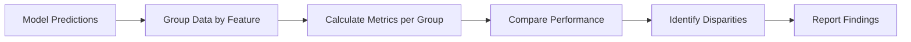

# Fairness Analysis
{: .no_toc }

Evaluating model performance across different groups to identify potential biases and ensure equitable treatment for all user segments.
{: .fs-6 .fw-300 }

## Table of contents
{: .no_toc .text-delta }

1. TOC
{:toc}

---

## Overview

### What is Fairness Analysis?

Fairness analysis evaluates whether a model performs equally well across different groups of users or items. It identifies potential biases where the model may systematically favor or disadvantage certain groups.

**Key Concept**:
- **Group**: A subset of data defined by a feature (e.g., position range, query type)
- **Performance Disparity**: Difference in model performance between groups
- **Bias**: Systematic unfairness toward a particular group

### Why Fairness Matters

**Business Impact**:
- **User Trust**: Users expect fair treatment regardless of their characteristics
- **Legal Compliance**: Many jurisdictions require fair AI systems
- **Reputation**: Unfair models can damage brand reputation
- **Long-term Success**: Fair systems serve diverse user bases better

**Technical Benefits**:
- **Identify Issues**: Discover performance gaps before deployment
- **Improve Models**: Use fairness insights to improve model design
- **Regulatory Compliance**: Meet fairness requirements
- **Better Understanding**: Understand model behavior across segments

### How It Works

**Fairness Analysis Workflow**:



**Process**:
1. **Group Data**: Split data into groups based on a feature (e.g., position, query type)
2. **Evaluate Groups**: Calculate performance metrics for each group
3. **Compare**: Identify performance differences between groups
4. **Analyze**: Determine if differences indicate bias
5. **Report**: Provide actionable insights

---

## Grouping Methods

### Supported Grouping Features

The system supports grouping by various features to analyze fairness:

| Grouping Feature | Description | Use Case |
|:----------------|:------------|:---------|
| **position_range** | Group by document position in results | Detect position bias |
| **query** | Group by search query | Identify query-specific issues |
| **doc_id** | Group by document ID | Find document-level biases |
| **score_range** | Group by relevance score range | Analyze score-based disparities |

### Position Range Grouping

**Purpose**: Detect **position bias** - where documents at different positions receive different treatment.

**Example Groups**:
- **Position 0-3**: Top results (most visible)
- **Position 4-7**: Middle results
- **Position 8+**: Lower results (less visible)

**Why It Matters**:
- Users click top results more often (position bias)
- Model may learn to favor top positions
- Need to ensure model quality is consistent across positions

### Query-Based Grouping

**Purpose**: Identify queries where model performs poorly.

**Example Groups**:
- Each unique query becomes a group
- Compare performance across different queries

**Why It Matters**:
- Some queries may be harder than others
- Model may have systematic issues with certain query types
- Helps identify areas for improvement

### Document-Based Grouping

**Purpose**: Find documents that receive systematically different treatment.

**Example Groups**:
- Each document ID becomes a group
- Compare CTR predictions for same document in different contexts

**Why It Matters**:
- Some documents may be systematically under-ranked
- Helps identify content-based biases
- Useful for content provider fairness

### Score Range Grouping

**Purpose**: Analyze performance across relevance score ranges.

**Example Groups**:
- **High Score (0.8-1.0)**: Highly relevant documents
- **Medium Score (0.5-0.8)**: Moderately relevant
- **Low Score (0.0-0.5)**: Less relevant

**Why It Matters**:
- Model should perform consistently across relevance levels
- Helps identify if model struggles with certain relevance ranges

---

## Analysis Methods

### Performance Metrics per Group

For each group, the system calculates:

| Metric | Description | Fairness Interpretation |
|:-------|:------------|:------------------------|
| **Accuracy** | Overall correctness | Should be similar across groups |
| **Precision** | Positive prediction correctness | Higher precision in one group = potential bias |
| **Recall** | Coverage of actual positives | Lower recall in one group = potential bias |
| **F1-Score** | Balanced precision/recall | Should be balanced across groups |
| **AUC** | Ranking quality | Should be consistent across groups |

### Disparity Analysis

**Performance Gap Calculation**:
```python
# Example: Compare F1-scores across groups
group_f1_scores = {
    'position_0_3': 0.85,
    'position_4_7': 0.78,
    'position_8+': 0.72
}

# Calculate disparity
max_f1 = max(group_f1_scores.values())
min_f1 = min(group_f1_scores.values())
disparity = max_f1 - min_f1  # 0.13 (13% gap)
```

**Interpretation**:
- **Small Gap (< 5%)**: Generally acceptable
- **Medium Gap (5-10%)**: Worth investigating
- **Large Gap (> 10%)**: Significant fairness concern

### Bias Identification

**Systematic Bias Indicators**:
- **Consistent Underperformance**: One group consistently performs worse
- **Large Gaps**: Performance differences exceed acceptable thresholds
- **Correlation with Sensitive Features**: Performance correlates with protected attributes

---

## Usage Guide

### Basic Usage

1. Navigate to the "📊 Data Collection & Training" tab
2. Switch to the "⚖️ Fairness Analysis" sub-tab
3. **Select Grouping Method**:
   - Choose one of: `position_range`, `query`, `doc_id`, or `score_range`
4. **Run Analysis**: Click "⚖️ Analyze Model Fairness" button
5. **View Results**:
   - Performance metrics for each group
   - Disparity analysis and gap identification
   - Visualizations comparing groups

### Interpreting Results

**Fair Model**:
- ✅ Similar performance across all groups
- ✅ Small performance gaps (< 5%)
- ✅ No systematic underperformance

**Potential Issues**:
- ⚠️ Large performance gaps (> 10%)
- ⚠️ Consistent underperformance in specific groups
- ⚠️ Correlation with sensitive features

**Action Items**:
- Investigate groups with poor performance
- Review training data for biases
- Consider fairness constraints in model training
- Collect more data for underperforming groups

---

## Technical Implementation

### Grouping Logic

```python
def group_by_feature(data, feature_name):
    """Group data by specified feature"""
    groups = {}
    for record in data:
        group_key = get_group_key(record, feature_name)
        if group_key not in groups:
            groups[group_key] = []
        groups[group_key].append(record)
    return groups
```

### Metric Calculation

```python
from sklearn.metrics import accuracy_score, precision_score, recall_score, f1_score, roc_auc_score

def calculate_group_metrics(y_true, y_pred, y_pred_proba):
    """Calculate performance metrics for a group"""
    return {
        'accuracy': accuracy_score(y_true, y_pred),
        'precision': precision_score(y_true, y_pred),
        'recall': recall_score(y_true, y_pred),
        'f1': f1_score(y_true, y_pred),
        'auc': roc_auc_score(y_true, y_pred_proba),
        'size': len(y_true)  # Group size
    }
```

### Disparity Analysis

```python
def analyze_fairness(group_metrics):
    """Analyze fairness across groups"""
    disparities = {}
    for metric_name in ['accuracy', 'precision', 'recall', 'f1', 'auc']:
        metric_values = [g[metric_name] for g in group_metrics.values()]
        disparities[metric_name] = {
            'max': max(metric_values),
            'min': min(metric_values),
            'gap': max(metric_values) - min(metric_values),
            'std': np.std(metric_values)
        }
    return disparities
```

---

## Best Practices

### Choosing Grouping Features

- **Start with Position**: Position bias is common in search systems
- **Consider Business Context**: Group by features relevant to your use case
- **Multiple Analyses**: Run fairness analysis with different groupings
- **Sensitive Attributes**: Be careful with protected attributes (privacy, legal)

### Interpreting Results

- **Context Matters**: Some performance differences are expected (e.g., position bias)
- **Statistical Significance**: Consider sample sizes and statistical tests
- **Business Impact**: Focus on disparities that affect business outcomes
- **Actionable Insights**: Prioritize issues you can actually fix

### Addressing Fairness Issues

- **Data Collection**: Collect more data for underperforming groups
- **Feature Engineering**: Remove or adjust biased features
- **Model Training**: Use fairness constraints or regularization
- **Post-Processing**: Adjust predictions to ensure fairness
- **Monitoring**: Continuously monitor fairness in production

---

## Troubleshooting

### No Significant Disparities

**Problem**: All groups show similar performance.

**Possible Causes**:
- Model is actually fair (good!)
- Grouping doesn't capture relevant differences
- Insufficient data in some groups

**Solutions**:
- Try different grouping methods
- Increase data collection
- Verify grouping logic

### Large Disparities

**Problem**: Significant performance gaps between groups.

**Possible Causes**:
- Training data bias
- Model architecture issues
- Feature engineering problems

**Solutions**:
- Review training data for biases
- Collect more balanced data
- Use fairness-aware training methods
- Consider post-processing adjustments

### Small Group Sizes

**Problem**: Some groups have very few samples.

**Possible Causes**:
- Rare feature values
- Data collection issues

**Solutions**:
- Combine similar groups
- Collect more data
- Use statistical tests that account for small samples

---

## Related Resources

- [Fairness in Machine Learning](https://fairmlbook.org/)
- [AI Fairness 360 Toolkit](https://aif360.mybluemix.net/)
- [Fairness Metrics Explained](https://developers.google.com/machine-learning/fairness-overview)
- [Position Bias in Search](https://arxiv.org/abs/1904.08861)
