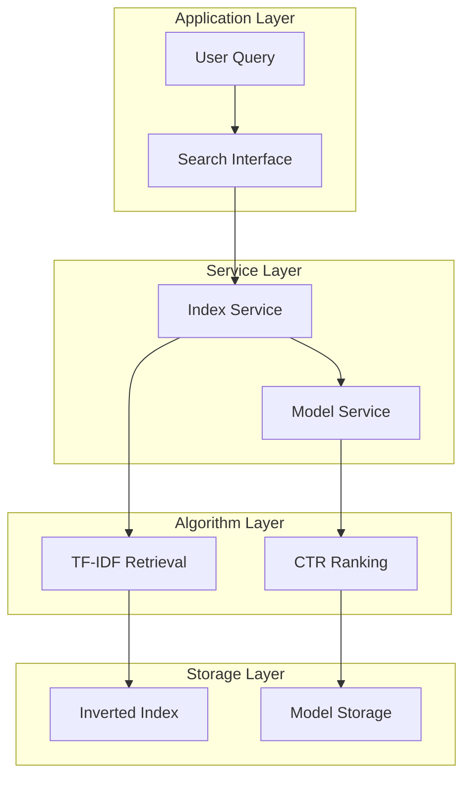

# Search & Recommendation System
{: .no_toc }

A comprehensive search and recommendation system featuring TF-IDF based retrieval, CTR prediction models, and intelligent ranking algorithms.
{: .fs-6 .fw-300 }

## Table of contents
{: .no_toc .text-delta }

1. TOC
{:toc}

---

## System Overview

The search and recommendation system implements a complete information retrieval pipeline, from document indexing to intelligent ranking using machine learning models.

### Key Features

- 🔍 **Full-Text Search**: TF-IDF based inverted index with Chinese word segmentation
- 🎯 **CTR Prediction**: Logistic Regression and Wide & Deep neural networks
- 📊 **Model Evaluation**: Cross-validation, interpretability, and fairness analysis
- 🤖 **AutoML**: Hyperparameter optimization with Grid Search and Optuna
- 🔄 **Online Learning**: Click feedback collection and model retraining

---

## Architecture Overview

### System Layers



### Core Components

| Component | Description | Technology |
|:----------|:------------|:-----------|
| **Inverted Index** | Document indexing and retrieval | TF-IDF, jieba |
| **CTR Model** | Click-through rate prediction | Logistic Regression, TensorFlow |
| **Feature Engineering** | Extract 7-dimensional feature vectors | pandas, NumPy |
| **Model Serving** | Real-time prediction service | scikit-learn |

---

## Module Documentation

### Core Features

<div class="code-example" markdown="1">

[CTR Prediction Models]({{ site.baseurl }}/docs/search-recommendation/ctr-prediction){: .btn .btn-primary .mr-2 }
Learn about Logistic Regression and Wide & Deep models for CTR prediction

[System Architecture]({{ site.baseurl }}/docs/search-recommendation/architecture){: .btn .btn-outline .mr-2 }
Understand the system architecture and design principles

[Implementation Details]({{ site.baseurl }}/docs/search-recommendation/implementation){: .btn .btn-outline .mr-2 }
Dive into code implementation and algorithms

</div>

### Model Analysis & Optimization

<div class="code-example" markdown="1">

[Model Evaluation]({{ site.baseurl }}/docs/search-recommendation/model-evaluation){: .btn .btn-outline .mr-2 }
Cross-validation and generalization analysis

[Interpretability Analysis]({{ site.baseurl }}/docs/search-recommendation/interpretability){: .btn .btn-outline .mr-2 }
LIME and SHAP model explanations

[Fairness Analysis]({{ site.baseurl }}/docs/search-recommendation/fairness){: .btn .btn-outline .mr-2 }
Performance analysis across different groups

[AutoML Optimization]({{ site.baseurl }}/docs/search-recommendation/automl){: .btn .btn-outline .mr-2 }
Hyperparameter tuning with Grid Search and Optuna

</div>

---

## Quick Start

### 1. Perform Search

Navigate to the "🔍 Online Retrieval & Ranking" tab:
- Enter query terms (e.g., "artificial intelligence", "machine learning")
- Select ranking mode: TF-IDF or CTR
- Click "🔬 Execute Search"

### 2. View Results

- Results displayed in table format with doc ID, TF-IDF score, CTR score, and summary
- Click on rows to view full document content
- Interactions are logged for CTR training

### 3. Train CTR Model (Optional)

Navigate to "📊 Data Collection & Training" tab:
- Review collected samples and statistics
- Click "Train CTR Model"
- Return to search tab and switch to CTR ranking to compare results

{: .note }
> **Tip**: If using preloaded documents from `data/preloaded_documents.json`, they are automatically indexed on startup.

---

## Technical Highlights

### Retrieval Stage

- **Algorithm**: TF-IDF with inverted index
- **Tokenization**: jieba Chinese word segmentation
- **Optimization**: Short-circuit evaluation, LRU caching
- **Scalability**: Horizontal sharding support

### Ranking Stage

- **Models**: Logistic Regression, Wide & Deep networks
- **Features**: 7-dimensional feature vector (position, content length, match score, historical CTR)
- **Training**: Online learning with click feedback
- **Evaluation**: Accuracy, Precision, Recall, AUC

---

## Key Files & Directories

```
src/search_engine/
├── search_tab/          # Search functionality
├── index_tab/           # Index management
│   └── offline_index.py # Inverted index implementation ⭐
├── training_tab/        # Model training
│   ├── ctr_model.py    # CTR model implementation ⭐
│   ├── model_evaluation.py
│   ├── model_interpretability.py
│   ├── model_fairness.py
│   └── model_automl.py
├── data_service.py      # Data collection ⭐
└── model_service.py     # Model serving ⭐
```

---

## Performance Metrics

| Metric | Description | Target |
|:-------|:------------|:-------|
| **CTR** | Click-through rate | > 10% |
| **MRR** | Mean reciprocal rank | > 0.7 |
| **Latency** | Average response time | < 100ms |
| **QPS** | Queries per second | > 1000 |

---

## Next Steps

- Explore [CTR Prediction Models]({{ site.baseurl }}/docs/search-recommendation/ctr-prediction) to understand model architectures
- Check [System Architecture]({{ site.baseurl }}/docs/search-recommendation/architecture) for detailed design
- Learn [Implementation Details]({{ site.baseurl }}/docs/search-recommendation/implementation) for code examples

